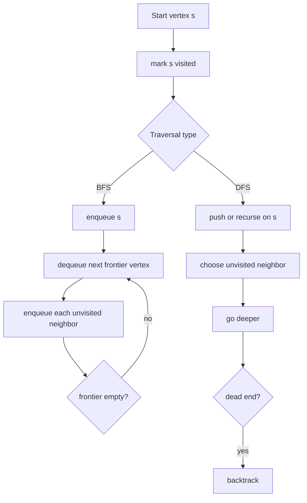

# Graph Traversals

Graph traversal is the process of systematically visiting vertices reachable from a starting point. The two fundamental traversals are depth-first search (DFS, 깊이 우선 탐색) and breadth-first search (BFS, 너비 우선 탐색). They differ mainly in the frontier discipline: DFS uses stack behavior and goes deep before backtracking; BFS uses queue behavior and explores in layers.


*Figure: Dijkstra's algorithm is a concrete example of graph search becoming a path. Image: [Wikimedia Commons](https://commons.wikimedia.org/wiki/File:Dijkstra_Animation.gif), Ibmua, public domain.*

In the source textbook, traversal appears after graph representation because traversal is representation-sensitive. With adjacency lists, scanning all vertices and edges costs $O(V + E)$. With an adjacency matrix, finding neighbors of each vertex costs $O(V)$, giving $O(V^2)$ traversal time even for sparse graphs.

## Definitions

Given a graph $G = (V, E)$ and a start vertex `s`, a traversal maintains a set of visited vertices to avoid repeated work and infinite loops around cycles.

**Depth-first search**:

- Visit a start vertex.
- Recursively visit an unvisited neighbor.
- Continue until no unvisited neighbor remains, then backtrack.
- Can be implemented recursively or with an explicit stack.

**Breadth-first search**:

- Visit a start vertex and enqueue it.
- Repeatedly dequeue a vertex and enqueue its unvisited neighbors.
- Visits vertices in nondecreasing number of edges from the start in an unweighted graph.

Traversal outputs may include:

- **Visit order**: the order vertices are first discovered.
- **Parent tree**: for each discovered vertex, the vertex from which it was first reached.
- **Connected components**: groups of vertices mutually reachable in an undirected graph.
- **Discovery and finish times**: DFS metadata useful for directed graph analysis.

The traversal ADT-level operation can be written as `traverse(G, start, visit)`, but the behavior depends on whether the frontier is a stack or queue.

## Key results

With adjacency lists, DFS and BFS both run in $O(V + E)$ time for a full traversal. Each vertex is marked visited once, and each adjacency-list entry is inspected once. For an undirected graph, each edge appears twice, but $2E$ is still $O(E)$.

BFS computes shortest path distances from the start in an unweighted graph. Proof sketch: BFS processes vertices by layers. All vertices at distance `0` are processed before distance `1`; all vertices at distance `1` before distance `2`; and so on. When a vertex is first discovered, the path through its parent has the fewest possible edges.

DFS does not generally compute shortest paths. Its strength is structural: it identifies connected components, supports topological sorting in directed acyclic graphs, detects cycles, and helps classify edges.

| Traversal | Frontier | Main guarantee | Common applications |
|---|---|---|---|
| DFS | stack or recursion | explores complete paths before alternatives | components, cycle detection, topological sort |
| BFS | queue | shortest unweighted edge distance from start | levels, shortest hops, bipartite checking |

The parent array produced by a traversal is often as important as the visit order. In BFS, `parent[v]` records the predecessor that first discovered `v`, so following parent links backward reconstructs a shortest unweighted path to the start vertex. In DFS, parent links form a depth-first forest. When the graph is disconnected, a full traversal starts a new DFS or BFS from each unvisited vertex, producing one tree per connected component.

Traversal state should be marked at discovery time, not after all neighbors have been processed. This distinction is especially important for BFS. If a vertex is marked only when dequeued, several already-discovered vertices can enqueue it again before it reaches the front of the queue. Marking when enqueued means each vertex enters the queue at most once.

For directed graphs, DFS can classify edges by discovery and finish times: tree edges discover new vertices, back edges point to ancestors, forward edges point to descendants, and cross edges connect separate DFS branches. A back edge in a directed graph indicates a cycle. These classifications are beyond the simplest traversal trace, but they explain why DFS is the foundation for topological sorting and strongly connected component algorithms.

Traversal code should be written against the graph representation's natural neighbor operation. With adjacency lists, a loop follows only existing edges, so total work is proportional to the number of stored adjacency records. With an adjacency matrix, the code scans an entire row to discover neighbors, so it checks every possible destination even when few edges exist. The same BFS idea therefore has different constants and sometimes different asymptotic cost.

In undirected graphs, connected components can be found by repeatedly starting BFS or DFS from an unvisited vertex. Each restart begins a new component. The number of restarts is the number of components, and the parent forest records one spanning tree for each component.

In directed graphs, the same restart pattern covers every vertex, but reachability is directional. A DFS forest from a directed graph should not be interpreted as undirected connected components unless the direction of edges is intentionally ignored.

## Visual



Example graph:

```text
0: 1, 2
1: 0, 3
2: 0, 3
3: 1, 2, 4
4: 3
```

## Worked example 1: BFS order and distances

Problem: Run BFS from vertex `0` on the example graph. Visit neighbors in increasing numeric order.

Method: use a queue and mark vertices when they are enqueued, not when dequeued.

1. Start at `0`. Mark `0`, distance `0`, parent none. Queue: `[0]`.
2. Dequeue `0`. Its neighbors are `1` and `2`.
   - Mark `1`, distance `1`, parent `0`.
   - Mark `2`, distance `1`, parent `0`.
   - Queue: `[1, 2]`.
3. Dequeue `1`. Neighbors are `0` and `3`.
   - `0` already visited.
   - Mark `3`, distance `2`, parent `1`.
   - Queue: `[2, 3]`.
4. Dequeue `2`. Neighbors are `0` and `3`.
   - Both already visited.
   - Queue: `[3]`.
5. Dequeue `3`. Neighbors are `1`, `2`, and `4`.
   - `1` and `2` already visited.
   - Mark `4`, distance `3`, parent `3`.
   - Queue: `[4]`.
6. Dequeue `4`. Neighbor `3` already visited. Queue becomes empty.

Checked answer: BFS discovery order is `0, 1, 2, 3, 4`. Distances are `d[0]=0`, `d[1]=1`, `d[2]=1`, `d[3]=2`, `d[4]=3`. The path to `4` from parent links is `0 -> 1 -> 3 -> 4`, which has three edges.

## Worked example 2: DFS order and backtracking

Problem: Run recursive DFS from vertex `0` on the same graph, again considering neighbors in increasing numeric order.

Method: visit a vertex, then recursively visit the first unvisited neighbor.

1. Visit `0`. First unvisited neighbor is `1`.
2. Visit `1`. Neighbors: `0` already visited, then `3` unvisited.
3. Visit `3`. Neighbors: `1` visited, `2` unvisited.
4. Visit `2`. Neighbors `0` and `3` are both visited. Backtrack to `3`.
5. Continue `3`'s neighbors: `4` unvisited.
6. Visit `4`. Neighbor `3` visited. Backtrack to `3`, then `1`, then `0`.
7. Continue `0`'s neighbors: `2` already visited. Done.

Checked answer: DFS discovery order is `0, 1, 3, 2, 4`. This is not a shortest-distance order because vertex `2`, which is one edge from `0`, was visited after vertex `3`, which is two edges from `0`. That difference is expected for DFS.

## Code

This program uses an adjacency matrix for compact demonstration and implements both DFS and BFS. For large sparse graphs, use adjacency lists instead.

```c
#include <stdio.h>
#include <stdlib.h>

#define V 5

static void dfs_rec(int graph[V][V], int v, int visited[V]) {
    visited[v] = 1;
    printf("%d ", v);
    for (int w = 0; w < V; ++w) {
        if (graph[v][w] && !visited[w]) {
            dfs_rec(graph, w, visited);
        }
    }
}

static void bfs(int graph[V][V], int start) {
    int visited[V] = {0};
    int queue[V];
    int front = 0;
    int rear = 0;

    visited[start] = 1;
    queue[rear++] = start;

    while (front < rear) {
        int v = queue[front++];
        printf("%d ", v);
        for (int w = 0; w < V; ++w) {
            if (graph[v][w] && !visited[w]) {
                visited[w] = 1;
                queue[rear++] = w;
            }
        }
    }
}

int main(void) {
    int graph[V][V] = {
        {0, 1, 1, 0, 0},
        {1, 0, 0, 1, 0},
        {1, 0, 0, 1, 0},
        {0, 1, 1, 0, 1},
        {0, 0, 0, 1, 0}
    };
    int visited[V] = {0};

    printf("DFS: ");
    dfs_rec(graph, 0, visited);
    printf("\nBFS: ");
    bfs(graph, 0);
    printf("\n");
    return EXIT_SUCCESS;
}
```

## Common pitfalls

- Marking a BFS vertex only when dequeued. That can enqueue the same vertex many times through different parents.
- Forgetting the visited set in cyclic graphs, causing infinite traversal.
- Claiming DFS gives shortest paths. BFS gives shortest unweighted paths; DFS does not.
- Expecting one traversal from a start vertex to visit a disconnected graph. Full graph traversal must restart from each unvisited vertex.
- Letting recursive DFS overflow the call stack on very deep graphs. An explicit stack is safer for huge inputs.
- Assuming traversal order is unique. It depends on neighbor ordering in the representation.

## Connections

- [graph representation](/cs/data-structures/graph-representation)
- [queues](/cs/data-structures/queues)
- [stacks](/cs/data-structures/stacks)
- [minimum spanning trees](/cs/data-structures/minimum-spanning-trees)
- [shortest paths](/cs/data-structures/shortest-paths)
