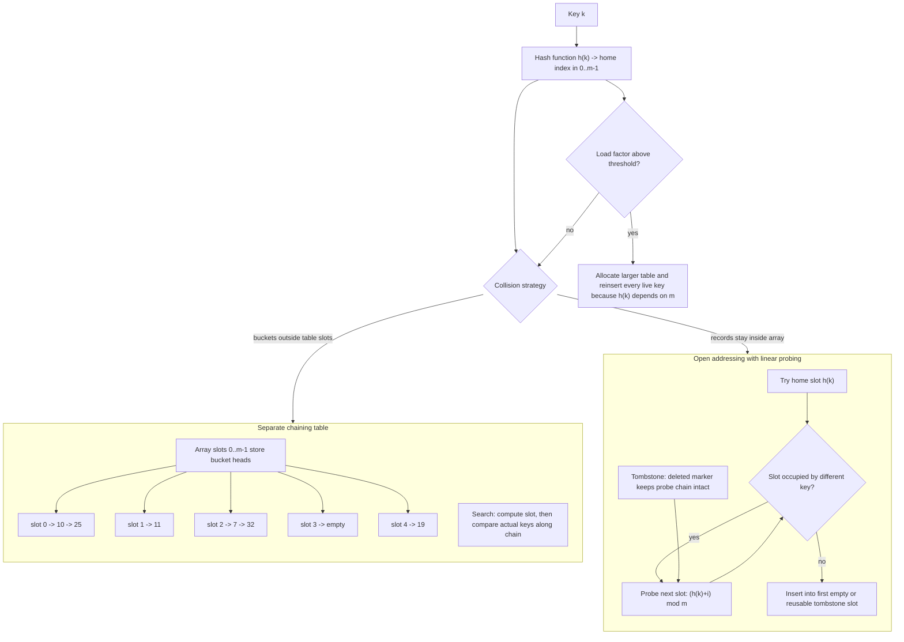

# Hashing

Hashing (해싱) tries to make dictionary operations close to constant time by computing where a key should live. Instead of comparing a key to many stored keys, a hash function maps the key to a table index. When the mapping is good and the table is not too full, search, insertion, and deletion are fast in practice.


*Figure: Separate chaining shows how a hash table stores multiple keys at the same bucket. Image: [Wikimedia Commons](https://commons.wikimedia.org/wiki/File:Dsa_hash_table.svg), Amit6, public domain.*

The cost is that collisions are unavoidable: two distinct keys can map to the same table slot. A hashing implementation is therefore mostly a collision-management design. The source textbook's hashing chapter covers hash tables, hash functions, overflow handling, theoretical evaluation, dynamic hashing, and Bloom filters. This page focuses on the core curriculum pieces: open addressing and chaining.

## Definitions

A **hash table** stores records in an array of size $m$. A **hash function** maps a key $k$ to an integer slot:

$$
h(k) \in \{0, 1, \dots, m - 1\}
$$

For integer keys, a simple division method is:

$$
h(k) = k \bmod m
$$

A **collision** occurs when two different keys map to the same slot. The **load factor** is:

$$
\alpha = \frac{n}{m}
$$

where $n$ is the number of stored keys and $m$ is the number of table slots.

Two major collision strategies are:

- **Separate chaining**: each table slot points to a linked list, dynamic array, or bucket of records that hash to that slot.
- **Open addressing**: all records live directly in the table array. If a slot is occupied, a probe sequence searches for another slot.

Common open-addressing probe sequences include:

- **Linear probing**: $h_i(k) = (h(k) + i) \bmod m$.
- **Quadratic probing**: $h_i(k) = (h(k) + c_1 i + c_2 i^2) \bmod m$.
- **Double hashing**: $h_i(k) = (h_1(k) + i h_2(k)) \bmod m$.

Deletion in open addressing usually requires a special tombstone marker. Clearing a slot to empty can break searches for keys that were inserted later in the same probe chain.

## Key results

Under uniform hashing assumptions and moderate load factor, expected dictionary operations are $O(1)$. Worst-case operations are $O(n)$ when many keys collide or when the table is too full. Hashing is therefore not magic; it shifts work into good hash functions, table sizing, and collision handling.

For separate chaining with uniform hashing, the expected chain length is the load factor $\alpha = n/m$. A successful search takes expected $O(1 + \alpha)$ time. Chaining can tolerate $\alpha \gt  1$, although long chains become slower.

For open addressing, the load factor must stay below `1` because every key occupies a table slot. As $\alpha$ approaches `1`, probe sequences become long. Linear probing also suffers from **primary clustering**, where consecutive occupied runs grow and attract more collisions.

| Method | Storage location | Deletion difficulty | Load factor limit | Typical issue |
|---|---|---|---|---|
| Chaining | linked buckets outside table slots | straightforward list deletion | can exceed `1` | pointer overhead |
| Linear probing | table array only | tombstones needed | must be below `1` | primary clustering |
| Quadratic probing | table array only | tombstones needed | must be below `1` | may not visit every slot |
| Double hashing | table array only | tombstones needed | must be below `1` | second hash must be compatible with table size |

A practical hash table also needs a resizing policy. When the load factor grows beyond a chosen threshold, such as `0.7` for open addressing, the table allocates a larger array and reinserts every occupied key using the new table size. Reinsertion is necessary because `h(k) = k mod m` changes when `m` changes. Chained tables also resize, but they can tolerate higher load factors because collisions do not consume alternate table slots.

Hash functions should distribute real keys well, not just look plausible on small examples. For strings, a common pattern multiplies the accumulated hash by a constant and adds the next character. For integers, using a prime table size with the division method often works better than a table size that shares patterns with the keys. Security-sensitive hash tables may also randomize hashing to resist adversarial inputs, but a basic data-structures course usually studies the uniform hashing model first.

In C, ownership matters for keyed records. If a table stores string pointers, the implementation must define whether it copies the strings or merely borrows pointers owned elsewhere. That decision affects deletion, resizing, and destruction.

Hash-table equality also has two stages: first compute a slot or bucket from the hash value, then compare the actual key. The hash value narrows the search; it does not identify the key by itself. This distinction prevents false matches after collisions.

## Visual



This hash-table diagram shows both collision-resolution architectures. Separate chaining stores bucket heads in the table and follows linked records while comparing real keys; open addressing keeps every live record in the table array and relies on probe sequences plus tombstones after deletion. The load-factor branch makes resizing explicit, including the need to rehash keys when table size changes.

## Worked example 1: linear probing insertion

Problem: Insert keys `18, 41, 22, 44, 59, 32` into a table of size `7` using $h(k) = k \bmod 7$ and linear probing.

Method: for each key, try its home slot. If occupied, try the next slot modulo `7`.

1. Insert `18`: $18 \bmod 7 = 4$. Slot `4` empty, place `18`.
2. Insert `41`: $41 \bmod 7 = 6$. Slot `6` empty, place `41`.
3. Insert `22`: $22 \bmod 7 = 1$. Slot `1` empty, place `22`.
4. Insert `44`: $44 \bmod 7 = 2$. Slot `2` empty, place `44`.
5. Insert `59`: $59 \bmod 7 = 3$. Slot `3` empty, place `59`.
6. Insert `32`: $32 \bmod 7 = 4$. Slot `4` has `18`, slot `5` is empty, place `32` at slot `5`.

Final table:

```text
index: 0    1    2    3    4    5    6
key:   _   22   44   59   18   32   41
```

Checked answer: searching for `32` starts at home slot `4`, sees `18`, then probes slot `5` and succeeds. The probe chain is intact.

## Worked example 2: why tombstones are needed

Problem: In the final table from example 1, delete `18`. Then search for `32`. Explain why the deleted slot cannot simply be marked empty.

Method:

1. Before deletion, `32` is stored at index `5` because its home slot `4` was occupied by `18`.
2. If deletion sets slot `4` to empty, the table looks like:

```text
index: 0    1    2    3    4    5    6
key:   _   22   44   59   _   32   41
```

3. Search for `32` begins at $32 \bmod 7 = 4$.
4. The search sees slot `4` marked empty.
5. In ordinary open addressing, an empty slot means the key was never inserted beyond this point in the probe sequence, so the search would stop and incorrectly report failure.

Correct method: mark slot `4` as `DELETED`, not `EMPTY`. Search treats `DELETED` as occupied for continuation, while insertion may reuse it.

Checked answer: with a tombstone at slot `4`, searching for `32` probes slot `4`, continues to slot `5`, and succeeds.

## Code

This program implements a small integer hash table with linear probing and tombstones.

```c
#include <stdio.h>
#include <stdlib.h>

#define TABLE_SIZE 11

typedef enum { EMPTY, OCCUPIED, DELETED } State;

typedef struct {
    int key;
    State state;
} Slot;

static int hash(int key) {
    int r = key % TABLE_SIZE;
    return r < 0 ? r + TABLE_SIZE : r;
}

static int search(Slot table[], int key) {
    int start = hash(key);
    for (int i = 0; i < TABLE_SIZE; ++i) {
        int pos = (start + i) % TABLE_SIZE;
        if (table[pos].state == EMPTY) return -1;
        if (table[pos].state == OCCUPIED && table[pos].key == key) {
            return pos;
        }
    }
    return -1;
}

static int insert(Slot table[], int key) {
    if (search(table, key) != -1) return 1;
    int start = hash(key);
    int first_deleted = -1;

    for (int i = 0; i < TABLE_SIZE; ++i) {
        int pos = (start + i) % TABLE_SIZE;
        if (table[pos].state == DELETED && first_deleted == -1) {
            first_deleted = pos;
        } else if (table[pos].state == EMPTY) {
            int target = first_deleted == -1 ? pos : first_deleted;
            table[target].key = key;
            table[target].state = OCCUPIED;
            return 1;
        }
    }
    if (first_deleted != -1) {
        table[first_deleted].key = key;
        table[first_deleted].state = OCCUPIED;
        return 1;
    }
    return 0;
}

static int erase(Slot table[], int key) {
    int pos = search(table, key);
    if (pos == -1) return 0;
    table[pos].state = DELETED;
    return 1;
}

int main(void) {
    Slot table[TABLE_SIZE] = {0};
    int keys[] = {18, 41, 22, 44, 59, 32};
    for (size_t i = 0; i < sizeof(keys) / sizeof(keys[0]); ++i) {
        insert(table, keys[i]);
    }
    erase(table, 18);
    printf("32 is at index %d\n", search(table, 32));
    return EXIT_SUCCESS;
}
```

## Common pitfalls

- Choosing a table size and hash function that interact badly, such as using only low bits when the keys share those bits.
- Letting the load factor grow too high. Open addressing degrades quickly near a full table.
- Clearing a deleted open-addressing slot to empty instead of using a tombstone.
- Forgetting that tombstones also accumulate and may require rehashing.
- Comparing hash values instead of keys. Equal hash values do not prove equal keys.
- Expecting sorted traversal from a hash table. Hashing sacrifices order for expected access speed.

## Connections

- [arrays and array operations](/cs/data-structures/arrays)
- [linked lists](/cs/data-structures/linked-lists)
- [searching algorithms](/cs/data-structures/searching-algorithms)
- [binary search trees](/cs/data-structures/binary-search-trees)
- [graph representation](/cs/data-structures/graph-representation)
