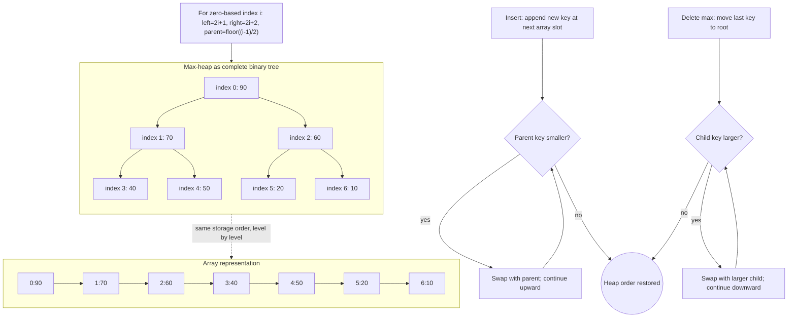

# Heaps and Priority Queues

A priority queue (우선순위 큐) stores items so that the most important item can be removed first. A heap (히프) is the standard array-based implementation for this ADT when priorities are ordered by a key. Unlike a binary search tree, a heap does not support fast search for arbitrary keys. Its purpose is narrower and very powerful: fast insert and fast removal of the minimum or maximum.

The source textbook introduces heaps in the tree chapter and later revisits advanced priority queues. The basic binary heap is the essential core. It combines two ideas: a complete binary-tree shape, which packs neatly into an array, and a heap-order property, which keeps the highest-priority key at the root.

## Definitions

A **priority queue ADT** supports:

- **`insert(PQ, item, priority)`**: add an item.
- **`find_min(PQ)`** or **`find_max(PQ)`**: inspect the highest-priority item.
- **`delete_min(PQ)`** or **`delete_max(PQ)`**: remove and return the highest-priority item.
- **`is_empty(PQ)`**: report whether no items remain.

A **max heap** is a complete binary tree in which each parent key is greater than or equal to its children:

$$
\mathrm{key(parent)} \ge \mathrm{key(child)}
$$

A **min heap** reverses the inequality. The root of a max heap stores the maximum key; the root of a min heap stores the minimum key.

Because a binary heap is complete, it is usually stored in an array. With zero-based indexing:

$$
\begin{aligned}
\mathrm{left}(i) &= 2i + 1 \\
\mathrm{right}(i) &= 2i + 2 \\
\mathrm{parent}(i) &= \left\lfloor \frac{i - 1}{2} \right\rfloor
\end{aligned}
$$

Two local repair operations are central:

- **Sift up**: after inserting at the end, repeatedly swap with the parent while heap order is violated.
- **Sift down**: after moving the last element to the root during deletion, repeatedly swap with the larger child in a max heap or smaller child in a min heap.

## Key results

A binary heap with $n$ elements has height $\lfloor \log_2 n \rfloor$ because it is complete. Therefore insertion and delete-max/delete-min take $O(\log n)$ time. Finding the root maximum or minimum is $O(1)$.

Building a heap by inserting $n$ items one at a time costs $O(n \log n)$. Floyd's bottom-up heap construction, which sifts down from the last internal node to the root, costs $O(n)$. The reason is that most nodes are near the leaves and can move only a small distance. The total work is bounded by a convergent height-weighted sum.

A heap is not a sorted array. The root is the extreme element, and every parent is ordered relative to its children, but siblings and nodes in different subtrees have no complete ordering relationship.

| Operation | Binary heap cost | Notes |
|---|---:|---|
| Find max in max heap | $O(1)$ | root element |
| Insert | $O(\log n)$ | append then sift up |
| Delete max | $O(\log n)$ | replace root then sift down |
| Build heap bottom-up | $O(n)$ | Floyd heapify |
| Search arbitrary key | $O(n)$ | heap order is partial |
| Heap sort | $O(n \log n)$ | repeated delete max or in-place heap |

The priority queue ADT does not require a heap, but the binary heap is the usual default because it gives a strong balance between simplicity and performance. An unsorted array gives $O(1)$ insertion but $O(n)$ delete-max. A sorted array gives $O(1)$ find-max and delete-max at one end but $O(n)$ insertion. A heap keeps both insertion and deletion logarithmic without requiring a full sorted order.

Some priority-queue applications need operations beyond the basic set. Dijkstra's algorithm is cleaner with `decrease_key`, which lowers a vertex's tentative distance and moves it upward in a min heap. A simple C implementation may avoid true `decrease_key` by inserting a duplicate pair and ignoring stale entries when they are removed. That is often easier, but it uses more heap entries. More advanced heaps improve amortized bounds for such operations, but with much more complex pointer structure.

Testing heap code should check both the output sequence and the internal invariant. If repeated delete-max returns keys in descending order, the public behavior looks right. If every parent remains at least as large as its children after each operation, the representation is also right.

Heaps are also sensitive to boundary tests. The last internal node in a zero-based heap of size `n` is `(n - 2) / 2` when `n >= 2`; leaves start after that. Bottom-up heap construction relies on this fact by sifting down only internal nodes. Sifting down from leaves is harmless but unnecessary.

Careful index arithmetic is part of the heap invariant, not a cosmetic implementation detail.

## Visual



This heap diagram ties the complete-tree invariant to the level-order array representation. Each tree node is labeled with its array index, and the formula node gives the exact parent/child index arithmetic used by heap operations. The insert and delete-max repair paths show why only one root-to-leaf or leaf-to-root path needs to be adjusted, giving logarithmic update cost.

## Worked example 1: inserting into a max heap

Problem: Insert `80` into the max heap with array `[90, 70, 60, 40, 50, 20, 10]`.

Method: append `80` at the next open position, then sift it upward until the parent is larger or it reaches the root.

1. Append at index `7`:

```text
[90, 70, 60, 40, 50, 20, 10, 80]
```

2. Parent of index `7` is `(7 - 1) / 2 = 3`. Parent key is `40`.
3. Since `80 > 40`, swap:

```text
[90, 70, 60, 80, 50, 20, 10, 40]
```

4. New index of `80` is `3`. Parent is `(3 - 1) / 2 = 1`. Parent key is `70`.
5. Since `80 > 70`, swap:

```text
[90, 80, 60, 70, 50, 20, 10, 40]
```

6. New index is `1`. Parent is `0`, key `90`.
7. Since `80 <= 90`, stop.

Checked answer: `[90, 80, 60, 70, 50, 20, 10, 40]` is a max heap. Each parent is at least as large as its children: `90 >= 80,60`, `80 >= 70,50`, `60 >= 20,10`, and `70 >= 40`.

## Worked example 2: deleting the maximum

Problem: Delete the maximum from `[90, 80, 60, 70, 50, 20, 10, 40]`.

Method: remove root `90`, move the last key `40` to the root, reduce size, then sift down.

1. Save root `90` as the answer.
2. Move last key `40` to index `0` and remove the last slot:

```text
[40, 80, 60, 70, 50, 20, 10]
```

3. Compare `40` with children `80` and `60`. The larger child is `80`, so swap:

```text
[80, 40, 60, 70, 50, 20, 10]
```

4. At index `1`, compare `40` with children `70` and `50`. The larger child is `70`, so swap:

```text
[80, 70, 60, 40, 50, 20, 10]
```

5. At index `3`, there are no children inside the heap. Stop.

Checked answer: deleted maximum is `90`, and the remaining array `[80, 70, 60, 40, 50, 20, 10]` is a valid max heap.

## Code

This program implements a fixed-capacity max heap with insert and delete-max.

```c
#include <stdio.h>
#include <stdlib.h>

#define CAPACITY 32

typedef struct {
    int data[CAPACITY];
    int size;
} MaxHeap;

static void init(MaxHeap *h) {
    h->size = 0;
}

static void swap(int *a, int *b) {
    int tmp = *a;
    *a = *b;
    *b = tmp;
}

static int insert(MaxHeap *h, int key) {
    if (h->size == CAPACITY) return 0;
    int i = h->size++;
    h->data[i] = key;
    while (i > 0) {
        int parent = (i - 1) / 2;
        if (h->data[parent] >= h->data[i]) break;
        swap(&h->data[parent], &h->data[i]);
        i = parent;
    }
    return 1;
}

static int delete_max(MaxHeap *h, int *out) {
    if (h->size == 0) return 0;
    *out = h->data[0];
    h->data[0] = h->data[--h->size];

    int i = 0;
    while (1) {
        int left = 2 * i + 1;
        int right = 2 * i + 2;
        int largest = i;
        if (left < h->size && h->data[left] > h->data[largest]) {
            largest = left;
        }
        if (right < h->size && h->data[right] > h->data[largest]) {
            largest = right;
        }
        if (largest == i) break;
        swap(&h->data[i], &h->data[largest]);
        i = largest;
    }
    return 1;
}

int main(void) {
    MaxHeap h;
    int values[] = {70, 40, 90, 10, 50, 60, 20, 80};
    init(&h);
    for (size_t i = 0; i < sizeof(values) / sizeof(values[0]); ++i) {
        insert(&h, values[i]);
    }
    int max_value;
    while (delete_max(&h, &max_value)) {
        printf("%d ", max_value);
    }
    printf("\n");
    return EXIT_SUCCESS;
}
```

## Common pitfalls

- Expecting a heap array to be fully sorted. Heap order is only between parent and child.
- Forgetting that complete-tree indexing depends on zero-based versus one-based formulas.
- Sifting down with the wrong child. In a max heap, swap with the larger child; in a min heap, swap with the smaller child.
- Removing the root without first saving it.
- Treating priority queue search as efficient. Standard heaps do not locate arbitrary keys quickly.
- Confusing the heap data structure with the C runtime heap used by `malloc`. They are unrelated meanings of the same word.

## Connections

- [binary trees](/cs/data-structures/binary-trees)
- [sorting algorithms](/cs/data-structures/sorting-algorithms)
- [shortest paths](/cs/data-structures/shortest-paths)
- [minimum spanning trees](/cs/data-structures/minimum-spanning-trees)
- [queues](/cs/data-structures/queues)
