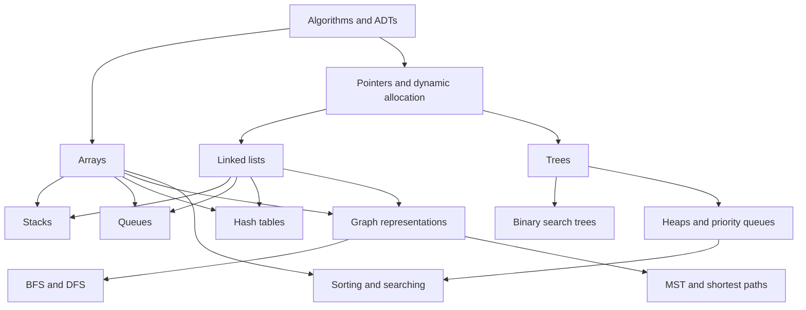

# Data Structures in C

Data structures are organized ways to store data so that the operations a program needs can be performed efficiently and correctly. In a C course, this subject is especially concrete. Every abstraction eventually becomes an arrangement of arrays, structures, pointers, dynamically allocated blocks, and functions that enforce an invariant. That makes C demanding, but also useful: it shows exactly what a stack, list, heap, hash table, tree, or graph costs in memory and time.


*Figure: Binary trees make recursive structure and pointer relationships visible. Image: [Wikimedia Commons](https://commons.wikimedia.org/wiki/File:Binary_tree.svg), Derrick Coetzee, public domain.*


*Figure: Separate chaining shows how a hash table stores multiple keys at the same bucket. Image: [Wikimedia Commons](https://commons.wikimedia.org/wiki/File:Dsa_hash_table.svg), Amit6, public domain.*


*Figure: Dijkstra's algorithm is a concrete example of graph search becoming a path. Image: [Wikimedia Commons](https://commons.wikimedia.org/wiki/File:Dijkstra_Animation.gif), Ibmua, public domain.*

These notes follow the core scope of a Korean-language C data-structures textbook, *C로 쓴 자료구조론*, whose table of contents includes algorithm specification, abstract data types, arrays, stacks and queues, linked lists, trees, heaps, binary search trees, graphs, sorting, hashing, and advanced search structures. The pages here focus on the standard curriculum topics requested for SJ Wiki: the structures and algorithms most students are expected to implement and trace by hand in a Data Structures in C course.

## Definitions

A **data type** is a set of values together with operations on those values. In C, `int`, `double`, and pointer types are built in, while `struct` lets programmers define new record layouts.

An **abstract data type**, or **ADT** (추상 데이터 타입), specifies behavior without committing to representation. For example, a stack ADT says that `push`, `pop`, and `peek` behave in last-in-first-out order. It does not require the stack to be stored in an array or a linked list. The implementation choice is separate.

A **data structure** is a concrete representation that supports an ADT or algorithm. An array stack, linked stack, circular queue, chained hash table, binary heap, adjacency list, and adjacency matrix are all data structures.

An **invariant** is a condition that must remain true before and after every public operation. Examples:

- In a stack, `top` identifies the most recently pushed element.
- In a circular queue, `size` equals the number of logical elements reachable from `front`.
- In a binary search tree, every key in the left subtree is less than the root key, and every key in the right subtree is greater.
- In a heap, each parent is ordered before its children according to min-heap or max-heap priority.
- In a hash table with open addressing, a search must not stop at a tombstone because later keys may lie beyond it in the probe sequence.

The **cost** of an operation is usually described by asymptotic complexity. If input size is `n`, $O(1)$ means constant time, $O(\log n)$ means logarithmic time, $O(n)$ means linear time, and $O(n \log n)$ is common for efficient comparison sorting. Complexity does not replace real measurement, but it explains how an algorithm scales and which costs dominate.

The wiki chapter list is:

| Page | Main idea | Typical implementation focus |
|---|---|---|
| [arrays and array operations](/cs/data-structures/arrays) | contiguous indexed storage | static arrays, dynamic arrays, shifting |
| [stacks](/cs/data-structures/stacks) | LIFO access | array stack, linked stack, expression evaluation |
| [queues](/cs/data-structures/queues) | FIFO access | circular queue, deque |
| [linked lists](/cs/data-structures/linked-lists) | pointer-linked sequences | singly, doubly, circular lists |
| [binary trees](/cs/data-structures/binary-trees) | hierarchical nodes | linked representation, traversals |
| [binary search trees](/cs/data-structures/binary-search-trees) | ordered binary trees | search, insert, delete |
| [heaps and priority queues](/cs/data-structures/heaps-priority-queues) | priority access | array heap, sift up, sift down |
| [hashing](/cs/data-structures/hashing) | computed table positions | open addressing, chaining |
| [graph representation](/cs/data-structures/graph-representation) | vertices and edges | adjacency matrix, adjacency list |
| [graph traversals](/cs/data-structures/graph-traversals) | systematic visiting | BFS and DFS |
| [minimum spanning trees](/cs/data-structures/minimum-spanning-trees) | cheapest connected subgraph | Kruskal, Prim, union-find |
| [shortest paths](/cs/data-structures/shortest-paths) | minimum route cost | Dijkstra, Floyd-Warshall |
| [sorting algorithms](/cs/data-structures/sorting-algorithms) | ordering records | insertion, quick, merge, heap, radix |
| [searching algorithms](/cs/data-structures/searching-algorithms) | locating keys | linear and binary search |

## Key results

The central result of the course is that there is no single best data structure. There are only structures whose invariants match the operations you need.

If the program needs constant-time access by position, an array is natural. If it needs frequent insertions and deletions near known positions, a linked list may be better. If it needs last-in-first-out behavior, use a stack. If it needs first-in-first-out behavior, use a queue. If it needs repeated access to the smallest or largest priority, use a heap. If it needs expected fast dictionary operations and does not need sorted order, use hashing. If it needs ordered traversal and dynamic search, use a search tree. If it needs relationships among many objects, use a graph representation.

The implementation must preserve the ADT invariant. A correct but slow implementation may still be useful for small input; a fast implementation that violates its invariant is not a data structure, but a bug waiting to surface. Most C errors in this subject come from crossing the abstraction boundary: manipulating internal fields from outside the module, confusing capacity with size, failing to update both sides of a link, or using freed memory.

Asymptotic cost gives the first comparison:

| Task | Basic structure | Better structure when assumptions hold |
|---|---|---|
| Find key in unsorted data | linear scan, $O(n)$ | hash table expected $O(1)$ |
| Find key in sorted array | linear scan, $O(n)$ | binary search, $O(\log n)$ |
| Insert at front repeatedly | array, $O(n)$ per insert | linked list, $O(1)$ per insert |
| Remove highest priority repeatedly | unsorted array, $O(n)$ per delete | heap, $O(\log n)$ per delete |
| Explore by fewest edges | DFS may go deep | BFS gives unweighted shortest paths |
| Sort arbitrary comparable keys | quadratic simple sorts | quick, merge, or heap sort |

Proofs in this subject are often invariant proofs. For example, binary search is correct because the target, if present, remains inside the interval `[lo, hi]` after every comparison. Heap insertion is correct because only the path from the new leaf to the root can violate heap order. Kruskal's algorithm is correct because each selected edge is safe by the cut property and cycle checks preserve the tree invariant.

## Visual



The diagram shows why the course starts with arrays, pointers, and ADTs. Nearly every later topic is a controlled combination of those ingredients.

## Worked example 1: choosing a structure for an undo feature

Problem: A text editor must support `undo`. Each edit action should be reversed in the opposite order from how it was performed. Choose a data structure and justify the operations.

Method:

1. Identify the access rule. If the user performs edits `A`, `B`, and `C`, the first undo should reverse `C`, not `A`.
2. That rule is last-in-first-out.
3. A stack ADT directly matches LIFO behavior.
4. Decide an implementation:
   - If the editor sets a fixed maximum undo depth, an array stack is simple.
   - If the undo depth should grow until memory is exhausted, a dynamic array or linked stack is better.
5. Define operations:
   - After every edit, `push(undo_stack, inverse_action)`.
   - On undo, `pop(undo_stack)` and apply the popped inverse action.
   - If the stack is empty, undo is unavailable.
6. Check complexity:
   - Array stack push and pop are $O(1)$ if capacity remains.
   - Dynamic array stack push is $O(1)$ amortized.
   - Linked stack push and pop are $O(1)$ but allocate or free a node each time.

Checked answer: use a stack. A queue would be wrong because it would undo the oldest edit first. A sorted structure would be unnecessary because chronological nesting, not key order, determines the operation.

## Worked example 2: choosing a representation for a sparse road graph

Problem: A road network has `100,000` intersections and `250,000` bidirectional roads. The program must run BFS-like reachability queries and Dijkstra shortest paths with nonnegative distances. Should the graph use an adjacency matrix or adjacency lists?

Method:

1. Estimate matrix space. An adjacency matrix needs $V^2$ entries:

$$
100000^2 = 10000000000
$$

That is ten billion entries. Even one byte per entry would be about ten gigabytes, and realistic weighted entries are larger.

2. Estimate adjacency-list space. An undirected graph stores each road twice:

$$
2E = 500000
$$

So the list representation stores `100,000` vertex heads plus about `500,000` adjacency records.

3. Compare algorithm behavior:
   - BFS with adjacency lists inspects reachable adjacency records, so full traversal is $O(V + E)$.
   - Dijkstra with adjacency lists and a heap is roughly $O(E \log V)$.
   - With a matrix, scanning neighbors costs $O(V)$ per vertex, causing $O(V^2)$ behavior.
4. Match to graph density. Maximum possible undirected edges are close to $V(V-1)/2$, which is about five billion. The graph has only `250,000` roads, so it is sparse.

Checked answer: use adjacency lists. The graph is sparse, and the required algorithms benefit from iterating only over actual roads.

## Code

This short C program compares the number of comparisons used by linear search and binary search on the same sorted array. It is not a benchmarking tool; it is a trace that makes the complexity difference visible.

```c
#include <stdio.h>
#include <stdlib.h>

static int linear_search_count(const int a[], int n, int target, int *checks) {
    *checks = 0;
    for (int i = 0; i < n; ++i) {
        (*checks)++;
        if (a[i] == target) return i;
    }
    return -1;
}

static int binary_search_count(const int a[], int n, int target, int *checks) {
    int lo = 0;
    int hi = n - 1;
    *checks = 0;
    while (lo <= hi) {
        int mid = lo + (hi - lo) / 2;
        (*checks)++;
        if (a[mid] == target) return mid;
        if (a[mid] < target) {
            lo = mid + 1;
        } else {
            hi = mid - 1;
        }
    }
    return -1;
}

int main(void) {
    int a[] = {2, 5, 8, 12, 16, 23, 38, 41, 56, 72, 91};
    int n = (int)(sizeof(a) / sizeof(a[0]));
    int checks = 0;

    int i = linear_search_count(a, n, 91, &checks);
    printf("linear index=%d checks=%d\n", i, checks);

    i = binary_search_count(a, n, 91, &checks);
    printf("binary index=%d checks=%d\n", i, checks);

    return EXIT_SUCCESS;
}
```

## Common pitfalls

- Learning operation names without learning invariants. The invariant is what makes the operation correct.
- Choosing a structure only by average-case complexity. Worst-case behavior, memory use, order requirements, and implementation risk also matter.
- Treating C arrays as safe containers. Raw arrays do not know their length and do not check bounds.
- Forgetting ownership rules for dynamically allocated nodes. Every successful `malloc` needs a clear path to `free`.
- Using a graph algorithm without checking its assumptions, such as running Dijkstra with negative edges.
- Assuming a page's example implementation is the only implementation. ADTs can have multiple valid representations.

## Connections

- [arrays and array operations](/cs/data-structures/arrays)
- [stacks](/cs/data-structures/stacks)
- [queues](/cs/data-structures/queues)
- [linked lists](/cs/data-structures/linked-lists)
- [binary trees](/cs/data-structures/binary-trees)
- [binary search trees](/cs/data-structures/binary-search-trees)
- [heaps and priority queues](/cs/data-structures/heaps-priority-queues)
- [hashing](/cs/data-structures/hashing)
- [graph representation](/cs/data-structures/graph-representation)
- [graph traversals](/cs/data-structures/graph-traversals)
- [minimum spanning trees](/cs/data-structures/minimum-spanning-trees)
- [shortest paths](/cs/data-structures/shortest-paths)
- [sorting algorithms](/cs/data-structures/sorting-algorithms)
- [searching algorithms](/cs/data-structures/searching-algorithms)
