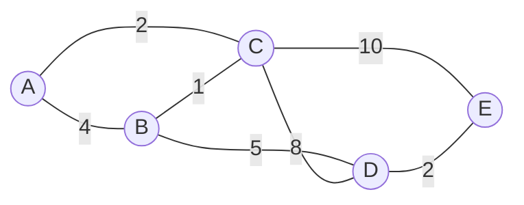

# Minimum Spanning Trees

A minimum spanning tree, or MST (최소 비용 신장 트리), connects all vertices of a weighted undirected graph with the least possible total edge weight and no cycles. It is a graph problem, but it is also a data-structures lesson: Kruskal's algorithm relies on disjoint sets, Prim's algorithm relies on a priority queue, and both rely on careful graph representation.


*Figure: Binary trees make recursive structure and pointer relationships visible. Image: [Wikimedia Commons](https://commons.wikimedia.org/wiki/File:Binary_tree.svg), Derrick Coetzee, public domain.*

The source textbook places minimum-cost spanning trees after graph traversal and connected components. That sequence is logical. A spanning tree exists only inside a connected undirected graph; traversal explains reachability, and MST algorithms then ask which connecting edges are cheapest without forming unnecessary cycles.

## Definitions

Let $G = (V, E)$ be a connected, undirected, weighted graph. A **spanning tree** is a subgraph $T = (V, E_T)$ that includes every vertex, is connected, and has no cycles. Any spanning tree of a graph with $\vert V\vert $ vertices has exactly $\vert V\vert  - 1$ edges.

A **minimum spanning tree** is a spanning tree with minimum total edge weight:

$$
w(T) = \sum_{e \in E_T} w(e)
$$

If all edge weights are distinct, the MST is unique. If some edge weights tie, multiple MSTs may exist with the same total weight.

Two greedy algorithms dominate the basic curriculum:

- **Kruskal's algorithm**: sort edges by weight and add the next lightest edge that does not form a cycle.
- **Prim's algorithm**: grow one tree from a start vertex by repeatedly adding the lightest edge crossing from the tree to a vertex outside it.

Useful properties:

- **Cut property**: for any cut of the vertices, a lightest edge crossing that cut is safe to add to some MST.
- **Cycle property**: for any cycle, a heaviest edge on that cycle is not needed in some MST.

A **disjoint-set union** structure, also called union-find, maintains components during Kruskal's algorithm. It supports `find(x)` to identify a component and `union(a,b)` to merge two components.

## Key results

Kruskal's algorithm is correct because each chosen edge is the lightest edge crossing a cut between two current components. By the cut property, adding it is safe. Rejecting edges whose endpoints already belong to the same component prevents cycles.

Prim's algorithm is correct by the same cut property. At every step, the current tree defines a cut: vertices already in the tree versus vertices outside. The lightest edge crossing that cut can safely extend the tree.

Kruskal's running time is typically $O(E \log E)$ because of edge sorting. Union-find operations are almost constant amortized time with path compression and union by rank, so sorting dominates.

Prim's running time depends on the priority queue and graph representation. With an adjacency matrix and simple scanning, it is $O(V^2)$. With adjacency lists and a binary heap, it is $O(E \log V)$.

| Algorithm | Main data structures | Time complexity | Best fit |
|---|---|---:|---|
| Kruskal | edge list, sorting, union-find | $O(E \log E)$ | sparse graphs, edge-list input |
| Prim with matrix | adjacency matrix, arrays | $O(V^2)$ | dense graphs |
| Prim with heap | adjacency lists, priority queue | $O(E \log V)$ | sparse graphs |

The MST problem is greedy in a disciplined way. It is not enough to take the cheapest edge incident to the most recently added vertex, and it is not enough to choose locally cheap paths from a single source. The cut property is what makes the choices safe. Each accepted edge must be lightest across some cut that respects the partial solution. Kruskal defines cuts through current connected components; Prim defines the cut through the growing tree.

The output should also be checked structurally. A set of edges with low total weight is not an MST if it leaves a vertex disconnected or contains a cycle. A correct MST for a connected graph with `V` vertices has exactly `V - 1` selected edges and exactly one connected component.

## Visual



Kruskal's selection order for this graph:

| Step | Edge considered | Action | Reason |
|---:|---|---|---|
| 1 | `B-C` weight 1 | add | connects two components |
| 2 | `A-C` weight 2 | add | connects `A` to component |
| 3 | `D-E` weight 2 | add | connects `D` and `E` |
| 4 | `A-B` weight 4 | reject | cycle with `A-C-B` |
| 5 | `B-D` weight 5 | add | connects two large components |

## Worked example 1: Kruskal's algorithm

Problem: Find an MST of the graph in the visual.

Method: sort edges by weight, scan them, and use components to avoid cycles.

Sorted edges:

1. `B-C` weight `1`
2. `A-C` weight `2`
3. `D-E` weight `2`
4. `A-B` weight `4`
5. `B-D` weight `5`
6. `C-D` weight `8`
7. `C-E` weight `10`

Trace:

1. Start with components `{A}`, `{B}`, `{C}`, `{D}`, `{E}`.
2. Consider `B-C`. Components differ, so add it. Components become `{B,C}`, `{A}`, `{D}`, `{E}`. Total `1`.
3. Consider `A-C`. `A` is separate from `{B,C}`, so add it. Components become `{A,B,C}`, `{D}`, `{E}`. Total `3`.
4. Consider `D-E`. Components differ, so add it. Components become `{A,B,C}`, `{D,E}`. Total `5`.
5. Consider `A-B`. Both endpoints are already in `{A,B,C}`, so adding it would form a cycle. Reject it.
6. Consider `B-D`. Endpoints lie in different components, `{A,B,C}` and `{D,E}`. Add it. Components become `{A,B,C,D,E}`. Total `10`.
7. Stop because an MST on five vertices has four edges.

Checked answer: selected edges are `B-C`, `A-C`, `D-E`, and `B-D`, with total weight `1 + 2 + 2 + 5 = 10`. The selected subgraph has all five vertices, four edges, and no cycle, so it is a spanning tree.

## Worked example 2: Prim's algorithm from vertex A

Problem: Run Prim's algorithm on the same graph, starting at `A`.

Method: maintain a set `S` of vertices already in the tree. At each step choose the minimum-weight edge from `S` to `V - S`.

1. Start: `S = {A}`. Crossing edges are `A-B` weight `4` and `A-C` weight `2`. Choose `A-C`. Total `2`.
2. Now `S = {A, C}`. Crossing edges include:
   - `A-B` weight `4`
   - `C-B` weight `1`
   - `C-D` weight `8`
   - `C-E` weight `10`
   Choose `C-B` weight `1`. Total `3`.
3. Now `S = {A, B, C}`. Crossing edges include:
   - `B-D` weight `5`
   - `C-D` weight `8`
   - `C-E` weight `10`
   Choose `B-D` weight `5`. Total `8`.
4. Now `S = {A, B, C, D}`. Crossing edges include:
   - `D-E` weight `2`
   - `C-E` weight `10`
   Choose `D-E` weight `2`. Total `10`.
5. All vertices are included. Stop.

Checked answer: selected edges are `A-C`, `C-B`, `B-D`, and `D-E`, total `10`. This is the same MST as Kruskal's result, just found in a different order.

## Code

The following C program implements Kruskal's algorithm using an edge array and disjoint-set union with path compression and union by rank.

```c
#include <stdio.h>
#include <stdlib.h>

typedef struct {
    int u;
    int v;
    int w;
} Edge;

typedef struct {
    int parent;
    int rank;
} Set;

static int compare_edges(const void *a, const void *b) {
    const Edge *ea = a;
    const Edge *eb = b;
    return (ea->w > eb->w) - (ea->w < eb->w);
}

static int find(Set sets[], int x) {
    if (sets[x].parent != x) {
        sets[x].parent = find(sets, sets[x].parent);
    }
    return sets[x].parent;
}

static int unite(Set sets[], int a, int b) {
    int ra = find(sets, a);
    int rb = find(sets, b);
    if (ra == rb) return 0;
    if (sets[ra].rank < sets[rb].rank) {
        sets[ra].parent = rb;
    } else if (sets[ra].rank > sets[rb].rank) {
        sets[rb].parent = ra;
    } else {
        sets[rb].parent = ra;
        sets[ra].rank++;
    }
    return 1;
}

int main(void) {
    Edge edges[] = {
        {0, 1, 4}, {0, 2, 2}, {1, 2, 1}, {1, 3, 5},
        {2, 3, 8}, {2, 4, 10}, {3, 4, 2}
    };
    int vertex_count = 5;
    int edge_count = (int)(sizeof(edges) / sizeof(edges[0]));
    Set sets[5];
    int total = 0;
    int chosen = 0;

    for (int i = 0; i < vertex_count; ++i) {
        sets[i].parent = i;
        sets[i].rank = 0;
    }
    qsort(edges, edge_count, sizeof(edges[0]), compare_edges);

    for (int i = 0; i < edge_count && chosen < vertex_count - 1; ++i) {
        if (unite(sets, edges[i].u, edges[i].v)) {
            printf("%d-%d weight %d\n", edges[i].u, edges[i].v, edges[i].w);
            total += edges[i].w;
            chosen++;
        }
    }
    printf("total = %d\n", total);
    return EXIT_SUCCESS;
}
```

## Common pitfalls

- Applying MST algorithms to directed graphs without changing the problem. Standard MSTs are for undirected graphs.
- Forgetting that a disconnected graph has a minimum spanning forest, not a single spanning tree.
- Adding the lightest remaining edge in Kruskal without checking whether it creates a cycle.
- Stopping after too many or too few edges. A spanning tree on $V$ vertices has exactly $V - 1$ edges.
- Assuming the MST is always unique. Equal edge weights can produce different MSTs with the same total cost.
- Confusing shortest paths with MSTs. An MST minimizes total tree weight, not the distance from one source to every vertex.

## Connections

- [graph representation](/cs/data-structures/graph-representation)
- [graph traversals](/cs/data-structures/graph-traversals)
- [heaps and priority queues](/cs/data-structures/heaps-priority-queues)
- [shortest paths](/cs/data-structures/shortest-paths)
- [sorting algorithms](/cs/data-structures/sorting-algorithms)
