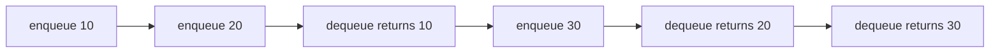

# Queues, Circular Queues, and Deques

A queue (큐) is the linear structure for waiting order. New elements enter at the rear, old elements leave from the front, and the element that has waited longest is served first. This FIFO rule makes queues central to scheduling, buffering, breadth-first search, simulations, interrupt handling, and producer-consumer systems.


*Figure: The algorithms mark gives the abstract algorithms pages a concrete visual anchor. Image: [Wikimedia Commons](https://commons.wikimedia.org/wiki/File:Algorithms.svg), Jeff Erickson, CC BY 4.0.*

The basic queue is easy to describe but surprisingly easy to implement poorly in C. If an array queue always removes by shifting every remaining element left, each dequeue costs $O(n)$. If it uses a `front` index and never reuses earlier cells, the array appears full even when many cells have been dequeued. The circular queue solves both problems by treating the array as a ring. The deque, or double-ended queue, generalizes the idea by allowing insertion and deletion at both ends.

## Definitions

A **queue ADT** has:

- **Objects**: finite ordered sequences $\langle x_0, x_1, \dots, x_{n-1}\rangle$, where $x_0$ is the front and $x_{n-1}$ is the rear.
- **`enqueue(Q, x)`**: insert `x` at the rear.
- **`dequeue(Q)`**: remove and return the front element.
- **`front(Q)`**: inspect the front element without removing it.
- **`is_empty(Q)`**: report whether the queue has no elements.
- **`is_full(Q)`**: meaningful for bounded array queues.

The defining rule is **FIFO**, first in, first out. If elements arrive as `A`, `B`, `C`, then the dequeue order is `A`, then `B`, then `C`.

A **linear array queue** uses two indices, `front` and `rear`, but does not wrap them. It is simple but wastes cells after dequeue operations.

A **circular queue** stores elements in `data[0..capacity-1]` and advances indices modulo the capacity:

$$
\mathrm{next}(i) = (i + 1) \bmod \mathrm{capacity}
$$

Common representations are:

- Keep a separate `size` field. Full when `size == capacity`, empty when `size == 0`.
- Leave one array slot unused. Full when `(rear + 1) % capacity == front`, empty when `front == rear`.

A **deque** supports `push_front`, `push_back`, `pop_front`, and `pop_back`. It can act as a stack, a queue, or a sliding-window structure.

## Key results

The circular queue achieves $O(1)$ enqueue and dequeue without shifting elements. The proof is direct: each operation writes or reads one cell and updates one or two integers with modular arithmetic. The array never moves existing elements.

The separate-size convention makes full and empty tests unambiguous. Without `size`, `front == rear` could mean either empty or full, so an implementation must either reserve one cell or store additional state.

For applications, the semantic difference between stacks and queues is often more important than implementation details. DFS uses a stack-like frontier and follows one path deeply; BFS uses a queue and explores all vertices at distance $k$ before any vertex at distance $k+1$. A scheduler that should be fair among jobs usually starts with queue behavior, while an undo feature usually starts with stack behavior.

| Structure | Insert ends | Remove ends | Order rule | Typical use |
|---|---|---|---|---|
| Stack | top only | top only | LIFO | recursion, undo, DFS |
| Queue | rear only | front only | FIFO | scheduling, BFS, buffering |
| Circular queue | rear only | front only | FIFO with reused array cells | fixed-size buffers |
| Deque | front and rear | front and rear | programmer chooses | sliding windows, work stealing |

The most common C design decision is whether the queue owns its storage or receives storage from the caller. A small embedded-style circular queue may contain a fixed array inside the `struct`, making allocation unnecessary. A general-purpose queue may store a pointer, capacity, front index, rear index, and size so it can be initialized with any capacity. Linked queues add another option: keep both `front` and `rear` node pointers. Enqueue links a new node after the rear, and dequeue removes the front node. Without the rear pointer, enqueue would require traversal and would no longer be $O(1)$.

Deque implementations follow the same circular-buffer logic but update both ends. To push at the front, decrement `front` modulo capacity before writing. To pop at the back, decrement `rear` modulo capacity before reading. These off-by-one details are why it is worth writing down the exact invariant before coding.

## Visual



Circular storage after wraparound:

```text
capacity = 6, size = 4

index:   0    1    2    3    4    5
value:  50   60   _    _    30   40
                rear->2  front->4

logical queue order: 30, 40, 50, 60
```

## Worked example 1: circular queue wraparound

Problem: A circular queue has capacity `5`, `front = 0`, `rear = 0`, and `size = 0`. Perform `enqueue(10)`, `enqueue(20)`, `enqueue(30)`, `dequeue()`, `dequeue()`, `enqueue(40)`, `enqueue(50)`, `enqueue(60)`. Show the final array and logical order.

Method: with the separate-size convention, `rear` points to the next free cell and `front` points to the current front element.

1. Enqueue `10`: write at `rear = 0`, set `rear = 1`, `size = 1`.
2. Enqueue `20`: write at `1`, set `rear = 2`, `size = 2`.
3. Enqueue `30`: write at `2`, set `rear = 3`, `size = 3`.
4. Dequeue: read `data[0] = 10`, set `front = 1`, `size = 2`.
5. Dequeue: read `data[1] = 20`, set `front = 2`, `size = 1`.
6. Enqueue `40`: write at `3`, set `rear = 4`, `size = 2`.
7. Enqueue `50`: write at `4`, set `rear = 0` because `(4 + 1) % 5 = 0`, `size = 3`.
8. Enqueue `60`: write at `0`, set `rear = 1`, `size = 4`.

Final physical array:

```text
index:   0    1    2    3    4
value:  60   20   30   40   50
front = 2, rear = 1, size = 4
```

Checked answer: ignore stale values outside the logical queue. Starting at `front = 2` and reading `size = 4` elements modulo `5` gives indices `2, 3, 4, 0`, so the logical order is `30, 40, 50, 60`.

## Worked example 2: choosing queue behavior for service simulation

Problem: Customers arrive at times `0`, `2`, `3`, and `9`. A single server takes `4` time units per customer. Simulate the service order and waiting times using a FIFO queue.

Method: process events in time order. When the server is free and the queue is nonempty, dequeue the next customer.

1. Time `0`: customer `A` arrives. Server is free, so `A` starts immediately. Finish time is `4`. Waiting time: `0 - 0 = 0`.
2. Time `2`: customer `B` arrives while `A` is being served. Queue: `[B]`.
3. Time `3`: customer `C` arrives. Queue: `[B, C]`.
4. Time `4`: `A` finishes. Dequeue `B`. `B` arrived at `2`, starts at `4`, waits `2`.
5. Time `8`: `B` finishes. Dequeue `C`. `C` arrived at `3`, starts at `8`, waits `5`.
6. Time `9`: customer `D` arrives while `C` is being served. Queue: `[D]`.
7. Time `12`: `C` finishes. Dequeue `D`. `D` arrived at `9`, starts at `12`, waits `3`.
8. Time `16`: `D` finishes.

Checked answer: the service order is `A, B, C, D`, exactly the arrival order. Waiting times are `0`, `2`, `5`, and `3`, for an average of $(0 + 2 + 5 + 3)/4 = 2.5$ time units.

## Code

The following program implements a bounded circular queue with a separate `size` field. The printed output demonstrates wraparound.

```c
#include <stdio.h>
#include <stdlib.h>

#define CAPACITY 5

typedef struct {
    int data[CAPACITY];
    int front;
    int rear;
    int size;
} Queue;

static void init(Queue *q) {
    q->front = 0;
    q->rear = 0;
    q->size = 0;
}

static int is_empty(const Queue *q) {
    return q->size == 0;
}

static int is_full(const Queue *q) {
    return q->size == CAPACITY;
}

static int enqueue(Queue *q, int value) {
    if (is_full(q)) return 0;
    q->data[q->rear] = value;
    q->rear = (q->rear + 1) % CAPACITY;
    q->size++;
    return 1;
}

static int dequeue(Queue *q, int *out) {
    if (is_empty(q)) return 0;
    *out = q->data[q->front];
    q->front = (q->front + 1) % CAPACITY;
    q->size--;
    return 1;
}

static void print_queue(const Queue *q) {
    printf("queue:");
    for (int k = 0; k < q->size; ++k) {
        int index = (q->front + k) % CAPACITY;
        printf(" %d", q->data[index]);
    }
    printf("\n");
}

int main(void) {
    Queue q;
    int removed;
    init(&q);
    enqueue(&q, 10);
    enqueue(&q, 20);
    enqueue(&q, 30);
    dequeue(&q, &removed);
    dequeue(&q, &removed);
    enqueue(&q, 40);
    enqueue(&q, 50);
    enqueue(&q, 60);
    print_queue(&q);
    return EXIT_SUCCESS;
}
```

## Common pitfalls

- Confusing `front` and `rear` meanings. Document whether `rear` points to the last element or the next free slot.
- Forgetting modulo arithmetic when an index reaches the physical end of the array.
- Using `front == rear` for both full and empty without an extra convention.
- Shifting elements on every dequeue in an array queue. That implementation is simple but destroys the expected $O(1)$ queue operation.
- Reading stale cells in a circular buffer. Physical array contents are not the same thing as logical queue contents.
- Using a queue for expression evaluation where LIFO nesting is required; that is a stack problem.

## Connections

- [stacks](/cs/data-structures/stacks)
- [arrays and array operations](/cs/data-structures/arrays)
- [linked lists](/cs/data-structures/linked-lists)
- [graph traversals](/cs/data-structures/graph-traversals)
- [shortest paths](/cs/data-structures/shortest-paths)
