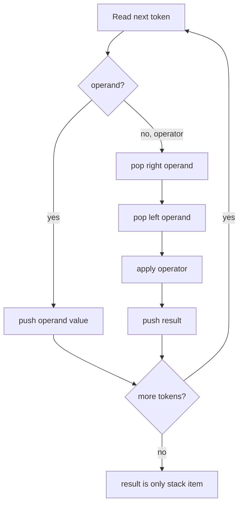

# Stacks and Expression Evaluation

A stack (스택) is a restricted linear structure where insertion and deletion happen at one end, called the top. This restriction is the point: by removing choices, the stack gives strong behavior. The last item pushed is the first item popped, so a stack naturally represents nested work: function calls, parentheses, undo histories, backtracking, depth-first traversal, and expression evaluation.

In a C data-structures course, stacks are usually introduced after arrays because the simplest stack is just an array plus an integer top index. The same ADT can also be implemented with linked nodes, which removes the fixed-capacity problem but adds allocation overhead. The source textbook places stacks next to queues and then applies stacks to maze search and arithmetic expressions. Expression evaluation is a particularly good example because the stack does not merely store data; it enforces the order in which operations become ready.

## Definitions

A **stack ADT** is defined by the following objects and operations:

- **Objects**: finite ordered sequences $\langle x_0, x_1, \dots, x_{n-1}\rangle$, where $x_{n-1}$ is the top.
- **`push(S, x)`**: insert `x` at the top.
- **`pop(S)`**: remove and return the top element; invalid on an empty stack.
- **`peek(S)`** or **`top(S)`**: return the top element without removing it.
- **`is_empty(S)`**: report whether the stack has no elements.
- **`is_full(S)`**: meaningful for bounded array implementations.

The defining rule is **LIFO**, last in, first out. If the operations are:

$$
\mathrm{push}(A),\ \mathrm{push}(B),\ \mathrm{push}(C),\ \mathrm{pop}()
$$

then the popped value is `C`, because `C` was pushed last.

An **array-based stack** stores items in `data[0..capacity-1]` and records the top position. Two common conventions are:

- `top == -1` means empty, and `data[top]` is the current top.
- `top == size` means empty when `top == 0`, and `data[top - 1]` is the current top.

A **linked-list stack** stores each element in a node with a pointer to the next node. The stack top is a pointer to the first node. Pushing allocates a new head; popping removes the head.

In expression processing, the common notations are:

- **Infix**: operator between operands, such as `A + B`.
- **Prefix**: operator before operands, such as `+ A B`.
- **Postfix** or **reverse Polish notation**: operator after operands, such as `A B +`.

Postfix expressions are easy to evaluate with one operand stack because every operator appears after its operands are already available.

## Key results

Both array and linked implementations support `push`, `pop`, and `peek` in $O(1)$ time. The difference is in memory management and overflow behavior. A fixed array stack can overflow; a linked stack can grow until heap allocation fails. A dynamically resized array stack has $O(1)$ amortized push, similar to a vector.

The correctness of stack-based postfix evaluation follows from a simple invariant: after scanning any prefix of the token stream, the stack contains exactly the values of subexpressions whose operands have been fully read but whose surrounding operator has not yet appeared. When an operator arrives, the top two values are the operator's right and left operands, so the evaluator can reduce them to one value and preserve the invariant.

For infix-to-postfix conversion, the operator stack stores operators whose left operand has been seen but whose output position is delayed by precedence or parentheses. Higher-precedence operators must be emitted before lower-precedence operators. Parentheses override precedence by marking a boundary on the operator stack.

| Implementation | Push | Pop | Extra memory per item | Failure mode | Best use |
|---|---:|---:|---:|---|---|
| Fixed array | $O(1)$ | $O(1)$ | none beyond array slot | full stack | known maximum depth |
| Dynamic array | $O(1)$ amortized | $O(1)$ | possible unused capacity | allocation failure | general-purpose stack |
| Linked list | $O(1)$ | $O(1)$ | pointer per node | allocation failure | unpredictable depth |

In C, the array implementation is often the best first implementation because it makes the state easy to inspect: the stack is the prefix `data[0..top]`. The linked implementation becomes attractive when the maximum depth is unknown or when the stack is part of a larger linked structure. Even then, allocation cost matters. A linked stack performs a `malloc` on every push and a `free` on every pop unless nodes are pooled. For small, hot stacks such as parser operator stacks, a dynamic array is usually simpler and faster.

The call stack used by C function calls is also a stack, but it is managed by the runtime, not by your ADT code. Recursive DFS, recursive tree traversal, and recursive quicksort all consume call-stack frames. Rewriting those algorithms with an explicit stack gives the programmer control over capacity, allocation, and overflow handling.

## Visual



The stack itself grows and shrinks only at the top:

```text
push 10        push 20        pop
--------       --------       --------
|  10 | <-top  |  20 | <-top  |  10 | <-top
--------       |  10 |        --------
               --------
```

## Worked example 1: evaluating a postfix expression

Problem: Evaluate the postfix expression `6 2 3 + * 4 -`.

Method: scan left to right. Push operands. When an operator appears, pop the right operand first, then the left operand.

1. Token `6`: push `6`. Stack: `[6]`.
2. Token `2`: push `2`. Stack: `[6, 2]`.
3. Token `3`: push `3`. Stack: `[6, 2, 3]`.
4. Token `+`: pop right `3`, pop left `2`, compute `2 + 3 = 5`, push `5`. Stack: `[6, 5]`.
5. Token `*`: pop right `5`, pop left `6`, compute `6 * 5 = 30`, push `30`. Stack: `[30]`.
6. Token `4`: push `4`. Stack: `[30, 4]`.
7. Token `-`: pop right `4`, pop left `30`, compute `30 - 4 = 26`, push `26`. Stack: `[26]`.

Checked answer: the expression evaluates to `26`. Translating back to infix gives `6 * (2 + 3) - 4`, which is `6 * 5 - 4 = 30 - 4 = 26`, so the stack trace is consistent.

## Worked example 2: converting infix to postfix

Problem: Convert `(A + B) * (C - D) / E` to postfix.

Method: output operands immediately. Use an operator stack for parentheses and precedence. `*` and `/` have higher precedence than `+` and `-`; operators of the same precedence are left associative.

1. Read `(`: push it. Operators: `[(]`. Output: empty.
2. Read `A`: output it. Output: `A`.
3. Read `+`: top is `(`, so push `+`. Operators: `[(, +]`.
4. Read `B`: output it. Output: `A B`.
5. Read `)`: pop until `(`. Pop `+` to output, discard `(`. Output: `A B +`.
6. Read `*`: stack is empty, push `*`.
7. Read `(`: push it. Operators: `[*, (]`.
8. Read `C`: output it. Output: `A B + C`.
9. Read `-`: push because top is `(`. Operators: `[*, (, -]`.
10. Read `D`: output it. Output: `A B + C D`.
11. Read `)`: pop `-`, discard `(`. Output: `A B + C D -`. Operators: `[*]`.
12. Read `/`: top `*` has the same precedence and `/` is left associative, so pop `*` to output, then push `/`. Output: `A B + C D - *`. Operators: `[/]`.
13. Read `E`: output it. Output: `A B + C D - * E`.
14. End: pop remaining `/`.

Checked answer: `A B + C D - * E /`. This corresponds to `((A + B) * (C - D)) / E`, matching the original left-associative structure.

## Code

This program evaluates a whitespace-separated postfix expression containing integers and the four basic binary operators. It uses an array stack with checked overflow and underflow.

```c
#include <stdio.h>
#include <stdlib.h>
#include <string.h>

#define MAX_STACK 128

typedef struct {
    int data[MAX_STACK];
    int top;
} Stack;

static void init(Stack *s) {
    s->top = -1;
}

static int is_empty(const Stack *s) {
    return s->top == -1;
}

static void push(Stack *s, int value) {
    if (s->top + 1 >= MAX_STACK) {
        fprintf(stderr, "stack overflow\n");
        exit(EXIT_FAILURE);
    }
    s->data[++s->top] = value;
}

static int pop(Stack *s) {
    if (is_empty(s)) {
        fprintf(stderr, "stack underflow\n");
        exit(EXIT_FAILURE);
    }
    return s->data[s->top--];
}

static int apply(int left, int right, char op) {
    switch (op) {
        case '+': return left + right;
        case '-': return left - right;
        case '*': return left * right;
        case '/':
            if (right == 0) {
                fprintf(stderr, "division by zero\n");
                exit(EXIT_FAILURE);
            }
            return left / right;
        default:
            fprintf(stderr, "unknown operator: %c\n", op);
            exit(EXIT_FAILURE);
    }
}

int main(void) {
    char input[] = "6 2 3 + * 4 -";
    char *token = strtok(input, " ");
    Stack s;
    init(&s);

    while (token != NULL) {
        char *end = NULL;
        long value = strtol(token, &end, 10);
        if (*end == '\0') {
            push(&s, (int)value);
        } else if (strlen(token) == 1) {
            int right = pop(&s);
            int left = pop(&s);
            push(&s, apply(left, right, token[0]));
        } else {
            fprintf(stderr, "bad token: %s\n", token);
            return EXIT_FAILURE;
        }
        token = strtok(NULL, " ");
    }

    int result = pop(&s);
    if (!is_empty(&s)) {
        fprintf(stderr, "malformed expression\n");
        return EXIT_FAILURE;
    }
    printf("%d\n", result);
    return EXIT_SUCCESS;
}
```

## Common pitfalls

- Reversing operand order for noncommutative operators. In postfix evaluation, the first popped value is the right operand.
- Letting `top` point to the next free slot in one function and to the current element in another. Choose one convention and use it consistently.
- Ignoring underflow. Popping from an empty stack usually signals malformed input or a logic bug.
- Treating linked-list stacks as automatically safe. They still need allocation checks and `free` on popped nodes.
- Forgetting left associativity during infix-to-postfix conversion. For `A - B - C`, the correct grouping is `(A - B) - C`.
- Using a stack when the problem requires FIFO behavior. Waiting lines and breadth-first traversal need queues, not stacks.

## Connections

- [arrays and array operations](/cs/data-structures/arrays)
- [queues](/cs/data-structures/queues)
- [linked lists](/cs/data-structures/linked-lists)
- [binary trees](/cs/data-structures/binary-trees)
- [graph traversals](/cs/data-structures/graph-traversals)
