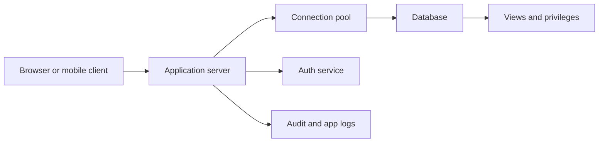

# Application Architecture and Security

Database systems rarely stand alone. Applications connect to them through drivers, connection pools, web frameworks, APIs, background jobs, and reporting tools. The database may enforce constraints and transactions, but application architecture determines how queries are issued, how failures are retried, how credentials are protected, and how user input reaches SQL.


*Figure: A database system is experienced through schemas, queries, connections, and administration tools. Image: [Wikimedia Commons](https://commons.wikimedia.org/wiki/File:PgAdminScreenshot.png), Boshomi, CC BY-SA 3.0.*

Security is not a separate final step. It begins with schema design, least-privilege accounts, parameterized queries, authorization checks, and careful transaction boundaries. A database-backed application that is functionally correct under friendly inputs can still fail badly if it concatenates SQL strings, leaks data through overbroad queries, or grants write privileges where read privileges would suffice.

## Definitions

A **database application architecture** describes how clients, application servers, and database servers communicate. A two-tier architecture lets clients connect directly to the database. A three-tier architecture places application servers between clients and the database, centralizing business logic, authentication, and connection management.

A **database driver** implements a programming interface such as JDBC, ODBC, DB-API, or a language-specific client. A **connection pool** maintains reusable database connections so each request does not pay the full cost of creating a connection.

A **prepared statement** is a SQL statement parsed with parameter placeholders. Parameters are bound as values, not executable SQL. This is the standard defense against SQL injection for value inputs.

**Authentication** proves who a user or service is. **Authorization** decides what that identity may do. Database authorization includes privileges such as `SELECT`, `INSERT`, `UPDATE`, `DELETE`, `REFERENCES`, and administrative rights. Application authorization often needs row-level or business-level checks in addition to database privileges.

**SQL injection** occurs when untrusted input is interpreted as SQL syntax. **Encryption in transit** protects network traffic. **Encryption at rest** protects stored files or backups. **Auditing** records relevant access and changes for accountability.

## Key results

Parameterized SQL separates code from data. If a user enters `x' OR '1'='1`, a prepared statement treats the entire string as a value. String concatenation may turn that input into executable predicate logic. This is one of the clearest cases where the correct programming interface matters more than manual escaping.

Least privilege limits damage. The web application account used for public search does not need `DROP TABLE`. A reporting account may need read-only access to selected views, not base tables with sensitive columns. Views can hide columns and rows, though they should complement, not replace, robust authorization design.

Transactions should match business operations. A request that debits one account and credits another should use one transaction. A request that sends email after committing an order should consider idempotency and outbox patterns, because external side effects cannot be rolled back by the database.

Connection pools are necessary but can overload the database if misconfigured. A pool with too many connections can increase contention, memory use, and context switching. A pool with too few connections can throttle the application. The right size depends on query latency, CPU cores, workload, and DBMS capacity.

Application code should treat database errors as part of the design. Deadlocks, serialization failures, unique-key violations, and connection timeouts are normal outcomes under load, not impossible exceptions. Robust services classify errors into retryable and nonretryable cases. Retrying a transaction requires idempotency: the repeated attempt must not charge a customer twice or send duplicate external messages.

Authorization should be enforced close to the data as well as in the application. Application checks provide business context, but database roles, views, row-level security, and stored procedures can limit damage if an application bug exposes a query path. Sensitive data should be minimized in result sets; the safest column is the one the service account cannot read.

Operational security includes migrations and backups. A migration that drops a column can be as destructive as an attacker if it runs against the wrong environment. Backups must be encrypted, access-controlled, and tested with restoration drills. Audit logs are useful only if they record the relevant actor, operation, time, and target without leaking secrets.

Performance bugs often come from application query patterns rather than single bad queries. The N+1 query problem occurs when code fetches a list of rows and then performs one query per row to fetch related data. It may look fine with ten rows and fail with ten thousand. Batching, joins, prefetching, and carefully designed APIs keep database round trips proportional to the task rather than to accidental loop structure.

Migrations should be compatible with running application versions. A common safe pattern is expand, migrate, contract: add new nullable structures, deploy code that writes both old and new forms or reads both, backfill data, switch reads, then remove the old structure later. This reduces downtime and avoids breaking rolling deployments where old and new application instances run at the same time.

Observability closes the loop between design and operation. Slow-query logs, execution plans, pool metrics, lock-wait metrics, and error rates show whether the application is using the database as intended. Without those signals, teams tend to guess: they add indexes blindly, raise pool sizes until the database is saturated, or cache stale data without understanding the original bottleneck. A production database application should make its data access patterns visible.

Caching should be treated as a consistency decision. A cache can reduce database load, but it creates another copy of data with its own expiration and invalidation rules. Cache keys, time-to-live settings, and write-through or write-around behavior should be documented next to the queries they protect.

## Visual



| Risk | Bad pattern | Better pattern |
| --- | --- | --- |
| SQL injection | concatenate user strings into SQL | prepared statements |
| Overbroad access | app uses admin account | least-privilege service roles |
| Data leakage | query base tables directly | views, row filters, explicit authorization |
| Lost work on failure | multi-step update without transaction | one transaction per business invariant |
| Duplicate side effects | retry sends external action twice | idempotency keys or outbox pattern |
| Pool exhaustion | unbounded connections | bounded pool with timeouts and metrics |

## Worked example 1: Replace unsafe SQL with parameters

Problem: An application searches students by name. The unsafe implementation builds:

```text
"SELECT ID, name FROM student WHERE name = '" + user_input + "'"
```

Show how an injection works and how a prepared statement fixes it.

Method:

1. Suppose the input is:

   ```text
   ' OR '1' = '1
   ```

2. String concatenation produces:

   ```sql
   SELECT ID, name
   FROM student
   WHERE name = '' OR '1' = '1';
   ```

3. The predicate `'1' = '1'` is true for every row, so the query returns all students.

4. With parameters, the SQL text is stable:

   ```sql
   SELECT ID, name
   FROM student
   WHERE name = ?;
   ```

5. The driver sends the user input as a value for the placeholder. The database compares `name` to the literal string containing quotes and spaces; it does not treat the input as syntax.

Checked answer: prepared statements prevent this value from changing the query structure. Authorization should still limit what the application account can read.

## Worked example 2: Choose transaction boundaries for enrollment

Problem: A student enrolls in a section. The application must check capacity, insert a `takes` row, and decrement available seats. Decide the transaction boundary.

Method:

1. The invariant is:

   ```text
   enrolled students must not exceed capacity
   ```

2. The check and writes must be atomic. If two requests check capacity at the same time outside a transaction, both may see one remaining seat and both may insert.

3. Put the critical operations in one transaction:

   ```sql
   BEGIN;
   SELECT available_seats
   FROM section_capacity
   WHERE course_id = ? AND sec_id = ? AND semester = ? AND year = ?
   FOR UPDATE;

   INSERT INTO takes(ID, course_id, sec_id, semester, year)
   VALUES (?, ?, ?, ?, ?);

   UPDATE section_capacity
   SET available_seats = available_seats - 1
   WHERE course_id = ? AND sec_id = ? AND semester = ? AND year = ?;
   COMMIT;
   ```

4. The `FOR UPDATE` lock or equivalent serializable strategy prevents concurrent transactions from both consuming the same last seat.

5. If any step fails, roll back the transaction so the enrollment row and seat count do not diverge.

Checked answer: the transaction boundary is the whole enrollment operation, not each individual SQL statement. Correctness depends on isolation as well as atomicity.

## Code

```python
import sqlite3

def find_student_by_name(conn, name):
    sql = """
    SELECT ID, name, dept_name
    FROM student
    WHERE name = ?
    ORDER BY ID
    """
    return conn.execute(sql, (name,)).fetchall()

def transfer(conn, source, target, amount):
    with conn:
        conn.execute(
            "UPDATE account SET balance = balance - ? WHERE account_id = ?",
            (amount, source),
        )
        conn.execute(
            "UPDATE account SET balance = balance + ? WHERE account_id = ?",
            (amount, target),
        )
```

```sql
CREATE VIEW public_student_directory AS
SELECT ID, name, dept_name
FROM student;

GRANT SELECT ON public_student_directory TO app_readonly;
REVOKE SELECT ON student FROM app_readonly;
```

## Common pitfalls

- Escaping strings manually instead of using parameters.
- Giving the application database owner privileges for ordinary requests.
- Splitting one business invariant across several autocommitted statements.
- Holding transactions open while waiting for user input or slow external services.
- Logging sensitive query parameters without redaction.
- Assuming application authorization and database authorization are interchangeable; robust systems use both.

## Connections

- [SQL DDL, DML, and Basic Queries](/cs/databases/sql-ddl-dml-and-basic-queries)
- [Transactions, ACID, and Serializability](/cs/databases/transactions-acid-and-serializability)
- [MVCC and Snapshot Isolation](/cs/databases/mvcc-and-snapshot-isolation)
- [Distributed Databases, Replication, Partitioning, and 2PC](/cs/databases/distributed-databases-replication-partitioning-2pc)
