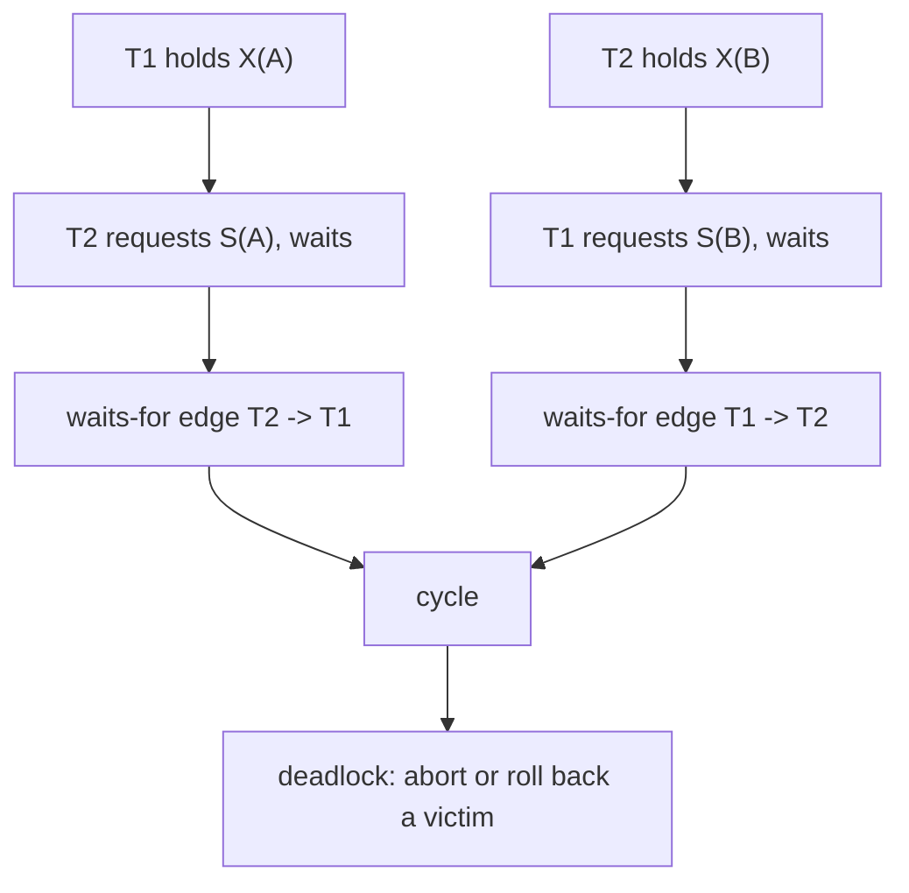

# Concurrency Control with Locks, Deadlocks, and Timestamps

Concurrency control lets many transactions run at the same time while preserving a correctness contract. Without it, two users can overwrite each other's updates, read data that later disappears, or make decisions from inconsistent snapshots. The DBMS must balance safety and throughput: blocking too much wastes resources, while allowing too much interleaving creates anomalies.


*Figure: A database system is experienced through schemas, queries, connections, and administration tools. Image: [Wikimedia Commons](https://commons.wikimedia.org/wiki/File:PgAdminScreenshot.png), Boshomi, CC BY-SA 3.0.*

Locking and timestamp protocols are classic approaches. Locking controls access to data items by making transactions wait for incompatible operations. Timestamp ordering assigns transactions a serialization order and rejects operations that violate that order. Both approaches are easier to understand after serializability, because their purpose is to produce schedules that behave like a safe serial order.

## Definitions

A **lock** is a permission to access a data item in a particular mode. A shared lock (`S`) permits reading. An exclusive lock (`X`) permits writing. Multiple transactions can hold shared locks on the same item, but an exclusive lock conflicts with any other lock on that item.

| Requested mode | Existing `S` | Existing `X` |
| --- | --- | --- |
| `S` | compatible | incompatible |
| `X` | incompatible | incompatible |

**Two-phase locking (2PL)** requires each transaction to have a growing phase, where it may acquire locks but not release any, followed by a shrinking phase, where it may release locks but not acquire any. 2PL guarantees conflict serializability. **Strict 2PL** holds all exclusive locks until commit or abort, producing strict schedules that are easier to recover.

A **deadlock** occurs when transactions wait in a cycle. For example, `T1` waits for a lock held by `T2`, while `T2` waits for a lock held by `T1`. A **waits-for graph** has transactions as nodes and wait edges as directed edges. A cycle means deadlock.

**Multiple granularity locking** supports locks at different levels, such as database, table, page, and row. Intention locks signal that a transaction intends to lock finer-grained items below a node. Common modes include intention shared (`IS`), intention exclusive (`IX`), and shared intention exclusive (`SIX`).

**Timestamp ordering** assigns every transaction a timestamp. Each data item tracks the largest read timestamp and largest write timestamp. Operations that would violate timestamp order are rejected or cause aborts.

## Key results

Basic 2PL guarantees conflict serializability because the order of lock points determines a serial order. A transaction's lock point is the moment it obtains its final lock. If `Ti` conflicts before `Tj`, lock acquisition forces an order consistent with the lock points, preventing cycles in the precedence graph.

Strict 2PL adds recoverability benefits. If exclusive locks are held until commit, no other transaction can read a value written by an uncommitted transaction. This prevents dirty reads and cascading aborts.

Deadlocks are a cost of lock-based waiting. Systems handle them by prevention, avoidance, timeout, or detection and recovery. Detection builds a waits-for graph periodically and aborts a victim transaction when a cycle is found. Victim choice may consider work done, locks held, rollback cost, and starvation risk.

Timestamp ordering avoids deadlock because transactions do not wait in cycles for data conflicts; instead, an operation that would violate the timestamp order aborts. The trade-off is more aborts under contention. Thomas' write rule can ignore certain obsolete writes when they would be overwritten by newer writes anyway, improving throughput for some workloads.

Lock granularity is a performance and correctness choice. Row locks allow high concurrency for point updates, but a transaction that scans and updates many rows may acquire thousands of locks. Table locks reduce lock-table overhead but block unrelated work. Multiple granularity locking lets a transaction announce its intent at coarse levels while taking precise locks at fine levels, so the lock manager can detect conflicts without scanning an entire hierarchy.

Phantom protection requires locking more than existing rows. If a transaction checks that no section has more than 30 students, another transaction inserting a new matching enrollment can create a phantom unless the predicate range is protected. Systems handle this with predicate locks, next-key locks, index-range locks, or serializable MVCC techniques. Simple row locks on currently visible rows are not enough for predicate invariants.

Deadlock prevention schemes choose an order before cycles form. Wait-die lets older transactions wait for younger ones but aborts younger transactions that request locks held by older ones. Wound-wait lets older transactions preempt younger lock holders, while younger transactions wait for older ones. These schemes reduce or eliminate cycles by using timestamps, but they can increase aborts and require care to avoid starvation.

Validation-based protocols take an optimistic approach. A transaction reads and writes private copies without acquiring long-term locks, then validates at commit that its read set was not invalidated by concurrent committed transactions. This works well when conflicts are rare and transactions are short. Under high contention, repeated validation failures can waste more work than conservative locking would have blocked.

Lock upgrades are another source of subtle blocking. A transaction may read a row with a shared lock and later decide to write it, requiring an exclusive lock. If two transactions both hold shared locks and both request upgrades, neither can proceed without one releasing or aborting. Some systems provide update locks or recommend acquiring the stronger lock earlier when a read is likely to become a write.

Starvation is different from deadlock. A transaction can be repeatedly delayed or aborted even when no cycle exists. Fair lock queues, victim-selection rules, and aging policies are used to keep high-contention systems from always sacrificing the same long transaction.

## Visual



| Protocol | Guarantees | Main cost | Typical use |
| --- | --- | --- | --- |
| Basic 2PL | conflict serializability | cascading aborts possible | teaching model |
| Strict 2PL | serializability plus strictness | blocking and deadlocks | many OLTP systems |
| Multiple granularity | scalable locking at table/page/row levels | more lock modes | mixed scans and row updates |
| Timestamp ordering | timestamp-serial schedules | aborts under contention | conceptual and specialized systems |
| Validation-based | optimistic execution | commit-time aborts | low-conflict workloads |

## Worked example 1: Check two-phase locking behavior

Problem: Transaction `T1` performs `lock-X(A)`, `read(A)`, `write(A)`, `unlock(A)`, `lock-X(B)`, `write(B)`, `unlock(B)`. Does it obey 2PL?

Method:

1. Identify lock acquisitions:

   ```text
   lock-X(A)
   lock-X(B)
   ```

2. Identify lock releases:

   ```text
   unlock(A)
   unlock(B)
   ```

3. 2PL requires all acquisitions to occur before the first release. Here `T1` releases `A` before acquiring `B`.

4. The transaction therefore enters the shrinking phase at `unlock(A)`, then tries to grow again at `lock-X(B)`.

Checked answer: `T1` violates two-phase locking. A 2PL version would acquire both `X(A)` and `X(B)` before releasing either, or at least delay `unlock(A)` until after `lock-X(B)`.

## Worked example 2: Detect a deadlock with a waits-for graph

Problem: `T1` holds `X(A)` and requests `X(B)`. `T2` holds `X(B)` and requests `X(C)`. `T3` holds `X(C)` and requests `S(A)`. Determine whether there is a deadlock.

Method:

1. `T1` requests `X(B)`, but `T2` holds `X(B)`. Add:

   ```text
   T1 -> T2
   ```

2. `T2` requests `X(C)`, but `T3` holds `X(C)`. Add:

   ```text
   T2 -> T3
   ```

3. `T3` requests `S(A)`, but `T1` holds `X(A)`. Shared and exclusive locks conflict. Add:

   ```text
   T3 -> T1
   ```

4. The graph has:

   ```text
   T1 -> T2 -> T3 -> T1
   ```

5. This is a directed cycle.

Checked answer: the system is deadlocked. A deadlock detector must choose at least one victim, abort it, release its locks, and let other transactions continue.

## Code

```python
def has_cycle(graph):
    visiting = set()
    visited = set()

    def dfs(node):
        if node in visiting:
            return True
        if node in visited:
            return False
        visiting.add(node)
        for nxt in graph.get(node, []):
            if dfs(nxt):
                return True
        visiting.remove(node)
        visited.add(node)
        return False

    return any(dfs(node) for node in graph)

waits_for = {"T1": ["T2"], "T2": ["T3"], "T3": ["T1"]}
print(has_cycle(waits_for))
```

```sql
-- Typical transaction shape under strict locking.
BEGIN;
SELECT balance FROM account WHERE account_id = 'A' FOR UPDATE;
UPDATE account SET balance = balance - 100 WHERE account_id = 'A';
UPDATE account SET balance = balance + 100 WHERE account_id = 'B';
COMMIT;
```

## Common pitfalls

- Thinking 2PL means two locks. It means two phases: growing and shrinking.
- Releasing exclusive locks early under strictness. Strict 2PL holds write locks until commit or abort.
- Ignoring deadlock because each transaction is individually correct. Deadlock is a property of interaction.
- Using table-level locks when row-level locks would preserve concurrency, or row-level locks when a table scan should declare intention properly.
- Assuming timestamp ordering waits like locking. Basic timestamp ordering aborts conflicting operations instead of waiting.
- Forgetting predicate locks or index-range locks when reasoning about phantoms.

## Connections

- [Transactions, ACID, and Serializability](/cs/databases/transactions-acid-and-serializability)
- [MVCC and Snapshot Isolation](/cs/databases/mvcc-and-snapshot-isolation)
- [Recovery with WAL, ARIES, and Checkpoints](/cs/databases/recovery-wal-aries-checkpoints)
- [Distributed Databases, Replication, Partitioning, and 2PC](/cs/databases/distributed-databases-replication-partitioning-2pc)
