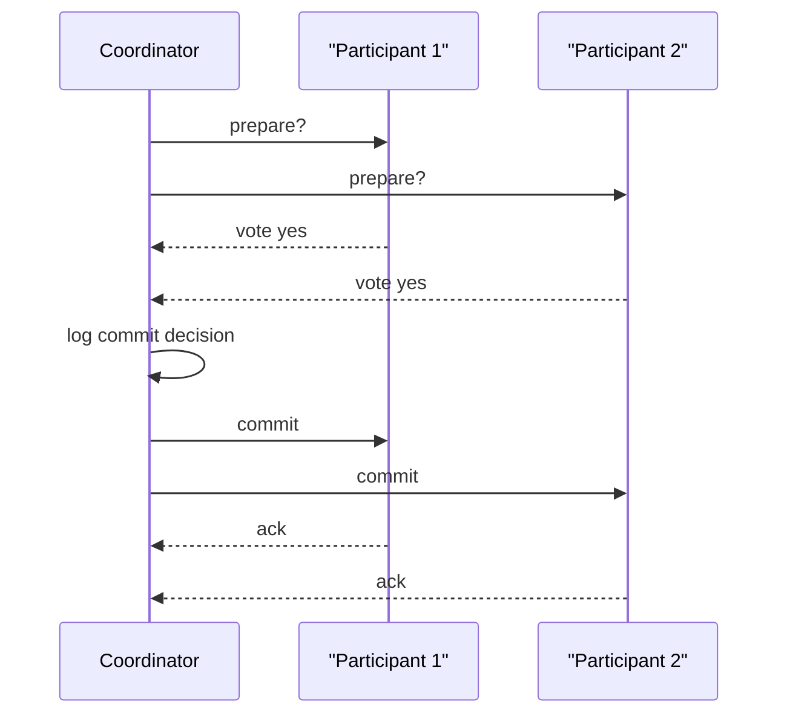

# Distributed Databases, Replication, Partitioning, and 2PC

A distributed database stores data across multiple machines, sites, or regions while trying to present a coherent data-management service. Distribution is used for scale, availability, locality, fault tolerance, and organizational autonomy. It also introduces new failure modes: messages can be delayed, nodes can crash independently, and network partitions can separate machines that are all still running.

The central design choices are partitioning, replication, distributed query processing, and distributed transaction management. Partitioning divides data so work can be spread out. Replication copies data so reads can be local and failures can be survived. Commit protocols coordinate atomic decisions across sites. Consistency models define what users can safely assume when operations touch more than one copy or partition.

## Definitions

**Data partitioning** divides a relation or key space across nodes. Horizontal partitioning assigns different rows to different partitions. Vertical partitioning assigns different columns to different partitions, usually keeping a key to reconstruct full rows. Common horizontal methods include range partitioning, hash partitioning, and list partitioning.

**Replication** stores copies of data at multiple nodes. Synchronous replication waits for multiple replicas before acknowledging a write. Asynchronous replication acknowledges earlier and propagates later, improving latency but allowing stale reads or data loss after some failures.

A **distributed transaction** accesses data at more than one site. It requires a protocol to ensure every participant commits or every participant aborts. **Two-phase commit (2PC)** is the classic atomic commit protocol.

2PC roles:

| Role | Responsibility |
| --- | --- |
| Coordinator | asks participants to prepare, then announces commit or abort |
| Participant | votes yes or no, records prepared state, follows final decision |
| Log | makes prepare and decision states durable across crashes |

The **CAP theorem** is often summarized as a trade-off among consistency, availability, and partition tolerance. In the presence of a network partition, a distributed system that must continue responding on both sides may have to relax strong consistency. CAP is not a full design guide, but it names a real tension during partitions.

## Key results

Partitioning improves scale only when workload follows the partitioning. Hash partitioning balances point lookups but is poor for range queries. Range partitioning supports range scans but can create skew if many rows fall into one hot range. Repartitioning is expensive, so partition keys should be chosen from stable, frequent access patterns.

Replication improves read availability and locality, but writes become more complicated. With a single primary, all writes for a data item go through one node, simplifying conflict handling. With multi-primary replication, concurrent writes at different replicas require conflict detection and resolution.

2PC provides atomicity across participants but can block. If participants vote yes and enter the prepared state, then the coordinator crashes before sending the final decision, participants may have to wait because unilaterally aborting or committing could violate atomicity. Three-phase commit and consensus-based commit address some failure cases under stronger assumptions, but real systems often use replicated coordinators or consensus groups.

Distributed query plans try to move less data. It is often cheaper to ship a small filtered relation to a large relation's site than to transfer a huge base table. Semijoin strategies can send projected join keys first, filter remote rows, and then ship only likely matches.

Replication has several consistency styles. In primary-copy replication, one replica accepts writes and ships changes to followers. This simplifies conflict handling but makes the primary a critical path. In quorum systems, reads and writes contact enough replicas that their sets overlap, such as `R + W > N` for `N` replicas. Quorums can tolerate some failures but still require careful versioning, repair, and conflict rules.

The CAP trade-off appears only when a partition occurs, but partitions are not exotic in large systems. A region can lose connectivity, a rack switch can fail, or a long pause can make a node appear unreachable. During that interval, a system that continues accepting writes on both sides must either reconcile later or risk divergent state. A system that preserves strong consistency may reject or delay some operations until communication is restored.

Distributed databases also need observability. Latency percentiles, replication lag, partition hot spots, lock waits, transaction aborts, and coordinator failures are not implementation trivia; they determine whether the design works under production load. A schema that is clean on one node may behave poorly when every transaction crosses regions.

Global secondary indexes are a common hidden cost. If a table is partitioned by `student_id` but users search by `course_id`, an index on `course_id` may itself be partitioned differently or replicated. Maintaining that index can turn a single-partition write into a multi-partition operation. Distributed physical design therefore includes both base data and every access path that must remain consistent with it.

Clock assumptions must be explicit. Some distributed systems use loosely synchronized physical clocks for timestamps, leases, or snapshot reads. Clock skew can break correctness if the protocol assumes more precision than the infrastructure provides. Other systems avoid this by using logical clocks, hybrid clocks, or consensus to order critical events. Time is a data-management concern once replicas can make decisions independently.

## Visual



| Technique | Benefit | Trade-off |
| --- | --- | --- |
| Hash partitioning | balanced equality workload | range queries scatter |
| Range partitioning | efficient ranges and locality | skew and hot partitions |
| Synchronous replication | strong freshness at replicas | higher write latency |
| Asynchronous replication | low write latency | stale reads and failover risk |
| 2PC | atomic distributed commit | blocking under coordinator failure |
| Consensus replication | fault-tolerant agreement | more messages and coordination cost |

## Worked example 1: Choose a partitioning strategy

Problem: A university system stores `takes(ID, course_id, semester, year, grade)`. Most queries ask for one student's transcript by `ID`, but administrators also run reports by semester. Choose a partitioning key.

Method:

1. Identify the dominant high-frequency query:

   ```sql
   SELECT *
   FROM takes
   WHERE ID = ?;
   ```

2. A hash partition on `ID` sends all rows for a student to one partition if the partitioning expression is exactly `ID`.

3. This makes transcript lookup single-partition:

$$
partition = hash(ID) \bmod N
$$

4. Semester reports:

   ```sql
   WHERE semester = ? AND year = ?
   ```

   must scan all partitions unless there is a secondary partitioning, global index, or replicated analytical copy.

5. Since transcript lookup is the dominant operational query, choose hash partitioning on `ID`, and support semester reports with a separate analytical index, materialized summary, or warehouse pipeline.

Checked answer: hash partitioning on `ID` optimizes the frequent point-access workload and balances students across nodes. It sacrifices single-partition semester reports, which should be handled by a separate reporting design if they are heavy.

## Worked example 2: Trace two-phase commit

Problem: Transaction `T` updates accounts at sites `S1` and `S2`. Both participants can commit. Show the 2PC log decisions and final outcome.

Method:

1. Coordinator sends prepare:

   ```text
   C -> S1: prepare T
   C -> S2: prepare T
   ```

2. Each participant checks whether it can commit. If yes, it writes a durable prepared log record before voting yes:

   ```text
   S1 log: prepared T
   S2 log: prepared T
   ```

3. Participants vote yes:

   ```text
   S1 -> C: yes
   S2 -> C: yes
   ```

4. Since all votes are yes, the coordinator writes:

   ```text
   C log: commit T
   ```

5. Coordinator sends commit to all participants:

   ```text
   C -> S1: commit T
   C -> S2: commit T
   ```

6. Participants commit locally and release resources:

   ```text
   S1 log: commit T
   S2 log: commit T
   ```

Checked answer: the final outcome is commit at both sites. Atomicity depends on durable prepared and decision records; after a crash, each site can recover its state and learn or enforce the same final decision.

## Code

```python
def choose_partition(key, partition_count):
    return hash(key) % partition_count

students = ["00128", "12345", "54321", "76543"]
for student_id in students:
    print(student_id, choose_partition(student_id, 4))
```

```sql
-- Example of declarative range partitioning syntax in systems that support it.
CREATE TABLE takes_2026_spring PARTITION OF takes
FOR VALUES FROM ('Spring', 2026) TO ('Summer', 2026);

-- Operational lookup that benefits from partitioning or an index on ID.
SELECT course_id, semester, year, grade
FROM takes
WHERE ID = '00128'
ORDER BY year, semester, course_id;
```

## Common pitfalls

- Treating distribution as automatic speedup. Cross-partition joins and coordination can dominate.
- Choosing a partition key from data shape alone instead of workload.
- Ignoring skew. A balanced hash function cannot fix a single hot key that receives most traffic.
- Assuming replication is backup. Replication can copy corrupt or accidental writes; backups need independent retention.
- Describing CAP as "choose any two" without specifying behavior during partitions.
- Forgetting 2PC blocking. Prepared participants cannot safely decide alone if the coordinator's decision is unknown.

## Connections

- [Transactions, ACID, and Serializability](/cs/databases/transactions-acid-and-serializability)
- [Concurrency Control with Locks, Deadlocks, and Timestamps](/cs/databases/concurrency-control-locks-deadlocks-timestamps)
- [Recovery with WAL, ARIES, and Checkpoints](/cs/databases/recovery-wal-aries-checkpoints)
- [NoSQL, Big Data, and Analytics](/cs/databases/nosql-big-data-and-analytics)
