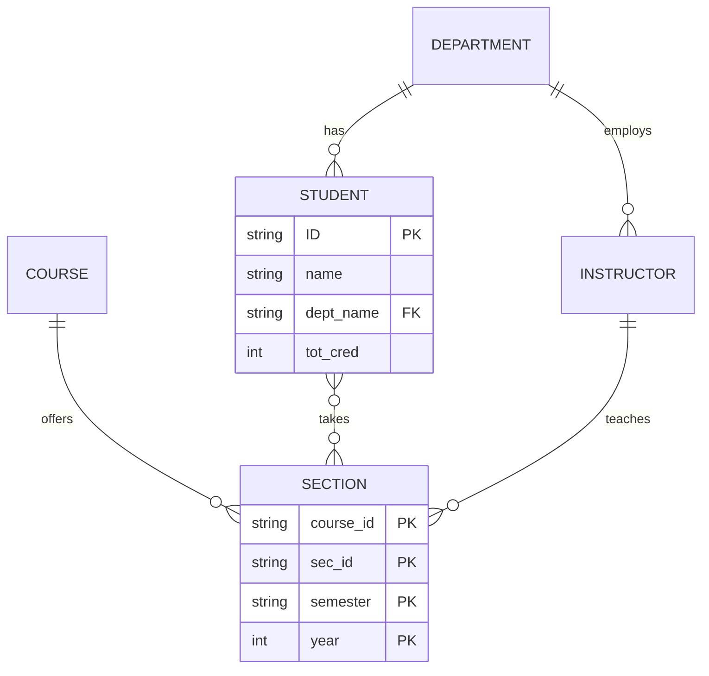

# E-R Modeling and Relational Mapping

Database design starts before tables. The entity-relationship model gives designers a way to talk about the world being modeled: the objects that exist, the facts known about them, and the relationships among them. It is deliberately conceptual. A good E-R model avoids premature storage details but is precise enough to become a relational schema with keys and constraints.

E-R modeling sits between requirements analysis and relational design. It helps expose ambiguity: Is an instructor an entity or just an attribute of a course section? Can a section have more than one instructor? Can a department exist without instructors? The mapping from E-R diagrams to relations then turns those answers into tables, primary keys, foreign keys, and sometimes separate relationship tables.

## Definitions

An **entity** is a distinguishable object, such as a particular student, instructor, department, course, or section. An **entity set** is a collection of similar entities, such as all students. An **attribute** records a property of an entity or relationship. Attributes can be simple, composite, multivalued, or derived.

A **relationship** is an association among entities. A **relationship set** contains relationships of the same type. For example, `advisor(student, instructor)` connects students to instructors. The relationship's **degree** is the number of participating entity sets. Binary relationships are most common, but ternary relationships are sometimes necessary when a fact depends on three entities together.

**Mapping cardinality** describes how many entities can participate on each side of a binary relationship. Common categories are one-to-one, one-to-many, many-to-one, and many-to-many. **Participation** can be total, meaning every entity in an entity set must participate, or partial, meaning participation is optional.

A **weak entity set** lacks enough attributes to form a primary key by itself. It depends on an identifying owner entity set and a discriminator. For example, a course section might be identified by `(course_id, sec_id, semester, year)` where `course_id` is borrowed from the owning course.

In relational mapping:

| E-R construct | Relational mapping |
| --- | --- |
| Strong entity set | relation with entity attributes and primary key |
| Weak entity set | relation including owner key plus discriminator |
| Many-to-many relationship | separate relation containing participating keys |
| One-to-many relationship | foreign key on the many side |
| One-to-one relationship | foreign key on one side, often with `UNIQUE` |
| Multivalued attribute | separate relation with owner key and attribute value |
| Composite attribute | store component attributes |

## Key results

Design choices in the E-R model affect integrity constraints later. A one-to-many relationship is not only a drawing style; it implies a uniqueness condition if mapped through a relationship table, or a foreign key placement if mapped directly. Total participation often becomes `NOT NULL` plus a foreign key, though some constraints require assertions or application logic when SQL cannot express them directly.

Many-to-many relationships usually need their own relation. If students take courses, one student can take many courses and one course can be taken by many students. A `takes` relation stores the pair and any relationship attributes, such as grade or enrollment date. Putting a comma-separated course list inside `student` would violate the relational model and make constraints, queries, and updates harder.

Relationship attributes belong where the relationship is represented. A grade is not a property of a student alone or a course alone; it is a property of a student taking a particular section. Therefore it belongs in the enrollment relationship relation.

Ternary relationships should not be casually decomposed into three binary relationships. If a project uses a supplier to provide a part, the fact depends on all three entities together. Pairwise relations can lose the constraint that a specific supplier provided a specific part for a specific project.

A good E-R model also records assumptions that are easy to overlook in prose. If a student may have at most one advisor, that is a key constraint on the advising relationship. If a section must have at least one instructor, that is a participation constraint that may need a deferred constraint or transaction-level check in SQL. The diagram is not merely a picture; it is a compact statement of business rules that should survive the transition to relations.

Attribute placement is a useful test of design quality. If an attribute can be answered by looking at one entity alone, it probably belongs to that entity. If it needs two or more participating entities to make sense, it probably belongs to a relationship. For example, `salary` belongs to an instructor in the simple university model, but `grade` belongs to the relationship between a student and a section.

## Visual



| Cardinality | Example | Common relational choice |
| --- | --- | --- |
| One-to-one | person to campus ID card | foreign key with `UNIQUE` |
| One-to-many | department to students | foreign key in `student` |
| Many-to-one | students to department | same as one-to-many from other direction |
| Many-to-many | students to sections | relationship table |
| Optional participation | instructor may advise no students | nullable foreign key or separate relationship |
| Total participation | section must belong to course | `NOT NULL` foreign key |

## Worked example 1: Map students and departments

Problem: Model departments and students. Each student belongs to exactly one department. A department can have zero or more students. Departments have a name, building, and budget. Students have ID, name, and total credits.

Method:

1. Identify entity sets:

   - `Department(dept_name, building, budget)`
   - `Student(ID, name, tot_cred)`

2. Choose keys:

   - `dept_name` uniquely identifies a department in this simplified model.
   - `ID` uniquely identifies a student.

3. Identify the relationship:

   - A department has many students.
   - Each student has exactly one department.

4. Decide mapping. For a one-to-many relationship with total participation on the many side, put the foreign key in the many-side relation:

   ```sql
   CREATE TABLE department (
     dept_name varchar(30) PRIMARY KEY,
     building varchar(30),
     budget numeric(12, 2) CHECK (budget >= 0)
   );

   CREATE TABLE student (
     ID varchar(10) PRIMARY KEY,
     name varchar(40) NOT NULL,
     dept_name varchar(30) NOT NULL,
     tot_cred integer NOT NULL CHECK (tot_cred >= 0),
     FOREIGN KEY (dept_name) REFERENCES department(dept_name)
   );
   ```

5. Check the participation constraints. `student.dept_name NOT NULL` plus the foreign key says every student has a valid department. The schema does not require every department to have students, which matches the requirement.

Checked answer: the design stores department facts once, stores student facts once, and represents the relationship by a foreign key without a separate table because the relationship has no many-to-many multiplicity.

## Worked example 2: Map students taking sections with grades

Problem: Model students taking course sections. A student can take many sections, and a section can contain many students. The grade belongs to the enrollment.

Method:

1. Identify the entity sets:

   - `Student(ID, name, dept_name, tot_cred)`
   - `Section(course_id, sec_id, semester, year, room, time_slot_id)`

2. Identify the relationship:

   - `Takes(Student, Section)` is many-to-many.

3. Identify relationship attributes:

   - `grade` depends on the pair `(student, section)`.

4. Map the relationship to a separate relation containing both keys:

   ```sql
   CREATE TABLE takes (
     ID varchar(10),
     course_id varchar(12),
     sec_id varchar(8),
     semester varchar(6),
     year integer,
     grade varchar(2),
     PRIMARY KEY (ID, course_id, sec_id, semester, year),
     FOREIGN KEY (ID) REFERENCES student(ID),
     FOREIGN KEY (course_id, sec_id, semester, year)
       REFERENCES section(course_id, sec_id, semester, year)
   );
   ```

5. Check why `grade` does not belong in `student`. One student has many grades. It also does not belong in `section`, because one section has many students with different grades. It belongs exactly at the relationship level.

Checked answer: the primary key prevents the same student from being recorded twice for the same section. The foreign keys prevent enrollment in nonexistent students or sections. The grade is stored once for the enrollment fact it describes.

## Code

```sql
CREATE TABLE instructor (
  ID varchar(10) PRIMARY KEY,
  name varchar(40) NOT NULL,
  dept_name varchar(30) NOT NULL,
  salary numeric(10, 2) CHECK (salary > 0),
  FOREIGN KEY (dept_name) REFERENCES department(dept_name)
);

CREATE TABLE advisor (
  s_ID varchar(10) PRIMARY KEY,
  i_ID varchar(10) NOT NULL,
  FOREIGN KEY (s_ID) REFERENCES student(ID),
  FOREIGN KEY (i_ID) REFERENCES instructor(ID)
);

-- Each student can have at most one advisor because s_ID is the primary key.
-- An instructor can advise many students because i_ID is not unique.
```

## Common pitfalls

- Starting with tables before clarifying entity sets, relationships, and cardinalities.
- Treating a many-to-many relationship as a repeated text field inside one table.
- Putting relationship attributes on one participating entity when they depend on the association.
- Decomposing ternary relationships into binaries without checking whether the original fact is preserved.
- Using natural-language names as keys when stable surrogate or institutional identifiers are available.
- Forgetting that total participation may require `NOT NULL`, foreign keys, and sometimes additional constraints.

## Connections

- [SQL DDL, DML, and Basic Queries](/cs/databases/sql-ddl-dml-and-basic-queries)
- [Normalization and Functional Dependencies](/cs/databases/normalization-functional-dependencies)
- [Higher Normal Forms and Decomposition](/cs/databases/higher-normal-forms-and-decomposition)
- [Application Architecture and Security](/cs/databases/application-architecture-and-security)
