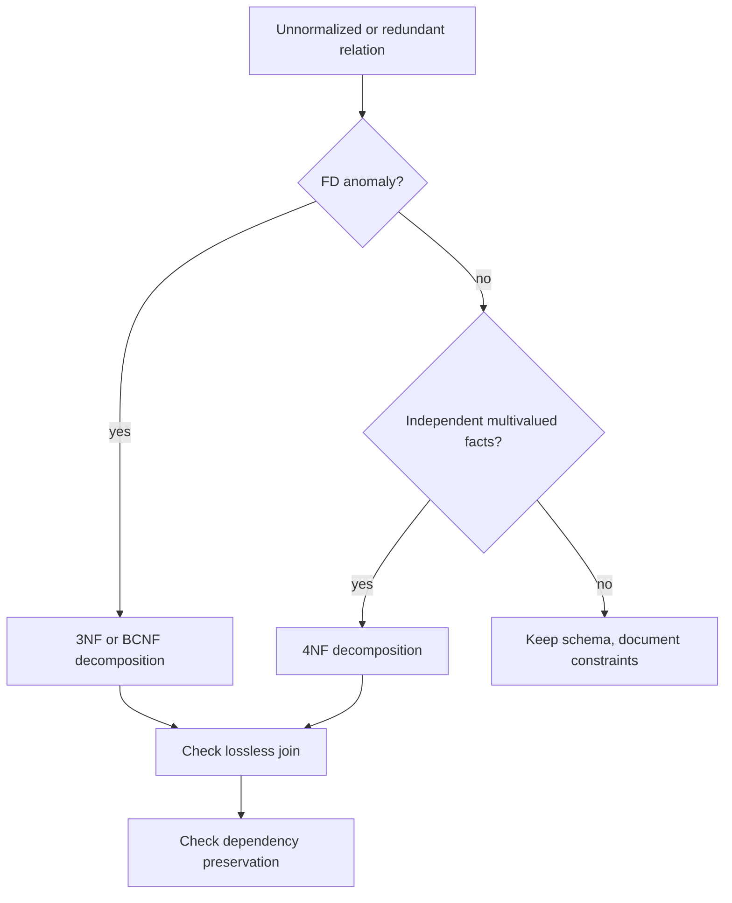

# Higher Normal Forms and Decomposition

BCNF and 3NF handle redundancy explained by functional dependencies. Some schemas still contain redundancy even when no functional dependency is responsible. Multivalued dependencies capture a different pattern: two or more independent many-valued facts about the same key are stored in one relation. Fourth normal form removes that redundancy.

Decomposition is the practical operation behind normalization. It replaces one relation by two or more relations that store the same information with fewer anomalies. The quality of a decomposition is judged by lossless join, dependency preservation, and the normal form reached. These goals can pull in different directions, which is why design is an engineering activity rather than a purely mechanical exercise.

## Definitions

A **decomposition** of relation schema `R` is a set of schemas `R1, R2, ..., Rn` whose union of attributes is `R`. It is **lossless** if every legal instance of `R` can be reconstructed exactly by joining the projections on `R1` through `Rn`.

A decomposition is **dependency-preserving** if the original functional dependencies can be enforced by checking dependencies on individual decomposed relations, without needing to join them. Dependency preservation matters because constraints checked with joins can be expensive or unsupported by ordinary SQL declarations.

A **canonical cover** is a simplified set of FDs equivalent to the original set. It removes extraneous attributes and combines dependencies with the same left side. Canonical covers are useful in 3NF synthesis.

A **multivalued dependency** (MVD) is written `X ->> Y`. It means that for each value of `X`, the set of associated `Y` values is independent of the remaining attributes. If `R` has attributes `X`, `Y`, and `Z`, then `X ->> Y` says that the `Y` values and `Z` values combine freely for each `X`.

**Fourth normal form (4NF)** requires that for every nontrivial MVD `X ->> Y`, `X` is a superkey. Every FD is also an MVD, so 4NF is at least as strict as BCNF with respect to those dependencies, and stricter when independent multivalued facts exist.

## Key results

A binary decomposition of `R` into `R1` and `R2` is lossless under FDs if:

$$
(R_1 \cap R_2) \rightarrow R_1
$$

or

$$
(R_1 \cap R_2) \rightarrow R_2
$$

That condition says the shared attributes identify one side of the join, preventing spurious combinations.

The 3NF synthesis algorithm uses a canonical cover. For each dependency `X -> Y`, create a relation containing `X` and `Y`. If none of the created relations contains a candidate key of the original schema, add one relation containing a candidate key. The result is lossless, dependency-preserving, and in 3NF. Some redundant relations may be removed if their attributes are contained in another relation.

BCNF decomposition repeatedly chooses a dependency that violates BCNF and decomposes on it. It gives a lossless result, but it may not preserve all dependencies. That trade-off is central: BCNF maximizes elimination of FD-based redundancy; 3NF guarantees enforceability of dependencies without joins.

4NF decomposition is analogous for MVDs. If `X ->> Y` violates 4NF in `R`, decompose into `XY` and `R - Y`. This separates independent multivalued facts.

The hardest part of higher normal forms is not running the algorithm; it is discovering the real constraints. FDs and MVDs should come from domain rules, not only from inspection of today's data. A current sample may show every instructor teaching one course, but the university may allow multiple courses next term. Designing from accidental data patterns leads to schemas that reject valid future facts or require disruptive migrations.

Dependency preservation is often the practical reason to stop at 3NF. Suppose a dependency spans attributes that BCNF separates into different relations. The database can still represent the data without loss, but enforcing that dependency may require joining relations during every update. If the DBMS cannot declare that constraint directly, the application must enforce it, which increases risk. The choice between BCNF and 3NF should therefore be explicit: stronger redundancy removal versus simpler constraint enforcement.

Lossless join should be checked for every decomposition step, not only at the end. A sequence of individually lossless binary decompositions gives a lossless final result, but one careless step can introduce spurious tuples that later steps do not repair. The common chase procedure gives a general test, while the intersection-determines-one-side rule is a convenient sufficient and necessary test for binary FD-based decompositions.

4NF is especially relevant when a relation stores independent lists. If a course has many textbooks and many software tools, and the textbook choice is independent of the tool choice, a single relation `CourseResource(course, textbook, tool)` stores every combination. That is not a relationship among a specific textbook and a specific tool; it is two separate multivalued facts attached to the same course.

Decomposition also affects query ergonomics. A fully normalized design may require joins for common reports, which is usually acceptable when indexes and views are designed well. When the same expensive join is needed constantly, a materialized view or maintained summary can be added deliberately. That is different from leaving the logical design redundant by accident.

## Visual



| Goal | Why it matters | Typical compromise |
| --- | --- | --- |
| Lossless join | prevents spurious or missing tuples | mandatory for correct decomposition |
| Dependency preservation | constraints can be checked locally | 3NF guarantees it for FDs |
| BCNF | stronger removal of FD redundancy | may lose dependency preservation |
| 4NF | removes independent multivalued redundancy | needs true MVD knowledge, not just data samples |
| Performance | fewer joins for reads | controlled denormalization with update discipline |

## Worked example 1: 3NF synthesis from dependencies

Problem: For `R(A, B, C, D)` with FDs `A -> B`, `B -> C`, and `A -> D`, synthesize a 3NF decomposition.

Method:

1. Check the dependencies. The right sides are already single attributes, and there are no obvious extraneous attributes because every left side has one attribute.

2. Combine dependencies with the same left side:

$$
A \rightarrow BD
$$

   and keep:

$$
B \rightarrow C
$$

3. Create relations for each dependency:

$$
R_1(A, B, D)
$$

$$
R_2(B, C)
$$

4. Check whether a relation contains a candidate key for the original `R`. Compute `A+`: from `A`, get `B` and `D`; from `B`, get `C`. Therefore `A+ = {A, B, C, D}` and `A` is a candidate key. `R1` contains `A`.

5. No extra key relation is needed.

Checked answer: `{R1(A, B, D), R2(B, C)}` is dependency-preserving because `A -> BD` is enforced in `R1` and `B -> C` is enforced in `R2`. It is lossless because a relation containing a key of the original schema is present in the synthesis result.

## Worked example 2: 4NF for independent hobbies and languages

Problem: Relation `PersonFact(person, hobby, language)` records a person's hobbies and languages. A person's hobbies are independent of languages. For Ada, suppose hobbies are `{chess, music}` and languages are `{English, Korean}`. The relation contains all four combinations. Decompose to remove redundancy.

Method:

1. State the MVDs:

$$
person \twoheadrightarrow hobby
$$

$$
person \twoheadrightarrow language
$$

2. Check whether `person` is a superkey. It is not, because one person has many hobbies and many languages.

3. The MVDs violate 4NF.

4. Decompose into:

$$
PersonHobby(person, hobby)
$$

$$
PersonLanguage(person, language)
$$

5. Reconstruct by joining on `person` when the combined view is needed:

   ```sql
   SELECT ph.person, ph.hobby, pl.language
   FROM person_hobby AS ph
   JOIN person_language AS pl
     ON ph.person = pl.person;
   ```

Checked answer: Ada's two hobbies are stored twice in the original relation, once per language, and each language is stored once per hobby. The 4NF design stores two hobby rows and two language rows, eliminating the four-combination redundancy while preserving the ability to reconstruct the combined relation.

## Code

```python
def is_lossless_binary(r1, r2, fds):
    """Sufficient FD test for lossless binary decomposition."""
    intersection = set(r1) & set(r2)

    def closure(attrs):
        result = set(attrs)
        changed = True
        while changed:
            changed = False
            for left, right in fds:
                if set(left) <= result and not set(right) <= result:
                    result |= set(right)
                    changed = True
        return result

    xplus = closure(intersection)
    return set(r1) <= xplus or set(r2) <= xplus

fds = [("A", "BD"), ("B", "C")]
print(is_lossless_binary("ABD", "BC", fds))
```

## Common pitfalls

- Calling a decomposition good because it has many tables. More tables do not automatically mean better design.
- Ignoring lossless join. A decomposition that creates spurious tuples is incorrect even if each smaller relation looks tidy.
- Assuming BCNF always preserves dependencies. It does not; verify before choosing BCNF over 3NF.
- Inferring MVDs from small data samples. MVDs are semantic constraints about all legal data.
- Treating 4NF as a replacement for E-R modeling. It is a refinement tool, not the whole design process.
- Denormalizing for speed without a plan for maintaining duplicate facts consistently.

## Connections

- [Normalization and Functional Dependencies](/cs/databases/normalization-functional-dependencies)
- [E-R Modeling and Relational Mapping](/cs/databases/er-modeling-and-relational-mapping)
- [Query Optimization and Cost Estimation](/cs/databases/query-optimization-and-cost-estimation)
- [Transactions, ACID, and Serializability](/cs/databases/transactions-acid-and-serializability)
