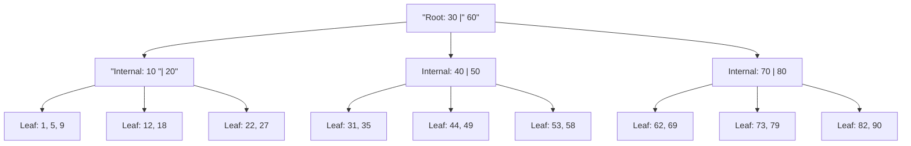

# Indexing with B+ Trees, Hashing, and Bitmaps

An index is an auxiliary access structure that helps the DBMS find records without scanning an entire file. It is the database analogue of a book index, but with stronger correctness and update requirements. Every insert, delete, and update that affects indexed columns must maintain the index, so indexes trade write cost and storage space for faster reads.

Indexing belongs after storage because an index is itself stored in pages. B+ trees, hash indexes, and bitmap indexes support different query patterns. There is no universally best index. The right choice depends on equality versus range predicates, key cardinality, clustering, update frequency, and whether the workload is transactional or analytical.


*Figure: B-tree node structure used in balanced search indexes. Image: [Wikimedia Commons](https://commons.wikimedia.org/wiki/File:B-tree.svg), CyHawk, CC BY-SA 3.0.*

## Definitions

A **search key** is the attribute or attribute set used to look up records in an index. It does not need to be a candidate key. For example, an index on `student(dept_name)` has a search key that may match many students.

A **primary index** is built on the ordering key of a sorted file. A **secondary index** provides an access path that is not the file's physical ordering. A **clustered index** stores table records in the same or similar order as the index key; a **nonclustered index** stores separate index entries that point to records elsewhere.

A **dense index** has an entry for every search-key value, or every record in the case of duplicate keys. A **sparse index** has entries for only some search-key values, typically one per data block in a sorted file.

A **B+ tree** is a balanced search tree optimized for block storage. Internal nodes contain search keys and child pointers. Leaf nodes contain search-key values and record pointers, or the records themselves in some clustered designs. Leaves are linked in key order for efficient range scans.

A **hash index** maps a search key through a hash function to a bucket. It is excellent for equality lookups if buckets stay balanced, but it does not preserve order, so it is not useful for range queries.

A **bitmap index** stores one bitmap per value or encoded value range. A bit position corresponds to a row or row identifier. Bitmap operations such as AND and OR can combine predicates quickly, especially in read-mostly analytical systems with low-cardinality columns.

## Key results

B+ tree height is small because each internal page has high fanout. If a page can hold 200 child pointers, a three-level tree can address millions of leaf entries. The cost of an equality lookup is roughly one page per level plus data-page fetches. Range queries descend once to the first leaf and then scan linked leaves.

B+ tree insertion and deletion preserve balance. Insertion finds the target leaf. If there is room, it inserts the key. If the leaf overflows, it splits the leaf and propagates a separator key upward. Deletion removes an entry; if a node underflows, the tree may redistribute entries with a sibling or merge nodes. All root-to-leaf paths remain the same length.

Hash indexes are expected constant-time for equality under good hashing and controlled load factor. Static hashing degrades when buckets overflow. Dynamic schemes such as extensible hashing and linear hashing adjust bucket structure as the file grows.

Bitmap indexes shine when predicates combine several low-cardinality attributes:

$$
gender = 'F' \land class = 'senior' \land major = 'CS'
$$

The DBMS can compute a bitwise AND of three bitmaps, then fetch matching rows. For high-cardinality, frequently updated transactional columns, ordinary B+ trees are usually better.

Index-only plans are another important case. If every column needed by a query is present in an index, the DBMS may answer the query without fetching base table records. For example, an index on `(dept_name, tot_cred, ID, name)` can support a query that filters by department and credits and returns `ID` and `name`. This can be much faster than using the index only to find row identifiers and then performing many table lookups.

The order of columns in a composite index matters. A B+ tree on `(dept_name, tot_cred)` is ordered first by department, then by credits within each department. It supports `dept_name = 'Comp. Sci.'` and a range on `tot_cred` inside that department. It is much less helpful for a query that only asks `tot_cred >= 90`, because matching entries are scattered across every department prefix.

Indexes also encode physical design assumptions that may become wrong. An index created for a report run once per semester might slow daily inserts all year. An index that was selective when the table was small may become unhelpful after most rows share the same status value. Index maintenance should be revisited with workload evidence: execution plans, write latency, buffer usage, and index-size growth.

Unique indexes deserve separate mention because they often enforce constraints as well as speed lookups. If an email address must be unique, a unique index can reject duplicates even under concurrent inserts. Application-side "check then insert" logic is not enough unless it is protected by serializable isolation or a database constraint, because two transactions can both observe that the value is absent.

## Visual



| Index type | Best for | Poor for | Update cost |
| --- | --- | --- | --- |
| B+ tree | equality and range | very low selectivity predicates | moderate |
| Hash | equality lookup | range and ordering | low to moderate, depends on overflow |
| Bitmap | analytical filters on low-cardinality columns | frequent row-level updates | high in OLTP |
| Clustered | range scans returning many rows | many competing orderings | can be high |
| Composite B+ tree | left-prefix predicates and ordering | predicates skipping leading key | moderate |

## Worked example 1: Estimate B+ tree lookup cost

Problem: A B+ tree index has height 3, counting the root, one internal level, and leaves. The root is pinned in memory. Estimate page reads for an equality lookup that matches one record in a nonclustered index.

Method:

1. Identify tree pages needed. Since the root is already in memory, no disk read is needed for it.

2. Read one internal page:

$$
1\ \text{page read}
$$

3. Read one leaf page:

$$
1\ \text{page read}
$$

4. The leaf contains a record pointer, not the record itself. Since the index is nonclustered and the matching record may be on any data page, read the data page:

$$
1\ \text{page read}
$$

5. Total:

$$
1 + 1 + 1 = 3\ \text{page reads}
$$

Checked answer: the lookup costs about three page reads under these assumptions. If the leaf or data page is already in the buffer, the actual I/O is lower. If the predicate matches many records through a nonclustered index, data-page reads may become much more expensive than a table scan.

## Worked example 2: Bitmap predicate evaluation

Problem: A table has eight rows. A bitmap for `dept = 'CS'` is `1 1 0 1 0 0 1 0`. A bitmap for `year = 4` is `0 1 1 1 0 1 0 0`. Find rows matching both predicates.

Method:

1. Align the bitmaps by row position:

   ```text
   row:        1 2 3 4 5 6 7 8
   dept=CS:    1 1 0 1 0 0 1 0
   year=4:     0 1 1 1 0 1 0 0
   ```

2. Apply bitwise AND:

   ```text
   result:     0 1 0 1 0 0 0 0
   ```

3. Interpret 1 bits:

   - Row 2 matches.
   - Row 4 matches.

4. Check each matching position. Row 2 has both `dept = 'CS'` and `year = 4`; row 4 also has both. Rows with only one predicate true are excluded.

Checked answer: rows 2 and 4 satisfy the conjunction. The DBMS can compute this with fast word-level CPU operations before fetching row data.

## Code

```python
def bitmap_and(*bitmaps):
    if not bitmaps:
        return []
    result = list(bitmaps[0])
    for bitmap in bitmaps[1:]:
        result = [a & b for a, b in zip(result, bitmap)]
    return [i + 1 for i, bit in enumerate(result) if bit]

dept_cs = [1, 1, 0, 1, 0, 0, 1, 0]
year_4 = [0, 1, 1, 1, 0, 1, 0, 0]
print(bitmap_and(dept_cs, year_4))
```

```sql
CREATE INDEX idx_student_dept_credits
ON student(dept_name, tot_cred);

SELECT ID, name, tot_cred
FROM student
WHERE dept_name = 'Comp. Sci.'
  AND tot_cred >= 90
ORDER BY tot_cred;
```

## Common pitfalls

- Creating an index for every column. Extra indexes slow writes and consume storage.
- Expecting a hash index to support `ORDER BY` or range predicates. Hashing destroys order.
- Ignoring selectivity. An index on a value that matches most rows may be worse than a scan.
- Misunderstanding composite indexes. An index on `(dept_name, tot_cred)` helps `dept_name = ...` and `dept_name = ... AND tot_cred > ...`, but not usually `tot_cred > ...` alone.
- Assuming nonclustered index range scans are always cheap. Many random data-page fetches can dominate.
- Using bitmap indexes for high-update OLTP tables without considering locking and maintenance cost.

## Connections

- [Storage, Records, Blocks, and Files](/cs/databases/storage-records-blocks-and-files)
- [Query Processing and Join Algorithms](/cs/databases/query-processing-join-algorithms)
- [Query Optimization and Cost Estimation](/cs/databases/query-optimization-and-cost-estimation)
- [NoSQL, Big Data, and Analytics](/cs/databases/nosql-big-data-and-analytics)
