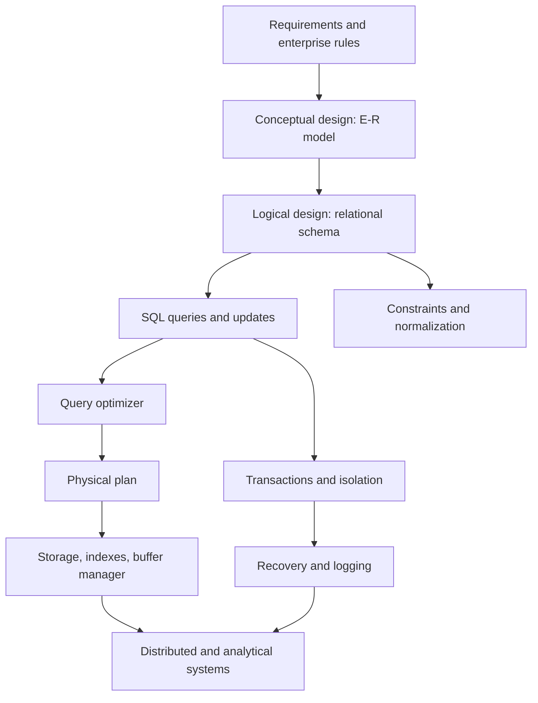

# Database Systems

Database systems are the software layer that lets people store, query, update, protect, and share large collections of data. A database-management system is not just a file format. It includes data models, query languages, storage structures, indexing methods, query optimizers, transaction managers, recovery logic, authorization, and distributed coordination. The central promise is data independence: users should describe the information they need, while the system decides how to store and retrieve it efficiently and safely.

These notes follow the structure and emphasis of Silberschatz, Korth, and Sudarshan's *Database System Concepts*, 7th edition, using the local source PDF's extracted table of contents as the roadmap. The pages are written as study notes rather than a replacement for the book: they compress the core definitions, algorithms, trade-offs, and worked examples needed to connect SQL practice with database internals.

## Definitions

A **database** is an organized collection of related data representing some part of the real world or an enterprise. A **database-management system (DBMS)** is the software system that defines, stores, queries, updates, protects, and administers that data. A **database system** is the DBMS plus the data, applications, users, and operating environment around it.

A **data model** supplies the concepts used to describe data. The relational model represents data as relations; the E-R model represents entities, attributes, and relationships during design; document, graph, key-value, and columnar models support other shapes and workloads.

A **schema** is the logical design: relation names, attributes, domains, keys, foreign keys, constraints, views, and sometimes physical declarations such as indexes. An **instance** is the current data stored under that schema. The schema is the contract; the instance changes over time.

A **query language** lets users ask questions and change data. SQL is the dominant relational language, covering data definition, data manipulation, views, authorization, transactions, and analytics. Relational algebra is the mathematical foundation used to reason about query meaning and optimization.

A **transaction** is a unit of work that should be atomic, isolated, durable, and consistency-preserving. Transactions let many users share data without constantly corrupting one another's results, and they let the system recover after failures.

A **physical database design** chooses storage layouts, indexes, partitioning, replication, and related implementation choices. It should serve the workload without changing the logical meaning of the data.

## Key results

The extracted source table of contents organizes the subject into a sequence that is useful for study:

| Source part | Main chapters in the extracted TOC | Notes in this wiki |
| --- | --- | --- |
| Overview | Introduction | this page |
| Relational languages | relational model, SQL, intermediate SQL, advanced SQL | relational algebra and SQL pages |
| Database design | E-R model and relational design | E-R mapping and normalization pages |
| Application development | complex data types and application development | application architecture/security and NoSQL overview |
| Big data analytics | big data and analytics | NoSQL/big-data page |
| Storage management and indexing | physical storage, data storage structures, indexing | storage and indexing pages |
| Query processing and optimization | query processing and query optimization | join algorithms and optimizer pages |
| Transaction management | transactions, concurrency control, recovery | transaction, concurrency, MVCC, and recovery pages |
| Parallel and distributed databases | architectures, storage, query processing, transactions | distributed systems page |
| Advanced topics | advanced indexing, application development, blockchain databases | selected connections from indexes, distribution, and application pages |

Several themes recur across the whole subject:

- Logical and physical design are separate but connected. A relation can be defined without saying which pages or indexes store it, but performance depends on those physical choices.
- Declarative queries need optimization. SQL describes results; the DBMS must choose scans, indexes, join order, join algorithms, sorting, hashing, and materialization.
- Constraints are part of the data model. Keys, foreign keys, checks, and transaction isolation are not optional decoration; they define legal states and legal state transitions.
- Performance trade-offs are usually workload-specific. An index that helps reads can slow writes. Denormalization can speed a dashboard but complicate updates. Replication can improve availability but complicate consistency.
- Correctness must survive concurrency and failure. Serializability, recoverability, write-ahead logging, checkpoints, and commit protocols exist because real systems crash and real users act at the same time.

## Visual



| If you are trying to understand... | Start with | Then read |
| --- | --- | --- |
| why SQL joins work | relational algebra | joins and query optimization |
| why schemas split into tables | E-R mapping | normalization and decomposition |
| why indexes help some queries only | storage pages | B+ trees, hashing, and optimizer estimates |
| why concurrent updates are hard | transactions | locks, MVCC, and recovery |
| why distributed databases are difficult | transactions and recovery | replication, partitioning, 2PC, CAP |
| why analytics use different systems | storage layouts | NoSQL, big data, and warehousing |

## Worked example 1: Trace one SQL query through the DBMS

Problem: A user asks for high-credit computer-science students:

```sql
SELECT ID, name
FROM student
WHERE dept_name = 'Comp. Sci.'
  AND tot_cred >= 90
ORDER BY name;
```

Trace the main database-system components involved.

Method:

1. The parser checks SQL syntax and resolves names. It verifies that `student`, `ID`, `name`, `dept_name`, and `tot_cred` exist and that the comparisons are type-correct.

2. The logical meaning is a selection followed by projection and ordering:

$$
\pi_{ID,name}(\sigma_{dept\_name='Comp. Sci.' \land tot\_cred \ge 90}(student))
$$

3. The optimizer estimates predicate selectivity. If statistics say there are 50,000 students, 25 departments, and credits are broadly distributed, it may estimate a few thousand rows after the department filter and fewer after the credit filter.

4. The optimizer chooses an access path. If an index exists on `(dept_name, tot_cred)`, it may use an index range scan. If no useful index exists or the predicate matches many rows, it may choose a table scan.

5. The execution engine reads pages through the buffer manager. The buffer manager fetches needed table or index pages from storage and may reuse pages already in memory.

6. The sort operator orders matching rows by `name`, unless an index or prior operator already provides the required order.

7. If the query runs inside a transaction, the concurrency-control layer determines which committed data versions or locked rows the query can see.

Checked answer: even a short SQL query touches schema metadata, algebraic meaning, statistics, access paths, physical operators, buffer management, and isolation. The user sees a table of results, but the DBMS coordinates many layers to produce it.

## Worked example 2: Choose a safe design for course enrollment

Problem: A university application must enroll students into sections while enforcing these rules: the student must exist, the section must exist, a student cannot enroll twice in the same section, and section capacity must not be exceeded.

Method:

1. Represent core entities as relations:

   ```text
   student(ID, name, dept_name, tot_cred)
   section(course_id, sec_id, semester, year, capacity)
   takes(ID, course_id, sec_id, semester, year, grade)
   ```

2. Use keys and foreign keys:

   - `student.ID` is the student primary key.
   - `section(course_id, sec_id, semester, year)` is the section primary key.
   - `takes` has a composite primary key containing the student and section identifiers.
   - `takes.ID` references `student`.
   - `takes(course_id, sec_id, semester, year)` references `section`.

3. The primary key of `takes` prevents duplicate enrollment in the same section:

$$
(ID, course\_id, sec\_id, semester, year)
$$

4. Foreign keys prevent nonexistent students or sections from being used.

5. Capacity requires transaction isolation because it is a cross-row or summary invariant. The application should check and update capacity in one transaction, using row locks, serializable isolation, or another DBMS-supported mechanism.

6. Recovery must ensure that a crash after inserting into `takes` but before decrementing available seats does not leave a partial committed operation. Atomicity and WAL handle this at the transaction level.

Checked answer: schema constraints handle identity and references; transaction isolation handles the concurrent capacity race; recovery handles crashes. No single feature is enough for the whole enrollment rule.

## Code

```sql
CREATE TABLE section (
  course_id varchar(12),
  sec_id varchar(8),
  semester varchar(6),
  year integer,
  capacity integer NOT NULL CHECK (capacity >= 0),
  available_seats integer NOT NULL CHECK (available_seats >= 0),
  PRIMARY KEY (course_id, sec_id, semester, year)
);

CREATE TABLE takes (
  ID varchar(10),
  course_id varchar(12),
  sec_id varchar(8),
  semester varchar(6),
  year integer,
  grade varchar(2),
  PRIMARY KEY (ID, course_id, sec_id, semester, year),
  FOREIGN KEY (ID) REFERENCES student(ID),
  FOREIGN KEY (course_id, sec_id, semester, year)
    REFERENCES section(course_id, sec_id, semester, year)
);
```

```python
def recommended_path(goal):
    paths = {
        "sql": [
            "/cs/databases/relational-model-and-algebra",
            "/cs/databases/sql-ddl-dml-and-basic-queries",
            "/cs/databases/sql-joins-subqueries-and-set-operations",
        ],
        "internals": [
            "/cs/databases/storage-records-blocks-and-files",
            "/cs/databases/indexing-bplus-hash-bitmap",
            "/cs/databases/query-processing-join-algorithms",
        ],
        "transactions": [
            "/cs/databases/transactions-acid-and-serializability",
            "/cs/databases/concurrency-control-locks-deadlocks-timestamps",
            "/cs/databases/recovery-wal-aries-checkpoints",
        ],
    }
    return paths.get(goal, paths["sql"])

print(recommended_path("transactions"))
```

## Common pitfalls

- Treating a DBMS as only persistent storage. Query processing, constraints, transactions, recovery, and authorization are equally central.
- Learning SQL syntax without the relational model. Algebra clarifies joins, subqueries, duplicate handling, and optimization.
- Designing tables from screens instead of facts and dependencies. User interfaces change faster than data semantics.
- Adding indexes before understanding workload and selectivity. Indexes have write and storage costs.
- Assuming default isolation is serializable. Many systems default to weaker levels for throughput.
- Treating distributed replication as backup or as automatic consistency. Replicas need explicit consistency and recovery design.

## Connections

- [Relational Model and Relational Algebra](/cs/databases/relational-model-and-algebra)
- [SQL DDL, DML, and Basic Queries](/cs/databases/sql-ddl-dml-and-basic-queries)
- [E-R Modeling and Relational Mapping](/cs/databases/er-modeling-and-relational-mapping)
- [Storage, Records, Blocks, and Files](/cs/databases/storage-records-blocks-and-files)
- [Transactions, ACID, and Serializability](/cs/databases/transactions-acid-and-serializability)
- [Distributed Databases, Replication, Partitioning, and 2PC](/cs/databases/distributed-databases-replication-partitioning-2pc)
