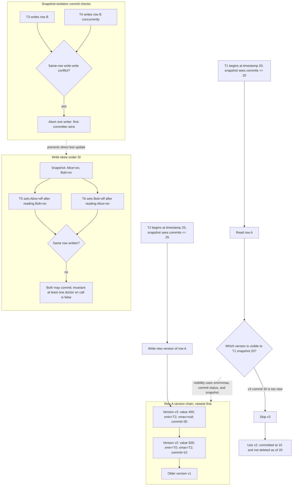

# MVCC and Snapshot Isolation

Multiversion concurrency control, usually called MVCC, keeps multiple committed versions of data so that readers and writers do not always block each other. Instead of making every reader wait behind a writer, the DBMS can let a transaction read a version that was committed as of the transaction's snapshot. This is one reason modern relational systems can support high read concurrency.


*Figure: A database system is experienced through schemas, queries, connections, and administration tools. Image: [Wikimedia Commons](https://commons.wikimedia.org/wiki/File:PgAdminScreenshot.png), Boshomi, CC BY-SA 3.0.*

Snapshot isolation is a common isolation model built on MVCC. It gives each transaction a consistent snapshot and checks write-write conflicts at commit. It prevents dirty reads and many lost updates, but it is not the same as serializability. The classic anomaly is write skew, where two transactions read the same snapshot, update different rows, and jointly violate an invariant.

## Definitions

A **version** is a stored state of a row or object, usually annotated with creation and deletion transaction identifiers or timestamps. A transaction's visibility rules decide which version it can read.

A **snapshot** is the set of committed versions visible to a transaction. Under transaction-level snapshot isolation, all reads in a transaction see the same snapshot. Under statement-level read committed MVCC, each statement may get a fresh snapshot.

**Snapshot isolation (SI)** usually has two main rules:

1. A transaction reads from a consistent snapshot taken at its start.
2. If two concurrent transactions write the same item, at most one commits.

The second rule is often called **first-committer-wins** or a write-write conflict check.

A **lost update** happens when two transactions read the same value and both write a new value based on it, with one update overwriting the other. SI commonly prevents direct lost updates on the same row. **Write skew** happens when transactions update different rows after reading overlapping data, so no write-write conflict occurs even though a constraint is violated.

**Serializable snapshot isolation (SSI)** is a technique that detects dangerous dependency structures among snapshot transactions and aborts one transaction to preserve serializability.

## Key results

MVCC improves read-write concurrency because readers can read old committed versions while writers create new versions. This does not eliminate all conflicts. Writers still need coordination, version chains need cleanup, and serializable behavior may require predicate tracking or dependency detection.

Snapshot isolation is stronger than read committed for repeatable reads within a transaction, but weaker than serializability. Under SI, if transaction `T1` starts before `T2` commits, `T1` does not see `T2`'s writes even if it reads the same row later. This stable snapshot is convenient for reports and multi-step application logic.

SI's write-write conflict rule serializes transactions that update the same row. However, serializability also cares about read-write dependencies. If two doctors are on call and the rule says at least one must remain on call, two transactions can each see both doctors on call, then each set a different doctor off call. They write different rows, so SI may allow both commits, leaving no doctor on call.

Garbage collection is part of MVCC. Old versions cannot be removed while any active transaction might still need them. Long-running transactions can therefore cause version bloat and slow scans.

MVCC visibility is usually implemented with transaction identifiers, commit status, and version chains. A row version may say which transaction created it and which transaction deleted or superseded it. To read a row, the DBMS walks to a version that is visible under the reader's snapshot. Indexes may point to version chains or to tuple locations whose visibility still has to be checked, so an index match does not always mean the row is visible.

Snapshot isolation is attractive for read-heavy applications because readers are not forced to wait for writers merely to get a consistent view. Reports can run over a stable snapshot while transactions continue changing current data. The operational cost is that very old snapshots keep old versions alive, increasing storage pressure and sometimes forcing vacuum or cleanup processes to work harder after the long transaction ends.

When an application needs serializable behavior under MVCC, it should be ready to retry transactions. Serializable MVCC systems often preserve performance by detecting dangerous dependency patterns and aborting one participant. A serialization failure is not data corruption; it is the system refusing an execution that could not be safely placed into a serial order.

MVCC does not remove the need for indexes to be maintained consistently. When a row is updated, a new version may require new index entries, while old entries may remain until cleanup can prove no visible version needs them. This is one reason update-heavy workloads can create bloat. The physical representation of versions is an implementation detail, but the user-visible effect is that long transactions and frequent updates can make maintenance work visible in performance.

Snapshot choice also affects user experience. A long report under transaction-level snapshot isolation is internally consistent, but it may not include changes committed after it began. That is usually desirable for financial reports, where a moving target would be confusing. For a live monitoring page, fresher statement-level reads may be more useful even if consecutive statements are not repeatable.

## Visual



This MVCC diagram shows the physical version chain a reader walks and the timestamp rule that chooses the visible row version. The same page also labels the snapshot-isolation write-write conflict check, which aborts concurrent writers of the same row. The write-skew subgraph explains why that check is still weaker than serializability: two transactions can write different rows after reading the same snapshot and jointly violate a constraint.

| Isolation style | Reader blocks writer? | Writer blocks reader? | Main anomaly risk |
| --- | --- | --- | --- |
| Strict 2PL serializable | often | often | lower, but blocking/deadlocks |
| Read committed MVCC | usually no | usually no | nonrepeatable reads, phantoms |
| Snapshot isolation | usually no | usually no | write skew |
| Serializable MVCC/SSI | usually no for reads | sometimes aborts | serialization failures |

## Worked example 1: Visibility under a snapshot

Problem: Row `account A` has balance 500 at time 10. Transaction `T1` starts at time 20. Transaction `T2` starts at time 25, updates A to 450, and commits at time 30. `T1` reads A again at time 35 under transaction-level snapshot isolation. What does `T1` see?

Method:

1. `T1`'s snapshot is fixed at its start time:

$$
snapshot(T1) = 20
$$

2. The version with balance 500 was committed at time 10, so it is visible to `T1`.

3. The version with balance 450 was committed at time 30, after `T1`'s snapshot.

4. Since `30 > 20`, the newer version is not visible to `T1`.

5. Therefore `T1` reads the old committed version:

$$
balance = 500
$$

Checked answer: under transaction-level snapshot isolation, `T1` sees 500 even at time 35. Under read committed MVCC, a second statement might see 450, depending on the system.

## Worked example 2: Write skew with on-call doctors

Problem: Table `on_call(doctor, is_on)` has two rows: `(Alice, true)` and `(Bob, true)`. The rule is at least one doctor must be on call. `T1` turns Alice off if Bob is on. `T2` turns Bob off if Alice is on. Show how SI can allow violation.

Method:

1. Both transactions start from the same snapshot:

   ```text
   Alice = true
   Bob   = true
   ```

2. `T1` reads Bob as on call, so it writes:

   ```text
   Alice = false
   ```

3. `T2` reads Alice as on call, so it writes:

   ```text
   Bob = false
   ```

4. The write sets are disjoint:

   ```text
   T1 writes Alice
   T2 writes Bob
   ```

5. SI's direct write-write conflict check does not detect a same-row conflict, so both may commit.

6. Final state:

   ```text
   Alice = false
   Bob   = false
   ```

Checked answer: the invariant is violated even though each transaction's decision was valid in its own snapshot. Serializable isolation would need to abort one transaction or enforce the invariant through a stronger constraint/locking pattern.

## Code

```sql
-- A safer pattern is to lock the predicate or summary row that represents
-- the invariant, depending on the DBMS and schema design.
BEGIN;

SELECT *
FROM on_call_guard
WHERE guard_name = 'at_least_one_doctor'
FOR UPDATE;

SELECT COUNT(*) AS doctors_on
FROM on_call
WHERE is_on = true;

UPDATE on_call
SET is_on = false
WHERE doctor = 'Alice';

COMMIT;
```

```python
def visible_version(versions, snapshot_time):
    """versions are (commit_time, value), sorted oldest to newest."""
    visible = None
    for commit_time, value in versions:
        if commit_time <= snapshot_time:
            visible = value
    return visible

versions = [(10, 500), (30, 450)]
print(visible_version(versions, snapshot_time=20))
```

## Common pitfalls

- Treating snapshot isolation as serializable. It is strong, but write skew can occur.
- Forgetting that long-running snapshots keep old row versions alive.
- Assuming MVCC means no locks. Writers still need conflict checks, and some queries take locks intentionally.
- Confusing statement snapshots with transaction snapshots. Read committed MVCC and SI differ here.
- Relying on application checks for cross-row invariants without locking, constraints, or serializable isolation.
- Ignoring retry logic. Serializable MVCC systems may abort transactions to preserve correctness.

## Connections

- [Transactions, ACID, and Serializability](/cs/databases/transactions-acid-and-serializability)
- [Concurrency Control with Locks, Deadlocks, and Timestamps](/cs/databases/concurrency-control-locks-deadlocks-timestamps)
- [Recovery with WAL, ARIES, and Checkpoints](/cs/databases/recovery-wal-aries-checkpoints)
- [Application Architecture and Security](/cs/databases/application-architecture-and-security)
