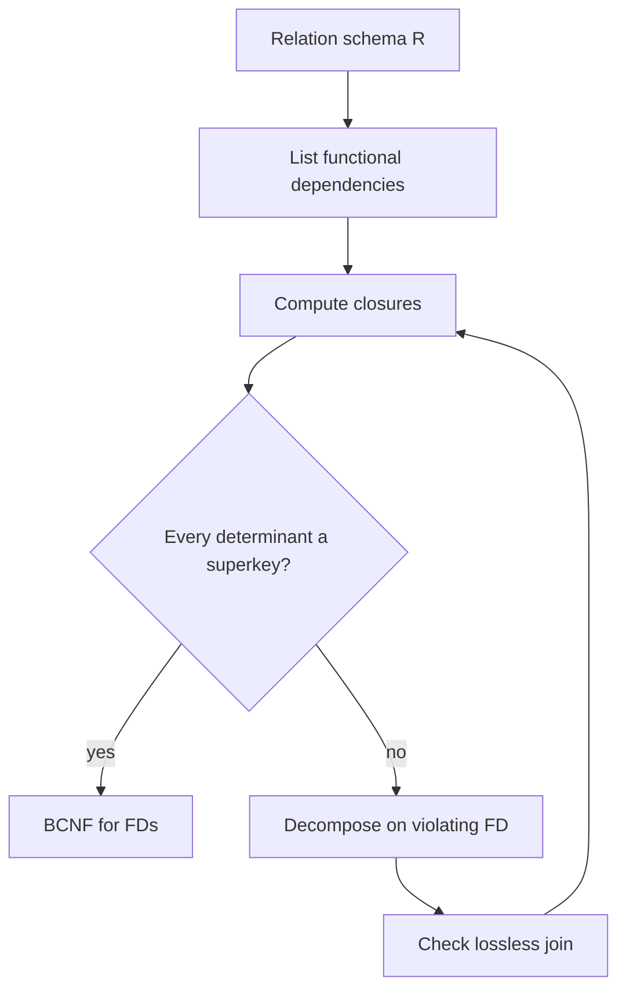

# Normalization and Functional Dependencies

Normalization is the discipline of designing relation schemas so that facts are stored in the right place. It is not an aesthetic rule about making many small tables. Its purpose is to avoid update anomalies, insertion anomalies, deletion anomalies, and contradictions caused by storing the same fact in multiple rows. Functional dependencies are the formal tool used to reason about those risks.

This topic follows E-R design because a first relational schema often comes from conceptual modeling. Normalization then checks whether each relation has a clean meaning. A relation should say one kind of thing. If it mixes independent facts, such as instructor salary and department building in every course row, updates become unsafe and constraints become hard to enforce.

## Definitions

A **functional dependency** (FD) on a relation schema `R` is written `X -> Y`, where `X` and `Y` are sets of attributes from `R`. It means that in every legal instance of `R`, any two tuples that agree on all attributes in `X` must also agree on all attributes in `Y`.

The **closure** of an attribute set `X`, written `X+`, is the set of all attributes functionally determined by `X` under a given set of dependencies. If `X+` contains every attribute of relation `R`, then `X` is a superkey for `R`.

An FD is **trivial** if `Y` is a subset of `X`. For example, `{ID, name} -> ID` is trivial. The interesting dependencies determine attributes not already on the left side.

**Armstrong's axioms** are sound and complete inference rules for FDs:

| Rule | Form | Meaning |
| --- | --- | --- |
| Reflexivity | if `Y` subset of `X`, then `X -> Y` | attributes determine themselves |
| Augmentation | if `X -> Y`, then `XZ -> YZ` | adding context preserves dependency |
| Transitivity | if `X -> Y` and `Y -> Z`, then `X -> Z` | dependencies chain |

Useful derived rules include union, decomposition, and pseudotransitivity.

**First normal form (1NF)** requires atomic attribute domains: each attribute value is a single value from its domain, not a repeating group or nested relation. **Boyce-Codd normal form (BCNF)** requires that for every nontrivial FD `X -> Y`, `X` is a superkey. **Third normal form (3NF)** relaxes BCNF slightly to preserve dependencies in some cases.

## Key results

The attribute-closure algorithm decides whether a set of attributes is a superkey and whether an FD follows from a set of FDs:

1. Start with `result = X`.
2. Repeatedly find an FD `A -> B` where `A` is contained in `result`.
3. Add `B` to `result`.
4. Stop when no more attributes can be added.

If `Y` is contained in the final result, then `X -> Y` follows from the dependencies.

BCNF removes redundancy caused by functional dependencies. If `X -> Y` violates BCNF because `X` is not a superkey, decompose `R` into:

$$
R_1 = X \cup Y
$$

$$
R_2 = R - (Y - X)
$$

This decomposition is lossless for the violating FD. Losslessness means joining the decomposed relations reconstructs exactly the original legal relation, with no spurious tuples and no missing tuples.

3NF permits a dependency `X -> A` when `X` is a superkey, or `A` is prime, meaning `A` is part of some candidate key. The practical reason is dependency preservation: a 3NF decomposition can always be made lossless and dependency-preserving, while BCNF sometimes sacrifices dependency preservation.

A design review should distinguish redundancy from repetition. Repeating a department name as a foreign key in many student rows is not automatically bad; it is how the relationship is represented. Repeating a department building in every instructor row is different if `dept_name -> building` holds, because the same fact is copied many times. Normalization targets copied facts that can become inconsistent, not every repeated value.

Functional dependencies also help explain update anomalies. If a department changes buildings and that building is stored in many instructor rows, every copy must be updated. If a new department has no instructors yet, there may be nowhere to store its building. If the last instructor in a department is deleted, the department-building fact may disappear. These are update, insertion, and deletion anomalies, and they are symptoms that the relation mixes multiple facts.

Candidate keys should be found before judging normal forms. In a schema with composite keys, an attribute can be prime because it belongs to some candidate key even if it is not part of the primary key chosen for implementation. This distinction matters for 3NF. A dependency that looks suspicious may be allowed in 3NF when its right-hand side is prime. Skipping key discovery often leads to incorrect normal-form classifications.

Minimal covers help keep reasoning manageable. Splitting right-hand sides, removing extraneous left-hand attributes, and deleting redundant dependencies do not change the logical implications, but they make synthesis algorithms easier to run by hand. When a decomposition seems unexpectedly large, recomputing a clean canonical cover is often the first debugging step.

Normalization is not opposed to performance engineering. The usual workflow is to first design a schema whose facts and constraints are clear, then measure the workload and add physical structures such as indexes, materialized views, or carefully maintained summaries. If a redundant column is added for speed, it should be treated as derived data with a defined maintenance rule, not as an independent source of truth.

It is also normal for different relations in the same database to be normalized to different degrees. Core transactional facts usually deserve stricter normalization, while derived reporting tables may intentionally store summaries. The important point is to know which tables are authoritative and which are maintained copies.

## Visual



| Normal form | Main requirement | Prevents |
| --- | --- | --- |
| 1NF | atomic values | repeating groups inside rows |
| 2NF | no partial dependency of non-prime attributes on part of a key | redundancy under composite keys |
| 3NF | every FD has superkey determinant or prime RHS | most FD-based anomalies with dependency preservation |
| BCNF | every nontrivial FD has a superkey determinant | stronger FD-based redundancy |

## Worked example 1: Compute an attribute closure

Problem: For relation `R(A, B, C, D, E)` with FDs `A -> BC`, `CD -> E`, `B -> D`, and `E -> A`, compute `A+`. Decide whether `A` is a superkey.

Method:

1. Initialize closure with the starting attributes:

$$
A^+ = \{A\}
$$

2. Apply `A -> BC` because `A` is in the closure:

$$
A^+ = \{A, B, C\}
$$

3. Apply `B -> D` because `B` is now in the closure:

$$
A^+ = \{A, B, C, D\}
$$

4. Apply `CD -> E` because both `C` and `D` are now in the closure:

$$
A^+ = \{A, B, C, D, E\}
$$

5. Apply `E -> A` if desired, but `A` is already present. No new attributes appear.

Checked answer: `A+` contains every attribute of `R`, so `A` is a superkey. Since no proper subset of `{A}` exists except the empty set, `A` is also a candidate key.

## Worked example 2: Detect and fix a BCNF violation

Problem: Relation `InstDept(ID, name, dept_name, building, salary)` has FDs `ID -> name, dept_name, salary` and `dept_name -> building`. Is it in BCNF? If not, decompose it.

Method:

1. Compute whether `ID` is a superkey. From `ID`, we get `name`, `dept_name`, and `salary`. Since we then have `dept_name`, we get `building`. Therefore `ID+` is all attributes. `ID` is a superkey.

2. Check `dept_name -> building`. The closure of `dept_name` is:

$$
dept\_name^+ = \{dept\_name, building\}
$$

   It does not include `ID`, `name`, or `salary`, so `dept_name` is not a superkey.

3. Therefore `dept_name -> building` violates BCNF.

4. Decompose using the violating dependency:

$$
R_1(dept\_name, building)
$$

$$
R_2(ID, name, dept\_name, salary)
$$

5. Check losslessness. The intersection is `dept_name`. In `R1`, `dept_name -> building`, so the intersection determines all attributes of `R1`. The decomposition is lossless.

Checked answer: the decomposed schema stores each department building once and each instructor fact once. Updating a department's building no longer requires changing many instructor rows.

## Code

```python
def closure(attributes, fds):
    """Compute attribute closure under functional dependencies."""
    result = set(attributes)
    changed = True
    while changed:
        changed = False
        for left, right in fds:
            if set(left).issubset(result) and not set(right).issubset(result):
                result.update(right)
                changed = True
    return result

fds = [
    ("A", "BC"),
    ("CD", "E"),
    ("B", "D"),
    ("E", "A"),
]

print(closure("A", fds))
print(closure("D", fds))
```

## Common pitfalls

- Treating every dependency found in a sample instance as a true FD. FDs describe all legal instances, not accidental current data.
- Forgetting to compute closure iteratively. A dependency may become usable only after another dependency adds attributes.
- Assuming BCNF is always preferable without cost. It can lose dependency preservation, requiring joins to check some constraints.
- Confusing `X -> Y` with causation. It is a uniqueness rule, not a time or cause relation.
- Normalizing away intentional denormalization used for performance without considering maintenance strategy.
- Ignoring 1NF by storing lists, JSON blobs, or comma-separated values when the data should be queried relationally.

## Connections

- [E-R Modeling and Relational Mapping](/cs/databases/er-modeling-and-relational-mapping)
- [Higher Normal Forms and Decomposition](/cs/databases/higher-normal-forms-and-decomposition)
- [Relational Model and Relational Algebra](/cs/databases/relational-model-and-algebra)
- [Query Optimization and Cost Estimation](/cs/databases/query-optimization-and-cost-estimation)
