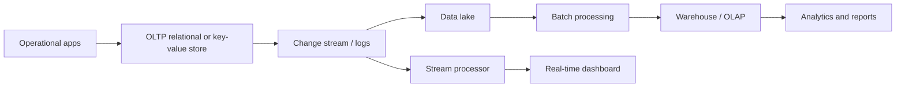

# NoSQL, Big Data, and Analytics

NoSQL and big-data systems grew from workloads where a single relational server was not the best fit: massive event logs, web-scale key-value access, flexible semi-structured documents, large graph traversals, streaming data, and analytical scans over petabytes. These systems do not replace relational databases as a category; they broaden the design space for data management.

The key question is not whether a system is "SQL" or "NoSQL." The key question is what data model, consistency contract, access pattern, scale target, and operational cost match the workload. Many modern systems mix ideas: relational databases store JSON, document stores add SQL-like languages, warehouses use columnar storage, and stream processors maintain stateful views.

## Definitions

**NoSQL** is an umbrella term for nontraditional database systems, commonly including key-value stores, document stores, wide-column stores, and graph databases. They often emphasize horizontal scalability, flexible schema, and application-specific access patterns.

**Big data** refers to data whose size, speed, or variety requires distributed storage and processing techniques. The common "volume, velocity, variety" slogan is less important than the engineering fact: the workload no longer fits comfortably on one machine or in one conventional processing model.

Major models:

| Model | Data shape | Typical access |
| --- | --- | --- |
| Key-value | key to opaque value | get, put, delete by key |
| Document | JSON-like documents | fetch by id, filter fields, nested data |
| Wide-column | sparse rows with column families | large-scale keyed access and scans |
| Graph | vertices and edges | traversals and relationship queries |
| Columnar warehouse | columns stored separately | analytical scans and aggregations |
| Stream system | unbounded event sequences | windows, joins, alerts, state updates |

**MapReduce** is a programming model with a map phase that emits key-value pairs and a reduce phase that groups values by key. It made large batch processing approachable, though many modern systems use more expressive execution engines.

**Data warehousing** organizes historical data for analysis. **OLAP** systems support aggregations, slicing, dicing, roll-up, drill-down, and pivoting. Warehouses often use star schemas, columnar storage, compression, and materialized summaries.

## Key results

Flexible schema does not mean no schema. A document store may allow different fields in different documents, but application code, indexes, validation rules, and analytics still depend on expected structure. Schema-on-read delays interpretation until query time; schema-on-write validates and organizes data before storage.

Denormalization is common in NoSQL systems because joins may be limited or expensive. The cost is duplicated data and more complex updates. A design that stores a user's display name inside every comment can read comments quickly, but a name change now requires many updates or acceptance of stale embedded values.

Columnar analytics are efficient because queries often read only a few columns from many rows. Compression improves because values in one column tend to have similar types and distributions. This is different from row-oriented OLTP, where a transaction often needs a complete record and low-latency point updates.

Streaming systems replace "run a batch query over a finished table" with "maintain results as events arrive." Windowing defines finite groups over an unbounded stream, such as tumbling five-minute windows or sliding one-hour windows. Late events and exactly-once processing semantics are central operational concerns.

NoSQL systems often move work from the database engine into the application design. If the database does not support joins, the application must choose document boundaries or maintain duplicated read models. If the system provides eventual consistency, the application must decide what users see during replication lag. These are not defects by themselves; they are explicit trade-offs that can be excellent for the right workload and dangerous for the wrong one.

Warehouses and lakes serve different roles. A data lake can store raw or lightly processed files in open formats, preserving detail for future processing. A warehouse curates data into governed tables with known meanings, quality checks, and optimized query performance. Many organizations use both: logs land in a lake, transformations clean and model them, and business-facing aggregates appear in a warehouse.

Graph systems are strongest when relationships are the primary data. A relational database can represent edges in a table, but repeated variable-length traversals may be more natural in a graph engine with adjacency-oriented storage and traversal languages. Conversely, simple aggregations over millions of events are usually better served by columnar analytics than by a graph model.

Data quality becomes harder at scale because errors are amplified by pipelines. A malformed event field can affect dashboards, machine-learning features, and downstream exports. Big-data architectures therefore need validation, lineage, schema evolution rules, and backfill procedures. The engineering problem is not only storing many bytes; it is preserving meaning as data moves through many systems.

Batch and streaming are often combined. A batch job may compute an accurate historical baseline, while a stream processor maintains recent incremental updates. The two results are merged for low-latency dashboards. This pattern is powerful, but it requires consistent definitions so the batch and streaming paths do not count events differently.

Choosing a nonrelational system should include an exit and integration plan. Data rarely stays in one store forever; it is exported to search indexes, warehouses, monitoring systems, and archives. Systems with flexible schemas and application-specific encodings need clear contracts so downstream consumers know how to interpret old and new records as the application evolves.

## Visual



| Workload | Better default | Reason |
| --- | --- | --- |
| Bank transfer | relational OLTP | constraints and transactions |
| User session cache | key-value store | simple key lookup and expiration |
| Product catalog with varying attributes | document store | flexible nested documents |
| Social relationship traversal | graph database | edges are first-class |
| Daily revenue by region | columnar warehouse | scans, grouping, compression |
| Fraud alert from events | stream processor | low-latency continuous computation |

## Worked example 1: MapReduce word count

Problem: Count word occurrences across a distributed collection of text documents.

Method:

1. The map function reads one document and emits `(word, 1)` for each word:

   ```text
   "data systems data" -> (data, 1), (systems, 1), (data, 1)
   ```

2. The shuffle groups values by key:

   ```text
   data -> [1, 1]
   systems -> [1]
   ```

3. The reduce function sums each list:

   ```text
   data -> 2
   systems -> 1
   ```

4. Across many machines, mappers process splits independently. The system redistributes intermediate pairs so all values for the same word reach the same reducer.

5. The final output is a relation-like set of pairs:

   ```text
   (word, count)
   ```

Checked answer: the count for each word is the sum of all emitted ones for that word. The algorithm is naturally parallel because maps are independent and reduces are independent per key after shuffle.

## Worked example 2: Pick a data model for product reviews

Problem: An e-commerce application stores products, reviews, users, and votes. Product pages need fast reads showing product details and recent reviews. Analysts need aggregate review scores by category. Choose an operational model and explain the trade-off.

Method:

1. Product-page reads are document-shaped:

   ```text
   product
     id
     title
     category
     recent_reviews[]
   ```

2. Embedding recent reviews in a product document gives one fast read for the page.

3. Full review history may be too large to embed forever. Store reviews as separate documents or rows keyed by `product_id`, with an index for recent reviews.

4. Aggregate review scores by category are analytical. They should be computed in a warehouse or materialized summary:

   ```text
   category, day, review_count, average_rating
   ```

5. A relational design could also work, especially if constraints and ad hoc queries dominate. The document design favors product-page reads but must handle duplicated user display names and update propagation.

Checked answer: a hybrid is often best: operational document or relational tables for serving product pages, plus a columnar analytical store for category summaries. The correct design follows access patterns, not labels.

## Code

```python
from collections import Counter
import re

def map_words(document):
    for word in re.findall(r"[a-z]+", document.lower()):
        yield word, 1

def reduce_counts(mapped_pairs):
    counts = Counter()
    for word, value in mapped_pairs:
        counts[word] += value
    return counts

documents = ["Data systems store data.", "Systems query data."]
pairs = [pair for doc in documents for pair in map_words(doc)]
print(reduce_counts(pairs))
```

```sql
SELECT category,
       COUNT(*) AS review_count,
       AVG(rating) AS average_rating
FROM fact_review
WHERE review_date >= DATE '2026-01-01'
GROUP BY category
ORDER BY average_rating DESC;
```

## Common pitfalls

- Treating NoSQL as automatically faster. A poor access pattern is slow in any model.
- Believing flexible schema means no data governance. Validation and migration still matter.
- Duplicating data without a strategy for stale copies and repair.
- Running analytical scans on an OLTP store that is optimized for point updates.
- Ignoring late-arriving events in streaming windows.
- Assuming eventual consistency is acceptable without checking user-facing invariants.

## Connections

- [Distributed Databases, Replication, Partitioning, and 2PC](/cs/databases/distributed-databases-replication-partitioning-2pc)
- [Storage, Records, Blocks, and Files](/cs/databases/storage-records-blocks-and-files)
- [Indexing with B+ Trees, Hashing, and Bitmaps](/cs/databases/indexing-bplus-hash-bitmap)
- [SQL Aggregation, Views, and Window Functions](/cs/databases/sql-aggregation-views-and-window-functions)
