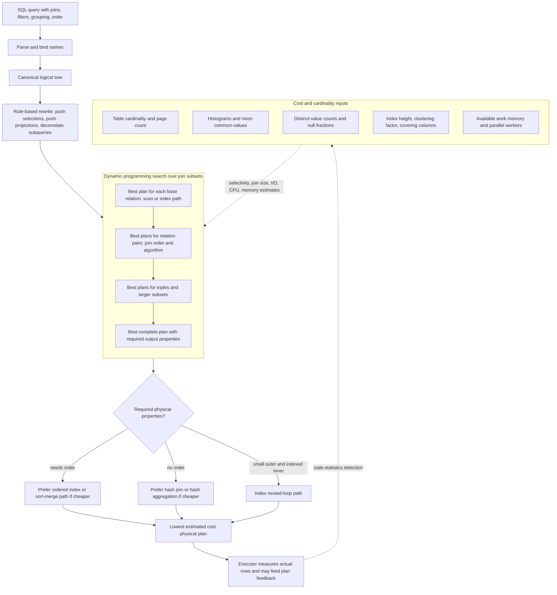

# Query Optimization and Cost Estimation

Query optimization is the process of choosing an efficient execution plan among many equivalent plans. SQL is declarative, so the user does not usually specify join order, access paths, or physical algorithms. The optimizer uses algebraic equivalences and cost estimates to search the plan space and choose a plan expected to be cheap.

Optimization is difficult because the number of possible plans grows quickly. A query with several joins can be evaluated in many join orders, with different join algorithms and indexes at each step. The optimizer therefore relies on statistics, heuristics, and dynamic programming rather than exhaustive physical experimentation. A good plan can be thousands of times faster than a bad one.

## Definitions

A **logical plan** represents relational operations such as selection, projection, join, grouping, and sorting. A **physical plan** chooses concrete algorithms such as index scan, hash join, sort-merge join, or hash aggregation.

An **equivalence rule** says two relational expressions always produce the same result under stated assumptions. Examples include pushing selections below joins and reordering inner joins. SQL features such as outer joins, nulls, duplicates, and aggregates make some equivalences more restricted than in pure relational algebra.

**Statistics** summarize relation contents. Common statistics include tuple count, page count, number of distinct values for an attribute, minimum and maximum values, histograms, and index height. Statistics are estimates, not exact knowledge, unless the DBMS computes exact metadata for a small object.

**Selectivity** is the fraction of rows expected to satisfy a predicate. If a table has 100,000 rows and a predicate selectivity of 0.02, the estimated output is 2,000 rows.

A **left-deep join tree** is a join plan where the right input of each join is a base relation. Many optimizers search left-deep trees because they support pipelined execution and reduce search complexity. Bushy trees allow both inputs to be intermediate results and can be better for some queries.

## Key results

Selection pushdown is one of the most important transformations:

$$
\sigma_p(R \bowtie S) = \sigma_p(R) \bowtie S
$$

when predicate `p` refers only to attributes of `R`. It reduces the size of join inputs.

Projection pushdown removes unused attributes, reducing tuple width:

$$
\pi_A(R \bowtie S)
$$

can often be rewritten so that each input keeps only join attributes and attributes needed later.

Join commutativity and associativity permit join reordering:

$$
R \bowtie S = S \bowtie R
$$

$$
(R \bowtie S) \bowtie T = R \bowtie (S \bowtie T)
$$

for inner joins under compatible predicates. This is the basis of join-order optimization.

A simple equality selectivity estimate for `A = value` is:

$$
\frac{1}{V(R, A)}
$$

where `V(R, A)` is the number of distinct values of attribute `A` in relation `R`. A simple join-size estimate for `R.A = S.B` is:

$$
\frac{|R| \times |S|}{\max(V(R,A), V(S,B))}
$$

These formulas rely on uniformity and independence assumptions that can be wrong, but they give a starting point.

Cost models usually combine I/O, CPU, memory, and sometimes network cost. In older disk-centered models, page I/O dominated. In memory-resident or columnar systems, CPU cost, decompression, cache behavior, and vectorized execution can dominate. Distributed systems must also estimate data movement. The exact model varies by DBMS, but the central idea is stable: compare alternative plans using estimated resource consumption before executing the query.

Cardinality estimation errors multiply through a plan. If the optimizer underestimates one join result by a factor of 100, it may choose a nested-loop plan that looks cheap on paper but performs huge numbers of probes at runtime. This is why histograms, multi-column statistics, and feedback from actual execution can matter. Query tuning often starts by comparing estimated rows with actual rows at each plan node.

Heuristics still matter even in cost-based optimizers. Pushing selections, removing unused columns, avoiding Cartesian products, and simplifying predicates reduce the search space and improve the quality of later cost decisions. The best optimizers combine algebraic rewriting, statistics, dynamic programming, and practical limits on how many alternatives they explore.

Plan choice is also affected by physical properties delivered by earlier operators. A plan that produces rows sorted by `(dept_name, ID)` may make a later merge join or grouping operation cheaper. A hash join may have a lower immediate cost but destroy useful order, forcing a later sort. Optimizers therefore track not only estimated cardinality and cost, but also properties such as ordering, partitioning, and materialization.

Subquery decorrelation is a major advanced rewrite. A nested `EXISTS` query may be transformed into a semijoin; a `NOT EXISTS` query may become an antijoin; a scalar subquery may become a join plus aggregation if uniqueness is preserved. These rewrites can turn repeated logical evaluation into one set-oriented operation, but they must preserve null semantics and duplicate behavior.

Prepared statements and parameterized queries introduce another estimation challenge. The optimizer may choose a generic plan that works reasonably for many parameter values, or a custom plan for a specific value. If one department has 10 students and another has 20,000, the best plan for `dept_name = ?` may depend heavily on the parameter. This is one reason skew and bind parameters can make performance diagnosis surprising.

Optimization time is itself a cost. For short queries, spending seconds searching for a perfect plan would be worse than executing a good plan immediately. Real optimizers use time limits, search-space pruning, and heuristics because planning must be fast enough for interactive workloads.

## Visual



This optimizer diagram opens the black box between SQL and the final plan. Rule rewrites reduce the logical tree, then dynamic programming builds the best plans for base relations, pairs, and larger join subsets while tracking cost and physical properties such as ordering. The cost-input subgraph names the statistics that drive the choice, and the feedback edge highlights why comparing estimated and actual rows is central to query tuning.

| Statistic | Used for | Risk when stale or missing |
| --- | --- | --- |
| tuple count | scan and join output estimates | wrong join order |
| page count | I/O cost | scan cost underestimation |
| distinct values | equality selectivity | bad filter estimates |
| histogram | skewed range and equality predicates | uniformity assumption errors |
| index height | index lookup cost | wrong access-path choice |
| clustering factor | random versus sequential fetch cost | index scan chosen when table scan is cheaper |

## Worked example 1: Estimate selection cardinality

Problem: `student` has 50,000 rows. Statistics say `V(student, dept_name) = 25`. Estimate the number of rows for `dept_name = 'Comp. Sci.'` using uniformity.

Method:

1. Use the equality selectivity estimate:

$$
selectivity = \frac{1}{V(student, dept\_name)}
$$

2. Substitute the distinct-value count:

$$
selectivity = \frac{1}{25} = 0.04
$$

3. Multiply by table cardinality:

$$
50000 \times 0.04 = 2000
$$

4. Interpret the assumption. The estimate says each department has about 2,000 students. This may be false if departments are skewed; a histogram would improve the estimate.

Checked answer: the optimizer estimates 2,000 rows. The number is not a guarantee; it is a cost-model input.

## Worked example 2: Choose a join order by estimated size

Problem: Relations `Student`, `Takes`, and `Course` have cardinalities 50,000, 500,000, and 2,000. A query filters `Course.dept_name = 'Comp. Sci.'`. Suppose the filter leaves 200 courses. Should the optimizer join `Takes` with filtered `Course` before joining `Student`, or join `Student` with `Takes` first?

Method:

1. Estimate `Takes join filtered Course`. If each course appears in about:

$$
\frac{500000}{2000} = 250
$$

   `takes` rows, then 200 CS courses match:

$$
200 \times 250 = 50000
$$

2. Estimate `Student join Takes` before course filtering. Since every `takes.ID` matches one student, the join remains about:

$$
500000\ \text{rows}
$$

3. Compare intermediate sizes. Joining `Takes` to filtered `Course` first produces about 50,000 rows, while `Student join Takes` produces about 500,000 rows.

4. Then join the smaller intermediate with `Student` by `ID`.

Checked answer: it is likely better to push the course filter and join `Takes` with filtered `Course` first. This reduces the intermediate result by about a factor of ten before adding student attributes.

## Code

```python
def equality_selection_rows(row_count, distinct_values):
    return row_count / distinct_values

def equality_join_rows(rows_r, rows_s, distinct_r, distinct_s):
    return rows_r * rows_s / max(distinct_r, distinct_s)

student_rows = 50_000
estimated_cs_students = equality_selection_rows(student_rows, 25)
print(estimated_cs_students)

join_estimate = equality_join_rows(500_000, 200, 2_000, 200)
print(join_estimate)
```

```sql
ANALYZE student;
ANALYZE takes;
ANALYZE course;

EXPLAIN
SELECT s.name, c.title
FROM student AS s
JOIN takes AS t ON t.ID = s.ID
JOIN course AS c ON c.course_id = t.course_id
WHERE c.dept_name = 'Comp. Sci.';
```

## Common pitfalls

- Assuming the optimizer knows exact data distributions. It usually works from approximate statistics.
- Forgetting that stale statistics can make a correct query slow.
- Applying relational equivalences blindly to outer joins or queries with null-sensitive predicates.
- Believing the written SQL join order is always the execution order. Optimizers reorder inner joins frequently.
- Ignoring tuple width. A plan with the same row count can be cheaper if projection pushdown removes large attributes.
- Reading estimated plans as truth. Compare estimated and actual row counts when diagnosing performance.

## Connections

- [Relational Model and Relational Algebra](/cs/databases/relational-model-and-algebra)
- [Query Processing and Join Algorithms](/cs/databases/query-processing-join-algorithms)
- [Indexing with B+ Trees, Hashing, and Bitmaps](/cs/databases/indexing-bplus-hash-bitmap)
- [SQL Aggregation, Views, and Window Functions](/cs/databases/sql-aggregation-views-and-window-functions)
