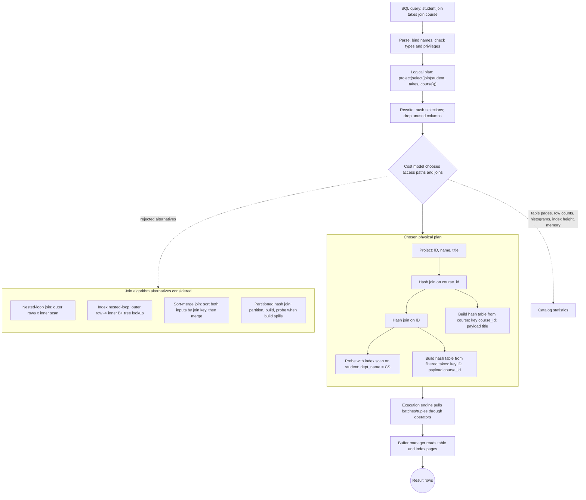

# Query Processing and Join Algorithms

Query processing is the path from a declarative SQL statement to executable operations. The DBMS parses the query, validates names and types, rewrites it into an internal algebraic form, chooses a physical plan, and executes that plan using operators such as scans, selections, sorts, aggregations, and joins. The user asks a logical question; the query processor turns it into work.

Joins are the central expensive operation in relational systems because they combine rows from different relations. A join can be implemented by nested loops, indexed lookups, sorting, hashing, or parallel variants. The best algorithm depends on relation sizes, available memory, indexes, sort order, predicate type, and whether results can be pipelined to later operators.

## Definitions

A **query plan** is a tree or graph of physical operators. Leaves read base tables or indexes. Internal nodes perform operations such as selection, projection, join, grouping, sorting, or duplicate elimination. The root produces the query result.

An **access path** is a method for retrieving tuples from a relation: table scan, index scan, index lookup, bitmap scan, or clustered range scan. The optimizer chooses access paths for each base relation.

A **selection operation** filters rows. It can be implemented by a file scan, binary search on an ordered file, B+ tree lookup, hash lookup, or bitmap combination. A **projection operation** removes columns and may remove duplicates if SQL `DISTINCT` or set semantics require it.

Common join algorithms:

| Algorithm | Basic idea | Best when |
| --- | --- | --- |
| Nested-loop join | compare each outer row with inner rows | small outer or no useful structure |
| Block nested-loop join | read chunks of outer pages and scan inner | memory can hold many outer pages |
| Index nested-loop join | use inner index for each outer row | inner join attribute is indexed |
| Sort-merge join | sort both inputs, then merge by join key | inputs already sorted or range-friendly |
| Hash join | build hash table on smaller input, probe with larger | equality joins with enough memory |

A **pipeline** passes tuples directly from one operator to the next without materializing a full intermediate result. **Materialization** writes an intermediate result to memory or disk before the next operator consumes it.

## Key results

The naive nested-loop join of relations `R` and `S` compares every pair, so CPU comparisons are:

$$
|R| \times |S|
$$

Block nested-loop join reduces I/O by reading several pages of the outer relation at once. If `B(R)` and `B(S)` are page counts and memory has `M` pages, with `M - 2` pages available for the outer block, the approximate I/O cost is:

$$
B(R) + \left\lceil \frac{B(R)}{M - 2} \right\rceil B(S)
$$

Hash join for equality predicates has two phases. In the build phase, hash the smaller relation into an in-memory hash table. In the probe phase, scan the larger relation and look up matching build tuples. If the build input fits in memory, the cost is about one scan of each input. If not, partitioned hash join writes and rereads partitions.

Sort-merge join sorts both inputs on the join key, then advances through them in order. It is useful when inputs are already ordered by indexes, when the query also needs ordered output, or when memory is insufficient for a one-pass hash join.

Operators can be blocking or streaming. A selection can usually emit a tuple as soon as it reads and accepts it. A full sort must see its entire input before it can emit the first tuple, unless it is doing a top-N variant. Hash aggregation may emit only after a group is complete. These differences affect latency, memory use, and whether a plan can pipeline intermediate results without writing them to temporary storage.

Duplicate elimination and grouping are often implemented with either sorting or hashing. Sorting brings equal keys together and can also satisfy an `ORDER BY`. Hashing partitions rows by key and can be faster when no output order is needed. The optimizer compares these physical properties, not just the logical operation name.

Expression evaluation can be tuple-at-a-time, vectorized, or compiled. Traditional iterator engines call `next()` on operators, which is simple and composable but can have overhead. Vectorized engines process batches of column values, improving CPU cache behavior and enabling SIMD instructions. Some systems compile query fragments into machine code. These implementation choices do not change relational semantics, but they strongly affect analytical performance.

Temporary files are a sign that an operator exceeded available memory or deliberately materialized data for reuse. External sort writes runs and merges them. Hash join may partition inputs to disk. These spills are correct behavior, but they can dominate runtime. Memory settings, row width, and earlier projection pushdown all influence whether a plan stays in memory.

Parallel execution adds another layer. A scan can be split across workers, a hash join can partition rows by hash value, and an aggregation can compute partial results before a final merge. Parallelism helps only when coordination, skew, and data movement do not exceed the saved work.

## Visual



This query-processing diagram distinguishes the logical relational expression from the executable physical plan. The chosen plan labels concrete operator choices, including two hash joins, build/probe roles, index scanning, and projected payloads, while the side branch lists nested-loop, index nested-loop, sort-merge, and partitioned hash alternatives. The dotted catalog edge shows that plan selection depends on statistics, memory, and index metadata rather than only SQL syntax.

| Join algorithm | Equality only? | Uses indexes? | Memory sensitivity | Output order |
| --- | --- | --- | --- | --- |
| Tuple nested loop | no | no | low | outer order then inner order |
| Block nested loop | no | no | benefits from more memory | outer block order |
| Index nested loop | no, if index supports predicate | yes | low to moderate | outer order |
| Sort-merge | no for some ordered predicates, strongest for equality/ranges | can use ordered indexes | sorting needs memory | join-key order |
| Hash join | yes for standard form | no required index | high | unordered |

## Worked example 1: Block nested-loop I/O cost

Problem: Relation `R` has 1,000 pages. Relation `S` has 2,000 pages. The DBMS has 102 buffer pages, and a block nested-loop join uses `M - 2` pages for chunks of `R`. Estimate I/O cost with `R` as outer.

Method:

1. Compute usable outer block pages:

$$
M - 2 = 102 - 2 = 100
$$

2. Compute number of outer chunks:

$$
\left\lceil \frac{B(R)}{100} \right\rceil =
\left\lceil \frac{1000}{100} \right\rceil = 10
$$

3. Read `R` once:

$$
1000\ \text{page reads}
$$

4. For each outer chunk, scan `S` once:

$$
10 \times 2000 = 20000\ \text{page reads}
$$

5. Total:

$$
1000 + 20000 = 21000\ \text{page reads}
$$

Checked answer: with `R` as outer, the estimated cost is 21,000 page reads. If `S` were outer, the cost would be `2000 + ceil(2000/100) * 1000 = 22,000`, slightly worse.

## Worked example 2: Choose hash join or index nested-loop

Problem: `student` has 50,000 rows and 2,000 pages. `takes` has 500,000 rows and 20,000 pages. Query joins `student.ID = takes.ID` for one department containing 500 students. There is an index on `takes(ID)`. Which join plan is plausible?

Method:

1. Apply the selection first:

   ```sql
   WHERE student.dept_name = 'Comp. Sci.'
   ```

   This reduces the outer side to about 500 students.

2. Consider index nested-loop join. For each selected student, use the `takes(ID)` index to find matching enrollment rows.

3. If each student has about 10 enrollment rows, the result has about:

$$
500 \times 10 = 5000\ \text{rows}
$$

4. The index plan performs 500 index probes plus data fetches for matching `takes` rows. This may be much cheaper than scanning all 20,000 pages of `takes`.

5. A hash join would likely scan `takes` once and hash the 500 students, costing at least the scan of 20,000 `takes` pages. That can be good for large selected departments but wasteful here.

Checked answer: index nested-loop is plausible because the outer input after selection is small and the inner relation has a useful index on the join key. The exact winner depends on clustering and buffer hits.

## Code

```python
from math import ceil

def block_nested_loop_cost(outer_pages, inner_pages, buffer_pages):
    outer_block = buffer_pages - 2
    chunks = ceil(outer_pages / outer_block)
    return outer_pages + chunks * inner_pages

print(block_nested_loop_cost(1000, 2000, 102))
print(block_nested_loop_cost(2000, 1000, 102))
```

```sql
EXPLAIN
SELECT s.ID, s.name, t.course_id, t.grade
FROM student AS s
JOIN takes AS t
  ON t.ID = s.ID
WHERE s.dept_name = 'Comp. Sci.';
```

## Common pitfalls

- Judging a join algorithm without considering earlier selections. The best join depends on input sizes after filtering.
- Assuming indexes always make joins faster. Many random lookups can lose to a sequential scan.
- Forgetting memory constraints. Hash and sort operators can spill to disk if memory is insufficient.
- Treating logical join order as fixed by the SQL text. Inner joins can often be reordered by the optimizer.
- Ignoring output requirements. A sort-merge join may be attractive if the next operator needs join-key order.
- Materializing every intermediate result mentally. Many engines pipeline operators when possible.

## Connections

- [SQL Joins, Subqueries, and Set Operations](/cs/databases/sql-joins-subqueries-and-set-operations)
- [Indexing with B+ Trees, Hashing, and Bitmaps](/cs/databases/indexing-bplus-hash-bitmap)
- [Query Optimization and Cost Estimation](/cs/databases/query-optimization-and-cost-estimation)
- [Storage, Records, Blocks, and Files](/cs/databases/storage-records-blocks-and-files)
