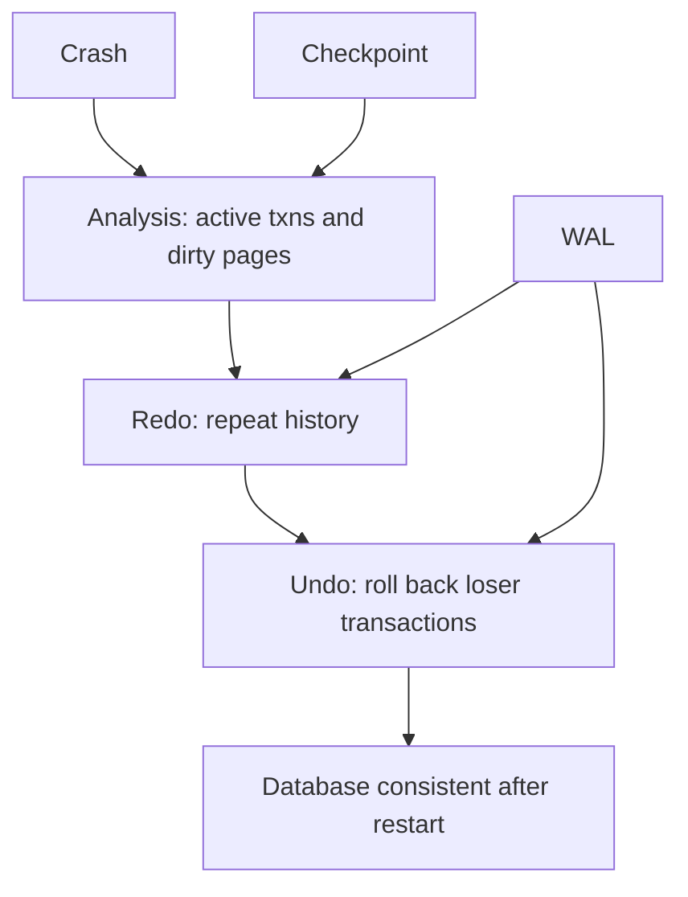

# Recovery with WAL, ARIES, and Checkpoints

Recovery is the part of a DBMS that makes atomicity and durability believable after crashes. Transactions update pages in memory, pages are written to disk at inconvenient times, and failures can interrupt execution between any two machine instructions. The recovery system records enough history to redo committed work and undo uncommitted work after restart.

Write-ahead logging and ARIES are central ideas in recovery. The log is an append-only record of changes and transaction events. Write-ahead logging says the log record describing a change must reach stable storage before the changed data page reaches stable storage. ARIES organizes restart into analysis, redo, and undo phases, allowing flexible buffer management and efficient recovery.

## Definitions

A **log record** describes a transaction event such as update, commit, abort, end, checkpoint, or compensation. An update log record commonly stores the transaction id, page id, previous log sequence number, redo information, and undo information.

A **log sequence number (LSN)** is a monotonically increasing identifier for log records. Each data page stores a `pageLSN`, the LSN of the latest update applied to that page. The recovery algorithm uses `pageLSN` to decide whether a logged update is already present on disk.

**Write-ahead logging (WAL)** has two core rules:

1. Before a dirty page is written to disk, all log records for updates on that page up to the page's `pageLSN` must be on stable storage.
2. Before a transaction is reported committed, its commit log record must be on stable storage.

A **checkpoint** records recovery metadata so restart does not need to scan the log from the beginning of time. Modern fuzzy checkpoints can occur while transactions continue running. They record information such as a dirty-page table and active-transaction table.

**ARIES** is a recovery method based on repeating history during redo and then undoing loser transactions. A **loser transaction** was active at the time of crash and did not commit. A **winner transaction** committed before the crash.

## Key results

Steal/no-force buffer management is efficient but requires logging. **Steal** means the buffer manager may write a dirty page containing uncommitted updates to disk. This requires undo during recovery. **No-force** means the system does not have to write all pages modified by a transaction at commit. This requires redo during recovery.

The ARIES restart phases are:

1. **Analysis**: determine the state at crash time, including active transactions and dirty pages.
2. **Redo**: repeat history from an appropriate point, reapplying updates that might not be on disk.
3. **Undo**: roll back loser transactions, writing compensation log records.

Redo is based on idempotence checks. If a page's `pageLSN` is already greater than or equal to the log record's LSN, the update is already reflected on disk and does not need to be redone. If not, redo applies it.

Undo uses the per-transaction log chain, following previous-LSN pointers backward. Compensation log records record undo actions so recovery itself can be recovered if another crash happens during restart.

The log is sequential by design. Sequential appends are much cheaper and easier to make durable than forcing many random data pages at commit time. This is the core performance reason for no-force commit: the system can make a transaction durable by forcing a small amount of log data, while writing dirty data pages later in an order chosen by the buffer manager.

Checkpoints reduce restart time but do not eliminate the need for the log. A fuzzy checkpoint may begin while transactions are active and pages are changing. It records enough metadata to know where redo must start and which transactions were active, but later log records still determine the exact recovery actions. The checkpoint is a map into the log, not a replacement for the log.

Recovery also interacts with media failure. WAL handles crashes where stable storage survives, such as power loss or process failure. If a disk or storage volume is lost, the system needs backups, archive logs, replication, or remote backup. Crash recovery and disaster recovery are related but distinct operational problems.

Commit latency is often tied to log forcing. If every commit waits for its log record to reach stable storage, many tiny transactions can be limited by storage flush latency. Group commit improves throughput by flushing log records for several transactions together. Each transaction still becomes durable only after its commit record is included in a durable flush, but the cost of one physical flush is shared.

Undo must respect logical operation semantics. Some systems can undo by restoring before-images at the page level; others need logical undo for operations such as deleting an inserted index entry or reversing a structural change. ARIES handles this with careful logging and compensation records, allowing recovery to proceed correctly even when pages have been reorganized since the original update.

Recovery testing is operationally important. A system that has never restored from backup or replayed logs under realistic conditions has an unverified durability story. Administrators need to know recovery time objectives, recovery point objectives, backup frequency, archive-log retention, and whether replicas can be promoted without losing acknowledged commits. The theory explains the mechanisms; operations prove they work.

Log records must cover index changes as well as table changes. If a transaction inserts a row and an index entry, recovery must bring both structures back to a mutually consistent state. Otherwise a committed row could become unreachable through an index, or an index could point to a nonexistent record.

## Visual



| Policy | Meaning | Recovery need |
| --- | --- | --- |
| Force | write updated pages at commit | less redo, slower commits |
| No-force | commit without forcing all data pages | redo committed updates |
| Steal | write uncommitted dirty pages | undo uncommitted updates |
| No-steal | never write uncommitted dirty pages | less undo, restrictive buffer use |
| Steal/no-force | common high-performance choice | needs both undo and redo |

## Worked example 1: Apply WAL rules

Problem: Transaction `T1` updates page `P5`, generating log record LSN 120. The page's `pageLSN` becomes 120. The buffer manager wants to flush `P5` to disk. What must be true before the flush?

Method:

1. Identify the page being flushed:

   ```text
   P5 with pageLSN = 120
   ```

2. WAL requires all log records up to the page's `pageLSN` for changes on that page to be stable before the page is written.

3. Therefore log record 120 must already be on stable storage. If earlier relevant records are not stable, they must be flushed too.

4. If the log has only been written through LSN 100, the DBMS must flush the log at least through LSN 120 before writing `P5`.

5. After the log is stable through 120, the page flush is safe. If a crash happens, recovery can undo or redo the change using the log.

Checked answer: the data page cannot be written before the corresponding log record is durable. The log must be forced through LSN 120 first.

## Worked example 2: Redo or skip using pageLSN

Problem: During ARIES redo, the recovery manager sees an update log record with LSN 200 for page `P9`. The disk copy of `P9` has `pageLSN = 240`. Should the update be redone?

Method:

1. Compare the page's stored LSN with the log record LSN:

$$
pageLSN(P9) = 240
$$

$$
recordLSN = 200
$$

2. Since:

$$
240 \ge 200
$$

   the page already includes the effect of log record 200 or a later state.

3. Redoing the update is unnecessary and could be incorrect if repeated without checking.

4. ARIES therefore skips this redo record for `P9`.

Checked answer: skip the redo for LSN 200 because `P9`'s `pageLSN` shows that the logged update is already present on disk.

## Code

```python
def should_redo(page_lsn, record_lsn):
    """ARIES-style pageLSN test for a single log record."""
    return page_lsn < record_lsn

tests = [
    {"page": "P9", "page_lsn": 240, "record_lsn": 200},
    {"page": "P5", "page_lsn": 100, "record_lsn": 120},
]

for test in tests:
    print(test["page"], should_redo(test["page_lsn"], test["record_lsn"]))
```

```sql
-- SQL exposes transaction boundaries, while recovery is implemented below SQL.
BEGIN;
UPDATE account SET balance = balance - 100 WHERE account_id = 'A';
UPDATE account SET balance = balance + 100 WHERE account_id = 'B';
COMMIT;
```

## Common pitfalls

- Thinking commit means every changed data page was written. Under no-force, commit can be durable through the log.
- Forgetting the difference between undo and redo. Undo removes loser effects; redo repeats history for updates not reflected on disk.
- Ignoring WAL ordering. The log must reach stable storage before corresponding dirty pages.
- Treating checkpoints as full database backups. They are restart accelerators, not necessarily copies of all data.
- Assuming recovery only handles committed transactions. It must also clean up incomplete transactions.
- Omitting compensation log records in mental ARIES traces. They make undo itself crash-safe.

## Connections

- [Transactions, ACID, and Serializability](/cs/databases/transactions-acid-and-serializability)
- [Concurrency Control with Locks, Deadlocks, and Timestamps](/cs/databases/concurrency-control-locks-deadlocks-timestamps)
- [MVCC and Snapshot Isolation](/cs/databases/mvcc-and-snapshot-isolation)
- [Storage, Records, Blocks, and Files](/cs/databases/storage-records-blocks-and-files)
