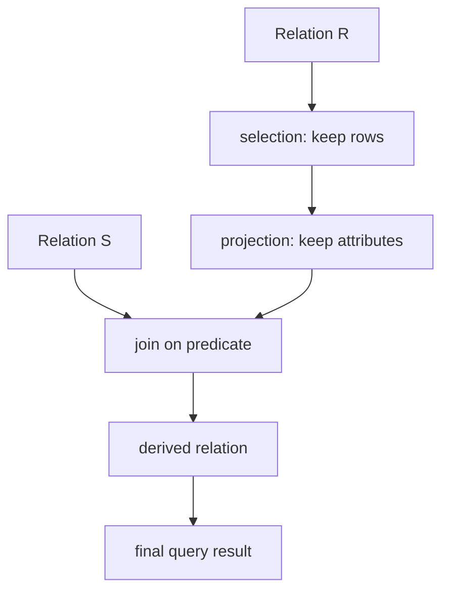

# Relational Model and Relational Algebra

The relational model is the mathematical core of most database systems. It describes data as named relations, where each relation is a set of tuples over named attributes, and it describes queries as operations that transform relations into other relations. The model matters because it separates the logical view of data from the physical details of files, indexes, caches, and disks. A user asks for a result in terms of relations and predicates; the database system chooses how to compute it.

Relational algebra is the procedural query language that gives this model its basic operators. It is not usually the language people type into production systems, but it is the language behind query rewriting, equivalence rules, join ordering, and many optimizer proofs. SQL adds bags, nulls, grouping, ordering, and many conveniences, but the first mental model for SQL should still be relation in, relation out.

## Definitions

A **relation schema** names a relation and its attributes, such as `Student(id, name, dept_name, credits)`. Each attribute has a **domain**, which is the set of legal values for that attribute. A **tuple** is one row matching the schema, and a **relation instance** is a finite set of tuples. In the pure model, tuples are unordered, attributes are referred to by name, and duplicate tuples do not occur.

A **database schema** is a collection of relation schemas plus constraints. A **database instance** is the current content of all relations. The distinction is important: the schema is the design contract; the instance changes as users insert, delete, and update data.

A **superkey** is a set of attributes that uniquely identifies tuples in a relation. A **candidate key** is a minimal superkey. A **primary key** is the candidate key chosen as the main identifier. A **foreign key** is an attribute set in one relation that refers to a candidate key in another relation, enforcing a relationship between the two relations.

Relational algebra operators include:

| Operator | Notation | Result |
| --- | --- | --- |
| Selection | `\sigma_p(R)` | Rows of `R` satisfying predicate `p` |
| Projection | `\pi_A(R)` | Columns listed in `A`, with duplicates removed in set algebra |
| Rename | `\rho_X(R)` | Same tuples with a different relation or attribute name |
| Union | `R \cup S` | Tuples in either compatible relation |
| Difference | `R - S` | Tuples in `R` but not `S` |
| Cartesian product | `R \times S` | All tuple pairs from `R` and `S` |
| Join | `R \bowtie_p S` | Tuple pairs that satisfy predicate `p` |
| Natural join | `R \bowtie S` | Equijoin on same-named attributes, with one copy kept |
| Division | `R \div S` | Values related to every tuple in `S` |

Two relations are **union-compatible** if they have the same number of attributes and corresponding domains. A join predicate is usually a comparison between attributes from different relations, such as `takes.course_id = course.course_id`.

## Key results

Relational algebra is **closed**: every operation returns a relation. Closure lets complex queries be built by nesting smaller expressions. For example, a selection can feed a projection, whose result can feed a join.

Selection and projection are the operators that reduce data early:

$$
\sigma_{p \land q}(R) = \sigma_p(\sigma_q(R))
$$

$$
\pi_A(\pi_B(R)) = \pi_A(R) \quad \text{when } A \subseteq B
$$

These identities explain why optimizers push selections below joins and remove unused columns before expensive operations. They are logical equivalences: the result is the same, but the cost may be very different.

Joins can be expressed from product and selection:

$$
R \bowtie_p S = \sigma_p(R \times S)
$$

This definition is mathematically simple but physically dangerous. A Cartesian product can be enormous, so real query processors implement joins directly with nested-loop, hash, or sort-merge algorithms.

Natural join is convenient but risky because it depends on matching attribute names. If two relations share an attribute name accidentally, the natural join adds an unintended equality condition. In precise algebra or production SQL, an explicit join condition is usually clearer.

Division is useful for "for all" queries. If `Takes(student_id, course_id)` records completed courses and `Required(course_id)` records required courses, then `Takes \div Required` returns students who took every required course. Division can be rewritten with projection, product, and difference, so it is not essential, but it is a compact way to recognize universal quantification.

A practical habit is to name intermediate relations when translating a question. Names such as `CSInstructors`, `HighSalary`, and `RequiredPairs` make the level of detail explicit and prevent accidental mixing of attributes from different stages. This habit also mirrors what optimizers do internally: a complex SQL query is represented as a tree of smaller algebraic operators before physical algorithms are chosen.

Keys should be read as universal claims, not observations from the current rows. If `ID` is a key for `Student`, the schema is saying that two legal student tuples can never share an `ID`. If the current instance merely happens to have unique names, that does not make `name` a key. This distinction matters because design, normalization, and query optimization rely on constraints that remain true after future inserts and updates.

## Visual



| Design idea | Relational-model meaning | Practical consequence |
| --- | --- | --- |
| Logical data independence | Queries mention relations, not files | Storage can change without rewriting applications |
| Keys | Tuple identity is declared by attributes | Constraints prevent duplicate logical objects |
| Closure | Operators return relations | Queries can be nested and optimized algebraically |
| Set semantics | Duplicate tuples are absent in the theory | SQL differs because it uses bags unless `DISTINCT` is requested |
| Constraints | Legal instances are restricted | The DBMS can reject invalid updates and improve plans |

## Worked example 1: Algebra for department instructors

Problem: Given `Instructor(ID, name, dept_name, salary)`, find the names and salaries of instructors in the `Comp. Sci.` department who earn more than 90000.

Method:

1. Start with the full relation:

$$
Instructor(ID, name, dept\_name, salary)
$$

2. Keep only the department of interest:

$$
R_1 = \sigma_{dept\_name = 'Comp. Sci.'}(Instructor)
$$

3. Keep only high salaries:

$$
R_2 = \sigma_{salary > 90000}(R_1)
$$

4. Project the requested attributes:

$$
R_3 = \pi_{name, salary}(R_2)
$$

5. Combine the selections using the selection law:

$$
R_3 = \pi_{name, salary}(\sigma_{dept\_name = 'Comp. Sci.' \land salary > 90000}(Instructor))
$$

Checked answer: the expression returns exactly two columns, `name` and `salary`, and it excludes every tuple that fails either condition. If two instructors have the same name and salary, pure relational algebra returns one tuple because projection removes duplicates. SQL without `DISTINCT` would return both rows.

## Worked example 2: Students who took every required course

Problem: `Takes(student_id, course_id)` records completed courses. `Required(course_id)` lists required database courses. Find students who completed all required courses.

Method:

1. Identify the universal pattern. The phrase "every required course" means: for a student `s`, there must not exist a required course `c` such that `(s, c)` is missing from `Takes`.

2. Use division directly:

$$
Answer = Takes \div Required
$$

   The result contains the `student_id` values paired with all `course_id` values in `Required`.

3. Rewrite division using primitive operators. First list all candidate students:

$$
Students = \pi_{student\_id}(Takes)
$$

4. Build every student-required-course pair:

$$
Needed = Students \times Required
$$

5. Find missing pairs:

$$
Missing = Needed - Takes
$$

6. Remove students with at least one missing requirement:

$$
Answer = Students - \pi_{student\_id}(Missing)
$$

Checked answer: if a student took all required courses, no pair for that student appears in `Missing`, so the student remains in `Answer`. If even one required course is absent, the student's id is projected from `Missing` and removed.

## Code

```sql
-- SQL version of the division-style query.
-- Return students for whom no required course is missing.
SELECT s.student_id
FROM (SELECT DISTINCT student_id FROM takes) AS s
WHERE NOT EXISTS (
  SELECT 1
  FROM required AS r
  WHERE NOT EXISTS (
    SELECT 1
    FROM takes AS t
    WHERE t.student_id = s.student_id
      AND t.course_id = r.course_id
  )
);
```

```python
def relational_division(takes, required_courses):
    """Return students whose course set covers every required course."""
    by_student = {}
    for student_id, course_id in takes:
        by_student.setdefault(student_id, set()).add(course_id)

    required = set(required_courses)
    answer = []
    for student_id, courses in sorted(by_student.items()):
        if required.issubset(courses):
            answer.append(student_id)
    return answer

print(relational_division(
    takes=[("S1", "DB"), ("S1", "OS"), ("S2", "DB")],
    required_courses=["DB", "OS"],
))
```

## Common pitfalls

- Treating a relation as an ordered table. The model does not define row order; use explicit ordering only at presentation time.
- Forgetting that projection removes duplicates in pure algebra. SQL needs `DISTINCT` to match this behavior.
- Using natural join when attribute names are not intentionally aligned. Prefer explicit join predicates when teaching or debugging.
- Confusing a key with an index. A key is a logical uniqueness constraint; an index is a physical access structure.
- Assuming foreign keys are optional documentation. If declared and enforced, they restrict legal database states.
- Translating "for all" queries as ordinary joins. Universal queries usually need division, double `NOT EXISTS`, or grouping with counts.

## Connections

- [SQL DDL, DML, and Basic Queries](/cs/databases/sql-ddl-dml-and-basic-queries)
- [SQL Joins, Subqueries, and Set Operations](/cs/databases/sql-joins-subqueries-and-set-operations)
- [Normalization and Functional Dependencies](/cs/databases/normalization-functional-dependencies)
- [Query Optimization and Cost Estimation](/cs/databases/query-optimization-and-cost-estimation)
