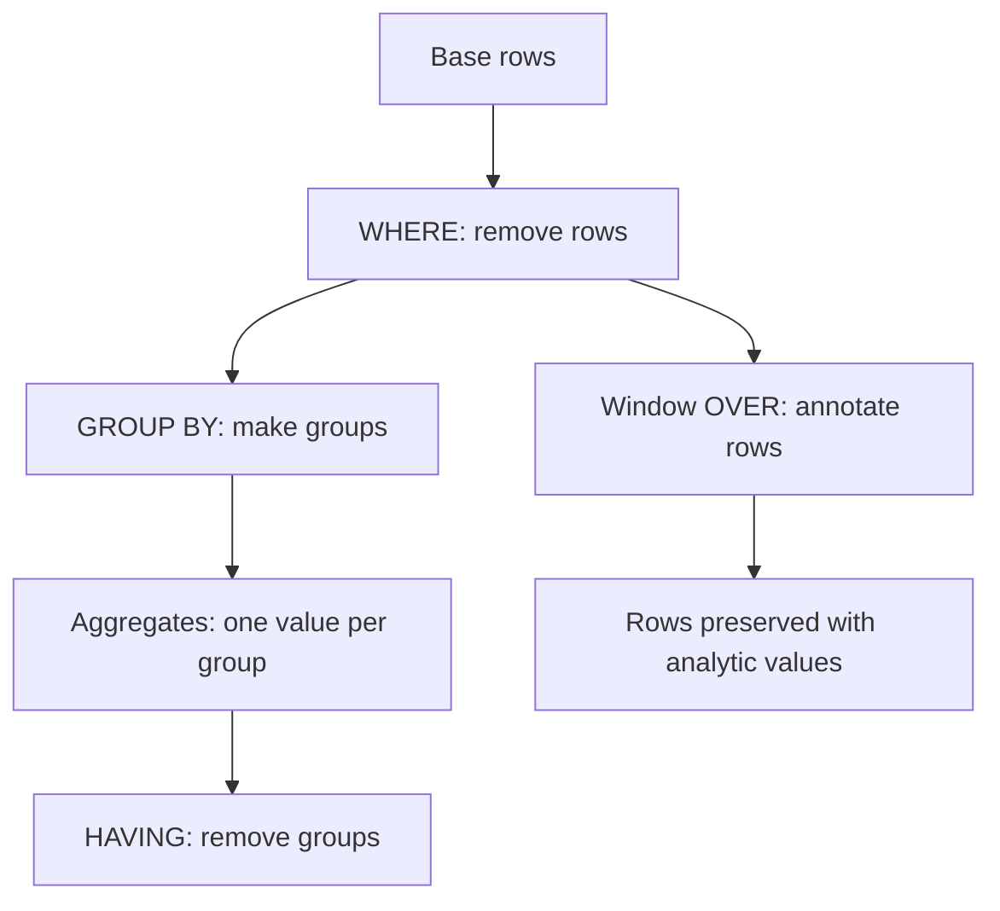

# SQL Aggregation, Views, and Window Functions

Aggregation turns many rows into summary rows. Views name useful query expressions so that users and applications can work at a higher level of abstraction. Window functions compute values across related rows while still preserving the individual rows. Together, these features move SQL beyond row filtering into reporting, analytics, and reusable logical design.


*Figure: SQL pages connect abstract relational operations to the database console used in practice. Image: [Wikimedia Commons](https://commons.wikimedia.org/wiki/File:Mysql-screenshot.PNG), Wikimedia Commons contributors, public domain text.*

These features are also where many SQL mistakes become subtle. The difference between `WHERE` and `HAVING`, between grouped rows and original rows, and between aggregate functions and window functions matters. A database system may execute these queries with sorting, hashing, temporary storage, or indexes, but the logical model should be clear before performance tuning begins.

## Definitions

An **aggregate function** maps a collection of values to one value. Common aggregates include `COUNT`, `SUM`, `AVG`, `MIN`, and `MAX`. `COUNT(*)` counts rows. `COUNT(attribute)` counts non-null attribute values. Most aggregates ignore `NULL` values; `COUNT(*)` is the major exception.

A **grouped query** partitions rows by `GROUP BY` expressions and computes one result row per group. Every selected expression must either be a grouping expression or be derived from an aggregate. `HAVING` filters groups after aggregation; `WHERE` filters rows before aggregation.

A **view** is a named query. A standard view is virtual: the DBMS stores its definition and expands it into queries that reference it. A **materialized view** stores the query result and must be refreshed when base data changes. Views can provide logical abstraction, security boundaries, or compatibility during schema evolution.

A **window function** computes a value over a window of rows related to the current row. It uses `OVER (...)`, usually with `PARTITION BY`, `ORDER BY`, and a frame. Unlike `GROUP BY`, a window function does not collapse rows. Examples include `ROW_NUMBER`, `RANK`, `DENSE_RANK`, running sums, and moving averages.

## Key results

Grouping changes the level of detail. Before grouping, each row might represent one student, one section, or one enrollment. After grouping by `dept_name`, each row represents a department. Selecting a non-grouped attribute such as `student.name` from a department-level query is undefined in the relational sense because there may be many names per department.

The logical order matters:

$$
\text{FROM} \rightarrow \text{WHERE} \rightarrow \text{GROUP BY} \rightarrow \text{HAVING} \rightarrow \text{SELECT} \rightarrow \text{ORDER BY}
$$

This order explains why aggregate conditions such as `COUNT(*) >= 5` belong in `HAVING`, while row predicates such as `dept_name = 'Comp. Sci.'` belong in `WHERE`.

Views support data independence. If a base schema changes, a view can preserve an older logical interface for applications. However, not every view is updatable. A view with grouping, aggregation, `DISTINCT`, set operations, or joins may not map one output row back to one base row in an unambiguous way.

Window functions solve questions that are awkward with plain grouping: top-N per group, running totals, percentiles, gaps between consecutive events, and comparisons against group averages while retaining each row.

Aggregate queries should always be checked for their grain. The grain is the meaning of one output row. In `GROUP BY dept_name`, one row means one department. In `GROUP BY dept_name, semester, year`, one row means one department in one term. Most mistakes in reporting SQL come from selecting or joining data at the wrong grain, which can double-count facts or attach a detail attribute to a summary row where it has no single value.

Views can also encode a grain. A view named `department_enrollment` should return one row per department, not a mixture of department rows and student rows. When a view is used as an API for application code, changing its grain is a breaking change even if the SQL type checker accepts the new definition. Materialized views add another concern: refresh timing. A dashboard may tolerate data that is five minutes old, while a seat-reservation workflow cannot.

Window frames deserve special attention. `ORDER BY` inside `OVER` defines an order for the analytic calculation, but the frame determines which neighboring rows are included. A running total usually uses rows from the beginning of the partition through the current row. A moving average may use a fixed number of preceding rows. If the frame is omitted, the DBMS default may not match the intended calculation, especially when duplicate ordering values create peer groups.

`DISTINCT` inside aggregates changes the question. `COUNT(course_id)` counts non-null course appearances, while `COUNT(DISTINCT course_id)` counts different courses. The latter often requires sorting or hashing per group and can be much more expensive. It is also semantically different: counting enrollments and counting courses are both valid, but they answer different questions. Reports should name measures clearly enough that the aggregate matches the business meaning.

Grouping after a join must be checked for accidental multiplication. If a department row joins to instructors and courses at the same time, the result may contain every instructor-course pair before aggregation. Separate pre-aggregations or distinct counts may be needed so the final numbers match the intended facts.

## Visual



| Feature | Collapses rows? | Typical use | Example |
| --- | --- | --- | --- |
| Aggregate without `GROUP BY` | yes, to one row | whole-table summary | total enrollment |
| Aggregate with `GROUP BY` | yes, to one row per group | departmental summary | average salary by department |
| View | no fixed rule | named abstraction | `active_students` |
| Window function | no | row-level analytics | rank within department |
| Materialized view | stores result | fast repeated summaries | daily dashboard table |

## Worked example 1: Department salary report

Problem: For each department with at least three instructors, return the department name, number of instructors, and average salary. Only consider instructors with non-null salaries.

Method:

1. Start from `instructor`:

   ```sql
   FROM instructor
   ```

2. Remove rows where the salary is unknown:

   ```sql
   WHERE salary IS NOT NULL
   ```

3. Group by department:

   ```sql
   GROUP BY dept_name
   ```

4. Compute group aggregates:

   ```sql
   COUNT(*) AS instructor_count,
   AVG(salary) AS avg_salary
   ```

5. Keep only groups with at least three rows:

   ```sql
   HAVING COUNT(*) >= 3
   ```

6. Combine:

   ```sql
   SELECT dept_name,
          COUNT(*) AS instructor_count,
          AVG(salary) AS avg_salary
   FROM instructor
   WHERE salary IS NOT NULL
   GROUP BY dept_name
   HAVING COUNT(*) >= 3
   ORDER BY avg_salary DESC;
   ```

Checked answer: `WHERE` removes individual instructors with unknown salaries before the groups are formed. `HAVING` removes departments whose remaining instructor count is below three. The selected columns are legal because `dept_name` is the grouping column and the other two expressions are aggregates.

## Worked example 2: Top two students per department

Problem: Return the two highest-credit students in each department, preserving ties by deterministic name order.

Method:

1. Window functions are appropriate because we need student rows, not one row per department.

2. Partition by department:

   ```sql
   PARTITION BY dept_name
   ```

3. Order each partition from highest to lowest credits, then by name and ID for deterministic ranking:

   ```sql
   ORDER BY tot_cred DESC, name ASC, ID ASC
   ```

4. Assign row numbers:

   ```sql
   ROW_NUMBER() OVER (...) AS rn
   ```

5. Filter the ranked result in an outer query, because many SQL systems do not allow the window alias in `WHERE` at the same level:

   ```sql
   SELECT ID, name, dept_name, tot_cred
   FROM (
     SELECT s.*,
            ROW_NUMBER() OVER (
              PARTITION BY dept_name
              ORDER BY tot_cred DESC, name ASC, ID ASC
            ) AS rn
     FROM student AS s
   ) AS ranked
   WHERE rn <= 2
   ORDER BY dept_name, rn;
   ```

Checked answer: each department has its own numbering sequence. The outer query keeps numbers 1 and 2 from every partition. Rows are not collapsed, so the result still contains individual student IDs and names.

## Code

```sql
CREATE VIEW department_enrollment AS
SELECT s.dept_name,
       COUNT(*) AS student_count,
       AVG(s.tot_cred) AS avg_credits
FROM student AS s
GROUP BY s.dept_name;

SELECT dept_name,
       student_count,
       avg_credits,
       RANK() OVER (ORDER BY student_count DESC) AS size_rank
FROM department_enrollment
WHERE student_count > 0
ORDER BY size_rank, dept_name;
```

```python
from collections import defaultdict

students = [
    {"id": "1", "dept": "CS", "credits": 100},
    {"id": "2", "dept": "CS", "credits": 80},
    {"id": "3", "dept": "Math", "credits": 95},
]

groups = defaultdict(list)
for student in students:
    groups[student["dept"]].append(student["credits"])

for dept, credits in sorted(groups.items()):
    print(dept, len(credits), sum(credits) / len(credits))
```

## Common pitfalls

- Using `WHERE COUNT(*) > 1`. Aggregate filters belong in `HAVING`.
- Selecting a column that is neither grouped nor aggregated. The result has no single well-defined value for that column.
- Confusing `COUNT(*)` with `COUNT(column)`. The latter ignores `NULL`.
- Expecting a normal view to store data. A regular view stores the query definition, not a separate copy of the rows.
- Filtering on a window-function alias in the same query block. Use a subquery or common table expression.
- Forgetting deterministic tie-breakers in ranking queries. Without them, the top-N result may be unstable among equal values.

## Connections

- [SQL DDL, DML, and Basic Queries](/cs/databases/sql-ddl-dml-and-basic-queries)
- [SQL Joins, Subqueries, and Set Operations](/cs/databases/sql-joins-subqueries-and-set-operations)
- [Query Processing and Join Algorithms](/cs/databases/query-processing-join-algorithms)
- [Application Architecture and Security](/cs/databases/application-architecture-and-security)
