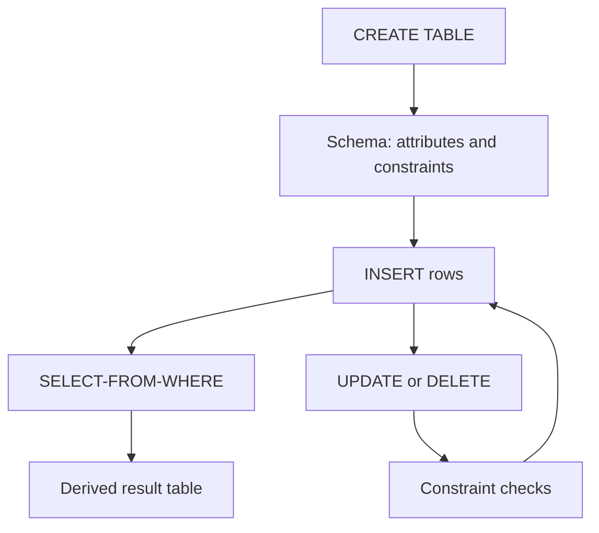

# SQL DDL, DML, and Basic Queries

SQL is the standard practical language for relational databases. It is both a data-definition language, because it declares schemas and constraints, and a data-manipulation language, because it inserts, changes, deletes, and queries data. The important shift from relational algebra is that SQL is declarative: a query says what result is wanted, not which physical algorithm should produce it.

Basic SQL is enough to express many useful questions: create tables, declare primary and foreign keys, filter rows, project columns, sort results, and update stored facts. The deeper topics of joins, grouping, views, recursion, and transactions build on these same ideas. A good SQL query is not only syntactically valid; it also states its assumptions about keys, missing values, and duplicate rows clearly.

## Definitions

**Data Definition Language (DDL)** statements define database objects. Common DDL statements include `CREATE TABLE`, `ALTER TABLE`, `DROP TABLE`, `CREATE INDEX`, and `CREATE VIEW`. The most important DDL object for the relational model is a table declaration with attribute names, data types, and constraints.

**Data Manipulation Language (DML)** statements read or modify table contents. `SELECT` reads data, `INSERT` adds rows, `UPDATE` changes rows, and `DELETE` removes rows. A DBMS executes these statements inside transactions, even when the user does not explicitly write `BEGIN` and `COMMIT`.

A **base table** is physically stored by the database system. A **derived table** is produced by a query. A **constraint** restricts legal table contents. Important constraints include:

| Constraint | Example | Meaning |
| --- | --- | --- |
| `PRIMARY KEY` | `PRIMARY KEY (ID)` | `ID` is unique and not null |
| `UNIQUE` | `UNIQUE (email)` | no two rows share a non-null email value |
| `NOT NULL` | `name varchar(40) NOT NULL` | every row must have a name |
| `CHECK` | `CHECK (credits >= 0)` | row-level predicate must be true |
| `FOREIGN KEY` | `FOREIGN KEY (dept_name) REFERENCES department` | referenced row must exist |

The basic `SELECT` form is:

```sql
SELECT select_list
FROM table_reference
WHERE row_predicate
ORDER BY sort_expression;
```

SQL uses **bag semantics** by default: duplicate result rows are preserved unless `DISTINCT` is requested. This differs from pure relational algebra. SQL also has a special marker, `NULL`, for unknown or inapplicable values. Comparisons involving `NULL` use three-valued logic: true, false, and unknown.

## Key results

The logical order of a simple SQL query is not the same as the written order. Conceptually, the database forms the `FROM` source, applies `WHERE`, groups if needed, filters groups with `HAVING`, computes the `SELECT` list, removes duplicates if `DISTINCT` appears, and then orders with `ORDER BY`. Physical execution may be radically different, but the result must match that logical meaning.

Primary keys and foreign keys are part of the schema's semantics, not afterthoughts. A primary key prevents duplicate logical entities; a foreign key prevents dangling references. A schema with keys gives the optimizer information too. For example, joining a child table to a parent table on a declared foreign key cannot multiply child rows beyond one parent match.

SQL's three-valued logic changes filtering. In a `WHERE` clause, only rows whose predicate evaluates to true are kept. False and unknown are both rejected. Therefore `WHERE salary <> 90000` does not keep rows where `salary` is `NULL`; those rows require `salary IS NULL` or a deliberate `COALESCE`.

Data modifications are set-oriented. An `UPDATE` statement can change thousands of rows, and a missing `WHERE` clause can update an entire table. Constraints are checked as part of the statement or transaction, depending on the DBMS and constraint mode.

DDL and DML should be designed together. A query that assumes every student has a department is safer and easier to optimize when the schema declares `dept_name NOT NULL` and a foreign key to `department`. Without those declarations, every application must defensively handle orphaned rows, and the optimizer loses useful information about join cardinality. Good schemas make illegal states unrepresentable or at least reject them at the boundary.

The `DELETE` statement deserves the same care as `UPDATE`. Deleting a parent row can violate foreign keys if child rows still reference it. SQL systems may reject the delete, cascade it, set child references to null, or apply another declared action. The right choice is a design decision: cascading course deletion might be dangerous if enrollment history must be retained, while cascading deletion of short-lived session rows may be exactly what the application needs.

Type choices are also semantic choices. Storing money in a floating-point column can introduce rounding behavior that is unacceptable for accounting; fixed-precision numeric types are usually more appropriate. Storing dates as strings makes ordering, validation, and date arithmetic unreliable. Choosing a wide text column for every attribute may make early loading convenient, but it pushes validation bugs into queries and application code. A schema should encode as many stable facts about the data as the DBMS can enforce.

## Visual



| SQL clause | Logical role | Common beginner mistake |
| --- | --- | --- |
| `SELECT` | choose output expressions | assuming aliases are visible everywhere |
| `FROM` | identify input tables | forgetting table aliases in multi-table queries |
| `WHERE` | filter individual rows | using aggregate conditions here |
| `GROUP BY` | form groups | selecting non-grouped columns without aggregation |
| `HAVING` | filter groups | using it for simple row predicates |
| `ORDER BY` | presentation order | assuming stored table order is meaningful |

## Worked example 1: Build a small university schema

Problem: Create tables for departments and students. Each student belongs to an existing department, has a nonnegative credit count, and is identified by `ID`.

Method:

1. Define the parent table first, because the child table will reference it:

   ```sql
   CREATE TABLE department (
     dept_name varchar(30) PRIMARY KEY,
     building varchar(30),
     budget numeric(12, 2) CHECK (budget >= 0)
   );
   ```

2. Define the child table with a primary key and foreign key:

   ```sql
   CREATE TABLE student (
     ID varchar(10) PRIMARY KEY,
     name varchar(40) NOT NULL,
     dept_name varchar(30) NOT NULL,
     tot_cred integer NOT NULL CHECK (tot_cred >= 0),
     FOREIGN KEY (dept_name) REFERENCES department(dept_name)
   );
   ```

3. Insert a department before inserting a student:

   ```sql
   INSERT INTO department(dept_name, building, budget)
   VALUES ('Comp. Sci.', 'Taylor', 1200000.00);

   INSERT INTO student(ID, name, dept_name, tot_cred)
   VALUES ('00128', 'Zhang', 'Comp. Sci.', 102);
   ```

4. Check the constraints. The department row is legal because the budget is nonnegative and `dept_name` is unique. The student row is legal because `ID` is unique, `name` is not null, credits are nonnegative, and `Comp. Sci.` exists in `department`.

Checked answer: the schema prevents two students with `ID = '00128'`, prevents negative total credits, and prevents a student from referencing a department not present in the `department` table.

## Worked example 2: Filter, project, and sort students

Problem: Return the names and credit counts of computer-science students with at least 90 credits, sorted from most credits to least.

Method:

1. Start with the relation:

   ```sql
   FROM student
   ```

2. Keep only the rows for the department and credit threshold:

   ```sql
   WHERE dept_name = 'Comp. Sci.' AND tot_cred >= 90
   ```

3. Select only the requested output columns:

   ```sql
   SELECT name, tot_cred
   ```

4. Add a deterministic presentation order:

   ```sql
   ORDER BY tot_cred DESC, name ASC
   ```

5. Combine the clauses:

   ```sql
   SELECT name, tot_cred
   FROM student
   WHERE dept_name = 'Comp. Sci.'
     AND tot_cred >= 90
   ORDER BY tot_cred DESC, name ASC;
   ```

Checked answer: the `WHERE` clause removes non-CS students and students below 90 credits before output is formed. The `ORDER BY` clause does not change the relation's stored state; it only orders the query result.

## Code

```sql
CREATE TABLE course (
  course_id varchar(12) PRIMARY KEY,
  title varchar(80) NOT NULL,
  dept_name varchar(30) NOT NULL,
  credits integer NOT NULL CHECK (credits BETWEEN 1 AND 5),
  FOREIGN KEY (dept_name) REFERENCES department(dept_name)
);

INSERT INTO course(course_id, title, dept_name, credits)
VALUES
  ('CS-101', 'Intro. to Computer Science', 'Comp. Sci.', 4),
  ('CS-347', 'Database System Concepts', 'Comp. Sci.', 3);

UPDATE course
SET credits = 4
WHERE course_id = 'CS-347';

SELECT course_id, title, credits
FROM course
WHERE dept_name = 'Comp. Sci.'
ORDER BY course_id;
```

## Common pitfalls

- Writing `SELECT *` in durable application code. It couples the caller to every column and can break when the schema evolves.
- Forgetting `WHERE` in `UPDATE` or `DELETE`. Always preview the target rows with a `SELECT` first when working interactively.
- Assuming `NULL = NULL` is true. Use `IS NULL` and `IS NOT NULL`.
- Treating `CHECK` constraints as documentation only. A good DBMS enforces them and rejects invalid rows.
- Depending on output order without `ORDER BY`. SQL results are unordered unless an ordering is requested.
- Expecting primary keys and indexes to be the same concept. A DBMS often creates an index for a primary key, but the logical constraint is separate from the physical structure.

## Connections

- [Relational Model and Relational Algebra](/cs/databases/relational-model-and-algebra)
- [SQL Joins, Subqueries, and Set Operations](/cs/databases/sql-joins-subqueries-and-set-operations)
- [SQL Aggregation, Views, and Window Functions](/cs/databases/sql-aggregation-views-and-window-functions)
- [Application Architecture and Security](/cs/databases/application-architecture-and-security)
