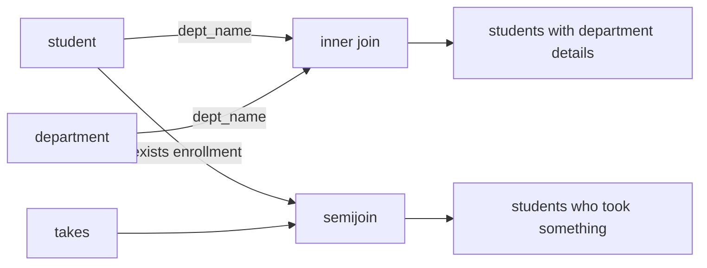

# SQL Joins, Subqueries, and Set Operations

The power of SQL appears when a query combines multiple relations. A database is deliberately split into tables so that facts are stored once, constraints are meaningful, and updates do not create contradictory copies. Joins put those facts back together for a particular question. Subqueries let one query depend on another, and set operations combine complete query results.

This page sits between basic SQL and query optimization. A correct join predicate is a logical statement about the database design, but the DBMS may evaluate it with many physical algorithms. The same result can be expressed as an explicit join, a semijoin-style `EXISTS`, a set operation, or an aggregation query. Choosing the clearest expression helps both people and optimizers.

## Definitions

An **inner join** returns matching row combinations. In SQL:

```sql
FROM instructor AS i
JOIN department AS d
  ON i.dept_name = d.dept_name
```

An **outer join** preserves unmatched rows from one or both sides. A left outer join keeps every row from the left table and fills right-side attributes with `NULL` when there is no match. A right outer join and full outer join behave analogously.

A **semijoin** returns rows from one side that have a match on the other side. SQL expresses semijoins naturally with `EXISTS` or `IN`, not by returning columns from both tables. An **antijoin** returns rows from one side that do not have a match, often expressed with `NOT EXISTS`.

A **subquery** is a query nested inside another query. It is **uncorrelated** if it can be evaluated independently. It is **correlated** if it refers to attributes from the outer query. Correlated subqueries are common for `EXISTS`, `NOT EXISTS`, and comparisons against related rows.

Set operations combine compatible query results:

| Operation | SQL form | Duplicate behavior |
| --- | --- | --- |
| Union | `q1 UNION q2` | removes duplicates |
| Union all | `q1 UNION ALL q2` | preserves duplicates |
| Intersect | `q1 INTERSECT q2` | removes duplicates |
| Except | `q1 EXCEPT q2` | removes duplicates |

Compatibility means the two query results have the same number of columns with compatible data types.

## Key results

Join predicates must match the intended relationship, not just columns with similar names. Joining `student.dept_name` to `department.dept_name` is meaningful because the schema says a student belongs to a department. Joining `student.name` to `instructor.name` may be syntactically valid but is not a declared relationship and may produce accidental matches.

Outer joins are not just inner joins plus extra rows; they interact carefully with `WHERE`. A condition on the preserved table can go in `WHERE`. A condition on the nullable side may accidentally remove the `NULL`-extended rows and turn the query back into an inner join. Conditions that define the match usually belong in `ON`.

`EXISTS` is often the clearest expression for "there is at least one related row." `NOT EXISTS` is the safest expression for "there is no related row," especially when nullable values are involved. `NOT IN` can behave unexpectedly if the subquery returns `NULL`, because comparisons become unknown.

Set operations are relations over complete rows. They are not replacements for joins. A join combines columns horizontally; a union stacks compatible rows vertically. A common design error is trying to use `UNION` to attach attributes that should be joined by a key.

Correlated subqueries should be read as parameterized tests. For each row of the outer query, the inner query is evaluated logically with that row's values substituted. The optimizer may decorrelate the subquery into a join, semijoin, or antijoin, but the written form remains useful because it states existence or nonexistence directly. This is especially clear for "students who have taken a CS course" and "courses that no student has taken."

Outer joins are most useful when absence is meaningful. A department with no instructors, a course with no offerings, or a student with no advisor may still need to appear in a report. The nullable side of the result is not an error; it is the representation of missing matching rows. Filtering those `NULL` values accidentally is one of the most common ways to destroy the intended outer-join behavior.

Self-joins are another important pattern. A relation can be joined to itself by giving it two aliases, such as comparing an instructor to another instructor in the same department or finding prerequisite chains between courses. The aliases represent two logical roles for the same base table. Without aliases, attribute references become ambiguous and the query no longer clearly states which role each row is playing.

Join output size can be surprising when the join attributes are not keys. If five students share one advisor and the advisor row is unique, the join returns five rows. If both sides have duplicates on the join key, the output contains every matching pair. This multiplication is correct relational behavior, but it often reveals that the query needs a key, an aggregation, or a duplicate-removal step.

## Visual



| Query intent | Preferred SQL pattern | Why |
| --- | --- | --- |
| Need columns from both tables | `JOIN ... ON ...` | returns combined tuples |
| Need left rows with or without matches | `LEFT JOIN ... ON ...` | preserves unmatched left rows |
| Need left rows that have a match | `WHERE EXISTS (...)` | expresses a semijoin |
| Need left rows with no match | `WHERE NOT EXISTS (...)` | avoids nullable `NOT IN` traps |
| Combine two same-shaped result sets | `UNION` or `UNION ALL` | vertical composition |

## Worked example 1: Join students to their departments

Problem: Return each student's name, department building, and department budget for students in departments with budgets above 900000.

Method:

1. Identify the relationship. `student.dept_name` references `department.dept_name`, so the join condition is:

   ```sql
   s.dept_name = d.dept_name
   ```

2. Decide which rows to keep. The budget filter applies to the department row:

   ```sql
   d.budget > 900000
   ```

3. Select the requested columns:

   ```sql
   s.name, d.building, d.budget
   ```

4. Write the query with aliases:

   ```sql
   SELECT s.name, d.building, d.budget
   FROM student AS s
   JOIN department AS d
     ON s.dept_name = d.dept_name
   WHERE d.budget > 900000
   ORDER BY s.name;
   ```

5. Check cardinality. If every student references one department and `department.dept_name` is a key, each student can match at most one department. Therefore the join cannot multiply a student into several department rows.

Checked answer: the query includes only students whose department exists and has a large enough budget. A student with an invalid department cannot exist if the foreign key is enforced. A department with no students does not appear because this is an inner join from student to department.

## Worked example 2: Courses never taken

Problem: Find courses that have never appeared in `takes(course_id, ID, sec_id, semester, year, grade)`.

Method:

1. Interpret "never taken" as an antijoin. We need course rows for which no matching `takes` row exists.

2. Write the outer query over `course`:

   ```sql
   SELECT c.course_id, c.title
   FROM course AS c
   ```

3. Add a correlated `NOT EXISTS` subquery:

   ```sql
   WHERE NOT EXISTS (
     SELECT 1
     FROM takes AS t
     WHERE t.course_id = c.course_id
   )
   ```

4. Combine and order:

   ```sql
   SELECT c.course_id, c.title
   FROM course AS c
   WHERE NOT EXISTS (
     SELECT 1
     FROM takes AS t
     WHERE t.course_id = c.course_id
   )
   ORDER BY c.course_id;
   ```

5. Check against an outer-join alternative:

   ```sql
   SELECT c.course_id, c.title
   FROM course AS c
   LEFT JOIN takes AS t
     ON t.course_id = c.course_id
   WHERE t.course_id IS NULL;
   ```

Checked answer: both forms return courses with no enrollment records. The `NOT EXISTS` form states the logic directly and is robust even if unrelated nullable columns exist in `takes`.

## Code

```sql
-- Students who took at least one Comp. Sci. course but no Biology course.
SELECT DISTINCT s.ID, s.name
FROM student AS s
WHERE EXISTS (
  SELECT 1
  FROM takes AS t
  JOIN course AS c
    ON c.course_id = t.course_id
  WHERE t.ID = s.ID
    AND c.dept_name = 'Comp. Sci.'
)
AND NOT EXISTS (
  SELECT 1
  FROM takes AS t
  JOIN course AS c
    ON c.course_id = t.course_id
  WHERE t.ID = s.ID
    AND c.dept_name = 'Biology'
)
ORDER BY s.ID;
```

```python
def antijoin(left_rows, right_keys, left_key):
    """Return left rows whose key is absent from right_keys."""
    right = set(right_keys)
    result = []
    for row in left_rows:
        if left_key(row) not in right:
            result.append(row)
    return result

courses = [
    {"course_id": "CS-101", "title": "Intro"},
    {"course_id": "CS-347", "title": "Databases"},
]
taken_course_ids = {"CS-101"}
print(antijoin(courses, taken_course_ids, lambda row: row["course_id"]))
```

## Common pitfalls

- Omitting a join predicate and accidentally writing a Cartesian product.
- Putting right-side filters for a left join in `WHERE` when the intent was to preserve unmatched rows.
- Using `NOT IN` with a nullable subquery result. Prefer `NOT EXISTS` unless null behavior is fully understood.
- Expecting `UNION` to preserve duplicates. Use `UNION ALL` when multiplicity matters.
- Joining on display names instead of stable keys. Names can be duplicated or changed.
- Selecting columns with the same name without aliases, making result interpretation ambiguous.

## Connections

- [SQL DDL, DML, and Basic Queries](/cs/databases/sql-ddl-dml-and-basic-queries)
- [SQL Aggregation, Views, and Window Functions](/cs/databases/sql-aggregation-views-and-window-functions)
- [Query Processing and Join Algorithms](/cs/databases/query-processing-join-algorithms)
- [Query Optimization and Cost Estimation](/cs/databases/query-optimization-and-cost-estimation)
