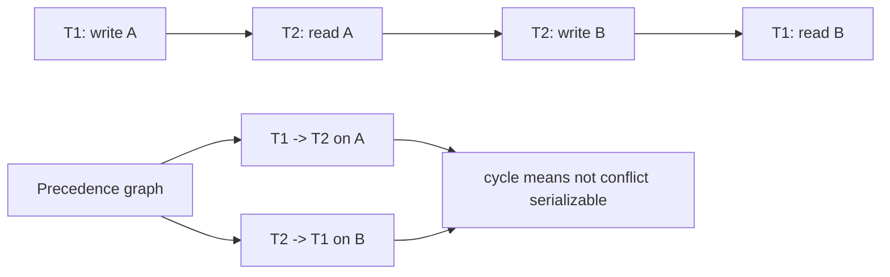

# Transactions, ACID, and Serializability

A transaction is a unit of database work that must behave as if it either happened completely or did not happen at all. Transactions let applications compose reads and writes into meaningful operations: transfer money, enroll in a course, reserve a seat, or post an order. Without transactions, failures and concurrent users can leave the database in states that no application rule accepts.


*Figure: A database system is experienced through schemas, queries, connections, and administration tools. Image: [Wikimedia Commons](https://commons.wikimedia.org/wiki/File:PgAdminScreenshot.png), Boshomi, CC BY-SA 3.0.*

Transaction theory separates correctness from implementation. ACID names the properties users expect. Serializability gives a formal correctness criterion for interleavings of concurrent transactions. Later topics, such as locking, timestamp ordering, MVCC, and recovery, are implementation techniques for approximating or enforcing these properties efficiently.

## Definitions

A **transaction** is a sequence of read and write operations followed by commit or abort. `COMMIT` makes the transaction's effects durable. `ROLLBACK` or abort discards its effects.

ACID properties:

| Property | Meaning |
| --- | --- |
| Atomicity | all writes of a transaction take effect, or none do |
| Consistency | a transaction preserves database constraints when run alone from a valid state |
| Isolation | concurrent transactions do not interfere in ways the isolation level forbids |
| Durability | committed effects survive failures |

A **schedule** is an ordering of operations from multiple transactions. A **serial schedule** runs transactions one at a time with no interleaving. A **serializable schedule** is an interleaved schedule equivalent to some serial schedule.

Two operations **conflict** if they are from different transactions, access the same data item, and at least one is a write. A schedule is **conflict serializable** if it can be transformed into a serial schedule by swapping adjacent nonconflicting operations.

A **precedence graph** has one node per transaction. Add an edge `Ti -> Tj` if an operation of `Ti` conflicts with a later operation of `Tj` on the same item. A schedule is conflict serializable exactly when its precedence graph is acyclic.

## Key results

Conflict serializability is efficiently testable. Build the precedence graph and check for cycles. If no cycle exists, any topological ordering gives an equivalent serial order. If a cycle exists, the schedule is not conflict serializable.

Not all serializable schedules are conflict serializable. View serializability is more general but harder to test and less commonly used for practical concurrency-control protocols. Conflict serializability is conservative and operationally useful.

Recoverability is different from serializability. A schedule is **recoverable** if a transaction commits only after any transaction whose data it read has committed. A schedule can be conflict serializable but not recoverable if it allows a transaction to commit after reading data from a transaction that later aborts.

Strict schedules avoid cascading aborts by not allowing a transaction to read or write an item written by another uncommitted transaction. Strictness is important for recovery because undoing an aborted transaction does not require undoing committed transactions that read dirty data.

SQL isolation levels are practical contracts. `SERIALIZABLE` aims to prevent anomalies equivalent to nonserial execution. Weaker levels such as read committed or repeatable read allow more concurrency but may permit anomalies depending on the DBMS.

Consistency in ACID is sometimes misunderstood. The DBMS can enforce declared constraints such as keys, checks, and foreign keys. It cannot automatically know every business rule unless that rule is expressed through constraints, triggers, procedures, or transaction logic. A transaction is consistency-preserving only if the program is correct and the database has enough constraints and isolation to reject unsafe interleavings.

Serializability is a correctness criterion for committed effects, not a promise that transactions actually ran one at a time. Interleaving is allowed when the final outcome and read relationships match some serial order. This distinction is what makes concurrency useful: the system can overlap I/O and CPU work while preserving a result that users can reason about as if one transaction came before another.

The serial order may not match wall-clock order unless the system promises strict serializability or external consistency. Basic conflict serializability can produce an equivalent serial order that is different from real-time completion order. For many single-database applications this is acceptable, but distributed systems and user-facing workflows sometimes need stronger real-time guarantees.

Isolation anomalies are easiest to understand by identifying the invariant at risk. A dirty read threatens decisions based on data that may never commit. A lost update threatens a read-modify-write calculation. A phantom threatens a predicate such as "no section has more than 30 students." Write skew threatens cross-row constraints such as "at least one doctor is on call." The right isolation mechanism depends on which invariant must be protected.

Application retry logic belongs in transaction design. If the DBMS aborts a transaction to resolve a deadlock or serialization conflict, the application should be able to retry the whole unit of work. Retrying only the failed SQL statement may be incorrect because earlier reads influenced later writes. The transaction boundary is therefore also the retry boundary.

Read-only transactions still need isolation definitions. A report that reads account balances from several tables can be inconsistent if it sees some values before a transfer and others after the transfer. Snapshot or serializable isolation can give the report a coherent cut of the database. This is why isolation is not only a write-write problem; read consistency matters whenever multiple facts must agree.

Durability also has layers. A DBMS may report commit after a log flush, but storage controllers, filesystems, and replication settings influence when bytes are truly safe against different failures. Production durability requires matching DBMS settings with the storage guarantees underneath.

## Visual



| Anomaly | Informal description | Prevented by strong serializable execution |
| --- | --- | --- |
| Dirty read | read uncommitted data | yes |
| Nonrepeatable read | reread same row and see changed value | yes |
| Phantom | rerun predicate and see new matching rows | yes |
| Lost update | concurrent writes overwrite one another | yes |
| Write skew | transactions read overlapping data then write disjoint data | yes |

## Worked example 1: Test conflict serializability

Problem: Schedule `S` has operations:

```text
r1(A), w1(A), r2(A), w2(B), r1(B), c1, c2
```

Build the precedence graph and decide whether `S` is conflict serializable.

Method:

1. Compare operations on `A`:

   - `w1(A)` occurs before `r2(A)`.
   - They are from different transactions and one is a write.
   - Add edge `T1 -> T2`.

2. Compare operations on `B`:

   - `w2(B)` occurs before `r1(B)`.
   - They conflict.
   - Add edge `T2 -> T1`.

3. The graph has edges:

   ```text
   T1 -> T2
   T2 -> T1
   ```

4. This is a cycle.

Checked answer: the schedule is not conflict serializable. The conflict on `A` requires `T1` before `T2`, while the conflict on `B` requires `T2` before `T1`, and both cannot hold in a serial order.

## Worked example 2: Money transfer with atomicity

Problem: Transfer 100 from account A to account B. Initial balances are A = 500 and B = 300. Show why atomicity matters if a crash occurs after debiting A but before crediting B.

Method:

1. The transaction logic is:

   ```text
   read A
   A := A - 100
   write A
   read B
   B := B + 100
   write B
   commit
   ```

2. If all operations complete:

$$
A = 500 - 100 = 400
$$

$$
B = 300 + 100 = 400
$$

   Total remains 800.

3. Suppose the system crashes after `write A` but before `write B`. The database might show A = 400 and B = 300, total 700, if no recovery exists.

4. Atomicity requires the system to undo A's debit unless the transaction commits. After rollback:

$$
A = 500,\quad B = 300
$$

5. If the transaction had committed before the crash, durability would require both effects to appear after restart:

$$
A = 400,\quad B = 400
$$

Checked answer: atomicity prevents the partial-transfer state A = 400, B = 300 from surviving as a committed database state.

## Code

```sql
BEGIN;

UPDATE account
SET balance = balance - 100
WHERE account_id = 'A';

UPDATE account
SET balance = balance + 100
WHERE account_id = 'B';

COMMIT;
```

```python
def precedence_edges(schedule):
    edges = set()
    for i, op1 in enumerate(schedule):
        tx1, kind1, item1 = op1
        for tx2, kind2, item2 in schedule[i + 1:]:
            if tx1 != tx2 and item1 == item2 and "w" in (kind1, kind2):
                edges.add((tx1, tx2))
    return edges

schedule = [
    ("T1", "r", "A"),
    ("T1", "w", "A"),
    ("T2", "r", "A"),
    ("T2", "w", "B"),
    ("T1", "r", "B"),
]
print(precedence_edges(schedule))
```

## Common pitfalls

- Equating isolation with serializability for every SQL isolation level. Many systems provide weaker levels by default.
- Checking only final values and ignoring whether a schedule is serializable for all possible values.
- Forgetting recoverability. A serializable-looking schedule can still commit after reading dirty data.
- Assuming application code alone can enforce consistency under concurrency. The database isolation level matters.
- Treating `COMMIT` as only a logical marker. It also interacts with logging and durability.
- Ignoring predicate reads, which are needed to understand phantom anomalies.

## Connections

- [Concurrency Control with Locks, Deadlocks, and Timestamps](/cs/databases/concurrency-control-locks-deadlocks-timestamps)
- [MVCC and Snapshot Isolation](/cs/databases/mvcc-and-snapshot-isolation)
- [Recovery with WAL, ARIES, and Checkpoints](/cs/databases/recovery-wal-aries-checkpoints)
- [SQL DDL, DML, and Basic Queries](/cs/databases/sql-ddl-dml-and-basic-queries)
