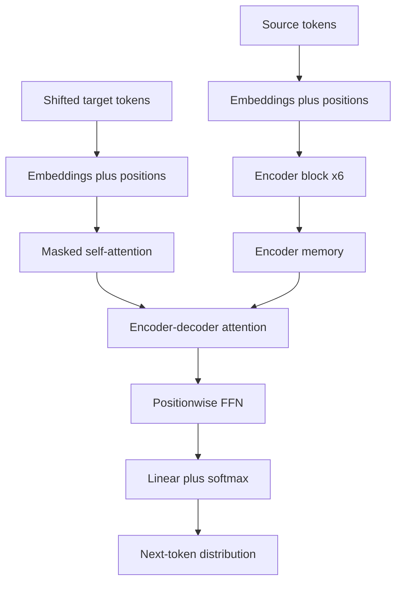

# Attention Is All You Need (Vaswani et al., 2017)

Vaswani, Shazeer, Parmar, Uszkoreit, Jones, Gomez, Kaiser, and Polosukhin's "Attention Is All You Need" introduced the Transformer, a sequence transduction architecture built from attention, feed-forward layers, residual connections, normalization, and positional encodings rather than recurrence or convolution. The paper matters because it converted sequence modeling from a mostly sequential computation into a highly parallel one, while also giving each token a direct route to every other token in the same context.

In this sequence of paper pages, the Transformer is the reference architecture. ViT applies its encoder to image patches, while Hyena, RWKV, Mamba, Griffin, and Jamba ask which parts of full attention can be replaced, approximated, or hybridized when sequence length and inference memory become the bottleneck.

## Definitions

**Problem and motivation.** Before the Transformer, strong sequence-to-sequence systems for translation usually used recurrent or convolutional encoders and decoders, often with an attention mechanism connecting them. Recurrence made token $t$ depend on token $t-1$, so training could not fully parallelize across time. Convolution improved parallelism but needed depth or dilation to connect distant positions. The Transformer keeps the encoder-decoder template but replaces the recurrent or convolutional token mixer with self-attention.

A **token embedding** maps a discrete token to a vector in $\mathbb{R}^{d_{\text{model}}}$. The paper uses $d_{\text{model}}=512$ in the base model.

A **query**, **key**, and **value** are learned projections of hidden states. For matrices $Q$, $K$, and $V$, scaled dot-product attention is

$$
\mathrm{Attention}(Q,K,V)
=
\mathrm{softmax}\left(\frac{QK^T}{\sqrt{d_k}}\right)V.
$$

The $\sqrt{d_k}$ denominator keeps dot products from becoming too large when the key dimension grows. Without it, softmax can saturate early, producing small gradients.

**Multi-head attention** runs attention in $h$ learned subspaces:

$$
\begin{aligned}
\mathrm{head}_i &= \mathrm{Attention}(QW_i^Q, KW_i^K, VW_i^V),\\
\mathrm{MultiHead}(Q,K,V) &= \mathrm{Concat}(\mathrm{head}_1,\ldots,\mathrm{head}_h)W^O.
\end{aligned}
$$

The base Transformer uses $h=8$ heads with $d_k=d_v=64$, because $512/8=64$.

**Self-attention** uses the same sequence as source of queries, keys, and values. **Encoder-decoder attention** uses decoder states as queries and encoder outputs as keys and values. **Causal masking** sets illegal future logits to $-\infty$ before softmax so the decoder cannot look ahead.

Since attention by itself is permutation equivariant, the paper adds **sinusoidal positional encodings**:

$$
\begin{aligned}
PE_{pos,2i} &= \sin\left(pos / 10000^{2i/d_{\text{model}}}\right),\\
PE_{pos,2i+1} &= \cos\left(pos / 10000^{2i/d_{\text{model}}}\right).
\end{aligned}
$$

Each encoder layer contains self-attention and a positionwise feed-forward network. Each decoder layer contains masked self-attention, encoder-decoder attention, and a positionwise feed-forward network. The feed-forward block is

$$
\mathrm{FFN}(x)=\max(0,xW_1+b_1)W_2+b_2,
$$

with inner dimension $d_{\text{ff}}=2048$ in the base model.

## Key results

**Method.** The Transformer uses stacks of $N=6$ encoder layers and $N=6$ decoder layers in the base configuration. Every sublayer is wrapped in residual addition and layer normalization:

$$
\mathrm{LayerNorm}(x+\mathrm{Sublayer}(x)).
$$

The encoder self-attention lets every source token interact with every other source token. The decoder first uses masked self-attention over the generated prefix, then attention over all encoder outputs. The feed-forward layer then transforms each position independently. This alternation is important: attention communicates across positions, while the feed-forward network increases per-token nonlinear capacity.

The paper's complexity argument is not only about asymptotic cost. A recurrent layer has $O(n)$ sequential operations for a sequence of length $n$, even if each step is cheap. A self-attention layer has constant sequential depth over positions during training, because the full attention matrix can be formed in parallel. The cost is $O(n^2 d)$ for full attention, which is acceptable for many 2017 translation lengths but becomes the motivation for later pages on [Hyena](/cs/deep-learning/hyena), [RWKV](/cs/deep-learning/rwkv), and [Mamba](/cs/deep-learning/mamba).

**Architecture details and hyperparameters.** The base model uses $d_{\text{model}}=512$, $d_{\text{ff}}=2048$, $8$ heads, dropout $0.1$, label smoothing $0.1$, Adam with $\beta_1=0.9$, $\beta_2=0.98$, and $\epsilon=10^{-9}$. The learning rate uses warmup followed by inverse-square-root decay:

$$
\mathrm{lr}
=
d_{\text{model}}^{-1/2}
\min\left(\mathrm{step}^{-1/2},\,
\mathrm{step}\cdot \mathrm{warmup}^{-3/2}\right),
$$

with $4000$ warmup steps. The WMT 2014 English-German setup used about $4.5$ million sentence pairs and a shared BPE vocabulary of about $37{,}000$ tokens. English-French used a much larger dataset and a word-piece vocabulary around $32{,}000$.

**Benchmarks.** The headline result is WMT 2014 machine translation. The paper reports $28.4$ BLEU on English-to-German for the big model, more than two BLEU above the previously reported best systems at the time. For English-to-French, the paper reports about $41$ BLEU for a single big model; the abstract gives $41.8$, while the main results table and discussion use a value around $41.0$, so it is safest to remember the result as roughly $41$ BLEU rather than as a single universal constant. The big English-French model trained for about $3.5$ days on eight P100 GPUs. The paper also reports strong English constituency parsing results, showing that the architecture was not only a translation trick.

## Visual



| Layer type | Per-layer token mixing | Sequential depth over positions | Main advantage | Main cost |
|---|---:|---:|---|---|
| Recurrent layer | Usually local through hidden state | $O(n)$ | Streaming state | Poor training parallelism |
| Convolution | Local unless deep or dilated | $O(1)$ per layer | Parallel and locality-biased | Long paths for distant tokens |
| Full self-attention | All pairs | $O(1)$ | Direct long-range routing | $O(n^2)$ scores |
| Causal self-attention | All previous positions | $O(1)$ in training | Autoregressive training parallelism | KV cache grows with context |

## Worked example 1: scaled dot-product attention by hand

Problem: compute one query attending to three key-value pairs. Let

$$
q=[2,0],\quad
k_1=[1,0],\quad k_2=[0,1],\quad k_3=[1,1],
$$

and

$$
v_1=[10,0],\quad v_2=[0,20],\quad v_3=[5,5].
$$

Use $d_k=2$.

1. Compute raw dot products:

$$
\begin{aligned}
qk_1^T &= 2\cdot 1+0\cdot 0=2,\\
qk_2^T &= 2\cdot 0+0\cdot 1=0,\\
qk_3^T &= 2\cdot 1+0\cdot 1=2.
\end{aligned}
$$

2. Scale by $\sqrt{2}$:

$$
s=\left[\frac{2}{\sqrt{2}},0,\frac{2}{\sqrt{2}}\right]
\approx [1.414,0,1.414].
$$

3. Apply softmax. Since $\exp(1.414)\approx 4.113$ and $\exp(0)=1$,

$$
Z=4.113+1+4.113=9.226.
$$

Therefore

$$
\alpha\approx [4.113/9.226,\;1/9.226,\;4.113/9.226]
\approx [0.446,0.108,0.446].
$$

4. Weight the values:

$$
\begin{aligned}
y
&=0.446[10,0]+0.108[0,20]+0.446[5,5]\\
&=[4.46,0]+[0,2.16]+[2.23,2.23]\\
&=[6.69,4.39].
\end{aligned}
$$

Check: the attention weights sum to $0.446+0.108+0.446=1.000$ up to rounding, and the output is a convex combination of the value vectors.

## Worked example 2: choosing head dimensions and attention cost

Problem: a Transformer encoder uses $d_{\text{model}}=512$, $h=8$ heads, source length $n=128$, and batch size $B=4$. Find the per-head dimension and the shape of the attention score tensor for one encoder self-attention layer.

1. Split the model dimension across heads:

$$
d_k=d_v=d_{\text{model}}/h=512/8=64.
$$

2. For each head, $Q$, $K$, and $V$ have shape

$$
(B,n,d_k)=(4,128,64).
$$

3. The score matrix is $QK^T$ for each batch item and head. Its shape is

$$
(B,h,n,n)=(4,8,128,128).
$$

4. The number of scalar attention logits is

$$
4\cdot 8\cdot 128\cdot 128=524{,}288.
$$

5. If the sequence doubles to $256$ while $B$ and $h$ stay fixed, the logits become

$$
4\cdot 8\cdot 256\cdot 256=2{,}097{,}152.
$$

Check: doubling length multiplies the attention score count by $4$, which is the practical meaning of the quadratic term.

## Code

```python
import math
import torch
import torch.nn.functional as F

def scaled_dot_product_attention(q, k, v, mask=None):
    """q, k, v: [batch, heads, length, head_dim]."""
    d_k = q.size(-1)
    scores = q @ k.transpose(-2, -1) / math.sqrt(d_k)
    if mask is not None:
        scores = scores.masked_fill(mask == 0, float("-inf"))
    weights = F.softmax(scores, dim=-1)
    return weights @ v, weights

batch, heads, length, head_dim = 2, 8, 16, 64
x = torch.randn(batch, length, heads * head_dim)
wq = torch.nn.Linear(heads * head_dim, heads * head_dim, bias=False)
wk = torch.nn.Linear(heads * head_dim, heads * head_dim, bias=False)
wv = torch.nn.Linear(heads * head_dim, heads * head_dim, bias=False)

q = wq(x).view(batch, length, heads, head_dim).transpose(1, 2)
k = wk(x).view(batch, length, heads, head_dim).transpose(1, 2)
v = wv(x).view(batch, length, heads, head_dim).transpose(1, 2)

causal = torch.tril(torch.ones(length, length, dtype=torch.bool))
out, attn = scaled_dot_product_attention(q, k, v, causal)
out = out.transpose(1, 2).reshape(batch, length, heads * head_dim)
print(out.shape, attn.shape)
```

## Common pitfalls

- Treating attention as a complete Transformer. The paper's gains depend on attention, feed-forward layers, residual paths, normalization, masking, embeddings, positional encodings, and the training recipe.
- Forgetting the scale factor. Omitting $\sqrt{d_k}$ can make logits too sharp, especially with larger head dimensions.
- Mixing up mask types. Padding masks remove fake tokens. Causal masks remove future tokens. Encoder self-attention usually needs the first, decoder self-attention needs both.
- Comparing perplexities across incompatible tokenizations. The paper's word-piece or BPE settings matter.
- Assuming attention is cheap at all lengths. Full attention parallelizes well but stores and processes $n^2$ pairwise scores.
- Reading attention maps as guaranteed explanations. The paper's examples are suggestive, but individual heads are not complete causal explanations.

## Connections

- Builds directly on the query-key-value view in [Attention and Transformers](/cs/deep-learning/attention-transformers).
- Replaces the sequential bottleneck discussed in [Sequence Modeling and RNNs](/cs/deep-learning/sequence-modeling-rnns) and [Gated RNNs and Sequence-to-Sequence](/cs/deep-learning/gated-rnns-seq2seq).
- Supplies the encoder reused by [Vision Transformer](/cs/deep-learning/vision-transformer).
- Supplies the baseline that [Hyena](/cs/deep-learning/hyena), [RWKV](/cs/deep-learning/rwkv), [Mamba](/cs/deep-learning/mamba), [Griffin](/cs/deep-learning/griffin), and [Jamba](/cs/deep-learning/jamba) compare against.
- For implementation context, see [Computational Performance](/cs/deep-learning/computational-performance) and [PyTorch Builders Guide](/cs/deep-learning/pytorch-builders-guide).
- Further reading: Bahdanau et al. on neural machine translation attention, Sutskever et al. on sequence-to-sequence learning, Wu et al. on GNMT, Gehring et al. on convolutional sequence models, and Dao et al. on FlashAttention.
