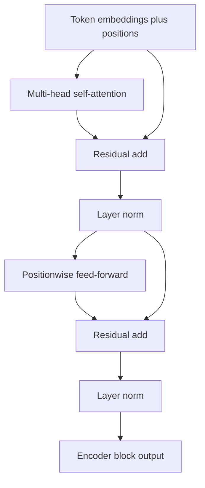
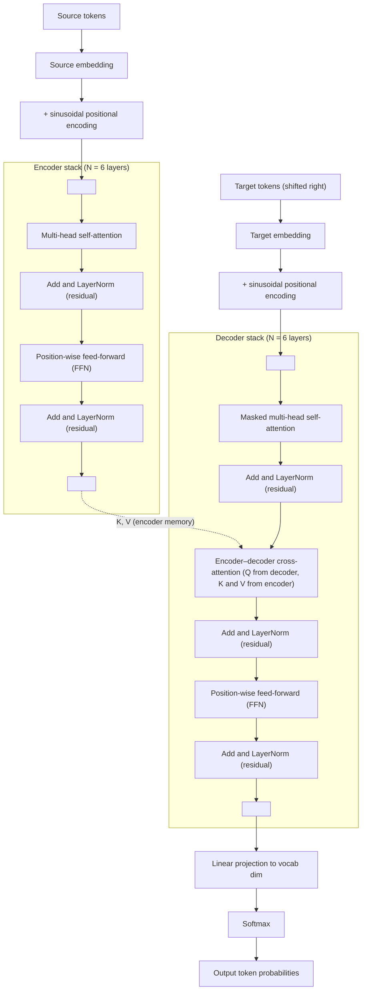
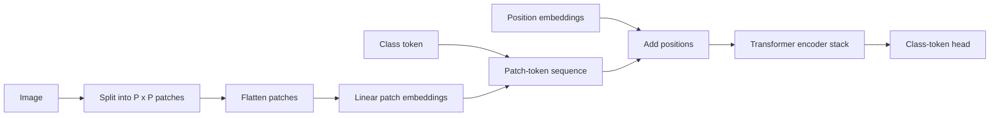

# Attention and Transformers

Attention lets a model choose which pieces of information to use for each prediction. D2L introduces attention through queries, keys, and values, then builds scoring functions, multi-head attention, self-attention, positional encoding, and the Transformer architecture. This progression explains why attention displaced recurrence for many sequence tasks: it creates direct paths between all positions and parallelizes efficiently.

A Transformer is not just attention. It combines multi-head self-attention, positionwise feed-forward networks, residual connections, layer normalization, masking, and positional information. Each component solves a specific problem: attention mixes tokens, feed-forward layers transform each position, residual paths stabilize optimization, masks preserve causality or ignore padding, and positional encodings restore order information that pure attention does not have.

## Definitions

A **query** asks for information, a **key** describes what a value contains, and a **value** is the content to aggregate. Attention computes weights from query-key similarity and returns a weighted sum of values.

In **scaled dot-product attention**, with queries $Q$, keys $K$, and values $V$,

$$
\mathrm{Attention}(Q,K,V)
=
\mathrm{softmax}\left(\frac{QK^T}{\sqrt{d_k}}\right)V.
$$

The factor $\sqrt{d_k}$ prevents dot products from growing too large as key dimension increases.

**Additive attention** uses a learned scoring network instead of a dot product. It is useful when query and key dimensions differ.

**Multi-head attention** projects queries, keys, and values into several subspaces, applies attention in each head, concatenates the results, and projects again.

**Self-attention** uses the same sequence as the source of queries, keys, and values. Every token can attend to other tokens in the same sequence.

**Positional encoding** injects token order into the model. D2L presents sinusoidal encodings:

$$
P_{i,2j} = \sin\left(\frac{i}{10000^{2j/d}}\right),
\qquad
P_{i,2j+1} = \cos\left(\frac{i}{10000^{2j/d}}\right).
$$

A **Transformer encoder block** contains multi-head self-attention and a positionwise feed-forward network. A **Transformer decoder block** adds masked self-attention and encoder-decoder attention.

## Key results

Attention pooling generalizes weighted averaging. If a query is similar to a key, the corresponding value receives a larger weight. Since the weights are produced by softmax, they are nonnegative and sum to one along the attended dimension.

The scaled dot-product denominator matters. If entries of $q$ and $k$ have variance near $1$, their dot product has variance roughly $d_k$. Large logits push softmax into saturated regions with tiny gradients. Dividing by $\sqrt{d_k}$ keeps the scale more stable.

Self-attention has short path length between positions. In an RNN, information from token $1$ to token $T$ travels through $T-1$ recurrent steps. In self-attention, token $T$ can attend directly to token $1$ in a single layer. This makes long-range interactions easier to learn, although the $O(T^2)$ attention matrix can be expensive for long sequences.

Masking has two distinct roles. Padding masks prevent attention to artificial padding tokens. Causal masks prevent a decoder position from attending to future target tokens during autoregressive training.

Residual connections and layer normalization are not optional details. They keep deep Transformer stacks trainable by stabilizing activations and gradients.

The query-key-value view also clarifies shape discipline. If a batch has $n$ examples, $T_q$ query positions, $T_k$ key/value positions, and model width $d$, then attention scores have shape $(n,T_q,T_k)$ for each head. The output has one value vector per query position. Self-attention has $T_q=T_k$ because the same sequence supplies all three roles. Encoder-decoder attention has target positions as queries and source positions as keys and values, so target length and source length may differ.

Multi-head attention is not merely running the same attention several times. Each head has its own learned projections, so one head may focus on local syntax, another on long-distance agreement, and another on delimiter or separator tokens. After concatenation, an output projection lets the model recombine those head-specific views. In practice, each head usually has width $d_{\text{model}}/h$, keeping the total projection size comparable to single-head attention.

The positionwise feed-forward network is equally important. Attention mixes information across positions, but the feed-forward block applies a nonlinear transformation independently at each position. A Transformer layer therefore alternates "communicate across tokens" and "transform each token representation." This alternating pattern is why removing either attention or feed-forward sublayers severely weakens the architecture.

Complexity is the main tradeoff. Full self-attention over a sequence of length $T$ forms $T^2$ pairwise scores per head. For sentence-length NLP this is often acceptable, and the parallelism is excellent. For long documents, audio, videos, or high-resolution vision patches, the quadratic matrix becomes expensive in memory and time. Many later architectures modify attention sparsity, chunking, recurrence, or retrieval, but D2L's full-attention formulation is the reference point from which those variants depart.

The encoder-decoder distinction is also practical for debugging. In an encoder block, every source token can attend to every other nonpadding source token. In a decoder block, target self-attention is causal, but encoder-decoder attention is not causal with respect to the source because the full source is already known. Confusing these two masks can produce models that train with leaked future tokens or models that cannot use the full input sequence.

For small examples, writing the attention matrix by hand is often the fastest way to find mistakes. Rows should correspond to query positions, columns to key positions, and each row should sum to one after softmax except where masking has removed all valid keys, which should be avoided.

## Visual



| Mechanism | Mixes positions? | Uses order directly? | Parallel over time? | Typical use |
|---|---|---|---|---|
| CNN | Locally | Through spatial layout | Yes | Images and local patterns |
| RNN | Sequentially | Yes, by recurrence | Limited | Streaming sequences |
| Self-attention | Globally | No, needs positions | Yes | Transformers |
| Causal self-attention | Past positions only | No, needs positions | Yes during training | Autoregressive decoding |
| Encoder-decoder attention | Target queries to source keys | Source order via positions | Yes | Translation and seq2seq |

## Worked example 1: scaled dot-product attention

Problem: one query attends to two key-value pairs. Let

$$
q = [1,1],
\quad
k_1=[1,0],
\quad
k_2=[0,1],
$$

and values

$$
v_1=[10,0],
\quad
v_2=[0,20].
$$

Compute scaled dot-product attention with $d_k=2$.

Method:

1. Compute raw dot products:

$$
qk_1^T = 1(1)+1(0)=1,
\qquad
qk_2^T = 1(0)+1(1)=1.
$$

2. Scale by $\sqrt{2}$:

$$
s_1=s_2=\frac{1}{\sqrt{2}}\approx 0.707.
$$

3. Apply softmax. Since both scores are equal, the weights are equal:

$$
\alpha_1=\alpha_2=0.5.
$$

4. Compute weighted value sum:

$$
0.5[10,0] + 0.5[0,20] = [5,10].
$$

Checked answer: the attention output is $[5,10]$. Equal query-key similarity caused equal averaging of the values.

## Worked example 2: causal mask for decoding

Problem: construct the valid attention pattern for a target sequence of length $4$ in an autoregressive decoder. Position $t$ may attend only to positions $\le t$.

Method:

1. Index positions as $1,2,3,4$.
2. Position $1$ can attend to only $1$.
3. Position $2$ can attend to $1,2$.
4. Position $3$ can attend to $1,2,3$.
5. Position $4$ can attend to $1,2,3,4$.
6. Write the mask as `1` for allowed and `0` for blocked:

$$
\begin{bmatrix}
1 & 0 & 0 & 0 \\
1 & 1 & 0 & 0 \\
1 & 1 & 1 & 0 \\
1 & 1 & 1 & 1
\end{bmatrix}.
$$

Checked answer: the matrix is lower triangular. In implementation, blocked positions are often assigned a large negative score before softmax so their attention weight becomes approximately zero.

## Code

```python
import math
import torch
from torch import nn

torch.manual_seed(5)

batch = 2
time = 4
d_model = 16
heads = 4

x = torch.randn(batch, time, d_model)
self_attn = nn.MultiheadAttention(
    embed_dim=d_model,
    num_heads=heads,
    batch_first=True,
)

causal_mask = torch.triu(
    torch.ones(time, time, dtype=torch.bool),
    diagonal=1,
)
attn_out, attn_weights = self_attn(x, x, x, attn_mask=causal_mask)

ffn = nn.Sequential(
    nn.Linear(d_model, 4 * d_model),
    nn.ReLU(),
    nn.Linear(4 * d_model, d_model),
)
norm1 = nn.LayerNorm(d_model)
norm2 = nn.LayerNorm(d_model)

y = norm1(x + attn_out)
z = norm2(y + ffn(y))

print("output shape:", z.shape)
print("attention weight shape:", attn_weights.shape)
```

## Encoder-decoder Transformer architecture

Vaswani et al. [1] introduced the Transformer in the setting of neural machine translation, where strong systems were mostly recurrent encoder-decoders, often LSTMs or GRUs with an attention mechanism over encoder states. The Transformer kept the encoder-decoder translation interface, but removed recurrence and convolution from the sequence transduction core. That made training much more parallel over positions and gave every token a short path to every other token through self-attention.

The original model is an encoder-decoder architecture. The encoder has $N=6$ identical layers. Each encoder layer contains multi-head self-attention followed by a position-wise feed-forward network, with residual connections and layer normalization around both sublayers. The decoder also has $N=6$ layers, but each decoder layer has three sublayers: masked decoder self-attention, encoder-decoder cross-attention, and the same position-wise feed-forward network. In the base model, $d_{\mathrm{model}}=512$, $d_{\mathrm{ff}}=2048$, and there are $h=8$ attention heads with $d_k=d_v=64$. The big model uses a wider configuration, but the same conceptual stack.



The block diagram above shows the canonical encoder–decoder Transformer of Vaswani et al. [1]:

- **Encoder layer** (left) has two sublayers — multi-head self-attention and a position-wise feed-forward network — each wrapped in a residual connection followed by layer normalization. Stacked $N$ times.
- **Decoder layer** (right) adds a third sublayer: masked multi-head self-attention prevents target tokens from attending to future positions, encoder–decoder cross-attention lets each target position read the full encoded source through $Q = X_{\mathrm{dec}} W^Q$ and $K, V$ from the encoder output, and a position-wise FFN finishes the layer. Stacked $N$ times.
- **Output** projects decoder states to the target vocabulary with a linear layer, then softmax produces the next-token distribution.
- **Embeddings** map discrete tokens to vectors of dimension $d_{\mathrm{model}}$; sinusoidal positional encodings are added so the model can use order despite having no recurrence or convolution.

The paper uses three attention variants. **Encoder self-attention** uses source positions as queries, keys, and values, so every source token can see every other source token, aside from padding masks. **Decoder masked self-attention** uses target positions as queries, keys, and values, but masks future target positions so autoregressive training cannot leak the answer. **Encoder-decoder attention** uses decoder states as queries and encoder outputs as keys and values, allowing each target position to attend over the full source sentence.

The central formula is scaled dot-product attention:

$$
\mathrm{Attention}(Q,K,V)=
\mathrm{softmax}\left(\frac{QK^T}{\sqrt{d_k}}\right)V.
$$

Multi-head attention runs this operation in parallel after learned projections:

$$
\begin{aligned}
\mathrm{MultiHead}(Q,K,V) &= \mathrm{Concat}(\mathrm{head}_1,\ldots,\mathrm{head}_h)W^O,\\
\mathrm{head}_i &= \mathrm{Attention}(QW_i^Q,KW_i^K,VW_i^V).
\end{aligned}
$$

Because the model has no recurrence or convolution, it needs an explicit order signal. The paper uses fixed sinusoidal positional encodings:

$$
\begin{aligned}
PE_{(pos,2i)} &= \sin\left(\frac{pos}{10000^{2i/d_{\mathrm{model}}}}\right),\\
PE_{(pos,2i+1)} &= \cos\left(\frac{pos}{10000^{2i/d_{\mathrm{model}}}}\right).
\end{aligned}
$$

The feed-forward sublayer is applied independently at every position:

$$
\mathrm{FFN}(x)=\max(0,xW_1+b_1)W_2+b_2.
$$

Training used WMT 2014 English-German and English-French translation. The English-German setup used about 4.5 million sentence pairs with byte-pair encoding and a shared vocabulary of about 37K tokens. The English-French setup used about 36 million sentence pairs and a 32K word-piece vocabulary. Batches were formed by approximate sequence length and contained roughly 25K source tokens and 25K target tokens. The optimizer was Adam with $\beta_1=0.9$, $\beta_2=0.98$, $\epsilon=10^{-9}$, and the now-standard warmup/inverse-square-root learning-rate schedule:

$$
\mathrm{lrate}=d_{\mathrm{model}}^{-0.5}\min(\mathrm{step}^{-0.5},\mathrm{step}\cdot \mathrm{warmup}^{-1.5}),
$$

with $\mathrm{warmup}=4000$. The paper also used dropout and label smoothing with value $0.1$. As reported in the paper, the big Transformer reached 28.4 BLEU on WMT 2014 English-German and about 41.0 BLEU on WMT 2014 English-French, while training far faster than prior recurrent and convolutional systems in the comparison table.

The landmark contribution was not merely a better translation score. The paper showed that recurrence was not necessary for high-quality sequence transduction. Self-attention reduced the maximum path length between positions to a constant number of layers, made training parallel over sequence positions, and supplied a modular block that later scaled into large language models. The same encoder idea can be adapted to image patches, while the long-context cost of its $L\times L$ attention matrix motivates the alternatives in [Efficient Sequence Modeling](/cs/deep-learning/efficient-sequence-modeling).

## Transformer encoders for image patches

Dosovitskiy et al. [2] showed that an almost standard Transformer encoder can classify images when the image is represented as a sequence of fixed-size patches. The contribution was not a new attention formula; it was the clean patch-token interface that made image recognition look like sequence modeling and showed that large-scale pretraining can compensate for weaker built-in vision priors.

For an image with shape $H\times W\times C$ and patch size $P\times P$, the number of nonoverlapping image tokens is

$$
N=\frac{HW}{P^2}.
$$

Each flattened patch has dimension $P^2C$ and is projected to Transformer width $D$. With a learned class token and learned position embeddings, the input sequence is

$$
z_0=[x_{\mathrm{class}}; x_p^1E; x_p^2E;\ldots;x_p^NE]+E_{\mathrm{pos}},
$$

where $E\in\mathbb{R}^{(P^2C)\times D}$. The encoder can then use the same pre-norm block pattern as an NLP Transformer encoder:

$$
\begin{aligned}
z'_\ell &= \mathrm{MSA}(\mathrm{LN}(z_{\ell-1}))+z_{\ell-1},\\
z_\ell &= \mathrm{MLP}(\mathrm{LN}(z'_\ell))+z'_\ell.
\end{aligned}
$$

The classifier reads the final class-token representation, usually after a layer normalization:

$$
y=\mathrm{LN}(z_L^0).
$$



The tradeoff is data efficiency versus architectural flexibility. CNNs hard-code locality, weight sharing, and translation equivariance, so they are strong on moderate image datasets. A patch-token Transformer has fewer image-specific priors, so it usually needs larger pretraining data or stronger regularization to match CNNs from scratch. The upside is a generic token mixer that scales well when pretraining data is large and that transfers naturally to masked image modeling, multimodal models, and video or high-resolution patch sequences.

Patch size is a real computational choice. Smaller patches preserve more detail, but they increase sequence length and therefore attention cost. A $224\times224$ RGB image with $16\times16$ patches has

$$
(224/16)^2=14^2=196
$$

image tokens, or 197 tokens after adding the class token. Fine-tuning the same model at $384\times384$ gives

$$
(384/16)^2=24^2=576
$$

image tokens, or 577 tokens with the class token. Since attention logits scale like $T^2$, the per-head attention-score count grows by

$$
\frac{577^2}{197^2}\approx 8.58.
$$

This is much larger than the image-area ratio of about $2.94$, which is why high-resolution patch attention quickly becomes a computational-performance problem.

```python
import torch
import torch.nn as nn

class PatchEmbedding(nn.Module):
    def __init__(self, image_size=224, patch_size=16, channels=3, dim=768):
        super().__init__()
        assert image_size % patch_size == 0
        self.num_patches = (image_size // patch_size) ** 2
        self.proj = nn.Conv2d(channels, dim, kernel_size=patch_size, stride=patch_size)
        self.cls = nn.Parameter(torch.zeros(1, 1, dim))
        self.pos = nn.Parameter(torch.zeros(1, self.num_patches + 1, dim))

    def forward(self, x):
        b = x.size(0)
        patches = self.proj(x).flatten(2).transpose(1, 2)
        cls = self.cls.expand(b, -1, -1)
        return torch.cat([cls, patches], dim=1) + self.pos

x = torch.randn(2, 3, 224, 224)
z = PatchEmbedding()(x)
print(z.shape)  # [2, 197, 768]
```

## Common pitfalls

- Forgetting positional information and expecting self-attention alone to know token order.
- Using the wrong mask orientation in a decoder. Future tokens must be blocked.
- Applying softmax over the wrong dimension of the attention score matrix.
- Ignoring padding masks, which lets the model attend to artificial padding tokens.
- Treating attention weights as complete explanations. They are useful diagnostics but not proof of causal importance.
- Underestimating the memory cost of the $T \times T$ attention matrix for long sequences.
- Treating patch size as cosmetic in vision Transformers. Halving patch size roughly quadruples image-token count.

## Connections

- [Gated RNNs and sequence-to-sequence](/cs/deep-learning/gated-rnns-seq2seq)
- [Pretrained transformers and BERT](/cs/deep-learning/pretrained-transformers-nlp)
- [Computer Vision Applications](/cs/deep-learning/computer-vision-applications)
- [Efficient Sequence Modeling](/cs/deep-learning/efficient-sequence-modeling)
- [Natural language processing](/cs/nlp/)
- [Linear algebra](/math/linear-algebra/)
- [Machine learning](/cs/machine-learning/)

## References

[1] A. Vaswani, N. Shazeer, N. Parmar, J. Uszkoreit, L. Jones, A. N. Gomez, L. Kaiser, I. Polosukhin. *Attention Is All You Need*. NeurIPS 2017.
[2] A. Dosovitskiy, L. Beyer, A. Kolesnikov, D. Weissenborn, X. Zhai, T. Unterthiner, M. Dehghani, M. Minderer, G. Heigold, S. Gelly, J. Uszkoreit, N. Houlsby. *An Image is Worth 16x16 Words: Transformers for Image Recognition at Scale*. ICLR 2021.
