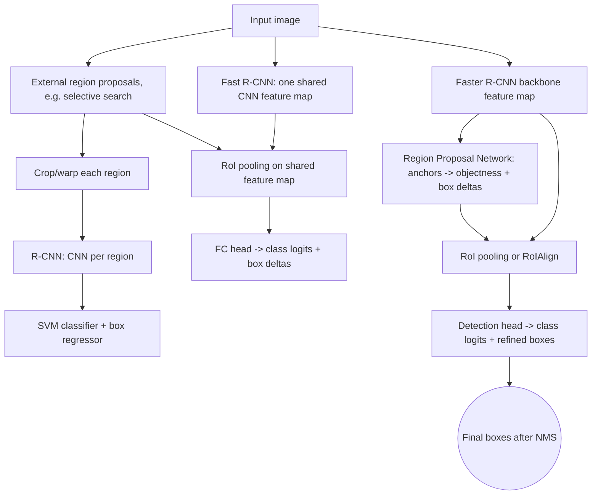
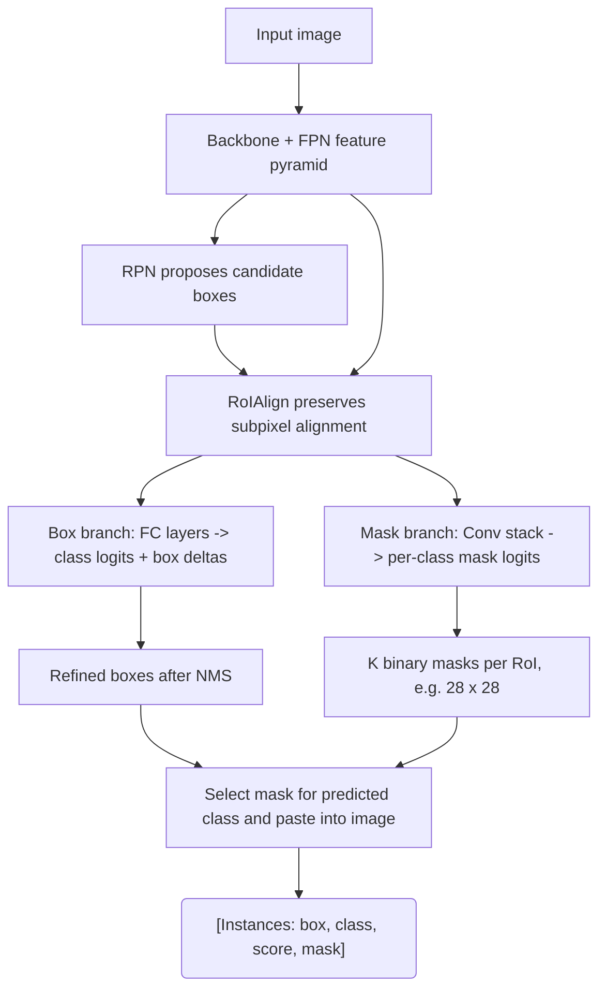

# Computer Vision Applications

D2L's computer vision application chapters show how CNN ideas become task systems. Image classification is the simplest case: one image, one label. Practical vision also includes augmentation, fine-tuning, object detection, anchor boxes, region-based CNNs, semantic segmentation, transposed convolution, and neural style transfer. These topics reuse convolutional backbones but change the output structure and loss.

The main shift is from global image prediction to spatial prediction. Object detection predicts boxes and classes. Segmentation predicts a class for each pixel. Style transfer optimizes an image itself to match content and style statistics. Fine-tuning adapts pretrained features to a new dataset. In each case, the model must preserve or recover spatial information that a plain classifier might discard.

## Definitions

**Image augmentation** applies label-preserving transformations such as random flips, crops, color jitter, and normalization. It increases effective data diversity and encodes invariances.

**Fine-tuning** initializes a model from pretrained weights and updates it for a new task. A common recipe replaces the final classification head, trains the head with the backbone frozen, then optionally unfreezes some or all backbone layers with a smaller learning rate.

An **anchor box** is a predefined candidate box centered at a pixel or feature location. Detectors predict class scores and box offsets relative to anchors.

For boxes $A$ and $B$, **intersection over union** is

$$
\mathrm{IoU}(A,B) =
\frac{\mathrm{area}(A \cap B)}{\mathrm{area}(A \cup B)}.
$$

**Non-maximum suppression** removes lower-scoring boxes that overlap too much with a higher-scoring box.

**R-CNN** style detectors generate region proposals, extract features for each region, and classify/refine boxes. Faster R-CNN integrates proposal generation into the network.

**Semantic segmentation** predicts a class label for every pixel. **Transposed convolution** learns upsampling and is often used to increase feature map resolution.

**Neural style transfer** optimizes an output image to match content features from one image and style statistics, often Gram matrices, from another.

## Key results

Data augmentation should match the task's invariances. Horizontal flips often preserve object identity for natural images, but vertical flips may be invalid for street scenes, digits, or medical images. Random cropping can improve robustness but may remove small objects if used carelessly.

Fine-tuning works because early and middle CNN layers learn reusable visual features such as edges, textures, parts, and shapes. The final head is task-specific. Smaller datasets usually benefit from lower learning rates and stronger regularization when updating pretrained layers.

IoU controls detection assignment and evaluation. A predicted box may be counted as correct only if its IoU with a ground-truth box exceeds a threshold such as $0.5$. Higher thresholds demand better localization.

Anchor design trades coverage and compute. More sizes and aspect ratios improve the chance that each object has a good matching anchor, but they increase class and box predictions per location.

Segmentation cannot simply use a classifier's final vector output. It needs spatially aligned predictions. Fully convolutional networks replace dense classification heads with convolutional predictions and upsampling.

Transposed convolution output size in one dimension is commonly

$$
o = (i-1)s - 2p + k + \text{output\_padding},
$$

where $i$ is input size, $s$ stride, $p$ padding, and $k$ kernel size.

Detection models need both classification and localization. A high class score is not enough if the box is badly placed, and an accurate box is not enough if the class is wrong. This is why detection losses usually combine a classification term with a box-regression term, and detection metrics combine confidence ranking with IoU thresholds. Non-maximum suppression then turns many overlapping candidate boxes into a smaller final set.

Fine-tuning is also a data-management problem. The normalization statistics expected by a pretrained backbone should match the pretraining recipe, and input resolution should be chosen deliberately. If the new dataset is small, freezing most of the backbone can reduce overfitting and speed training. If the new domain differs strongly from the pretraining domain, unfreezing more layers may be necessary, but the learning rate should usually be smaller for pretrained layers than for a newly initialized head.

Segmentation highlights the cost of downsampling. Classification backbones deliberately collapse spatial information, but segmentation must produce dense predictions. Fully convolutional networks, skip connections, transposed convolutions, and interpolation-based upsampling all try to recover high-resolution outputs while preserving semantic features from deep layers. The best design depends on whether boundaries, small objects, or coarse region labels matter most.

Object detection also depends on postprocessing. A detector may output thousands of candidate boxes before non-maximum suppression. The confidence threshold changes the precision-recall tradeoff: a high threshold reduces false positives but can miss objects, while a low threshold finds more candidates but may produce clutter. Mean average precision summarizes behavior across thresholds, which is why it is preferred to a single fixed-threshold accuracy.

Style transfer demonstrates another use of pretrained CNNs. The network does not have to be trained for style transfer directly; instead, its intermediate activations define perceptual content and style losses. Content loss compares feature maps at selected layers, while style loss compares correlations between channels through Gram matrices. This shows that a trained vision network can act as a feature space for optimization, not only as a predictor.

For every vision application, preprocessing at inference must match preprocessing at training. Resizing method, crop policy, channel order, and normalization constants can move accuracy by large amounts. This is especially easy to miss when exporting a model outside the notebook where it was trained.

## Visual

```mermaid
flowchart TB
  In["Input image: #lsqb;N, 3, 572, 572"]"] --> E1["Encoder level 1: two Conv 3 x 3, 64 -> #lsqb;N, 64, 568, 568"]"]
  E1 --> P1["MaxPool 2 x 2 -> #lsqb;N, 64, 284, 284"]"]
  P1 --> E2["Encoder level 2: two Conv 3 x 3, 128 -> #lsqb;N, 128, 280, 280"]"]
  E2 --> P2["MaxPool 2 x 2 -> #lsqb;N, 128, 140, 140"]"]
  P2 --> E3["Encoder level 3: two Conv 3 x 3, 256 -> #lsqb;N, 256, 136, 136"]"]
  E3 --> P3["MaxPool 2 x 2 -> #lsqb;N, 256, 68, 68"]"]
  P3 --> E4["Encoder level 4: two Conv 3 x 3, 512 -> #lsqb;N, 512, 64, 64"]"]
  E4 --> P4["MaxPool 2 x 2 -> #lsqb;N, 512, 32, 32"]"]
  P4 --> Bottleneck["Bottleneck: two Conv 3 x 3, 1024 -> #lsqb;N, 1024, 28, 28"]"]
  Bottleneck --> U4["UpConv 2 x 2, 512 -> #lsqb;N, 512, 56, 56"]"]
  E4 -. "crop and concatenate skip" .-> Cat4["Concat skip -> #lsqb;N, 1024, 56, 56"]"]
  U4 --> Cat4
  Cat4 --> D4["Decoder level 4: two Conv 3 x 3, 512 -> #lsqb;N, 512, 52, 52"]"]
  D4 --> U3["UpConv 2 x 2, 256 -> #lsqb;N, 256, 104, 104"]"]
  E3 -. "crop and concatenate skip" .-> Cat3["Concat skip -> #lsqb;N, 512, 104, 104"]"]
  U3 --> Cat3
  Cat3 --> D3["Decoder level 3: two Conv 3 x 3, 256 -> #lsqb;N, 256, 100, 100"]"]
  D3 --> U2["UpConv 2 x 2, 128 -> #lsqb;N, 128, 200, 200"]"]
  E2 -. "crop and concatenate skip" .-> Cat2["Concat skip -> #lsqb;N, 256, 200, 200"]"]
  U2 --> Cat2
  Cat2 --> D2["Decoder level 2: two Conv 3 x 3, 128 -> #lsqb;N, 128, 196, 196"]"]
  D2 --> U1["UpConv 2 x 2, 64 -> #lsqb;N, 64, 392, 392"]"]
  E1 -. "crop and concatenate skip" .-> Cat1["Concat skip -> #lsqb;N, 128, 392, 392"]"]
  U1 --> Cat1
  Cat1 --> D1["Decoder level 1: two Conv 3 x 3, 64 -> #lsqb;N, 64, 388, 388"]"]
  D1 --> Head["1 x 1 conv to K classes -> #lsqb;N, K, 388, 388"]"]
  Head --> Mask(("Per-pixel class map"))
```


*Figure: Original U-Net architecture from [Ronneberger, Fischer, and Brox, 2015](https://arxiv.org/abs/1505.04597) — embedded under educational fair use with attribution.*

The U-Net diagram shows the hourglass explicitly: the contracting path doubles channels while pooling reduces resolution, and the expanding path upsamples while concatenating same-level encoder features. Dotted skip connections carry high-resolution detail into each decoder level, which is why U-Net is effective for boundary-sensitive segmentation. The labels use the original valid-convolution shape progression from 572 x 572 input to 388 x 388 logits.



The R-CNN family diagram contrasts where proposals and feature extraction happen. Original R-CNN runs a CNN for every proposed crop, Fast R-CNN shares a single backbone feature map and pools per proposal, and Faster R-CNN learns proposals with an RPN. The shared-backbone path is the key architecture transition from slow external pipelines to trainable detectors.

```mermaid
flowchart TB
  Img["Input image: #lsqb;N, 3, S, S"]"] --> Backbone["CNN backbone + neck feature pyramid"]
  Backbone --> Grid["Dense grid features, e.g. #lsqb;N, A*(5+K), H, W"]"]
  Grid --> BoxHead["Per cell/anchor: box center, width, height"]
  Grid --> ObjHead["Objectness score"]
  Grid --> ClassHead["Class logits"]
  BoxHead --> Decode["Decode boxes relative to grid and anchors"]
  ObjHead --> Score["Class confidence = objectness * class probability"]
  ClassHead --> Score
  Decode --> Filter["Confidence threshold + NMS"]
  Score --> Filter
  Filter --> Out(("Single-shot detections"))
```


*Figure: YOLO unified detection schematic from [Redmon et al., 2015](https://arxiv.org/abs/1506.02640) — embedded under educational fair use with attribution.*

YOLO-style detectors predict boxes and classes in one dense pass instead of classifying proposal crops. The diagram shows the detection tensor split into box geometry, objectness, and class logits before decoding and NMS. The single-shot contract trades proposal-stage flexibility for a simpler low-latency pipeline.



Mask R-CNN extends Faster R-CNN with a parallel mask branch after RoIAlign. The box branch predicts classes and refined boxes, while the mask branch keeps spatial structure inside each RoI to produce per-instance masks. RoIAlign is labeled because mask quality depends on preserving feature-to-pixel alignment.

| Task | Input | Output | Main loss or metric |
|---|---|---|---|
| Classification | Image | One class distribution | Cross-entropy, accuracy |
| Fine-tuning | Image plus pretrained model | Adapted classifier | Validation accuracy |
| Detection | Image | Boxes plus classes | IoU, mAP, classification and box loss |
| Segmentation | Image | Pixel class map | Pixel cross-entropy, mean IoU |
| Style transfer | Content and style images | Optimized image | Content and style feature losses |
| Transposed conv | Low-res feature map | Higher-res feature map | Task-dependent |

## Worked example 1: IoU for two boxes

Problem: compute the IoU of box $A=(0,0,4,4)$ and box $B=(2,2,6,5)$, where boxes are `(x1, y1, x2, y2)`.

Method:

1. Compute area of $A$:

$$
\mathrm{area}(A) = (4-0)(4-0)=16.
$$

2. Compute area of $B$:

$$
\mathrm{area}(B) = (6-2)(5-2)=4 \cdot 3 = 12.
$$

3. Intersection coordinates:

$$
x_1^{I}=\max(0,2)=2,
\quad
y_1^{I}=\max(0,2)=2,
$$

$$
x_2^{I}=\min(4,6)=4,
\quad
y_2^{I}=\min(4,5)=4.
$$

4. Intersection area:

$$
(4-2)(4-2)=4.
$$

5. Union area:

$$
16 + 12 - 4 = 24.
$$

6. IoU:

$$
\frac{4}{24}=\frac{1}{6}\approx 0.167.
$$

Checked answer: the IoU is about $0.167$, so this prediction would not match a ground-truth box under a $0.5$ IoU threshold.

## Worked example 2: transposed convolution size

Problem: a transposed convolution receives a feature map with size $i=7$, kernel size $k=4$, stride $s=2$, padding $p=1$, and `output_padding=0`. Compute the output size in one dimension.

Method:

1. Use the formula:

$$
o = (i-1)s - 2p + k + \text{output\_padding}.
$$

2. Substitute:

$$
o = (7-1)(2) - 2(1) + 4 + 0.
$$

3. Compute:

$$
(7-1)(2)=12,
\qquad
12-2+4=14.
$$

Checked answer: the output size is $14$. If both height and width use the same settings, a $7 \times 7$ feature map becomes $14 \times 14$.

## Code

```python
import torch
from torch import nn

def box_iou(boxes1, boxes2):
    lt = torch.maximum(boxes1[:, None, :2], boxes2[None, :, :2])
    rb = torch.minimum(boxes1[:, None, 2:], boxes2[None, :, 2:])
    wh = (rb - lt).clamp(min=0)
    inter = wh[:, :, 0] * wh[:, :, 1]
    area1 = (boxes1[:, 2] - boxes1[:, 0]) * (boxes1[:, 3] - boxes1[:, 1])
    area2 = (boxes2[:, 2] - boxes2[:, 0]) * (boxes2[:, 3] - boxes2[:, 1])
    union = area1[:, None] + area2[None, :] - inter
    return inter / union

boxes_a = torch.tensor([[0.0, 0.0, 4.0, 4.0]])
boxes_b = torch.tensor([[2.0, 2.0, 6.0, 5.0]])
print("IoU:", box_iou(boxes_a, boxes_b))

upsampler = nn.ConvTranspose2d(
    in_channels=16,
    out_channels=4,
    kernel_size=4,
    stride=2,
    padding=1,
)
x = torch.randn(2, 16, 7, 7)
y = upsampler(x)
print("upsampled logits:", y.shape)
```

## Common pitfalls

- Applying augmentations that change the label, such as flipping asymmetric symbols or removing small objects with aggressive crops.
- Fine-tuning a pretrained model with the same learning rate for all layers on a tiny dataset.
- Forgetting to transform bounding boxes when the image is resized, cropped, or flipped.
- Evaluating detection with accuracy instead of localization-aware metrics such as IoU and mAP.
- Upsampling segmentation logits without checking alignment to the original image size.
- Treating style transfer as ordinary supervised learning; the optimized variable can be the image itself.

## Connections

- [Convolutional neural networks](/cs/deep-learning/convolutional-neural-networks)
- [Modern CNNs](/cs/deep-learning/modern-cnns)
- [Computational performance](/cs/deep-learning/computational-performance)
- [Machine learning](/cs/machine-learning/)
- [Linear algebra](/math/linear-algebra/)
