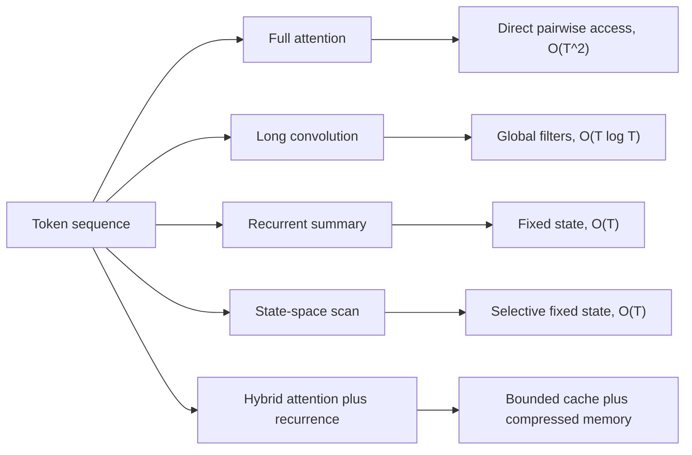
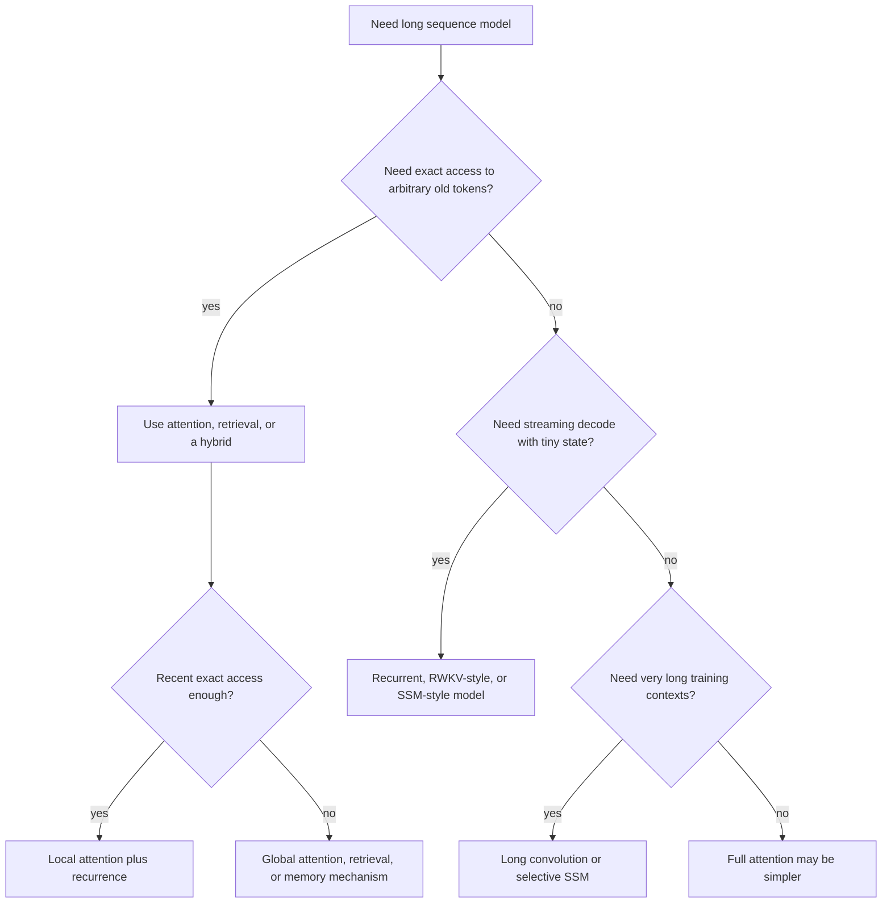

# Efficient Sequence Modeling: Linear Attention, SSMs, and Hybrids

Full self-attention is the reference token mixer for modern sequence models, but its cost grows quadratically with sequence length. That is acceptable for many sentences and short documents. It becomes a bottleneck for long documents, code repositories, audio, genomics, video, high-resolution image patches, and any decoder that must keep a large key-value cache during generation.

Efficient sequence modeling asks which parts of attention are essential. The answer is not a single architecture. Some methods replace attention with long convolutions, some use linearized attention or recurrent key-value summaries, some use state-space recurrences, and production models often hybridize these ideas with a small amount of attention. The design space is a tradeoff among quality, exact retrieval, training parallelism, inference memory, hardware kernels, and how much history must be remembered exactly.

## The quadratic attention bottleneck

For a sequence of length $T$ and model width $d$, scaled dot-product self-attention forms

$$
A=\mathrm{softmax}\left(\frac{QK^T}{\sqrt{d_k}}\right),
\qquad
Y=AV.
$$

For each head, $QK^T$ has shape $T\times T$. The score matrix therefore costs $O(T^2)$ memory to materialize and roughly $O(T^2d)$ compute to apply. During autoregressive inference, a Transformer can avoid recomputing old keys and values by storing a KV cache, but that cache grows linearly with generated length:

$$
\mathrm{cache\ scalars}\propto 2L_{\mathrm{layers}}Td_{\mathrm{head}}n_{\mathrm{kv\ heads}}.
$$

The problem is not only asymptotic notation. Doubling the context length quadruples the number of attention scores during training. At decode time, a long KV cache consumes memory bandwidth and reduces batch size. Efficient alternatives try to preserve enough of attention's strengths while changing one or more of these costs.



| Family | Token mixing idea | Training path | Decode memory | Main tradeoff |
|---|---|---|---|---|
| Full attention | Pairwise query-key scores | Matrix attention | KV cache grows with $T$ | Strong exact access, expensive long context |
| Linear attention | Associative feature-map attention | Prefix sums or scans | Fixed or compact state | Kernel choice limits operator class |
| Long convolution | Filters over many lags | FFT convolution | No full KV cache | Harder content-selective recall |
| Gated recurrence | Learned state update | Parallel scan or custom recurrence | Fixed state | Compresses history |
| Selective SSM | Input-dependent state-space update | Fused selective scan | Fixed state | Exact retrieval still not free |
| Hybrid | Sparse attention plus efficient mixers | Mixed kernels | Bounded or reduced KV cache | More architecture complexity |

## Linear attention and recurrent summaries

The algebraic route starts from attention without the row-wise softmax. If a nonnegative feature map $\phi$ makes attention weights approximately factorizable, then

$$
\mathrm{Attn}(q_t,K,V)
\approx
\frac{\phi(q_t)^T\sum_{i\le t}\phi(k_i)v_i^T}
{\phi(q_t)^T\sum_{i\le t}\phi(k_i)}.
$$

The sums over past keys and values can be maintained as recurrent state:

$$
S_t=S_{t-1}+\phi(k_t)v_t^T,
\qquad
z_t=z_{t-1}+\phi(k_t).
$$

Then each new token reads from $(S_t,z_t)$ instead of all previous tokens. This explains why many efficient models look recurrent at inference even when they train with parallel scan kernels. The price is compression: the state summarizes the past instead of storing every key and value separately.

## Long convolution with data-controlled gates

Long convolutions replace the dense attention matrix with a structured Toeplitz operator. Hyena showed that this can be much more expressive when fixed long filters are interleaved with input-dependent gates [1]. A causal convolution over one channel is

$$
y_t=(h*u)_t=\sum_{i=0}^{t}h_i u_{t-i}.
$$

In matrix form, this is multiplication by a lower-triangular Toeplitz matrix $S_h$. Hyena composes Toeplitz matrices with diagonal gate matrices:

$$
y=D_{x_N}S_{h_N}\cdots D_{x_2}S_{h_2}D_{x_1}S_{h_1}v.
$$

The filters are implicit: instead of learning one parameter for every possible lag, a small network maps positions to filter values,

$$
h_t=\mathrm{Window}(t)\cdot(\mathrm{FFN}\circ\mathrm{PositionalEncoding})(t).
$$

The gates make the operator data-controlled, while FFT convolution gives the long-filter part roughly $O(T\log T)$ length scaling. The implementation detail that matters most is causality: FFT convolution must be padded so it computes the aperiodic causal convolution, not circular convolution that leaks future tokens into early outputs.

Worked example: let

$$
u=[2,0,1,3],
\qquad
h=[1,0.5,0.25].
$$

Using $y_t=\sum_{i=0}^{2}h_i u_{t-i}$ with missing past values set to zero,

$$
\begin{aligned}
y_0&=1\cdot2=2,\\
y_1&=1\cdot0+0.5\cdot2=1,\\
y_2&=1\cdot1+0.5\cdot0+0.25\cdot2=1.5,\\
y_3&=1\cdot3+0.5\cdot1+0.25\cdot0=3.5.
\end{aligned}
$$

So $y=[2,1,1.5,3.5]$. Hyena applies the same causal idea with learned full-length filters and gates over many channels.

```python
import torch

def causal_fft_conv(u, h):
    """Depthwise causal convolution.

    u: [batch, channels, length]
    h: [channels, length]
    """
    length = u.size(-1)
    fft_len = 2 * length
    u_f = torch.fft.rfft(u, n=fft_len)
    h_f = torch.fft.rfft(h.unsqueeze(0), n=fft_len)
    y = torch.fft.irfft(u_f * h_f, n=fft_len)
    return y[..., :length]
```

Hyena's paper-reported result was that attention-free long convolutions can be competitive at sub-billion language-model scale and much faster than attention at very long sequence lengths under its tested kernels [1]. The conservative lesson is narrower and more useful: structured long filters plus gates are a serious token-mixing family, but exact retrieval and hardware constants still matter.

## Decayed key-value recurrence

RWKV turns attention-like quantities into a channelwise recurrence that trains in a parallelizable form and decodes like an RNN [2]. Its time-mixing block builds vectors analogous to attention projections:

$$
r_t=W_r(\mu_r\odot x_t+(1-\mu_r)\odot x_{t-1}),
$$

$$
k_t=W_k(\mu_k\odot x_t+(1-\mu_k)\odot x_{t-1}),
\qquad
v_t=W_v(\mu_v\odot x_t+(1-\mu_v)\odot x_{t-1}).
$$

The $\mu$ parameters implement token shift: each channel can blend the current token with the previous token before projection. A simplified one-channel weighted-key-value update is

$$
\mathrm{WKV}_t
=
\frac{\sum_{i=1}^{t-1}\exp(k_i-(t-1-i)w)v_i+\exp(u+k_t)v_t}
{\sum_{i=1}^{t-1}\exp(k_i-(t-1-i)w)+\exp(u+k_t)}.
$$

Here $w$ is a learned decay and $u$ is a learned current-token bonus. The output is gated by a receptance vector:

$$
o_t=W_o(\sigma(r_t)\odot\mathrm{WKV}_t).
$$

The recurrence can be updated with numerator and denominator state, so inference memory is independent of generated length. Real implementations use stable rescaling because the exponentials can overflow.

Worked example: suppose $k_1=0$, $k_2=\log2$, $k_3=0$, values $v_1=10$, $v_2=20$, $v_3=5$, decay $w=\log2$, and current bonus $u=0$. At $t=3$, the past weights are

$$
\exp(0-\log2)=0.5,\qquad
\exp(\log2)=2,
$$

and the current weight is $1$. Therefore

$$
\mathrm{WKV}_3=\frac{0.5\cdot10+2\cdot20+1\cdot5}{0.5+2+1}
=
\frac{50}{3.5}
\approx 14.286.
$$

This shows the intended behavior: a recent high-key token dominates, but older tokens still contribute through the decayed state.

RWKV's main contribution was to show that a modern recurrent language model can scale into the billion-parameter regime with Transformer-like training behavior and fixed-state decoding [2]. Its limitation follows from the same design: a fixed state is a useful summary, not an exact list of all prior tokens.

## Selective state-space recurrence

State-space models write sequence processing as a recurrence over a hidden state. In continuous form,

$$
h'(t)=Ah(t)+Bx(t),
\qquad
y(t)=Ch(t).
$$

After discretization, a sequence model can be written as

$$
h_t=\overline{A}h_{t-1}+\overline{B}x_t,
\qquad
y_t=Ch_t.
$$

Earlier structured SSMs often kept $A$, $B$, $C$, and the step size fixed across time. That makes convolutional computation possible but weakens content-dependent behavior. Mamba's selective SSM makes key parameters functions of the input token [3]:

$$
\Delta_t=\tau_\Delta(W_\Delta x_t),
\qquad
B_t=W_Bx_t,
\qquad
C_t=W_Cx_t.
$$

With diagonal $A$, a common update has

$$
\overline{A}_t=\exp(\Delta_tA),
\qquad
h_t=\overline{A}_t h_{t-1}+\overline{B}_t x_t,
\qquad
y_t=C_t h_t.
$$

The point is selection. Each token can influence how much state is kept, what is written, and what is read. Mamba recovers efficient training with a hardware-aware parallel scan. For a recurrence

$$
h_t=a_t\odot h_{t-1}+b_t,
$$

the affine updates compose associatively:

$$
(a_2,b_2)\circ(a_1,b_1)
=
(a_2\odot a_1,\;a_2\odot b_1+b_2).
$$

This enables scan kernels instead of a Python loop over tokens.

Worked example: a scalar selective recurrence

$$
h_t=a_t h_{t-1}+b_t x_t,\qquad h_0=0
$$

sees $x=[10,99,20]$ and chooses

$$
(a,b)_1=(0,1),\quad (a,b)_2=(1,0),\quad (a,b)_3=(0.5,1).
$$

Then

$$
h_1=10,\qquad
h_2=10,\qquad
h_3=0.5\cdot10+20=25.
$$

The middle token is ignored because its input-dependent write coefficient is zero. A time-invariant recurrence could not make that choice differently at different positions.

Mamba also changed the block design. A simplified block expands channels, applies a short depthwise convolution, generates SSM parameters, runs the selective scan, gates the result, and projects back to model width. The paper reported that an attention-free Mamba stack could match strong Transformer baselines at language-model scale, improve long-sequence throughput, and work well on DNA and audio sequences [3].

## Local attention plus gated recurrence

Fixed-state models compress the past, so exact retrieval remains difficult. One pragmatic response is to keep a small attention window for recent tokens and use recurrence for longer-range memory. Griffin follows this path by mixing Real-Gated Linear Recurrent Unit layers with local multi-query attention [4].

In simplified elementwise notation, the RG-LRU update is

$$
\begin{aligned}
r_t&=\sigma(W_rx_t+b_r),\\
i_t&=\sigma(W_ix_t+b_i),\\
a&=\sigma(\Lambda),\\
a_t&=a^{cr_t},\\
h_t&=a_t\odot h_{t-1}+\sqrt{1-a_t^2}\odot(i_t\odot x_t).
\end{aligned}
$$

The recurrent weight is diagonal and constrained to $(0,1)$ for stability. The input gate $i_t$ controls how much new content enters state; the recurrence gate $r_t$ controls effective decay. Griffin's main pattern uses recurrent residual blocks interleaved with local attention blocks, for example two recurrent blocks followed by one local-attention block.

Worked example: with

$$
h_{t-1}=3,\quad x_t=10,\quad i_t=0.2,\quad r_t=0.5,\quad a=0.96,\quad c=8,
$$

the effective recurrent weight is

$$
a_t=0.96^{8\cdot0.5}=0.96^4\approx0.8493.
$$

The input scale is

$$
\sqrt{1-a_t^2}\approx\sqrt{1-0.8493^2}\approx0.5279.
$$

So

$$
h_t=0.8493\cdot3+0.5279\cdot(0.2\cdot10)
\approx3.6037.
$$

The state mostly preserves history while admitting a limited amount of new information.

The local attention window bounds the cache. If a 32-layer model with one KV head of dimension 128 generates $T=65536$ tokens, a full MQA cache stores

$$
2\cdot32\cdot65536\cdot128=536{,}870{,}912
$$

scalar key/value entries. With a local window $W=1024$, the local cache stores

$$
2\cdot32\cdot1024\cdot128=8{,}388{,}608,
$$

which is 64 times smaller. Griffin's recurrent state is additional, but it does not grow with $T$. The paper-reported lesson is that recurrence plus bounded attention can improve long-context efficiency without forcing the recurrent state to handle every exact recent-copying problem [4].

## Sparse hybrid attention-state-space blocks

Jamba scales the hybrid idea into a decoder that interleaves Transformer attention, Mamba layers, and mixture-of-experts MLPs [5]. Its design treats architecture as a resource allocation problem: attention provides direct token access, Mamba layers reduce long-context cost, and sparse experts increase total capacity without activating all parameters for every token.

A Jamba block is described by several knobs:

$$
\begin{aligned}
l&=\text{layers per block},\\
a:m&=\text{attention-to-Mamba ratio},\\
e&=\text{MoE frequency},\\
n&=\text{experts per MoE layer},\\
K&=\text{experts used per token}.
\end{aligned}
$$

The released Jamba v0.1 configuration uses

$$
l=8,\qquad a:m=1:7,\qquad e=2,\qquad n=16,\qquad K=2.
$$

Four blocks give 32 layers total. Since each block has one attention layer and seven Mamba layers, only 4 of 32 layers need a Transformer-style KV cache. This gives an idealized 8x cache reduction relative to a fully attentional 32-layer decoder with the same cache shape per attention layer.

The MoE component routes each token to a small subset of expert MLPs:

$$
\mathrm{MoE}(x)=\sum_{j\in\mathrm{TopK}(r(x),K)}p_j(x)E_j(x).
$$

Increasing the number of experts raises total capacity; increasing $K$ raises active compute. Jamba's reported released model has 52B total parameters but about 12B active parameters because each token uses only a subset of experts [5].

Worked example: in the released 4-block, 8-layer-per-block pattern,

$$
4\cdot8=32
$$

total layers. The attention count is

$$
4\cdot1=4,
$$

and the Mamba count is

$$
32-4=28.
$$

With MoE every other layer, there are

$$
32/2=16
$$

MoE layers. With top-2 routing, each token runs

$$
16\cdot2=32
$$

selected expert computations across the network.

Jamba's paper-reported 256K-context memory comparison lists a large KV-cache reduction versus a fully attentional sparse MoE baseline, and its long-context throughput improves as context grows [5]. The important principle is not that the 1:7 ratio is universal. It is that a small number of attention layers can preserve some direct access while most layers use fixed-state sequence mixers.

## Choosing an efficient sequence model



Use full attention when direct access and simplicity matter more than long-context cost. Use long convolutions when global filters and FFT kernels fit the workload. Use recurrent or SSM models when fixed-state inference is central. Use hybrids when the application needs both long-context efficiency and some exact token access.

The practical comparison should include hardware. A method with better asymptotic length scaling can lose to attention at short contexts if kernels are immature or constants are high. Conversely, attention can become impossible at long contexts because memory, not FLOPs, is the limiting resource.

## Common pitfalls

- Calling every subquadratic method "linear attention." Long convolutions, RWKV-style recurrences, selective SSMs, and hybrids use different operators.
- Assuming fixed state means unlimited memory. Fixed-state models summarize history; they do not store an exact searchable list of all past tokens.
- Forgetting causality in FFT convolution. Unpadded FFT convolution is circular and can leak future information.
- Comparing benchmark numbers without matching data, token budgets, optimizer recipes, context lengths, and hardware kernels.
- Treating local attention as free. Its cache is bounded by the window, not eliminated.
- Ignoring short-context regimes. Full attention is often simpler and faster until sequence lengths are large enough for the alternative's scaling to matter.

## Connections

- [Attention and Transformers](/cs/deep-learning/attention-transformers) gives the full-attention baseline and Transformer block structure.
- [Sequence Modeling and RNNs](/cs/deep-learning/sequence-modeling-rnns) explains recurrent hidden state, autoregressive generation, and truncated backpropagation.
- [LSTM Variants](/cs/deep-learning/lstm-variants) connects older gated recurrence to modern recurrent language models.
- [Computational Performance](/cs/deep-learning/computational-performance) is the right place to reason about memory bandwidth, kernels, batching, and parallelism.
- [Pretrained Transformers and BERT](/cs/deep-learning/pretrained-transformers-nlp) covers model-family choices for downstream NLP systems.

## References

[1] M. Poli, S. Massaroli, E. Nguyen, D. Y. Fu, T. Dao, S. Baccus, Y. Bengio, S. Ermon, C. Re. *Hyena Hierarchy: Towards Larger Convolutional Language Models*. ICML 2023.
[2] B. Peng, E. Alcaide, Q. Anthony, A. Albalak, S. Arcadinho, S. Biderman, H. Cao, X. Cheng, and collaborators. *RWKV: Reinventing RNNs for the Transformer Era*. EMNLP Findings 2023.
[3] A. Gu, T. Dao. *Mamba: Linear-Time Sequence Modeling with Selective State Spaces*. COLM 2024.
[4] S. De, S. L. Smith, A. Fernando, A. Botev, G. Cristian-Muraru, A. Gu, and collaborators. *Griffin: Mixing Gated Linear Recurrences with Local Attention for Efficient Language Models*. 2024.
[5] O. Lieber, B. Lenz, H. Bata, G. Cohen, J. Osin, I. Dalmedigos, E. Safahi, S. Meirom, Y. Belinkov, S. Shalev-Shwartz, O. Abend, and collaborators. *Jamba: A Hybrid Transformer-Mamba Language Model*. 2024.
