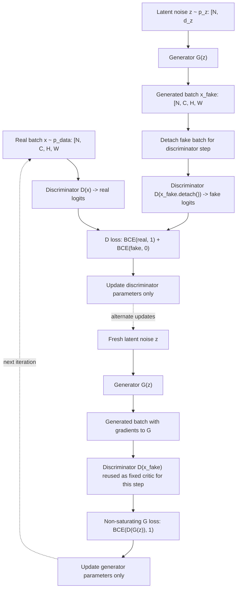
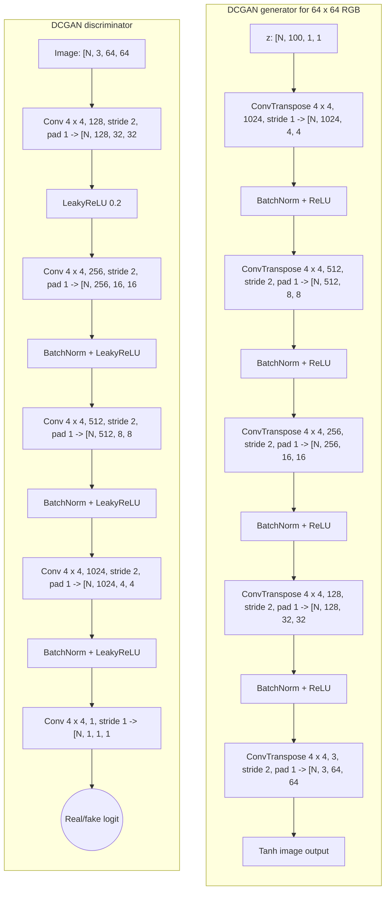

# Generative Adversarial Networks

Generative adversarial networks are D2L's introduction to adversarial generative modeling. A generator learns to produce samples, while a discriminator learns to distinguish generated samples from real data. The two networks define a game: the discriminator improves its ability to detect fakes, and the generator improves its ability to fool the discriminator.

GANs are important because they separate sample generation from explicit likelihood calculation. They can produce sharp images, and DCGANs show how convolutional design principles apply to generation. They are also notoriously delicate: loss curves can be hard to interpret, training can collapse to few modes, and the balance between generator and discriminator matters.

## Definitions

A **generator** $G(z)$ maps latent noise $z$ to a synthetic sample. The noise is usually drawn from a simple distribution such as a standard normal or uniform distribution.

A **discriminator** $D(x)$ maps a sample to a probability-like score that the sample is real.

The original GAN minimax objective is

$$
\min_G \max_D
\mathbb{E}_{x \sim p_{\mathrm{data}}}[\log D(x)]
+
\mathbb{E}_{z \sim p_z}[\log(1-D(G(z)))].
$$

In practice, the generator is often trained with the non-saturating loss

$$
L_G = -\mathbb{E}_{z \sim p_z}[\log D(G(z))],
$$

which gives stronger gradients when the discriminator confidently rejects generated samples.

**Mode collapse** occurs when the generator produces a narrow set of samples that fool the discriminator but fail to cover the data distribution.

**DCGAN** adapts GANs to images using convolutional and transposed convolutional layers, batch normalization, and stable architectural conventions.

**Latent space** is the input space of $z$ vectors. Interpolating between latent vectors often produces smooth changes in generated samples when training succeeds.

## Key results

GAN training alternates two optimization problems. For a discriminator step, real samples should be labeled $1$ and generated samples should be labeled $0$. For a generator step, generated samples are passed through the discriminator but optimized with labels $1$ so the generator learns to make them look real.

The discriminator should not be too weak or too strong. If it is too weak, the generator receives poor feedback. If it is too strong, the original minimax generator loss can saturate. This is one reason implementation details, learning rates, update ratios, and normalization matter.

At the ideal equilibrium under the original theory, the generator distribution matches the data distribution and the discriminator cannot do better than random guessing:

$$
D(x)=\frac{1}{2}.
$$

Real training rarely presents such a clean state. Visual samples, diversity checks, and task-specific metrics are often needed.

DCGAN replaces pooling with strided convolution or transposed convolution, uses batch normalization in many layers, and uses nonlinearities such as ReLU in the generator and LeakyReLU in the discriminator. The architecture encodes image locality while learning upsampling from latent vectors.

GANs differ from autoencoders. An autoencoder reconstructs inputs through an encoder and decoder. A GAN generator maps random noise to samples and is trained through an adversarial discriminator, not a direct reconstruction target.

Implementation details matter because the discriminator and generator losses use the same discriminator network in different ways. During the discriminator update, generated samples should usually be detached so gradients do not update the generator. During the generator update, the generated samples must not be detached because the discriminator's response supplies gradients back into the generator. This alternation is one of the first GAN-specific mechanics students tend to get wrong.

It is usually better to train with logits and a numerically stable binary-cross-entropy loss than to place a sigmoid layer at the end of the discriminator and then take logarithms manually. In PyTorch, `BCEWithLogitsLoss` combines the sigmoid and log terms stably. The discriminator can still be interpreted through `torch.sigmoid(logits)` for monitoring.

DCGAN architecture choices encode image priors. The generator gradually increases spatial resolution while reducing or reshaping channel depth. The discriminator does the reverse, turning spatial evidence into a real/fake score. Batch normalization and careful activations reduce some training instability, but they do not eliminate adversarial pathologies such as mode collapse.

Evaluation is difficult because likelihood is not directly available. Visual grids are useful but subjective. Diversity metrics, nearest-neighbor checks, downstream task utility, and distributional scores can provide more evidence. D2L's examples should therefore be read as a training pattern, not as a complete evaluation protocol for high-stakes generative modeling.

Mode collapse is especially important in applications. A generator that produces one excellent-looking sample repeatedly may fool a weak discriminator and look impressive in a small sample grid, but it has not learned the data distribution. Diversity should be checked by sampling many latent vectors, interpolating between them, and looking for coverage of the real data's modes. In image GANs, class-conditional generation or dataset labels can make collapse easier to diagnose.

The adversarial game also makes optimization nonstationary. The generator's loss surface changes whenever the discriminator changes, and the discriminator's task changes whenever the generator improves. This differs from supervised learning with a fixed target dataset and fixed loss. Alternating updates, learning-rate balance, and architectural constraints are attempts to keep this game informative long enough for useful samples to emerge.

GAN examples in D2L are deliberately small enough to inspect. That inspection is part of the lesson: plot generated samples, check discriminator outputs on real and fake batches, and verify that gradients reach the generator during its update. Without these checks, a GAN can appear to run while learning almost nothing.

Conditional GANs extend the same game by giving class labels or other conditions to both networks. The generator then learns $G(z,c)$ and the discriminator judges whether a sample is real and consistent with condition $c$. This is a common way to control generated content.

## Visual



The adversarial loop makes the detach boundary explicit: discriminator training uses generated samples without updating the generator, while generator training keeps the path through `G(z)` intact. Real and fake logits feed different binary targets for the discriminator, and the generator uses the discriminator response as a fooling loss. The alternating dotted arrows show why GAN optimization is nonstationary.




*Figure: DCGAN generator architecture from [Radford, Metz, and Chintala, 2015](https://arxiv.org/abs/1511.06434) — embedded under educational fair use with attribution.*

The DCGAN generator progressively upsamples a latent 1 x 1 tensor to a 64 x 64 RGB image with transposed convolutions, batch normalization, and ReLU. The discriminator mirrors that shape path with strided convolutions, LeakyReLU, and a final scalar logit. The paired diagrams show the image prior: generation increases spatial resolution while discrimination collapses spatial evidence into a real/fake score.

| Component | Input | Output | Training signal |
|---|---|---|---|
| Generator | Noise vector | Synthetic sample | Discriminator's response to fake samples |
| Discriminator | Real or fake sample | Real/fake logit | Binary labels for real and fake |
| DCGAN generator | Latent tensor | Image tensor | Adversarial loss |
| DCGAN discriminator | Image tensor | Real/fake logit | Binary cross-entropy |
| Latent interpolation | Two noise vectors | Sample path | Qualitative smoothness |

## Worked example 1: discriminator binary loss

Problem: a discriminator outputs probabilities $D(x_{\mathrm{real}})=0.8$ and $D(G(z))=0.3$. Compute the discriminator loss

$$
L_D = -\log D(x_{\mathrm{real}}) - \log(1-D(G(z))).
$$

Method:

1. Real-sample contribution:

$$
-\log(0.8) \approx 0.223.
$$

2. Fake-sample contribution:

$$
-\log(1-0.3) = -\log(0.7) \approx 0.357.
$$

3. Total:

$$
L_D \approx 0.223 + 0.357 = 0.580.
$$

Checked answer: the discriminator loss is about $0.580$. The discriminator is rewarded for assigning high probability to real samples and low probability to generated samples.

## Worked example 2: non-saturating generator loss

Problem: the discriminator assigns $D(G(z))=0.1$ to a generated sample. Compute the non-saturating generator loss and compare it with the value when $D(G(z))=0.7$.

Method:

1. Non-saturating generator loss:

$$
L_G = -\log D(G(z)).
$$

2. If $D(G(z))=0.1$:

$$
L_G=-\log(0.1)\approx 2.303.
$$

3. If $D(G(z))=0.7$:

$$
L_G=-\log(0.7)\approx 0.357.
$$

4. Interpret: lower loss means the generator is fooling the discriminator more successfully.

Checked answer: the generator loss drops from about $2.303$ to $0.357$ when the discriminator score on fake samples rises from $0.1$ to $0.7$.

## Code

```python
import torch
from torch import nn

torch.manual_seed(9)

latent_dim = 4
batch_size = 64

generator = nn.Sequential(
    nn.Linear(latent_dim, 16),
    nn.ReLU(),
    nn.Linear(16, 1),
)
discriminator = nn.Sequential(
    nn.Linear(1, 16),
    nn.LeakyReLU(0.2),
    nn.Linear(16, 1),
)

loss_fn = nn.BCEWithLogitsLoss()
opt_g = torch.optim.Adam(generator.parameters(), lr=0.01)
opt_d = torch.optim.Adam(discriminator.parameters(), lr=0.01)

real = torch.randn(batch_size, 1) * 0.5 + 2.0
z = torch.randn(batch_size, latent_dim)
fake = generator(z).detach()

real_logits = discriminator(real)
fake_logits = discriminator(fake)
d_loss = loss_fn(real_logits, torch.ones_like(real_logits)) + loss_fn(
    fake_logits, torch.zeros_like(fake_logits)
)
opt_d.zero_grad()
d_loss.backward()
opt_d.step()

z = torch.randn(batch_size, latent_dim)
fake = generator(z)
g_logits = discriminator(fake)
g_loss = loss_fn(g_logits, torch.ones_like(g_logits))
opt_g.zero_grad()
g_loss.backward()
opt_g.step()

print("discriminator loss:", d_loss.item())
print("generator loss:", g_loss.item())
```

## Common pitfalls

- Training the generator through a fake batch that was detached for the discriminator step.
- Reading GAN losses as if they should decrease monotonically like supervised losses.
- Letting the discriminator overpower the generator so feedback becomes unhelpful.
- Ignoring sample diversity and checking only whether a few generated examples look good.
- Using batch normalization carelessly in the discriminator when batch composition leaks information.
- Confusing transposed convolution with a literal inverse of convolution.

## Connections

- [Modern CNNs](/cs/deep-learning/modern-cnns)
- [Computer vision applications](/cs/deep-learning/computer-vision-applications)
- [Optimization algorithms](/cs/deep-learning/optimization-algorithms)
- [Probability and random variables](/math/probability-and-random-variables/)
- [Machine learning](/cs/machine-learning/)
