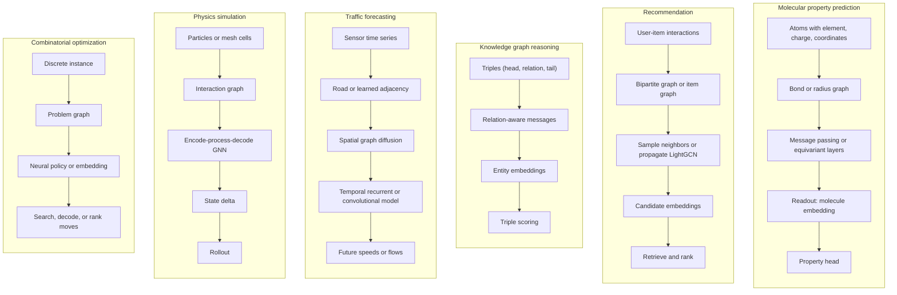
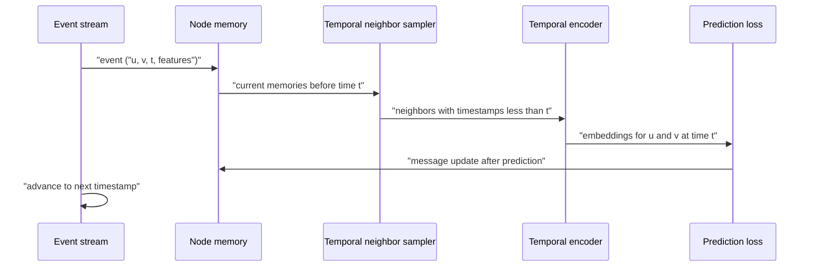

# Graph Neural Networks: Applications

GNN applications are diverse because graph structure appears whenever prediction depends on relationships. The same message-passing idea can predict a molecule's solubility, recommend products, complete a knowledge graph, forecast traffic, simulate a deforming mesh, or guide a combinatorial solver. What changes is the graph construction, the edge semantics, the time model, the loss, and the engineering needed to scale.


*Figure: Social and interaction graphs exhibit hubs, communities, and bridges. GNN applications exploit this structure for recommendation, ranking, fraud detection, and link prediction. Image: [Wikimedia Commons](https://commons.wikimedia.org/wiki/File:Social_Network_Analysis_Visualization.png), Calvinius, CC BY-SA 3.0.*

This chapter is an applied companion to [Graph Neural Networks: Basics](/cs/deep-learning/gnn-basics). It treats heterogeneous graphs, temporal graphs, major application domains, and current frontiers. The emphasis is practical: choose the graph, choose the supervision signal, preserve the right symmetries, avoid leakage, and evaluate in a way that resembles deployment.

## Definitions

A **homogeneous graph** has one node type and one edge type. A citation graph with only papers and citation edges is often modeled this way. A **heterogeneous graph** has multiple node or edge types, such as users, items, queries, sellers, and sessions in an e-commerce system. A **knowledge graph** is a typed directed multigraph of triples $(h,r,t)$, where $h$ is a head entity, $r$ is a relation, and $t$ is a tail entity.

Heterogeneous GNNs usually maintain type-specific parameters. In an R-GCN, each relation $r$ has a transformation matrix, and node $i$ receives messages from relation-specific neighborhoods [1]:

$$
h_i^{(\ell+1)}
=\sigma\left(
\sum_{r\in\mathcal{R}}\sum_{j\in\mathcal{N}_i^r}
\frac{1}{c_{i,r}}W_r^{(\ell)}h_j^{(\ell)}
+W_0^{(\ell)}h_i^{(\ell)}
\right).
$$

The normalization $c_{i,r}$ controls the scale of relation-specific neighborhoods. HAN uses meta-paths, such as author-paper-venue-paper-author, and applies attention over both neighbors and meta-path views [2]. HGT uses typed attention, typed message functions, and time-aware relative encodings for web-scale heterogeneous graphs [3].

Knowledge graph embedding models score triples without necessarily running a full GNN. TransE represents a relation as a translation and prefers $h+r\approx t$ [4]. RotatE represents relations as rotations in the complex plane [5]. ComplEx uses complex-valued bilinear scoring to model asymmetric relations [6]. GNN variants can use relation-aware message passing over the observed graph and then score candidate triples.

A **dynamic graph** changes over time. Snapshot-based methods represent the data as a sequence $G_1,G_2,\dots,G_T$, each with its own edges and features. Event-based methods represent the graph as timestamped events $(u,v,t,e)$, such as a user clicking an item at time $t$. TGAT uses time encodings inside temporal attention [7]. TGN maintains node memories updated by events and computes temporal embeddings from recent neighborhoods [8]. ROLAND adapts static GNN layers to dynamic graph snapshots by treating node representations as recurrent states across time [9].

Time encoding matters. Absolute time can capture seasonality, relative time can capture recency, and inter-event time can capture burstiness. In event streams, evaluation must respect chronology: training on future edges and testing on past edges is leakage, not generalization.

## Key results

Application success usually depends more on graph construction than on a single architecture name. A molecule can be a graph with atoms as nodes and bonds as edges; a recommender can be a bipartite user-item graph; a traffic network can use road connectivity, learned sensor similarity, or both; a physics simulator can use particles, cells, or mesh vertices; a satisfiability instance can use variables and clauses. The same layer formula can fail if the graph encodes the wrong relations.

For molecular property prediction, message passing aggregates local chemical environments. MoleculeNet made benchmark tasks visible across solubility, toxicity, quantum properties, and bioactivity [10]. Early neural message passing showed that edge-conditioned messages and set readouts can work well for quantum chemistry [11]. Equivariant models add geometry by respecting rotations and translations, which is essential when 3D conformation influences energy or binding. AlphaFold-style systems are broader than ordinary GNNs, but they show the same principle at scale: relational structure, attention, geometry, and learned pair representations can be combined for biological structure prediction [12].


*Figure: PinSAGE samples neighborhoods via random walks and aggregates them with a graph convolution to produce item embeddings at Pinterest scale. From [Ying et al., 2018](https://arxiv.org/abs/1806.01973) — embedded under educational fair use with attribution.*

For recommendation, the graph is usually bipartite or multipartite. PinSAGE performs random-walk-based neighbor sampling around items in a huge item graph, then applies graph convolutions for web-scale recommendation [13]. LightGCN removes feature transforms and nonlinearities from graph collaborative filtering, keeping only neighborhood propagation and layer combination [14]. GraphRec incorporates social relations and user-item interactions for social recommendation [15]. The practical pattern is often two-stage: graph embeddings retrieve candidates, and a richer ranker uses context, business constraints, and calibration.

For knowledge graph reasoning, relation type is central. R-GCN can classify entities by aggregating relation-specific neighborhoods [1]. For link prediction, a model scores candidate triples and trains against corrupted negatives. Attention-based reasoning can follow relation paths or weigh neighbors differently, but it must handle high-degree hubs, inverse relations, and incomplete facts. The distinction between closed-world and open-world assumptions is important: an unobserved triple is not always false.

For traffic forecasting, graph structure combines with temporal sequence modeling. DCRNN models diffusion over directed road networks and uses recurrent sequence learning for forecasting [16]. Graph WaveNet learns adaptive adjacency while using dilated temporal convolutions [17]. These models show that the "graph" may be partly physical and partly learned: road distance is useful, but sensor correlations can reveal functional connections not visible in the map.


*Figure: MeshGraphNet uses encoder-processor-decoder message passing over mesh nodes to roll out physics simulations on irregular geometries. From [Pfaff et al., 2020](https://arxiv.org/abs/2010.03409) — embedded under educational fair use with attribution.*

For physics simulation, the graph is a computational substrate. Graph Network Simulator represents particles as nodes and interactions as edges, using message passing to predict accelerations or state changes [18]. MeshGraphNet applies GNNs to mesh-based simulation, adapting to irregular meshes and complex boundaries [19]. These systems often roll out predictions for many steps, so small one-step errors can compound. Conservation laws, equivariance, boundary conditions, and stable integration are as important as test loss.

For combinatorial optimization, the graph represents a discrete problem instance. NeuroSAT embeds variables and clauses in a bipartite graph to predict satisfiability-like structure [20]. Attention-based TSP solvers learn policies over nodes and edges for routing [21]. Graph matching, maximum cut, scheduling, and routing models often train with reinforcement learning, imitation learning, or differentiable relaxations. The key caution is that neural solvers are usually heuristic: they may be useful for candidate generation or warm starts without replacing exact algorithms when guarantees are required.

Scalability is a separate design axis. Billion-edge graphs cannot be trained by repeatedly materializing full neighborhoods. Neighbor sampling, layer-wise sampling, subgraph batching, cluster-GCN, graph partitioning, cached embeddings, and distributed training are engineering necessities [22]. The right method depends on whether the bottleneck is memory, feature lookup, negative sampling, message fanout, or serving latency.

Graph foundation models are an emerging frontier. GraphGPS combines local message passing with global attention and positional or structural encodings [23]. OFA reformulates different graph tasks so one model can address many classification settings [24]. GNNs plus LLMs connect text-rich nodes, tool reasoning, retrieval, and graph structure. These systems are promising, but they raise evaluation problems: pretraining corpora may overlap with benchmarks, prompts can leak labels, and text may dominate structure unless ablations are careful.

| Domain | Graph construction | Representative architecture | Main risk |
|---|---|---|---|
| Molecules | Atoms and bonds, often 3D coordinates | MPNN, SchNet, EGNN | Conformation and data split leakage |
| Recommendation | User-item or item-item interactions | PinSAGE, LightGCN, GraphRec | Exposure bias and stale feedback |
| Knowledge graphs | Entity-relation triples | R-GCN, TransE, RotatE, ComplEx | False negatives from missing facts |
| Traffic | Sensors or roads with spatial edges | DCRNN, Graph WaveNet | Nonstationarity and sensor failure |
| Physics | Particles, cells, or mesh vertices | GNS, MeshGraphNet | Rollout instability |
| Optimization | Variables, clauses, cities, jobs | NeuroSAT, attention TSP | Lack of guarantees |

## Visual





The first diagram groups applications by graph construction and prediction head. The second diagram shows the causality discipline in event-based temporal GNNs: compute an embedding using history before time $t$, make the prediction, then update memory with the event. Reversing those steps leaks the answer into the representation.

## Worked example 1: LightGCN propagation on a bipartite recommender graph

Problem: a tiny recommender has users $u_1,u_2$ and items $i_1,i_2$. Interactions are $(u_1,i_1)$, $(u_1,i_2)$, and $(u_2,i_2)$. Initial scalar embeddings are

$$
e_{u_1}^{(0)}=1,\quad e_{u_2}^{(0)}=3,\quad e_{i_1}^{(0)}=2,\quad e_{i_2}^{(0)}=4.
$$

Compute one LightGCN propagation step with symmetric normalization:

$$
e_x^{(1)}=\sum_{y\in\mathcal{N}(x)}
\frac{1}{\sqrt{d_xd_y}}e_y^{(0)}.
$$

Method:

1. Compute degrees:

$$
d_{u_1}=2,\qquad d_{u_2}=1,\qquad d_{i_1}=1,\qquad d_{i_2}=2.
$$

2. Update $u_1$, whose neighbors are $i_1$ and $i_2$:

$$
\begin{aligned}
e_{u_1}^{(1)}
&=\frac{1}{\sqrt{2\cdot1}}e_{i_1}^{(0)}
+\frac{1}{\sqrt{2\cdot2}}e_{i_2}^{(0)}\\
&=\frac{1}{\sqrt{2}}(2)+\frac{1}{2}(4)\\
&=1.414+2=3.414.
\end{aligned}
$$

3. Update $u_2$, whose only neighbor is $i_2$:

$$
e_{u_2}^{(1)}
=\frac{1}{\sqrt{1\cdot2}}(4)
=2.828.
$$

4. Update $i_1$, whose only neighbor is $u_1$:

$$
e_{i_1}^{(1)}
=\frac{1}{\sqrt{1\cdot2}}(1)
=0.707.
$$

5. Update $i_2$, whose neighbors are $u_1$ and $u_2$:

$$
\begin{aligned}
e_{i_2}^{(1)}
&=\frac{1}{\sqrt{2\cdot2}}(1)
+\frac{1}{\sqrt{2\cdot1}}(3)\\
&=0.5+2.121=2.621.
\end{aligned}
$$

6. LightGCN commonly combines layer $0$ and layer $1$ by averaging. For $u_1$ and $i_1$:

$$
\bar{e}_{u_1}=\frac{1+3.414}{2}=2.207,
\qquad
\bar{e}_{i_1}=\frac{2+0.707}{2}=1.354.
$$

7. The dot-product score for $u_1$ and $i_1$ is

$$
\bar{e}_{u_1}\bar{e}_{i_1}=2.207(1.354)=2.988.
$$

Checked answer: the one-step propagated embeddings are $3.414$, $2.828$, $0.707$, and $2.621$ for $u_1,u_2,i_1,i_2$. The example shows why LightGCN can work without nonlinear layers: collaborative filtering signal is already encoded in normalized neighborhood propagation.

## Worked example 2: temporal aggregation in a TGN-style memory model

Problem: node $A$ receives two interaction messages before time $t=10$. At time $2$, it receives message $m_1=[1,0]$. At time $7$, it receives message $m_2=[0,2]$. Use exponential time decay with weight $\exp(-(10-t_k)/5)$ and aggregate by weighted average. Compute the memory input for node $A$ at time $10$.

Method:

1. Compute the age of each message:

$$
\Delta t_1=10-2=8,\qquad \Delta t_2=10-7=3.
$$

2. Compute decay weights:

$$
w_1=e^{-8/5}=e^{-1.6}\approx0.202,
\qquad
w_2=e^{-3/5}=e^{-0.6}\approx0.549.
$$

3. Compute the weighted message sum:

$$
w_1m_1+w_2m_2
=0.202[1,0]+0.549[0,2]
=[0.202,1.098].
$$

4. Compute the total weight:

$$
w_1+w_2=0.202+0.549=0.751.
$$

5. Divide componentwise:

$$
\bar{m}
=\frac{[0.202,1.098]}{0.751}
\approx[0.269,1.462].
$$

6. Interpret causality. If an event at time $12$ exists in the log, it must not be included when computing the embedding at time $10$.

Checked answer: the time-decayed aggregate is approximately $[0.269,1.462]$. The later message receives more weight because it is more recent.

## Code

```python
import torch

# LightGCN-style propagation for the worked recommender graph.
# Node order: u1, u2, i1, i2.
edges = torch.tensor([
    [0, 2],
    [2, 0],
    [0, 3],
    [3, 0],
    [1, 3],
    [3, 1],
])
emb0 = torch.tensor([[1.0], [3.0], [2.0], [4.0]])

num_nodes = emb0.size(0)
degree = torch.zeros(num_nodes)
degree.scatter_add_(0, edges[:, 0], torch.ones(edges.size(0)))

src, dst = edges[:, 0], edges[:, 1]
weights = 1.0 / torch.sqrt(degree[src] * degree[dst])
messages = weights.unsqueeze(1) * emb0[dst]
emb1 = torch.zeros_like(emb0)
emb1.index_add_(0, src, messages)
emb_final = 0.5 * (emb0 + emb1)

score_u1_i1 = (emb_final[0] * emb_final[2]).sum()
print("one-step embeddings:", emb1.squeeze().round(decimals=3))
print("u1-i1 score:", score_u1_i1.round(decimals=3))

# TGN-style time-decayed aggregation.
times = torch.tensor([2.0, 7.0])
messages = torch.tensor([[1.0, 0.0], [0.0, 2.0]])
query_time = torch.tensor(10.0)
decay = torch.exp(-(query_time - times) / 5.0)
temporal_message = (decay[:, None] * messages).sum(dim=0) / decay.sum()
print("temporal aggregate:", temporal_message.round(decimals=3))
```

## Common pitfalls

- Building the graph from information unavailable at prediction time. Temporal and recommendation systems are especially vulnerable to future leakage.
- Treating all missing knowledge graph triples as false. Many are simply unobserved.
- Evaluating recommenders with random interaction splits when deployment is chronological. Time-based splits are often more realistic.
- Ignoring exposure bias. A user cannot click an item that was never shown.
- Using the same negative sampling distribution for training and evaluation without asking whether it matches the deployed candidate set.
- Collapsing heterogeneous edge types into one adjacency when relation semantics matter.
- Overusing meta-paths without domain justification. Meta-path design should reflect plausible relational mechanisms.
- Assuming a road map adjacency is always the best traffic graph. Learned functional adjacency can capture sensor correlations, but it also needs regularization.
- Rolling out physics predictions only one step during evaluation. Long-horizon stability is the real test.
- Comparing neural combinatorial solvers only by average quality. Worst cases and constraint violations matter.
- Scaling by increasing neighbor fanout blindly. Fanout multiplies across layers and can dominate memory.
- Forgetting cold-start cases. New users, items, molecules, roads, and entities may lack historical edges.
- Letting text features dominate graph structure in graph-plus-LLM systems without ablation.
- Assuming graph foundation models eliminate task-specific validation. Transfer claims need careful splits and leakage checks.
- Serving stale embeddings in fast-changing graphs. Freshness can matter as much as offline accuracy.

## Connections

- [Graph Neural Networks: Basics](/cs/deep-learning/gnn-basics) gives the spectral, message-passing, attention, expressiveness, and equivariance foundations used here.
- [recommender systems](/cs/deep-learning/recommender-systems) provides matrix factorization, neural collaborative filtering, ranking metrics, and serving context for graph recommendation.
- [attention and transformers](/cs/deep-learning/attention-transformers) connects graph attention, graph transformers, and temporal attention to the broader Transformer family.
- [pretrained transformers NLP](/cs/deep-learning/pretrained-transformers-nlp) is relevant when graph nodes or edges carry text and LLM embeddings become node features.
- [reinforcement learning and Bayesian tuning](/cs/deep-learning/reinforcement-learning-and-bayesian-tuning) connects to neural combinatorial optimization and policy-based graph solvers.
- [computational performance](/cs/deep-learning/computational-performance) covers batching, memory, and hardware concerns that become severe on large graphs.
- [graph-theory](/math/graph-theory/intro) supports paths, flows, matchings, planarity, random graphs, and algebraic graph theory behind many application graphs.
- [linear-algebra](/math/linear-algebra/intro) supports embeddings, sparse matrix multiplication, eigenspaces, and bilinear knowledge graph scores.
- [probability](/math/probability/intro) supports random walks, temporal point processes, negative sampling, and uncertainty in graph predictions.

## References

[1] M. Schlichtkrull et al., "Modeling Relational Data with Graph Convolutional Networks," ESWC, 2018. https://arxiv.org/abs/1703.06103

[2] X. Wang et al., "Heterogeneous Graph Attention Network," WWW, 2019. https://arxiv.org/abs/1903.07293

[3] Z. Hu et al., "Heterogeneous Graph Transformer," WWW, 2020. https://arxiv.org/abs/2003.01332

[4] A. Bordes, N. Usunier, A. Garcia-Duran, J. Weston, and O. Yakhnenko, "Translating Embeddings for Modeling Multi-relational Data," NeurIPS, 2013. https://proceedings.neurips.cc/paper_files/paper/2013/hash/1cecc7a77928ca8133fa24680a88d2f9-Abstract.html

[5] Z. Sun, Z.-H. Deng, J.-Y. Nie, and J. Tang, "RotatE: Knowledge Graph Embedding by Relational Rotation in Complex Space," ICLR, 2019. https://arxiv.org/abs/1902.10197

[6] T. Trouillon, J. Welbl, S. Riedel, E. Gaussier, and G. Bouchard, "Complex Embeddings for Simple Link Prediction," ICML, 2016. https://arxiv.org/abs/1606.06357

[7] D. Xu, C. Ruan, E. Korpeoglu, S. Kumar, and K. Achan, "Inductive Representation Learning on Temporal Graphs," ICLR, 2020. https://arxiv.org/abs/2002.07962

[8] E. Rossi et al., "Temporal Graph Networks for Deep Learning on Dynamic Graphs," ICML Workshop, 2020. https://arxiv.org/abs/2006.10637

[9] J. You, T. Du, R. Ying, and J. Leskovec, "ROLAND: Graph Learning Framework for Dynamic Graphs," KDD, 2022. https://arxiv.org/abs/2208.07239

[10] Z. Wu et al., "MoleculeNet: A Benchmark for Molecular Machine Learning," Chemical Science, 2018. https://arxiv.org/abs/1703.00564

[11] J. Gilmer, S. S. Schoenholz, P. F. Riley, O. Vinyals, and G. E. Dahl, "Neural Message Passing for Quantum Chemistry," ICML, 2017. https://arxiv.org/abs/1704.01212

[12] J. Jumper et al., "Highly Accurate Protein Structure Prediction with AlphaFold," Nature, 2021. https://www.nature.com/articles/s41586-021-03819-2

[13] R. Ying et al., "Graph Convolutional Neural Networks for Web-Scale Recommender Systems," KDD, 2018. https://arxiv.org/abs/1806.01973

[14] X. He, K. Deng, X. Wang, Y. Li, Y. Zhang, and M. Wang, "LightGCN: Simplifying and Powering Graph Convolution Network for Recommendation," SIGIR, 2020. https://arxiv.org/abs/2002.02126

[15] W. Fan et al., "Graph Neural Networks for Social Recommendation," WWW, 2019. https://arxiv.org/abs/1902.07243

[16] Y. Li, R. Yu, C. Shahabi, and Y. Liu, "Diffusion Convolutional Recurrent Neural Network: Data-Driven Traffic Forecasting," ICLR, 2018. https://arxiv.org/abs/1707.01926

[17] Z. Wu, S. Pan, G. Long, J. Jiang, and C. Zhang, "Graph WaveNet for Deep Spatial-Temporal Graph Modeling," IJCAI, 2019. https://arxiv.org/abs/1906.00121

[18] A. Sanchez-Gonzalez et al., "Learning to Simulate Complex Physics with Graph Networks," ICML, 2020. https://arxiv.org/abs/2002.09405

[19] T. Pfaff, M. Fortunato, A. Sanchez-Gonzalez, and P. Battaglia, "Learning Mesh-Based Simulation with Graph Networks," ICLR, 2021. https://arxiv.org/abs/2010.03409

[20] D. Selsam, M. Lamm, B. Bunz, P. Liang, L. de Moura, and D. L. Dill, "Learning a SAT Solver from Single-Bit Supervision," ICLR, 2019. https://arxiv.org/abs/1802.03685

[21] W. Kool, H. van Hoof, and M. Welling, "Attention, Learn to Solve Routing Problems!" ICLR, 2019. https://arxiv.org/abs/1803.08475

[22] W.-L. Chiang et al., "Cluster-GCN: An Efficient Algorithm for Training Deep and Large Graph Convolutional Networks," KDD, 2019. https://arxiv.org/abs/1905.07953

[23] L. Rampasek et al., "Recipe for a General, Powerful, Scalable Graph Transformer," NeurIPS, 2022. https://arxiv.org/abs/2205.12454

[24] Y. Liu et al., "One for All: Towards Training One Graph Model for All Classification Tasks," ICLR, 2024. https://arxiv.org/abs/2310.00149
