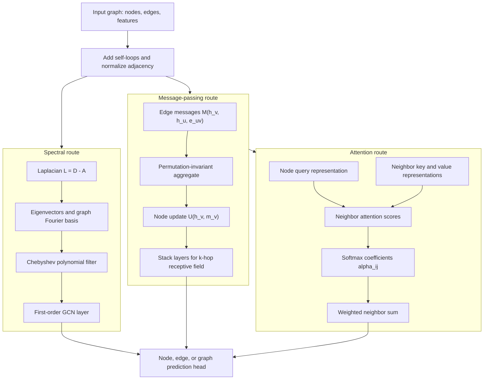
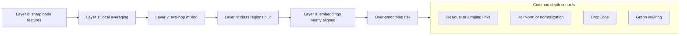

# Graph Neural Networks: Basics

Graphs are the natural data structure when the important signal is not just a vector, sequence, or grid, but a set of entities connected by relations. Molecules are atoms joined by bonds, social platforms are people joined by interactions, recommender systems are users connected to items, traffic networks are sensors connected by roads, and knowledge graphs are entities connected by typed facts. Graph neural networks, or GNNs, learn representations that respect this relational structure while still using the differentiable optimization tools of deep learning.


*Figure: The bridges of Konigsberg motivated the abstraction from physical layout to graph structure that GNNs now extend with learned representations. Image: [Wikimedia Commons](https://commons.wikimedia.org/wiki/File:Konigsberg_Bridge.png), Merian-Erben, public domain.*

This chapter consolidates the foundations: graph notation, spectral graph convolutions, message passing, attention on graphs, expressiveness limits, depth pathologies, and geometric equivariance. It connects directly to [linear algebra](/math/linear-algebra/intro), [graph theory](/math/graph-theory/intro), [attention and transformers](/cs/deep-learning/attention-transformers), and the application chapter [Graph Neural Networks: Applications](/cs/deep-learning/gnn-applications). The goal is not to memorize architecture names, but to see how most GNNs alternate between local communication over edges and learned nonlinear feature transformations.

## Definitions

A graph is $G=(V,E)$ with node set $V$, edge set $E$, and often attributes. For $n=\vert V\vert $, the adjacency matrix $A\in\mathbb{R}^{n\times n}$ has $A_{ij}\ne 0$ when an edge connects node $i$ to node $j$. In an unweighted simple graph, $A_{ij}\in\{0,1\}$. In a weighted graph, $A_{ij}$ stores an edge weight. In a directed graph, $A_{ij}$ and $A_{ji}$ may differ. In an undirected graph, $A=A^T$. Node features are stored as $X\in\mathbb{R}^{n\times d}$, where row $x_i$ describes node $i$. Edge features may be stored as $e_{ij}$ for each edge $(i,j)$, or as a tensor indexed by edge list position.

The degree matrix $D$ is diagonal, with $D_{ii}=\sum_j A_{ij}$ for an undirected unweighted graph. The combinatorial graph Laplacian is

$$
L=D-A.
$$

The normalized Laplacian is often written

$$
L_{\mathrm{sym}}=I-D^{-1/2}AD^{-1/2}.
$$

GCN-style layers usually add self-loops before normalization. If $\hat{A}=A+I$ and $\hat{D}_{ii}=\sum_j \hat{A}_{ij}$, then the renormalized adjacency is

$$
\tilde{A}=\hat{D}^{-1/2}\hat{A}\hat{D}^{-1/2}.
$$

Some texts write $\tilde{A}=D^{-1/2}(A+I)D^{-1/2}$ and let $D$ mean the degree matrix of $A+I$. The important implementation point is that the degree should match the adjacency after self-loops are added.

Graph tasks differ by prediction target. A **node-level task** predicts labels or values for nodes, such as classifying papers in a citation graph. An **edge-level task** predicts edges or edge labels, such as link prediction or relation classification. A **graph-level task** predicts one label or value for an entire graph, such as molecular property prediction. In **transductive learning**, the training procedure can see the full graph structure, including unlabeled test nodes, but not their labels. In **inductive learning**, the model must generalize to new nodes or new graphs that were not present during training.

Before neural message passing became standard, classical graph embedding methods learned node vectors from graph proximity. DeepWalk runs truncated random walks and trains a skip-gram objective, treating walks like sentences [1]. node2vec biases random walks between breadth-first and depth-first behavior, allowing embeddings to prefer homophily or structural role similarity [2]. LINE preserves first-order and second-order proximity in large networks [3]. These methods are useful background because they already express a core idea of GNNs: graph neighborhoods provide training signal even when labels are sparse.

## Key results

Spectral graph methods start from the Laplacian eigendecomposition. For an undirected graph, $L$ is symmetric positive semidefinite, so

$$
L=U\Lambda U^T,
$$

where columns of $U$ are orthonormal eigenvectors and $\Lambda$ is diagonal. The graph Fourier transform of a signal $x\in\mathbb{R}^n$ is $\hat{x}=U^Tx$, and the inverse transform is $x=U\hat{x}$. A spectral graph convolution applies a filter $g_\theta(\Lambda)$ in the Fourier domain:

$$
g_\theta * x = U g_\theta(\Lambda) U^T x.
$$

The direct spectral formula is elegant but expensive and not obviously transferable across graphs with different eigenbases [4]. ChebNet replaces the arbitrary spectral filter with a polynomial in a scaled Laplacian:

$$
g_\theta * x \approx \sum_{k=0}^{K}\theta_k T_k(\tilde{L})x,
$$

where $T_k$ are Chebyshev polynomials [5]. Because a degree-$K$ polynomial in $L$ only mixes information within $K$ hops, ChebNet turns a spectral construction into a localized computation.

The standard GCN layer can be read as a first-order Chebyshev simplification followed by a renormalization trick [6]:

$$
H^{(\ell+1)}=\sigma(\tilde{A}H^{(\ell)}W^{(\ell)}),
$$

with $H^{(0)}=X$. The multiplication $\tilde{A}H^{(\ell)}$ averages neighboring hidden states, including the node itself. The matrix $W^{(\ell)}$ then mixes feature channels. This "aggregate over graph, transform over channels" pattern is the backbone of many GNNs.

Message passing generalizes the idea. In the MPNN abstraction of Gilmer et al. [7], each layer computes messages along edges, aggregates them at each node, and updates the node state:

$$
m_v^{(\ell+1)}=\sum_{u\in\mathcal{N}(v)}
M_\ell(h_v^{(\ell)},h_u^{(\ell)},e_{uv}),
\qquad
h_v^{(\ell+1)}=U_\ell(h_v^{(\ell)},m_v^{(\ell+1)}).
$$

The sum can be replaced by any permutation-invariant aggregator, such as mean or max. Permutation invariance is essential: reordering neighbors should not change the represented graph.

GraphSAGE was designed for inductive learning on large graphs [8]. Instead of multiplying by the full adjacency, it samples a fixed number of neighbors at each hop and aggregates with a mean, max-pooling network, or LSTM-style aggregator. Sampling bounds memory and lets a model compute embeddings for new nodes from features and sampled neighborhoods. GIN, the Graph Isomorphism Network, uses a sum aggregator followed by an MLP:

$$
h_v^{(k)}=\mathrm{MLP}^{(k)}
\left((1+\epsilon^{(k)})h_v^{(k-1)}
+\sum_{u\in\mathcal{N}(v)}h_u^{(k-1)}\right).
$$

The sum aggregator is crucial. Xu et al. showed that injective multiset aggregation makes GIN as powerful as the 1-dimensional Weisfeiler-Lehman, or 1-WL, graph isomorphism test within the message-passing family [9].

Graph attention networks assign different weights to different neighbors [10]. With transformed node features $Wh_i$, a typical single-head GAT coefficient is

$$
\alpha_{ij}=\mathrm{softmax}_j\!\left(
\mathrm{LeakyReLU}(a^T[Wh_i\Vert Wh_j])
\right).
$$

The updated node representation is a weighted sum of neighbor features. Multi-head attention stabilizes learning and lets different heads attend to different relation patterns. GATv2 changes the order of linear projection and attention scoring so the ranking of neighbors can depend more dynamically on the query node [11]. Graph transformers take the attention idea further by allowing global or sparsified attention and injecting graph structure through spatial encodings, centrality encodings, edge encodings, Laplacian eigenvectors, random-walk features, or shortest-path biases. Graphormer is a representative architecture that adds centrality, spatial, and edge encodings to Transformer-style attention [12].

Expressiveness has a precise ceiling. Standard message-passing GNNs update node states by repeatedly aggregating neighbor multisets. Therefore, if the 1-WL color refinement test cannot distinguish two graphs, a broad class of message-passing GNNs cannot distinguish them either [9], [13]. This is not a practical death sentence, since many real tasks are not adversarial isomorphism tests, but it explains why higher-order GNNs, positional encodings, subgraph methods, and graph transformers exist.

Depth introduces two common pathologies. **Over-smoothing** means node embeddings become increasingly similar as layers repeatedly average over the graph. For a connected graph, powers of a normalized adjacency tend to wash out high-frequency variation, and Dirichlet energy often decays with depth [14], [15]. **Over-squashing** means information from exponentially many distant nodes is compressed through a small number of edges into fixed-width hidden states [16]. This is especially severe when a graph has narrow bottlenecks or negative curvature-like expansion properties [17].

Mitigations alter optimization, propagation, or graph structure. Residual and jumping-knowledge connections preserve early-layer information. PairNorm rescales node embeddings to counter collapse [18]. DropEdge randomly removes edges during training so propagation is less aggressively smoothing [19]. Graph rewiring methods add or remove edges to reduce bottlenecks, improve diffusion, or introduce positional shortcuts. No mitigation is universal: a homophilous citation graph and a molecular geometry graph have different failure modes.


*Figure: E(n)-Equivariant GNN propagates features alongside coordinates so that translations, rotations, and reflections of the input transform the output consistently. From [Satorras et al., 2021](https://arxiv.org/abs/2102.09844) — embedded under educational fair use with attribution.*

Geometric GNNs add symmetry constraints beyond node permutation. A graph model is **permutation equivariant** if reordering node indices reorders node outputs the same way. For point clouds and molecules, we may also require translation, rotation, and reflection behavior. SchNet models continuous-filter interactions between atoms using distances, making it suitable for quantum chemistry [20]. EGNNs update both features and coordinates while preserving $E(n)$ equivariance [21]. A simplified coordinate update has the form

$$
x_i^{(\ell+1)}=
x_i^{(\ell)}+
\sum_{j\ne i}(x_i^{(\ell)}-x_j^{(\ell)})
\phi_x(m_{ij}),
$$

where $m_{ij}$ is an edge message computed from features and squared distances. Because the coordinate displacement is built from relative vectors, rotating or translating the input transforms the output consistently.

| Family | Core operation | Strength | Typical limitation |
|---|---|---|---|
| DeepWalk/node2vec/LINE | Unsupervised proximity embeddings | Simple scalable pretraining | Not end-to-end with task features |
| Spectral GNN | Filter graph Fourier modes | Strong link to Laplacian theory | Eigenbasis transfer and cost |
| GCN | Normalized neighbor averaging plus linear map | Sparse, stable baseline | Over-smoothing with depth |
| GraphSAGE | Sampled neighborhood aggregation | Inductive and scalable | Sampling variance and fanout tuning |
| GIN | Sum aggregation plus MLP | 1-WL-level expressiveness | Can overfit and lacks geometry |
| GAT/GATv2 | Learned neighbor attention | Adaptive edge weighting | Attention cost and instability |
| Graph Transformer | Global or biased attention | Long-range modeling | Requires structural encodings |
| Equivariant GNN | Symmetry-respecting feature and coordinate updates | Molecular and physical systems | More specialized assumptions |

## Visual





The first diagram shows how spectral convolution, message passing, and attention are not separate subjects. They are different views of the same design problem: how to move information across graph edges while preserving permutation structure. The second diagram isolates the depth problem. More layers enlarge the receptive field, but repeated averaging can erase distinctions unless the architecture preserves earlier signals or changes the propagation geometry.

## Worked example 1: GCN forward pass on a 3-node graph

Problem: compute one GCN layer on a path graph with three nodes, $1-2-3$. Use scalar node features

$$
H=
\begin{bmatrix}
1\\
2\\
0
\end{bmatrix},
\qquad
W=
\begin{bmatrix}
2
\end{bmatrix},
$$

and no nonlinear activation, so the output is $\tilde{A}HW$.

Method:

1. Write the adjacency matrix without self-loops:

$$
A=
\begin{bmatrix}
0&1&0\\
1&0&1\\
0&1&0
\end{bmatrix}.
$$

2. Add self-loops:

$$
\hat{A}=A+I=
\begin{bmatrix}
1&1&0\\
1&1&1\\
0&1&1
\end{bmatrix}.
$$

3. Compute degrees after self-loops:

$$
\hat{D}=\mathrm{diag}(2,3,2).
$$

4. Compute normalized entries $\tilde{A}_{ij}=\hat{A}_{ij}/\sqrt{\hat{D}_{ii}\hat{D}_{jj}}$:

$$
\tilde{A}=
\begin{bmatrix}
1/2 & 1/\sqrt{6} & 0\\
1/\sqrt{6} & 1/3 & 1/\sqrt{6}\\
0 & 1/\sqrt{6} & 1/2
\end{bmatrix}.
$$

5. Multiply $\tilde{A}H$:

$$
\begin{aligned}
(\tilde{A}H)_1
&= \frac{1}{2}(1)+\frac{1}{\sqrt{6}}(2)+0(0)
=0.5+0.816=1.316,\\
(\tilde{A}H)_2
&= \frac{1}{\sqrt{6}}(1)+\frac{1}{3}(2)+\frac{1}{\sqrt{6}}(0)
=0.408+0.667=1.075,\\
(\tilde{A}H)_3
&=0(1)+\frac{1}{\sqrt{6}}(2)+\frac{1}{2}(0)
=0.816.
\end{aligned}
$$

6. Multiply by $W=2$:

$$
\tilde{A}HW \approx
\begin{bmatrix}
2.632\\
2.150\\
1.632
\end{bmatrix}.
$$

Checked answer: node $1$ receives its own feature and node $2$'s feature, node $2$ receives all three, and node $3$ receives node $2$ plus itself. The normalization prevents the high-degree middle node from dominating purely because it has more neighbors.

## Worked example 2: GAT attention coefficients on a small graph

Problem: node $1$ attends to itself and two neighbors, nodes $2$ and $3$. Let transformed one-dimensional features be

$$
Wh_1=1,\qquad Wh_2=2,\qquad Wh_3=-1.
$$

Use attention vector $a=[1,1]^T$ and LeakyReLU with slope $0.2$ for negative inputs. Compute $\alpha_{12}$, $\alpha_{13}$, and $\alpha_{11}$.

Method:

1. Compute raw concatenation scores $a^T[Wh_1\Vert Wh_j]$:

$$
\begin{aligned}
s_{11} &= 1+1=2,\\
s_{12} &= 1+2=3,\\
s_{13} &= 1+(-1)=0.
\end{aligned}
$$

2. Apply LeakyReLU. All scores are nonnegative, so they are unchanged:

$$
z_{11}=2,\qquad z_{12}=3,\qquad z_{13}=0.
$$

3. Compute exponentials:

$$
e^{z_{11}}=e^2\approx 7.389,\quad
e^{z_{12}}=e^3\approx 20.086,\quad
e^{z_{13}}=e^0=1.
$$

4. Sum the denominator:

$$
7.389+20.086+1=28.475.
$$

5. Normalize:

$$
\alpha_{11}=\frac{7.389}{28.475}\approx0.259,
\qquad
\alpha_{12}=\frac{20.086}{28.475}\approx0.705,
\qquad
\alpha_{13}=\frac{1}{28.475}\approx0.035.
$$

6. If the value vectors equal the transformed features, the weighted output is

$$
0.259(1)+0.705(2)+0.035(-1)=1.634.
$$

Checked answer: node $2$ receives the largest weight because its score with node $1$ is highest. The attention weights sum to $0.999$ after rounding, as required by softmax.

## Code

```python
import torch
import torch.nn.functional as F

torch.manual_seed(7)

# Undirected path 0-1-2 with self-loops added explicitly.
A = torch.tensor([
    [1.0, 1.0, 0.0],
    [1.0, 1.0, 1.0],
    [0.0, 1.0, 1.0],
])
X = torch.tensor([[1.0], [2.0], [0.0]])
W = torch.tensor([[2.0]])

deg = A.sum(dim=1)
D_inv_sqrt = torch.diag(torch.pow(deg, -0.5))
A_norm = D_inv_sqrt @ A @ D_inv_sqrt
gcn_out = A_norm @ X @ W

print("normalized adjacency")
print(A_norm.round(decimals=3))
print("gcn output")
print(gcn_out.round(decimals=3))

# A tiny single-head GAT score computation for node 0.
Wh = torch.tensor([[1.0], [2.0], [-1.0]])
center = Wh[0].repeat(3, 1)
pairs = torch.cat([center, Wh], dim=1)
a = torch.tensor([[1.0], [1.0]])
logits = F.leaky_relu((pairs @ a).squeeze(), negative_slope=0.2)
alpha = torch.softmax(logits, dim=0)
gat_out = (alpha.unsqueeze(1) * Wh).sum(dim=0)

print("gat attention:", alpha.round(decimals=3))
print("gat output:", gat_out.round(decimals=3))
```

## Common pitfalls

- Confusing the degree matrix before and after adding self-loops. In a GCN, normalize the same adjacency that is actually propagated.
- Treating node order as meaningful. A valid graph model should be invariant or equivariant to relabeling unless explicit positional identifiers are part of the data.
- Assuming more layers always help. More layers increase receptive field, but also increase over-smoothing and over-squashing risk.
- Forgetting edge directions. Symmetrizing a directed graph can erase causality, citation direction, transaction flow, or dependency direction.
- Using mean aggregation when multiplicity matters. Mean can map different multisets to the same vector; sum plus an MLP is more expressive.
- Evaluating transductive and inductive settings interchangeably. Seeing the test graph during training is a major modeling assumption.
- Ignoring feature scale. Graph aggregation mixes feature vectors, so unnormalized numerical attributes can dominate learned messages.
- Believing attention is automatically explanatory. Attention weights are model internals and may not equal causal importance.
- Building dense $n\times n$ adjacency matrices for large sparse graphs. Use edge lists or sparse tensors when $\vert E\vert \ll n^2$.
- Forgetting that 1-WL limits are about architecture classes. A task can still be solved if labels, features, positions, or substructures break symmetry.
- Applying Euclidean equivariant models to arbitrary relational graphs. Coordinate-based symmetry assumptions only make sense when coordinates have physical meaning.
- Leaking labels through graph construction. Edges built using target labels or future information can make validation accuracy meaningless.

## Connections

- [Graph Neural Networks: Applications](/cs/deep-learning/gnn-applications) applies these layers to molecules, recommenders, knowledge graphs, traffic, physics, and optimization.
- [attention and transformers](/cs/deep-learning/attention-transformers) explains the attention mechanism reused by GATs and graph transformers.
- [recommender systems](/cs/deep-learning/recommender-systems) connects user-item graphs to matrix factorization and graph-based recommendation.
- [optimization algorithms](/cs/deep-learning/optimization-algorithms) gives the training background for sparse minibatches and deep stacks.
- [math for deep learning](/cs/deep-learning/math-for-deep-learning) reviews the linear algebra and differentiation used in GNN layers.
- [graph-theory](/math/graph-theory/intro) provides the underlying language of walks, paths, connectivity, trees, and graph algorithms.
- [linear-algebra](/math/linear-algebra/intro) is the home for eigendecomposition, diagonalization, orthogonality, and matrix products behind spectral GNNs.
- [probability](/math/probability/intro) supports random walks, node2vec sampling, stochastic minibatches, and graph diffusion.

## References

[1] B. Perozzi, R. Al-Rfou, and S. Skiena, "DeepWalk: Online Learning of Social Representations," KDD, 2014. https://arxiv.org/abs/1403.6652

[2] A. Grover and J. Leskovec, "node2vec: Scalable Feature Learning for Networks," KDD, 2016. https://arxiv.org/abs/1607.00653

[3] J. Tang, M. Qu, M. Wang, M. Zhang, J. Yan, and Q. Mei, "LINE: Large-scale Information Network Embedding," WWW, 2015. https://arxiv.org/abs/1503.03578

[4] J. Bruna, W. Zaremba, A. Szlam, and Y. LeCun, "Spectral Networks and Locally Connected Networks on Graphs," ICLR, 2014. https://arxiv.org/abs/1312.6203

[5] M. Defferrard, X. Bresson, and P. Vandergheynst, "Convolutional Neural Networks on Graphs with Fast Localized Spectral Filtering," NeurIPS, 2016. https://arxiv.org/abs/1606.09375

[6] T. N. Kipf and M. Welling, "Semi-Supervised Classification with Graph Convolutional Networks," ICLR, 2017. https://arxiv.org/abs/1609.02907

[7] J. Gilmer, S. S. Schoenholz, P. F. Riley, O. Vinyals, and G. E. Dahl, "Neural Message Passing for Quantum Chemistry," ICML, 2017. https://arxiv.org/abs/1704.01212

[8] W. L. Hamilton, R. Ying, and J. Leskovec, "Inductive Representation Learning on Large Graphs," NeurIPS, 2017. https://arxiv.org/abs/1706.02216

[9] K. Xu, W. Hu, J. Leskovec, and S. Jegelka, "How Powerful are Graph Neural Networks?" ICLR, 2019. https://arxiv.org/abs/1810.00826

[10] P. Velickovic, G. Cucurull, A. Casanova, A. Romero, P. Lio, and Y. Bengio, "Graph Attention Networks," ICLR, 2018. https://arxiv.org/abs/1710.10903

[11] S. Brody, U. Alon, and E. Yahav, "How Attentive are Graph Attention Networks?" ICLR, 2022. https://arxiv.org/abs/2105.14491

[12] C. Ying et al., "Do Transformers Really Perform Badly for Graph Representation?" NeurIPS, 2021. https://arxiv.org/abs/2106.05234

[13] C. Morris et al., "Weisfeiler and Leman Go Neural: Higher-order Graph Neural Networks," AAAI, 2019. https://arxiv.org/abs/1810.02244

[14] Q. Li, Z. Han, and X.-M. Wu, "Deeper Insights into Graph Convolutional Networks for Semi-Supervised Learning," AAAI, 2018. https://arxiv.org/abs/1801.07606

[15] K. Oono and T. Suzuki, "Graph Neural Networks Exponentially Lose Expressive Power for Node Classification," ICLR, 2020. https://arxiv.org/abs/1905.10947

[16] U. Alon and E. Yahav, "On the Bottleneck of Graph Neural Networks and its Practical Implications," ICLR, 2021. https://arxiv.org/abs/2006.05205

[17] J. Topping, F. Di Giovanni, B. P. Chamberlain, X. Dong, and M. M. Bronstein, "Understanding Over-squashing and Bottlenecks on Graphs via Curvature," ICLR, 2022. https://arxiv.org/abs/2111.14522

[18] L. Zhao and L. Akoglu, "PairNorm: Tackling Oversmoothing in GNNs," ICLR, 2020. https://arxiv.org/abs/1909.12223

[19] Y. Rong, W. Huang, T. Xu, and J. Huang, "DropEdge: Towards Deep Graph Convolutional Networks on Node Classification," ICLR, 2020. https://arxiv.org/abs/1907.10903

[20] K. T. Schutt et al., "SchNet: A Continuous-filter Convolutional Neural Network for Modeling Quantum Interactions," NeurIPS, 2017. https://arxiv.org/abs/1706.08566

[21] V. G. Satorras, E. Hoogeboom, and M. Welling, "E(n) Equivariant Graph Neural Networks," ICML, 2021. https://arxiv.org/abs/2102.09844
