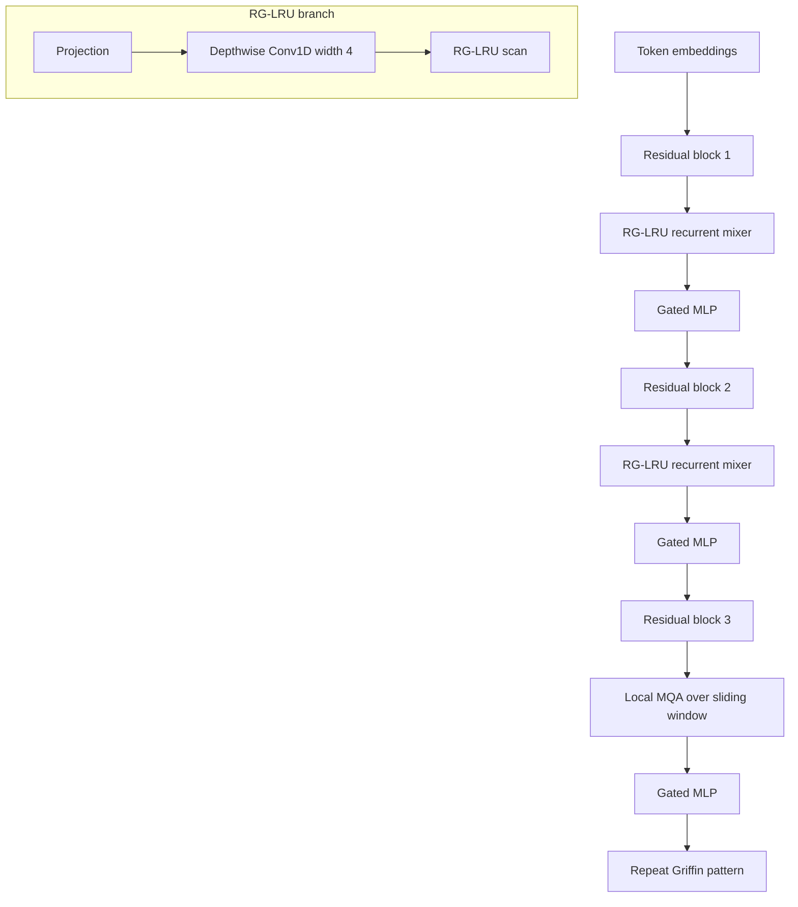

# Griffin (De et al., 2024)

Soham De, Samuel L. Smith, Anushan Fernando, Aleksandar Botev, George Cristian-Muraru, Albert Gu, and collaborators, "Griffin: Mixing Gated Linear Recurrences with Local Attention for Efficient Language Models," 2024, introduces two related language-model families: Hawk, a pure recurrent model built around a Real-Gated Linear Recurrent Unit, and Griffin, a hybrid that alternates recurrent blocks with local attention. The pitch is pragmatic: use recurrence for fixed-state long-context efficiency, but keep sliding-window attention for recent exact details that compressed state can easily lose.

## Problem & motivation

Transformers train efficiently and perform well, but autoregressive inference requires a key-value cache. Even with multi-query attention, the cache grows linearly with sequence length. This creates latency and memory pressure for long generations: every new token reads a larger history, and batching becomes harder as the cache fills device memory.

Recurrent language models avoid this cache because the past is summarized in a fixed hidden state. Classical RNNs, however, were hard to train at scale and generally lost to Transformers in modern language modeling. Recent recurrent and state-space models reopened the question by showing that diagonal or structured recurrences can be trained with modern hardware kernels. Griffin's contribution is to combine that fixed-state direction with a small amount of local attention instead of forcing a pure recurrence to solve every local copying problem.

This makes Griffin a bridge between [Mamba](/cs/deep-learning/mamba) and later hybrid models such as [Jamba](/cs/deep-learning/jamba). Mamba argues that input-selective recurrent dynamics can replace attention surprisingly well. Griffin agrees that recurrence is valuable, but it argues that a bounded local attention window is a cheap way to preserve exact access to the recent past.

## Method

The core recurrent layer is the **Real-Gated Linear Recurrent Unit** (RG-LRU). In simplified elementwise notation, for token representation $x_t$ and hidden state $h_t$,

$$
\begin{aligned}
r_t &= \sigma(W_r x_t + b_r),\\
i_t &= \sigma(W_i x_t + b_i),\\
a &= \sigma(\Lambda),\\
a_t &= a^{c r_t},\\
h_t &= a_t\odot h_{t-1} + \sqrt{1-a_t^2}\odot(i_t\odot x_t).
\end{aligned}
$$

The paper sets $c=8$. The recurrent weight is diagonal and constrained to $(0,1)$, which keeps the recurrence stable. The input gate $i_t$ controls how much new content enters the state. The recurrence gate $r_t$ controls the effective decay $a_t$. When $a_t$ is close to one, the state is preserved; when it is smaller, the layer admits more new information. Unlike many RNN gates, these gates do not depend on $h_{t-1}$, which helps the recurrence run efficiently on accelerator kernels.

A Griffin residual block follows a Transformer-like pre-normalization pattern. It applies RMSNorm, then a temporal mixer, then a residual connection. It follows with another RMSNorm, a gated MLP, and another residual connection. The temporal mixer can be global MQA for a Transformer baseline, an RG-LRU recurrent block for Hawk, or a mix of recurrent blocks and local MQA for Griffin.

The recurrent block has two branches. One branch applies a linear projection, a tiny separable temporal Conv1D with filter width 4, and the RG-LRU. The other branch applies a linear projection and GeLU. The two branches are multiplied elementwise and projected back to the model width. Griffin then interleaves these recurrent blocks with local attention: the paper's main pattern uses two recurrent residual blocks followed by one local-MQA residual block, with a local attention window of 1024 tokens unless stated otherwise.

## Visual



| Model family | Temporal mixer | Cache behavior at decode | Main strength | Main limitation |
|---|---|---|---|---|
| MQA Transformer baseline | Global multi-query attention | Grows with total context | Direct global recall | Long-context cache pressure |
| Hawk | RG-LRU recurrent blocks | Fixed recurrent state | Efficient long decoding | Harder exact retrieval |
| Griffin | RG-LRU plus local MQA | Fixed state plus bounded window | Recent exact access and compressed long memory | Window size is a tradeoff |
| Mamba | Selective state-space blocks | Fixed SSM state | Strong attention-free recurrence | No explicit local attention |

## Architecture details / hyperparameters

The paper studies models from about 100M to 7B parameters, plus a 14B Griffin model in the scaling plot. It trains on MassiveText with sequence length 2048 for the main scaling study and scales token count roughly with parameter count in the Chinchilla spirit. For downstream comparisons, Hawk and Griffin are overtrained on 300B tokens.

The common backbone uses RMSNorm, tied input/output embeddings, a gated MLP with expansion factor $e=3$, and AdamW optimization. The attention baselines use multi-query attention rather than full multi-head key/value storage, with head dimension 128. Local attention uses the same MQA idea but restricts each token to a sliding window over recent tokens. The recurrent block expands width to roughly match the parameter count of a multi-head attention block, even though the actual attention baseline uses MQA.

Implementation is not a footnote in Griffin. Diagonal recurrences have a low FLOP-to-byte ratio, so naive scans can become memory-bound. The paper describes a Pallas kernel on TPU-v3 for the RG-LRU recurrence, Megatron-style sharding for MLP and attention linear layers, block-diagonal weights for the RG-LRU gates to avoid extra cross-device communication, ZeRO for optimizer and parameter state, and bfloat16 parameters and activations. These details matter because an elegant recurrent equation is not useful at language-model scale unless it trains competitively on real hardware.

## Key results

The paper reports power-law scaling of held-out loss with training FLOPs for Hawk, Griffin, and an MQA Transformer baseline. In the reported scaling curve, Griffin achieves lower validation loss than the Transformer baseline across the tested FLOP budgets, while Hawk is slightly worse at smaller budgets but improves with scale. This is an internal comparison under a shared training setup, so it is more informative than uncontrolled comparisons to external models.

For downstream tasks after 300B-token training, the paper reports Hawk-3B exceeding the reported Mamba-3B average on its selected tasks despite using half as many training tokens. It reports Griffin-7B and Griffin-14B as competitive with Llama-2 models while being trained on roughly 300B tokens rather than about 2T. The authors explicitly caution that dataset and hyperparameter differences may explain part of these external comparisons, so the conservative claim is that Griffin is competitive, not that it strictly dominates those models in general.

For inference, the paper reports that Hawk and Griffin achieve higher throughput than the MQA Transformer baseline as generated sequence length grows. Griffin also performs better than Transformers in the paper's sequence-length extrapolation tests. On copying and exact-retrieval experiments, the picture is mixed: Hawk and Griffin can learn several synthetic tasks from training data, but pretrained fixed-state models degrade on phonebook-style exact retrieval when the required information falls outside local attention coverage.

## Worked example 1: one RG-LRU scalar update

Problem: compute a scalar RG-LRU update with

$$
h_{t-1}=3,\quad x_t=10,\quad i_t=0.2,\quad r_t=0.5,\quad a=0.96,\quad c=8.
$$

Method:

1. Compute the effective recurrent weight:

$$
a_t=a^{c r_t}=0.96^{8\cdot 0.5}=0.96^4.
$$

2. Square twice:

$$
0.96^2=0.9216,\qquad 0.96^4=0.9216^2\approx 0.8493.
$$

3. Compute the input scale:

$$
\sqrt{1-a_t^2}=\sqrt{1-0.8493^2}=\sqrt{1-0.7213}=\sqrt{0.2787}\approx 0.5279.
$$

4. Gate the input:

$$
i_t x_t=0.2\cdot 10=2.
$$

5. Update the state:

$$
h_t=0.8493\cdot 3+0.5279\cdot 2=2.5479+1.0558=3.6037.
$$

Checked answer: $h_t\approx 3.6037$. The state mostly preserves history because $a_t$ is large, while the small input gate limits the new token's effect.

## Worked example 2: bounded local-attention cache

Problem: compare a full MQA cache with a Griffin local-attention cache. Suppose a model has $L_{\mathrm{layers}}=32$, one KV head, $d_{\mathrm{head}}=128$, total generated length $T=65536$, and local window $W=1024$. Ignore precision and batch size and count scalar key/value entries.

Method:

1. A full MQA cache stores keys and values for every token in every layer:

$$
2\cdot L_{\mathrm{layers}}\cdot T\cdot d_{\mathrm{head}}
=2\cdot 32\cdot 65536\cdot 128.
$$

2. Compute the product:

$$
65536\cdot 128=8{,}388{,}608,\qquad 64\cdot 8{,}388{,}608=536{,}870{,}912.
$$

3. A local cache stores only the most recent $W$ tokens:

$$
2\cdot L_{\mathrm{layers}}\cdot W\cdot d_{\mathrm{head}}
=2\cdot 32\cdot 1024\cdot 128.
$$

4. Compute the local product:

$$
1024\cdot 128=131{,}072,\qquad 64\cdot 131{,}072=8{,}388{,}608.
$$

5. Ratio:

$$
\frac{536{,}870{,}912}{8{,}388{,}608}=64.
$$

Checked answer: the local cache is $64$ times smaller in this simplified setup, exactly $T/W=65536/1024$. Griffin also has recurrent state, but that state does not grow with $T$.

## Connections

- Griffin keeps part of the attention mechanism introduced in [Attention and Transformers](/cs/deep-learning/attention-transformers), but bounds it to a local window.
- It follows the recurrent-language-model direction of [RWKV](/cs/deep-learning/rwkv) and the selective-state direction of [Mamba](/cs/deep-learning/mamba).
- It differs from [Hyena](/cs/deep-learning/hyena), which uses FFT long convolutions and gates rather than a learned recurrent scan plus local attention.
- It helps motivate [Jamba](/cs/deep-learning/jamba), which is another hybrid but uses Mamba layers, grouped-query attention, and MoE capacity.
- It is less directly connected to [Vision Transformer](/cs/deep-learning/vision-transformer), but both pages illustrate a common pattern: preserve the useful Transformer interface while changing the token mixer.

## PyTorch sketch

```python
import torch
import torch.nn as nn
import torch.nn.functional as F

class TinyRGLRU(nn.Module):
    def __init__(self, dim):
        super().__init__()
        self.r_gate = nn.Linear(dim, dim)
        self.i_gate = nn.Linear(dim, dim)
        self.logit_a = nn.Parameter(torch.full((dim,), 2.5))
        self.c = 8.0

    def forward(self, x):
        batch, length, dim = x.shape
        h = x.new_zeros(batch, dim)
        ys = []
        base_a = torch.sigmoid(self.logit_a)
        for t in range(length):
            r = torch.sigmoid(self.r_gate(x[:, t]))
            i = torch.sigmoid(self.i_gate(x[:, t]))
            a_t = base_a.pow(self.c * r)
            input_scale = torch.sqrt((1.0 - a_t.square()).clamp_min(1e-6))
            h = a_t * h + input_scale * (i * x[:, t])
            ys.append(h)
        return torch.stack(ys, dim=1)

class TinyGriffinBlock(nn.Module):
    def __init__(self, dim, heads=4, local_window=8, use_local_attention=False):
        super().__init__()
        self.norm1 = nn.LayerNorm(dim)
        self.norm2 = nn.LayerNorm(dim)
        self.use_local_attention = use_local_attention
        self.local_window = local_window
        self.rnn = TinyRGLRU(dim)
        self.attn = nn.MultiheadAttention(dim, heads, batch_first=True)
        self.ffn = nn.Sequential(
            nn.Linear(dim, 3 * dim),
            nn.GELU(),
            nn.Linear(3 * dim, dim),
        )

    def forward(self, x):
        z = self.norm1(x)
        if self.use_local_attention:
            t = x.size(1)
            blocked_future = torch.triu(torch.ones(t, t, dtype=torch.bool), 1)
            blocked_past = torch.tril(torch.ones(t, t, dtype=torch.bool), -self.local_window)
            mask = blocked_future | blocked_past
            mixed, _ = self.attn(z, z, z, attn_mask=mask, need_weights=False)
        else:
            mixed = self.rnn(z)
        x = x + mixed
        return x + self.ffn(self.norm2(x))

x = torch.randn(2, 16, 32)
blocks = nn.Sequential(
    TinyGriffinBlock(32),
    TinyGriffinBlock(32),
    TinyGriffinBlock(32, use_local_attention=True),
)
print(blocks(x).shape)
```

## Common pitfalls

- Calling Griffin a pure RNN. Hawk is pure recurrence; Griffin is recurrence plus local attention.
- Forgetting that the attention cache is bounded by the window, not eliminated. Larger windows improve recent access but use more memory.
- Treating external benchmark comparisons as controlled experiments. The paper itself warns that data, tokens, and tuning differ across model families.
- Assuming fixed-state recurrence guarantees exact retrieval. The paper's phonebook-style tests show that exact recall can fail outside the local window.
- Ignoring the hardware story. RG-LRU is mathematically simple, but efficient training depends on a good scan kernel.
- Confusing RG-LRU with Mamba selection. Both are gated recurrent mechanisms, but RG-LRU's recurrence gate is biased toward preserving state through uninformative inputs.

## Further reading

Read Griffin alongside Linear Recurrent Units, Mamba, Gated State Spaces, sliding-window attention, Multi-Query Attention, and work on copying/retrieval limits of state-space models. In this wiki sequence, compare it with [Mamba](/cs/deep-learning/mamba) for pure selective recurrence and [Jamba](/cs/deep-learning/jamba) for a larger Transformer-Mamba-MoE hybrid.
