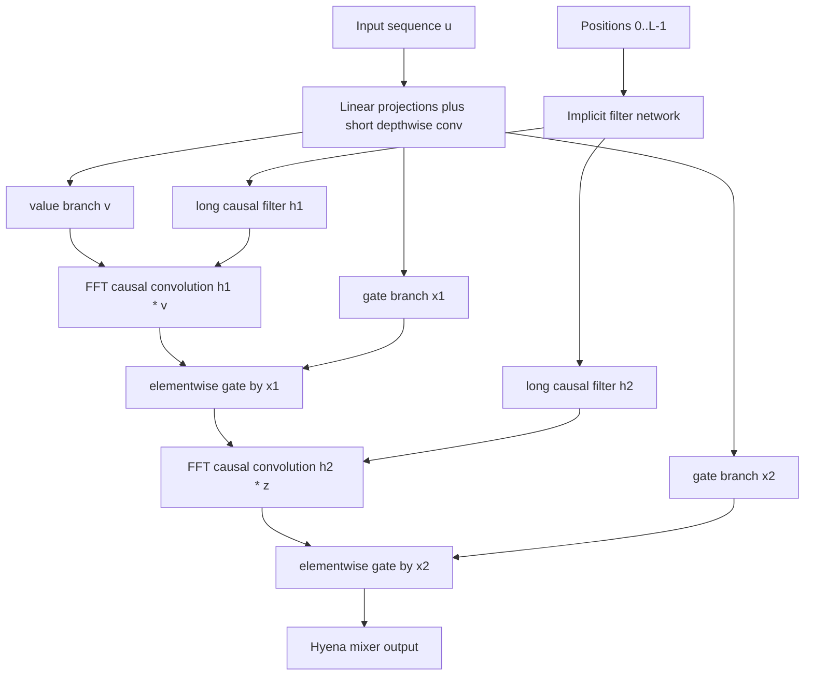

# Hyena Hierarchy (Poli et al., 2023)

Michael Poli, Stefano Massaroli, Eric Nguyen, Daniel Y. Fu, Tri Dao, Stephen Baccus, Yoshua Bengio, Stefano Ermon, and Christopher Re, "Hyena Hierarchy: Towards Larger Convolutional Language Models," ICML 2023, proposes an attention-free sequence mixer built from implicit long convolutions and data-controlled gates. The elevator pitch is simple: keep three properties that make attention useful, namely data control, parameter count independent of context length, and unrestricted access to long context, but avoid explicitly forming the $L \times L$ attention matrix.

## Problem & motivation

Full self-attention is powerful because it builds an input-dependent matrix. For a sequence $u \in \mathbb{R}^{L \times D}$, the attention weights are not fixed parameters; they are functions of query and key projections of the current input. That gives attention a form of in-context adaptation, but the price is the quadratic score matrix. At long lengths, the $O(L^2)$ memory and compute can dominate the rest of the network.

Before Hyena, many efficient attention alternatives were subquadratic but not drop-in replacements at language-model scale. Sparse attention limits which pairs can interact. Low-rank and linearized attention change the operator class. State-space and long-convolution models can handle long contexts, but early versions often needed dense attention layers to close the quality gap on language modeling or recall-heavy synthetic tasks. Hyena asks whether a more expressive structured operator can recover enough of attention's behavior without using attention at all.

The paper isolates three target properties. First, **data control**: the operator applied to values should depend on the input sequence, as attention does through $QK^T$. Second, **sublinear parameter scaling in length**: extending the context should not require a parameter for every time lag. Third, **unrestricted context**: the model should not be forced to use a small local window. Hyena's answer is a hierarchy of multiplicative gates and implicit long filters. The gates make the operator input-dependent; the long filters provide global memory; and the filters are generated by a small network rather than stored as one parameter per lag.

## Method

A causal convolution with a one-dimensional input $u$ and filter $h$ computes

$$
y_t = (h * u)_t = \sum_{i=0}^{t} h_i u_{t-i}.
$$

In matrix form, this is multiplication by a lower-triangular Toeplitz matrix $S_h$. A gate is multiplication by a diagonal matrix $D_x = \mathrm{diag}(x)$. Hyena composes these two simple structured matrices. For an order-$N$ Hyena operator, let $(v, x_1, \ldots, x_N)$ be projections of the same input sequence and let $(h_1,\ldots,h_N)$ be learnable long filters. A scalar-channel version of the recurrence is

$$
\begin{aligned}
z_1 &= v,\\
z_{n+1,t} &= x_{n,t}\,(h_n * z_n)_t,\qquad n=1,\ldots,N,\\
y_t &= z_{N+1,t}.
\end{aligned}
$$

The equivalent matrix view is

$$
y = D_{x_N}S_{h_N}\cdots D_{x_2}S_{h_2}D_{x_1}S_{h_1}v.
$$

This product can behave like a dense, input-conditioned linear map from $v$ to $y$, but it is never materialized as a dense matrix. Each $S_{h_n}z$ is evaluated as a long convolution, typically with FFT padding so that the circular convolution computed by the FFT equals the desired aperiodic causal convolution on the first $L$ positions. The paper gives the Hyena recurrence cost as roughly $O(NDL(\log L + D))$ when projection costs are included, with the long convolution part scaling like $O(NDL\log L)$.

The filters are **implicit**. Instead of learning $h_0,\ldots,h_{L-1}$ directly, Hyena evaluates a small feed-forward network on positional features:

$$
h_t = \mathrm{Window}(t)\cdot (\mathrm{FFN}\circ \mathrm{PositionalEncoding})(t).
$$

The window can bias a filter toward exponential decay, while sinusoidal or high-frequency features help represent filters with sharp frequency content. This matters because a low-frequency-biased neural network could otherwise produce smooth filters that are too weak for exact-ish selection tasks. Hyena therefore combines long memory with gates that can choose where the signal should pass.

## Visual



| Mixer | Operator is data-controlled? | Long-context route | Typical length cost | Main caveat |
|---|---:|---|---|---|
| Full attention | Yes | Pairwise $QK^T$ scores | $O(L^2)$ | KV/cache and score matrix grow with length |
| Short CNN | No | Explicit local filter | $O(ML)$ | Memory limited by filter size $M$ |
| Implicit long convolution | No | Generated filter over all lags | $O(L\log L)$ | Same filter for every input |
| Hyena | Yes | Gates plus implicit long filters | $O(NL\log L)$ for the convolutional part | FFT constants and exact recall limits matter |
| Mamba-style SSM | Yes, in selective variants | Recurrent state and scan | $O(L)$ | Fixed state compresses history |

## Architecture details / hyperparameters

In a Hyena language-model block, the input is projected into a value branch and several gate branches, analogous to attention's multiple projections but not restricted to query/key/value. The paper also uses a small explicit depthwise convolution near the projections to inject local order information before the long filters act. The long filters are generated in parallel for the needed sequence length and channels, then applied channelwise with FFT convolution.

Causality is handled by evaluating filters for $t=0,\ldots,L-1$ and padding the input and filter before the FFT. This is an easy implementation detail to get wrong: an unpadded FFT convolution is circular, so late tokens can leak into early outputs. In autoregressive modeling, the Hyena filter itself does not have to be learned under a special triangular constraint; the causal evaluation procedure is what prevents future-token use.

The paper studies Hyena in synthetic recall and induction-style tasks, language modeling, and vision. For language modeling, it reports sub-billion-scale experiments on WikiText103 and The Pile, including models around the 125M and 355M scale. The Pile experiments emphasize order-2 Hyena operators and GPT-style training recipes. The paper also explores depth/width tradeoffs: because Hyena reduces the nonparametric attention cost, some compute can be moved toward deeper stacks. For vision, the authors test Hyena as an attention replacement in a ViT-like setting on ImageNet-1k from scratch.

## Key results

The abstract reports that Hyena improves by more than 50 accuracy points over several state-space, frequency-domain, and explicit-convolution alternatives on difficult recall and reasoning tasks with lengths ranging from thousands to hundreds of thousands of tokens. The important conservative reading is not that Hyena "solves" recall, but that the alternating-gate hierarchy closes a visible gap between older subquadratic operators and dense attention on targeted tasks.

On language modeling, the paper reports state-of-the-art results for dense-attention-free architectures on WikiText103 and The Pile at the time. It reports matching Transformer quality on The Pile at the 335M scale with about a 20 percent reduction in training FLOPs at sequence length 2K. On long-sequence efficiency, it reports Hyena operators about twice as fast as FlashAttention at length 8K and about 100 times faster at length 64K in the tested setup, while standard PyTorch attention runs out of memory at that longer length.

These are paper-reported claims under specific training recipes and hardware. They do not imply that attention is obsolete. Later pages in this sequence show a split outcome: [Mamba](/cs/deep-learning/mamba) improves the recurrent/SSM path, while [Griffin](/cs/deep-learning/griffin) and [Jamba](/cs/deep-learning/jamba) keep some attention because exact recent access and in-context behavior remain valuable.

## Worked example 1: causal convolution as memory

Problem: compute the causal convolution of

$$
u=[2,0,1,3],\qquad h=[1,0.5,0.25]
$$

using $y_t=\sum_{i=0}^{2}h_i u_{t-i}$ and zero for missing past values.

Method:

1. At $t=0$,

$$
y_0 = 1\cdot u_0 + 0.5u_{-1}+0.25u_{-2}=2.
$$

2. At $t=1$,

$$
y_1 = 1\cdot 0 + 0.5\cdot 2 + 0.25u_{-1}=1.
$$

3. At $t=2$,

$$
y_2 = 1\cdot 1 + 0.5\cdot 0 + 0.25\cdot 2=1.5.
$$

4. At $t=3$,

$$
y_3 = 1\cdot 3 + 0.5\cdot 1 + 0.25\cdot 0=3.5.
$$

Checked answer:

$$
y=[2,1,1.5,3.5].
$$

The last output uses $u_3,u_2,u_1$ but no future value. A long Hyena filter applies the same causal idea over thousands of lags.

## Worked example 2: an order-2 Hyena recurrence

Problem: use two short filters and two gates:

$$
v=[1,2,0],\quad x_1=[1,0.5,2],\quad x_2=[2,1,1],
$$

$$
h_1=[1,1],\quad h_2=[1,-1].
$$

Compute $z_1=x_1\odot(h_1*v)$ and $y=x_2\odot(h_2*z_1)$.

Method:

1. First convolution:

$$
\begin{aligned}
(h_1*v)_0 &= 1\cdot 1=1,\\
(h_1*v)_1 &= 1\cdot 2 + 1\cdot 1=3,\\
(h_1*v)_2 &= 1\cdot 0 + 1\cdot 2=2.
\end{aligned}
$$

2. First gate:

$$
z_1=[1,0.5,2]\odot[1,3,2]=[1,1.5,4].
$$

3. Second convolution:

$$
\begin{aligned}
(h_2*z_1)_0 &= 1\cdot 1=1,\\
(h_2*z_1)_1 &= 1\cdot 1.5 - 1\cdot 1=0.5,\\
(h_2*z_1)_2 &= 1\cdot 4 - 1\cdot 1.5=2.5.
\end{aligned}
$$

4. Second gate:

$$
y=[2,1,1]\odot[1,0.5,2.5]=[2,0.5,2.5].
$$

Checked answer: $y=[2,0.5,2.5]$. If the gate vectors come from the input sequence, the effective map from $v$ to $y$ changes with the data, even though the filters are shared parameters.

## Connections

- Hyena replaces the full attention matrix described in [Attention and Transformers](/cs/deep-learning/attention-transformers) with a structured product of diagonal gates and Toeplitz convolution matrices.
- It helps explain why [Mamba](/cs/deep-learning/mamba) was important: both pursue attention-free long-context modeling, but Mamba uses selective state-space recurrence rather than FFT long convolution.
- It is conceptually close to [RWKV](/cs/deep-learning/rwkv) because both avoid a growing Transformer KV cache, but RWKV uses a recurrent weighted-key-value update.
- It relates to [Vision Transformer](/cs/deep-learning/vision-transformer) through the experiment of replacing image-patch attention with Hyena-style token mixing.
- It motivates hybrid follow-ups such as [Griffin](/cs/deep-learning/griffin) and [Jamba](/cs/deep-learning/jamba), which keep a limited amount of attention for exact access.

## PyTorch sketch

```python
import torch
import torch.nn as nn

def causal_fft_conv(u, h):
    """Depthwise causal convolution.

    u: [batch, channels, length]
    h: [channels, length]
    """
    length = u.size(-1)
    fft_len = 2 * length
    u_f = torch.fft.rfft(u, n=fft_len)
    h_f = torch.fft.rfft(h.unsqueeze(0), n=fft_len)
    y = torch.fft.irfft(u_f * h_f, n=fft_len)
    return y[..., :length]

class TinyHyena(nn.Module):
    def __init__(self, dim, order=2):
        super().__init__()
        self.order = order
        self.proj = nn.Linear(dim, (order + 1) * dim)
        self.out = nn.Linear(dim, dim)

    def forward(self, x, filters):
        # x: [batch, length, dim]
        # filters: list of [dim, length] tensors
        value, *gates = self.proj(x).chunk(self.order + 1, dim=-1)
        z = value.transpose(1, 2)
        for gate, filt in zip(gates, filters):
            z = causal_fft_conv(z, filt)
            z = z * torch.sigmoid(gate).transpose(1, 2)
        return self.out(z.transpose(1, 2))

batch, length, dim = 2, 128, 32
x = torch.randn(batch, length, dim)
filters = [torch.randn(dim, length) for _ in range(2)]
layer = TinyHyena(dim, order=2)
print(layer(x, filters).shape)
```

## Common pitfalls

- Calling Hyena "just a CNN." The key additions are implicit full-length filters and input-dependent gates.
- Forgetting that FFT convolution must be padded. Without padding, the convolution is circular and violates causality.
- Comparing only $O(L\log L)$ with $O(L^2)$. Constants, sequence length, hardware kernels, and projection costs decide real speed.
- Treating the filter network as optional decoration. The implicit parameterization is what decouples context length from parameter count.
- Overstating the results. Hyena is a strong attention-free result at the tested scales, not a proof that every Transformer should remove attention.
- Missing the matrix interpretation. The diagonal-gate/Toeplitz-product view explains why Hyena is more expressive than a fixed long convolution.

## Further reading

Read the original Hyena paper with H3, Gated State Spaces, S4, CKConv, FlashAttention, and StripedHyena. For the broader sequence-modeling path in this wiki, continue from [Attention and Transformers](/cs/deep-learning/attention-transformers) to [RWKV](/cs/deep-learning/rwkv), [Mamba](/cs/deep-learning/mamba), [Griffin](/cs/deep-learning/griffin), and [Jamba](/cs/deep-learning/jamba).
