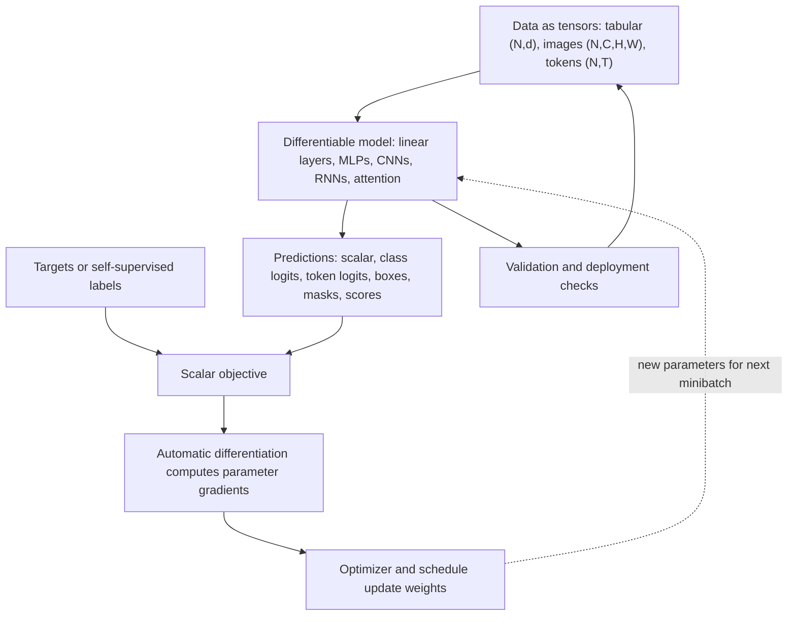

# Deep Learning

These notes follow Aston Zhang, Zachary C. Lipton, Mu Li, and Alexander J. Smola's *Dive into Deep Learning* and emphasize the book's central style: concepts, mathematics, and runnable code together. The path starts with tensors, data preparation, linear algebra, calculus, probability, and automatic differentiation, then builds complete training loops for regression and classification before moving to modern architectures.

*Figure: Layered neural networks make differentiable function approximation visible. Image: [Wikimedia Commons](https://commons.wikimedia.org/wiki/File:Artificial_neural_network.svg), Cburnett, CC BY-SA 3.0/GFDL.*

*Figure: MNIST gives classification, vision, and neural-network pages a familiar benchmark image. Image: [Wikimedia Commons](https://commons.wikimedia.org/wiki/File:MNIST_dataset_example.png), Suvanjanprasai, CC BY-SA 4.0.*

*Figure: A compact network diagram gives deep-learning pages a quick visual model of learned weights. Image: [Wikimedia Commons](https://commons.wikimedia.org/wiki/File:Neural_network.svg), Dake and Mysid, CC BY 1.0.*

The later pages cover the main deep learning families: multilayer perceptrons, convolutional networks, recurrent networks, attention, transformers, NLP applications, computer vision systems, recommender systems, GANs, reinforcement learning, Gaussian processes, and hyperparameter optimization. Code examples use PyTorch for portability. For classical context, compare these notes with [machine learning](/cs/machine-learning/); for prerequisites, see [linear algebra](/math/linear-algebra/) and [probability](/math/probability-and-random-variables/).

This overview diagram shows the repeated contract behind the chapter sequence. Data enters as shaped tensors, a differentiable model produces task-specific predictions, a scalar loss drives automatic differentiation, and an optimizer updates parameters for the next minibatch. The validation loop is separate from the gradient path because evaluation should measure behavior rather than train the model.

1. [Tensors and Data Preprocessing](/cs/deep-learning/tensors-data-preprocessing)
2. [Math for Deep Learning](/cs/deep-learning/math-for-deep-learning)
3. [Linear Regression and Training Loops](/cs/deep-learning/linear-regression-training)
4. [Softmax Classification and Generalization](/cs/deep-learning/softmax-classification-generalization)
5. [Multilayer Perceptrons and Regularization](/cs/deep-learning/multilayer-perceptrons-regularization)
6. [PyTorch Builders Guide](/cs/deep-learning/pytorch-builders-guide)
7. [Convolutional Neural Networks](/cs/deep-learning/convolutional-neural-networks)
8. [Modern CNNs](/cs/deep-learning/modern-cnns)
9. [Sequence Modeling and RNNs](/cs/deep-learning/sequence-modeling-rnns)
10. [Gated RNNs and Sequence-to-Sequence](/cs/deep-learning/gated-rnns-seq2seq)
11. [Attention and Transformers](/cs/deep-learning/attention-transformers)
12. [Efficient Sequence Modeling](/cs/deep-learning/efficient-sequence-modeling)
13. [Pretrained Transformers and BERT](/cs/deep-learning/pretrained-transformers-nlp)
14. [Optimization Algorithms](/cs/deep-learning/optimization-algorithms)
15. [Computational Performance](/cs/deep-learning/computational-performance)
16. [Computer Vision Applications](/cs/deep-learning/computer-vision-applications)
17. [NLP Pretraining and Applications](/cs/deep-learning/nlp-pretraining-and-applications)
18. [Generative Adversarial Networks](/cs/deep-learning/generative-adversarial-networks)
19. [Recommender Systems](/cs/deep-learning/recommender-systems)
20. [Reinforcement Learning and Bayesian Tuning](/cs/deep-learning/reinforcement-learning-and-bayesian-tuning)
