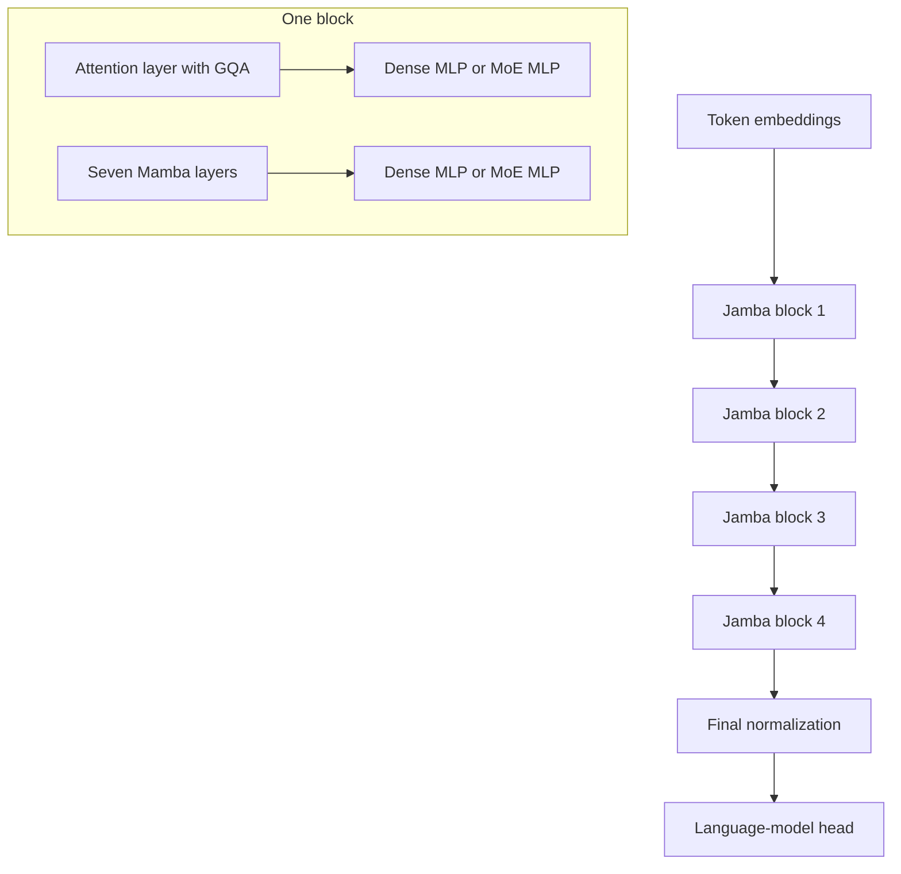

# Jamba (Lieber et al., 2024)

Opher Lieber, Barak Lenz, Hofit Bata, Gal Cohen, Jhonathan Osin, Itay Dalmedigos, Erez Safahi, Shaked Meirom, Yonatan Belinkov, Shai Shalev-Shwartz, Omri Abend, and collaborators, "Jamba: A Hybrid Transformer-Mamba Language Model," 2024, presents a production-scale decoder that interleaves Transformer attention, Mamba state-space layers, and mixture-of-experts MLPs. Its point is not that one token mixer wins everywhere; it treats architecture as a resource tradeoff among quality, throughput, memory, context length, active parameters, and total capacity.

## Problem & motivation

Pure Transformers remain strong because attention gives direct token-to-token access. Their weakness is memory and compute at long context. During decoding, every attention layer stores keys and values for previous tokens, so the KV cache grows with context length. At 128K or 256K tokens, the cache can become as important as the model weights.

Pure Mamba-like state-space models attack that problem by using a recurrent state instead of a growing attention cache. They are efficient and can process long sequences, but the Jamba paper reports that pure Mamba variants can lag on some tasks where exact in-context access, formatting, or retrieval behavior matters. Jamba's design response is hybridization: keep many Mamba layers for efficient long-context processing, keep a small number of attention layers for direct access, and add MoE layers so total capacity can grow without forcing every token to activate every parameter.

This makes Jamba the production-scale counterpart to the ideas in [Mamba](/cs/deep-learning/mamba) and [Griffin](/cs/deep-learning/griffin). Griffin mixes gated linear recurrences with local attention; Jamba mixes Mamba layers with global grouped-query attention and sparse experts.

## Method

A **Jamba block** is a stack of layers chosen from Mamba and attention layer types. The architecture exposes several design variables:

$$
\begin{aligned}
l &= \text{number of layers per block},\\
a:m &= \text{attention-to-Mamba layer ratio},\\
e &= \text{MoE frequency},\\
n &= \text{number of experts per MoE layer},\\
K &= \text{number of experts used per token}.
\end{aligned}
$$

The released Jamba v0.1 configuration uses

$$
l=8,\qquad a:m=1:7,\qquad e=2,\qquad n=16,\qquad K=2.
$$

It repeats four Jamba blocks, yielding 32 layers total. Since each block has one attention layer and seven Mamba layers, only 4 of the 32 layers need a Transformer-style KV cache. That is the source of the idealized 8x KV-cache reduction relative to a fully attentional 32-layer decoder.

The MoE component replaces some dense MLPs with routed expert MLPs. If $r(x)$ are router logits and $E_j$ are expert networks, a simplified top-$K$ MoE output is

$$
\mathrm{MoE}(x)=\sum_{j\in \mathrm{TopK}(r(x),K)} p_j(x)E_j(x),
$$

where $p_j(x)$ are normalized routing weights over the selected experts. Increasing $n$ raises total available capacity. Increasing $K$ raises active compute. Making MoE less frequent by increasing $e$ lowers memory transfers and communication, but also reduces sparse capacity. Jamba's released setting uses MoE every other layer with 16 experts and top-2 routing, giving 52B total available parameters but about 12B active parameters.

## Visual



| Design knob | Released value | What it controls |
|---|---:|---|
| Jamba blocks | 4 | Number of repeated hybrid groups |
| Layers per block $l$ | 8 | 32 total layers |
| Attention:Mamba ratio | 1:7 | Only 4 attention layers need KV cache |
| MoE frequency $e$ | 2 | Expert MLP every other layer |
| Experts per MoE $n$ | 16 | Total sparse capacity |
| Selected experts $K$ | 2 | Active expert compute per token |
| Released context | 256K tokens | Long-context target for the public model |

## Architecture details / hyperparameters

The released model has 12B active parameters and 52B total available parameters. It was designed to fit on a single 80GB GPU with int8 weights, including room for long-context inputs. The paper states that Jamba models were trained successfully with context lengths up to 1M tokens, while the released model supports up to 256K tokens.

Attention layers use grouped-query attention. Mamba layers receive additional stabilizing normalization; the paper specifically reports using RMSNorm inside Mamba components after observing activation-scale and loss-spike issues at larger scale. The model does not use explicit positional embeddings or RoPE in the released setup. The authors report ablations where adding RoPE did not materially improve the hybrid, suggesting that the Mamba layers provide enough positional signal for this configuration.

The MLP side uses SwiGLU-style modern feed-forward choices, and some MLPs are replaced by MoE layers. The vocabulary size is 64K. The tokenizer is BPE-based, uses separate digit tokens, and removes the dummy leading-space behavior used in some Llama/Mistral tokenizers for more consistent reversible tokenization. Training used an in-house mixture of web, books, and code data, with data updated through March 2024 according to the paper. The released checkpoint is a pretrained base model, not instruction-tuned and not safety-aligned.

## Key results

The paper reports that Jamba is competitive with contemporary public models such as Llama-2, Gemma, and Mixtral on a range of academic tasks, while using a much smaller long-context KV cache than fully attentional sparse MoE models. In its memory comparison at 256K context with 16-bit cache values, the paper lists Mixtral-8x7B at about 32GB of KV cache and Jamba at about 4GB. The exact memory depends on precision, implementation, batch size, head counts, and context length, but the architectural reason is clear: Jamba has attention in only one out of every eight layers.

For throughput, the paper reports up to about 3x higher throughput than Mixtral in the long-context settings it measures. With short contexts, all models are closer because attention is a smaller fraction of the total work. With long contexts, the reduced number of attention layers and the use of Mamba layers become more visible.

For long-context quality, the paper reports strong needle-in-a-haystack behavior up to 256K tokens and evaluates few-shot classification with contexts up to 128K tokens. It also reports better average F1 than Mixtral on selected long-context QA tasks from L-Eval. The conservative interpretation is that Jamba demonstrates a practical hybrid design point. It does not prove that the 1:7 ratio is universally optimal, and the authors frame the architecture as a flexible design space.

## Worked example 1: counting released Jamba layers

Problem: use the released configuration to count total layers, attention layers, Mamba layers, MoE layers, and selected expert computations per token.

Method:

1. Total layers:

$$
4\text{ blocks}\cdot 8\text{ layers/block}=32\text{ layers}.
$$

2. Attention layers:

$$
4\text{ blocks}\cdot 1\text{ attention layer/block}=4.
$$

3. Mamba layers:

$$
32-4=28.
$$

4. MoE appears every other layer, so

$$
32/2=16
$$

layers use MoE MLPs.

5. Each MoE uses top-2 routing. The number of selected expert forward passes per token through the whole network is

$$
16\cdot 2=32.
$$

Checked answer: the model has 32 layers, 4 attention layers, 28 Mamba layers, 16 MoE MLPs, and 32 selected expert computations per token. There are 16 available experts at each MoE layer, but a token uses only 2 of them.

## Worked example 2: idealized KV-cache reduction

Problem: compare a fully attentional 32-layer decoder with released Jamba's 4 attention layers. Assume each attention layer would store the same cache size per token.

Method:

1. A full Transformer has attention in all 32 layers, so its cache units are proportional to

$$
32T.
$$

2. Jamba has attention in 4 layers, so its attention cache units are proportional to

$$
4T.
$$

3. Ratio:

$$
\frac{32T}{4T}=8.
$$

4. If a comparable fully attentional model needed 32GB of KV cache in a given long-context setting, the idealized Jamba estimate is

$$
32\text{GB}/8=4\text{GB}.
$$

Checked answer: the idealized architecture ratio predicts an 8x reduction, matching the paper's listed 32GB versus 4GB comparison for Mixtral and Jamba at 256K context in its table. Real measurements also depend on GQA/MQA details, precision, and implementation.

## Connections

- Jamba keeps exact attention from [Attention and Transformers](/cs/deep-learning/attention-transformers), but uses it sparsely across layers.
- It depends on the selective state-space direction introduced in [Mamba](/cs/deep-learning/mamba).
- It shares Griffin's hybrid instinct: [Griffin](/cs/deep-learning/griffin) mixes recurrence with local attention, while Jamba mixes Mamba with grouped-query attention and MoE.
- It responds to the fixed-state limitations visible in [RWKV](/cs/deep-learning/rwkv) and [Hyena](/cs/deep-learning/hyena) by retaining some attention layers.
- It is less visually oriented than [Vision Transformer](/cs/deep-learning/vision-transformer), but both reuse Transformer components outside the original machine-translation setting.

## PyTorch sketch

```python
import torch
import torch.nn as nn
import torch.nn.functional as F

class Top2MoE(nn.Module):
    def __init__(self, dim, hidden, num_experts=16):
        super().__init__()
        self.router = nn.Linear(dim, num_experts)
        self.experts = nn.ModuleList([
            nn.Sequential(nn.Linear(dim, hidden), nn.SiLU(), nn.Linear(hidden, dim))
            for _ in range(num_experts)
        ])

    def forward(self, x):
        scores = self.router(x)
        probs = F.softmax(scores, dim=-1)
        weights, ids = torch.topk(probs, k=2, dim=-1)
        y = torch.zeros_like(x)
        for slot in range(2):
            chosen = ids[..., slot]
            for expert_id, expert in enumerate(self.experts):
                mask = chosen == expert_id
                if mask.any():
                    y[mask] += weights[..., slot][mask].unsqueeze(-1) * expert(x[mask])
        return y

class ToyJambaLayer(nn.Module):
    def __init__(self, dim, use_attention=False, use_moe=False):
        super().__init__()
        self.norm1 = nn.LayerNorm(dim)
        self.norm2 = nn.LayerNorm(dim)
        self.use_attention = use_attention
        self.attn = nn.MultiheadAttention(dim, 4, batch_first=True)
        # Stand-in for a Mamba layer: depthwise temporal mixing with fixed state omitted.
        self.mamba_like = nn.Conv1d(dim, dim, kernel_size=3, padding=1, groups=dim)
        self.ffn = Top2MoE(dim, 4 * dim) if use_moe else nn.Sequential(
            nn.Linear(dim, 4 * dim),
            nn.SiLU(),
            nn.Linear(4 * dim, dim),
        )

    def forward(self, x):
        z = self.norm1(x)
        if self.use_attention:
            mixed, _ = self.attn(z, z, z, need_weights=False)
        else:
            mixed = self.mamba_like(z.transpose(1, 2)).transpose(1, 2)
        x = x + mixed
        return x + self.ffn(self.norm2(x))

x = torch.randn(2, 32, 64)
layers = nn.ModuleList([
    ToyJambaLayer(64, use_attention=(i == 0), use_moe=(i % 2 == 1))
    for i in range(8)
])
for layer in layers:
    x = layer(x)
print(x.shape)
```

## Common pitfalls

- Calling Jamba simply a Mamba model. It is a Transformer-Mamba-MoE hybrid.
- Comparing total parameters without active parameters. Sparse experts make 52B total and 12B active very different quantities.
- Assuming the 1:7 ratio is a universal optimum. It is a reported design point chosen for the paper's goals and hardware.
- Forgetting that the released checkpoint is a base model, not an instruction-tuned or moderated assistant.
- Thinking "no RoPE" means "no position information." The paper reports that Mamba layers provide enough positional signal in this hybrid.
- Treating KV-cache numbers as architecture constants. They vary with precision, batch size, heads, head dimension, and implementation.

## Further reading

Read Jamba with Mamba, Mixtral, Switch Transformer, ST-MoE, grouped-query attention, StripedHyena, and long-context evaluations such as needle-in-a-haystack and L-Eval. In this wiki sequence, the best path is [Attention and Transformers](/cs/deep-learning/attention-transformers), [Hyena](/cs/deep-learning/hyena), [RWKV](/cs/deep-learning/rwkv), [Mamba](/cs/deep-learning/mamba), [Griffin](/cs/deep-learning/griffin), then Jamba.
