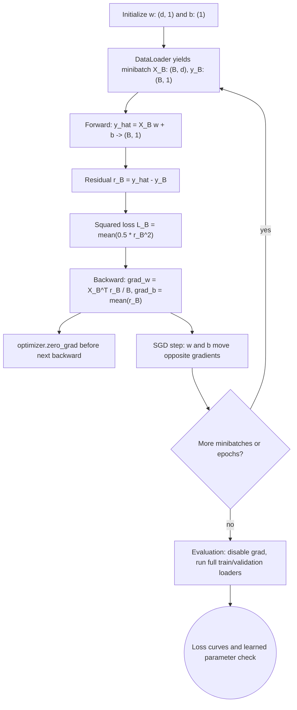

# Linear Regression and Training Loops

Linear regression is the first complete supervised learning system in D2L. It has a model, a loss function, an optimization algorithm, a data iterator, and an evaluation loop. The model is simple enough to solve analytically, but training it with minibatch stochastic gradient descent teaches the same mechanics used for deep networks.

The key idea is to predict a numeric target as a weighted sum of input features. In a deep learning framework, that weighted sum is just a linear layer. Once the training loop works for linear regression, the model can be replaced by an MLP, CNN, RNN, or transformer while keeping the outer logic mostly intact: load a minibatch, compute predictions, compute loss, backpropagate, update parameters, and monitor metrics.

## Definitions

In **linear regression**, each example $x_i \in \mathbb{R}^d$ has a real-valued target $y_i \in \mathbb{R}$. The model predicts

$$
\hat{y}_i = x_i^T w + b,
$$

where $w \in \mathbb{R}^d$ is the weight vector and $b \in \mathbb{R}$ is the bias.

For a dataset with feature matrix $X \in \mathbb{R}^{n \times d}$, the batched prediction is

$$
\hat{y} = Xw + b.
$$

The common **squared loss** for one example is

$$
\ell_i(w,b) = \frac{1}{2}(\hat{y}_i - y_i)^2.
$$

The factor $1/2$ cancels the derivative of the square and has no effect on the minimizer.

The **empirical risk** is the average loss over the training set:

$$
L(w,b) = \frac{1}{n}\sum_{i=1}^n \ell_i(w,b).
$$

**Minibatch stochastic gradient descent** estimates the full gradient using a small subset $B$ of examples:

$$
w \leftarrow w - \eta \frac{1}{|B|}\sum_{i \in B}\nabla_w \ell_i(w,b),
\qquad
b \leftarrow b - \eta \frac{1}{|B|}\sum_{i \in B}\nabla_b \ell_i(w,b).
$$

## Key results

For the full dataset, squared-error linear regression has a closed-form normal equation when $X^T X$ is invertible:

$$
w^* = (X^T X)^{-1}X^T y.
$$

This result is mathematically useful, but D2L emphasizes gradient-based training because it scales to the neural network models that do not have closed-form solutions. The normal equation requires forming and inverting a $d \times d$ matrix, which can be expensive or unstable when $d$ is large or features are collinear.

The gradients for a single example are direct:

$$
\frac{\partial \ell_i}{\partial w}
= (\hat{y}_i - y_i)x_i,
\qquad
\frac{\partial \ell_i}{\partial b}
= \hat{y}_i - y_i.
$$

For a minibatch matrix $X_B$, residual vector $r_B = X_Bw + b - y_B$, and mean squared loss with the same $1/2$ convention,

$$
\nabla_w L_B = \frac{1}{|B|}X_B^T r_B,
\qquad
\nabla_b L_B = \frac{1}{|B|}\sum_{i \in B} r_i.
$$

Under the probabilistic model $y = x^T w + b + \epsilon$ with Gaussian noise $\epsilon \sim \mathcal{N}(0,\sigma^2)$, minimizing squared error is equivalent to maximizing likelihood. This is why squared loss is not merely convenient; it corresponds to a noise assumption.

A training loop needs four separable pieces: a data iterator, a model, a loss, and an optimizer. D2L returns to this separation throughout the book because it makes code reusable. Data handling can change without rewriting the model, and the optimizer can change without rewriting the forward pass.

Linear regression also introduces the idea of a baseline. Before using a deep model, a practitioner should know how well a linear model performs with clean preprocessing. If a later MLP or CNN cannot beat this baseline, the issue may be data quality, leakage, target noise, or an optimization bug rather than insufficient architecture complexity.

The bias term deserves explicit treatment. Appending a constant feature of $1$ to every input lets the bias be absorbed into the weight vector, but frameworks usually represent it separately. Keeping it separate makes parameter groups easier to inspect and lets optimizers or regularizers treat biases differently from weights.

The stochastic training view is also the first encounter with noisy optimization. A minibatch gradient may point away from the full-dataset gradient for a particular step, but it is cheaper and often good enough over many updates. This tradeoff between noisy estimates and computational efficiency reappears in classification, language modeling, and reinforcement learning.

Synthetic data is useful because the true parameters are known. D2L uses generated regression data to check whether a training loop can recover weights close to the ground truth. This is a powerful debugging pattern: when a model fails on real data, first verify it can fit a simple controlled problem. If it cannot, the bug is likely in the implementation, optimizer, shapes, or loss rather than the dataset.

Residual plots are another diagnostic. If residuals are centered around zero with no visible structure, a linear model may be adequate. If residuals curve with a feature, fan out with magnitude, or differ by category, the model assumptions are probably missing nonlinear effects, heteroscedasticity, or interactions. Deep models can reduce such structure, but only if the training data and features expose it.

## Visual



The training-loop diagram keeps the tensor shapes visible through prediction, residual, scalar loss, and gradients. It also separates the required optimizer bookkeeping: gradients are cleared before the next backward pass and parameters are updated after the current gradients are computed. The evaluation branch uses the same forward contract but not the backward/update path.

| Component | From-scratch version | PyTorch concise version |
|---|---|---|
| Parameters | Tensors with `requires_grad=True` | `nn.Linear(d, 1)` |
| Prediction | `X @ w + b` | `model(X)` |
| Loss | Manual squared error | `nn.MSELoss()` |
| Optimizer | Manual subtraction under `torch.no_grad()` | `torch.optim.SGD` |
| Data iterator | Manual shuffling and slicing | `DataLoader` |

## Worked example 1: one SGD update by hand

Problem: perform one gradient-descent update for a one-dimensional linear regression model $\hat{y} = wx + b$. Use one minibatch with two examples: $(x_1,y_1)=(1,2)$ and $(x_2,y_2)=(3,6)$. Start with $w=1$, $b=0$, and learning rate $\eta=0.1$. Use

$$
L_B = \frac{1}{2|B|}\sum_{i \in B}(\hat{y}_i-y_i)^2.
$$

Method:

1. Compute predictions:

$$
\hat{y}_1 = 1(1)+0 = 1,
\qquad
\hat{y}_2 = 1(3)+0 = 3.
$$

2. Compute residuals:

$$
r_1 = \hat{y}_1-y_1 = 1-2 = -1,
\qquad
r_2 = \hat{y}_2-y_2 = 3-6 = -3.
$$

3. Compute the weight gradient:

$$
\nabla_w L_B =
\frac{1}{2}(r_1x_1 + r_2x_2)
= \frac{1}{2}((-1)(1)+(-3)(3))
= \frac{-10}{2}
= -5.
$$

4. Compute the bias gradient:

$$
\nabla_b L_B =
\frac{1}{2}(r_1+r_2)
= \frac{-4}{2}
= -2.
$$

5. Update parameters:

$$
w_{\text{new}} = 1 - 0.1(-5) = 1.5,
\qquad
b_{\text{new}} = 0 - 0.1(-2) = 0.2.
$$

Checked answer: after one update, $w=1.5$ and $b=0.2$. Both increase because the model underpredicted both targets.

## Worked example 2: normal equation for two examples

Problem: solve a linear regression exactly for the model $\hat{y}=wx$ with no bias using

$$
X =
\begin{bmatrix}
1 \\
2
\end{bmatrix},
\qquad
y =
\begin{bmatrix}
3 \\
5
\end{bmatrix}.
$$

Method:

1. Use the no-bias normal equation:

$$
w^* = (X^T X)^{-1}X^T y.
$$

2. Compute $X^T X$:

$$
X^T X =
\begin{bmatrix}
1 & 2
\end{bmatrix}
\begin{bmatrix}
1 \\
2
\end{bmatrix}
= 1^2 + 2^2 = 5.
$$

3. Compute $X^T y$:

$$
X^T y =
\begin{bmatrix}
1 & 2
\end{bmatrix}
\begin{bmatrix}
3 \\
5
\end{bmatrix}
= 1(3)+2(5)=13.
$$

4. Solve:

$$
w^* = 5^{-1}13 = 2.6.
$$

5. Check predictions and residuals:

$$
\hat{y} =
\begin{bmatrix}
2.6 \\
5.2
\end{bmatrix},
\qquad
r =
\begin{bmatrix}
-0.4 \\
0.2
\end{bmatrix}.
$$

The residuals are not both zero because a no-bias line through the origin cannot pass through both points exactly.

Checked answer: $w^*=2.6$, and the orthogonality condition holds because $X^T r = 1(-0.4)+2(0.2)=0$.

## Code

```python
import torch
from torch import nn
from torch.utils.data import DataLoader, TensorDataset

torch.manual_seed(0)

n, d = 1000, 2
true_w = torch.tensor([[2.0], [-3.4]])
true_b = 4.2
X = torch.randn(n, d)
y = X @ true_w + true_b + 0.01 * torch.randn(n, 1)

loader = DataLoader(TensorDataset(X, y), batch_size=32, shuffle=True)
model = nn.Linear(d, 1)
loss_fn = nn.MSELoss()
optimizer = torch.optim.SGD(model.parameters(), lr=0.03)

for epoch in range(5):
    total_loss = 0.0
    for xb, yb in loader:
        pred = model(xb)
        loss = loss_fn(pred, yb)
        optimizer.zero_grad()
        loss.backward()
        optimizer.step()
        total_loss += loss.item() * xb.shape[0]
    print(epoch, total_loss / n)

print("learned weight:", model.weight.data)
print("learned bias:", model.bias.data)
```

## Common pitfalls

- Forgetting to shuffle training data before forming minibatches, especially when examples are ordered by label or time.
- Averaging a loss twice or not averaging it at all, which silently changes the effective learning rate.
- Calling `loss.backward()` without `optimizer.zero_grad()`, causing gradients to accumulate across minibatches.
- Using the validation set to tune every small detail until it effectively becomes part of training.
- Expecting the normal equation to be the preferred implementation for large neural models.
- Ignoring feature scaling, which can make gradient descent zigzag across elongated loss contours.

## Connections

- [Tensors and data preprocessing](/cs/deep-learning/tensors-data-preprocessing)
- [Math for deep learning](/cs/deep-learning/math-for-deep-learning)
- [Classical machine learning](/cs/machine-learning/)
- [Optimization algorithms](/cs/deep-learning/optimization-algorithms)
- [Linear algebra](/math/linear-algebra/)
