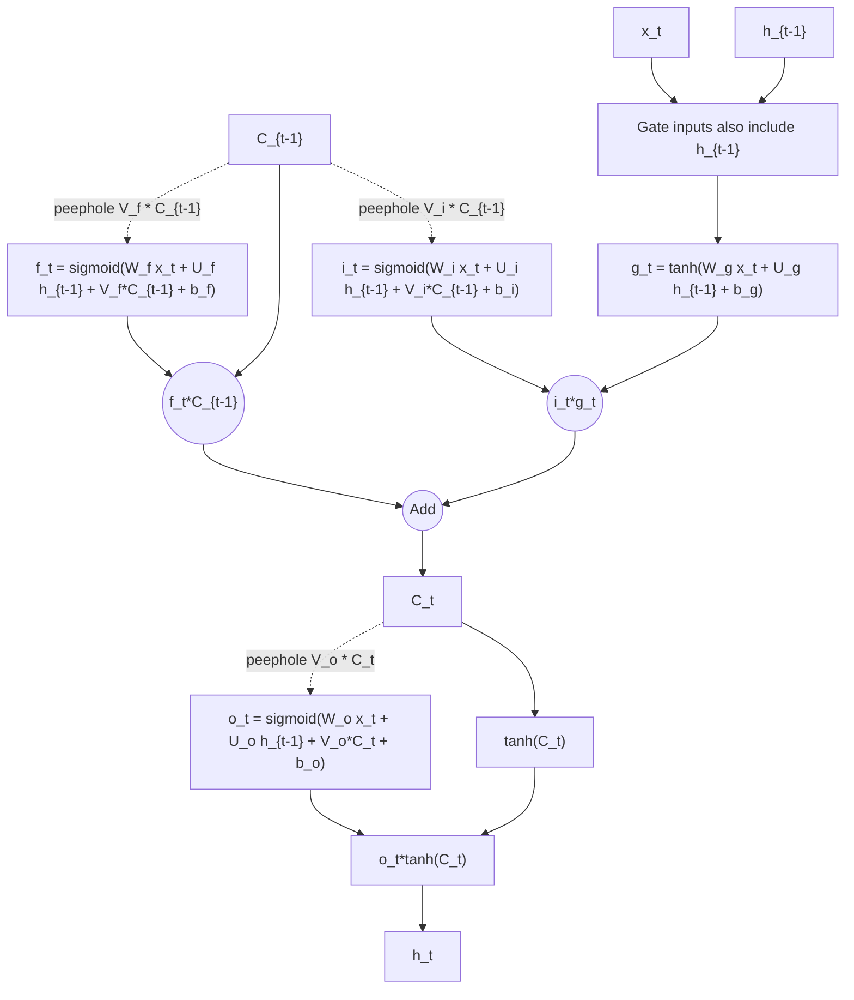
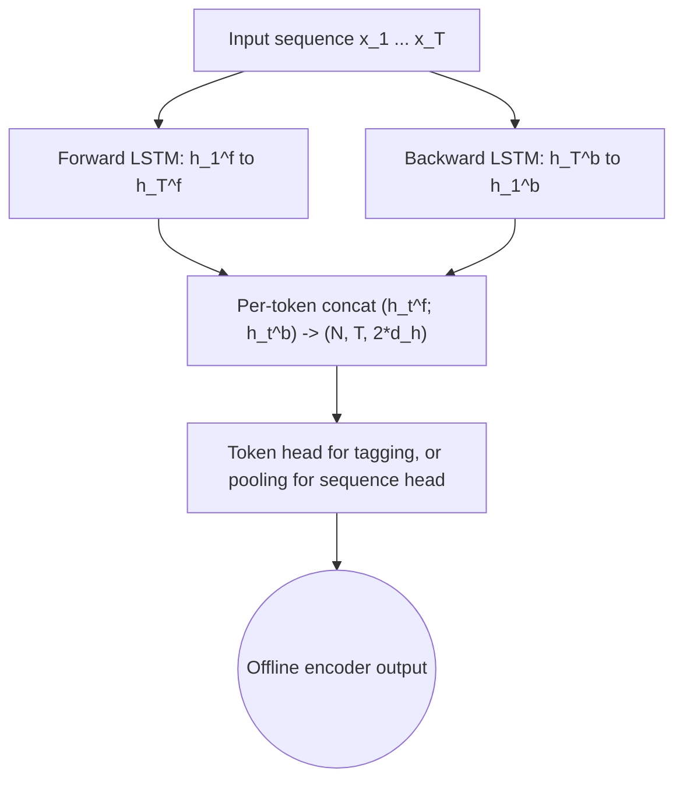
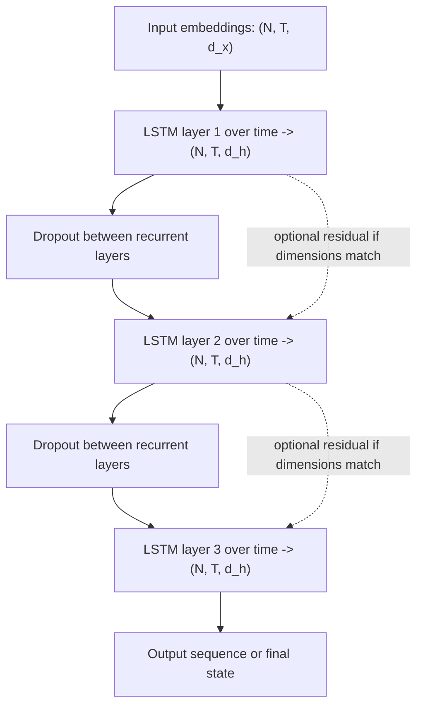
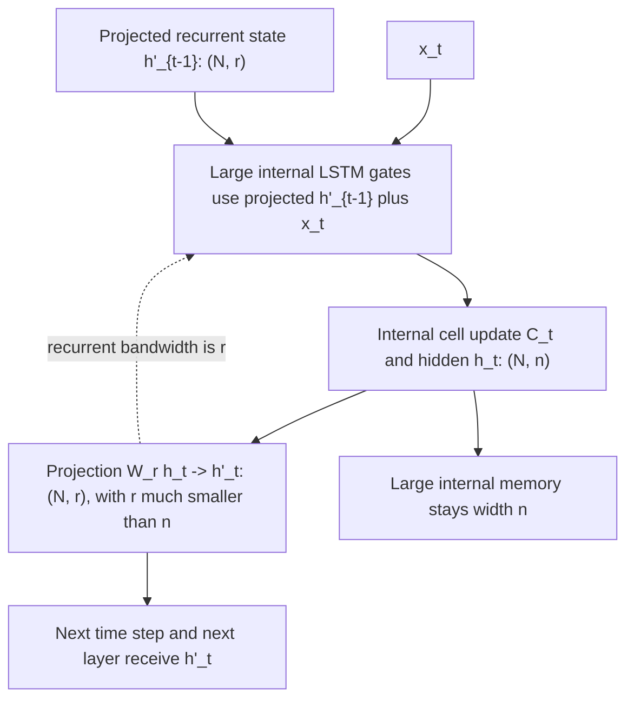
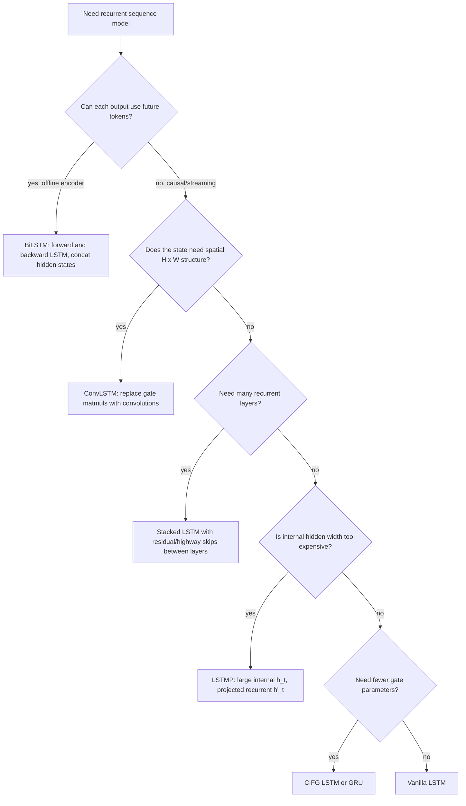

# LSTM Variants

The vanilla LSTM cell with input / forget / output gates is the most commonly taught form, but a long series of papers explored variants that adjust gating, memory pathways, or topology. This page surveys the variants most likely to appear in production code, in papers, or in interview questions, and explains when each is actually worth using.

For the baseline LSTM definition (cell state $C_t$, gates $i_t$, $f_t$, $o_t$, additive memory path), see [Gated RNNs and Sequence-to-Sequence](/cs/deep-learning/gated-rnns-seq2seq).

## Quick reference

| Variant | Year | Modification | When to use |
| --- | --- | --- | --- |
| **Peephole** | Gers & Schmidhuber 2000 | Gates see $C_{t-1}$ | Precise timing tasks; mostly historical |
| **Coupled forget-input (CIFG)** | Greff et al. 2017 | $i_t = 1 - f_t$ | Fewer parameters with little quality loss |
| **Bidirectional (BiLSTM)** | Schuster & Paliwal 1997 | Two LSTMs read fwd + bwd | Offline tagging / NER / encoder side |
| **Stacked / Deep LSTM** | Graves 2013 | $L$ LSTMs in sequence | Standard for capacity scaling |
| **Projection LSTM (LSTMP)** | Sak et al. 2014 | Hidden state linearly projected before output | Speech recognition; reduces large hidden dim |
| **ConvLSTM** | Shi et al. 2015 | Replace matmuls with convolutions | Spatiotemporal data (video, weather) |
| **Tree-LSTM** | Tai et al. 2015 | Children aggregate into parent | Syntactic structure / dependency trees |
| **Highway / Residual LSTM** | Zhang et al. 2016 | Skip connection over LSTM block | Very deep stacks |
| **mLSTM / sLSTM (xLSTM)** | Beck et al. 2024 | Matrix memory / exponential gates | Modern revival, competes with linear-attention |

## Peephole connections

Vanilla LSTM gates use only the previous hidden state $h_{t-1}$ and the current input $x_t$. **Peephole connections** let each gate also inspect the previous cell state $C_{t-1}$ (and sometimes $C_t$ for the output gate):

$$
\begin{aligned}
f_t &= \sigma(W_f x_t + U_f h_{t-1} + V_f \odot C_{t-1} + b_f) \\
i_t &= \sigma(W_i x_t + U_i h_{t-1} + V_i \odot C_{t-1} + b_i) \\
o_t &= \sigma(W_o x_t + U_o h_{t-1} + V_o \odot C_t + b_o)
\end{aligned}
$$

The diagonal weight vector $V_g$ (one per gate $g$) is elementwise on the cell state. Peephole connections improved LSTM accuracy on timing tasks where the model needs to **count** intervals — e.g., the original test was learning to produce spikes at precise times after a trigger.



The peephole diagram adds explicit dotted connections from the cell state into the gates. The forget and input gates inspect `C_{t-1}`, while the output gate can inspect the newly computed `C_t`. The main additive memory path remains the LSTM cell update; peepholes only add timing-sensitive gate inputs.

**Practical relevance today**: small. The empirical study by [Greff et al. (2017)](https://arxiv.org/abs/1503.04069) tested eight variants on speech, handwriting, and music tasks and found peephole connections offered no statistically significant improvement on those problems. Most modern frameworks omit them by default.

## Coupled input-forget gate (CIFG)

Observation: the forget gate $f_t$ controls how much old memory is kept, while the input gate $i_t$ controls how much new candidate $\tilde C_t$ enters. In many trained LSTMs the two are anti-correlated. CIFG removes this redundancy by setting

$$
i_t = 1 - f_t.
$$

This is the same idea as a GRU's update gate. A CIFG LSTM has 25% fewer parameters in the gating block. The Greff study found CIFG performed comparably to vanilla LSTM. If memory is tight, CIFG is a clean win.

## Bidirectional LSTM (BiLSTM)

For tasks where the entire input sequence is available before any output is needed — POS tagging, named-entity recognition, encoder side of sequence-to-sequence — a unidirectional LSTM wastes information about future context. **BiLSTM** runs two LSTMs and concatenates their hidden states:

$$
\overrightarrow{h_t} = \mathrm{LSTM}_\rightarrow(x_t, \overrightarrow{h_{t-1}})
\qquad
\overleftarrow{h_t} = \mathrm{LSTM}_\leftarrow(x_t, \overleftarrow{h_{t+1}})
\qquad
h_t = [\overrightarrow{h_t}; \overleftarrow{h_t}]
$$

Cannot be used in causal language modeling (the backward pass would leak future tokens) — it's an encoder-only tool. PyTorch: `nn.LSTM(..., bidirectional=True)`.



The BiLSTM diagram shows two independent recurrent passes over the same completed sequence. Their hidden states are concatenated at each token, doubling the representation width from `d_h` to `2*d_h`. This is an encoder architecture because the backward pass requires future tokens to be available.

## Stacked / Deep LSTM

The standard recipe for adding capacity to an RNN is to stack layers: the hidden state output of layer $\ell$ becomes the input of layer $\ell+1$.



The stacked LSTM diagram separates recurrence over time inside each layer from recurrence over depth between layers. Each layer returns a full hidden sequence that becomes the next layer's input, with dropout commonly applied only between layers. Dotted residual shortcuts are optional and require matching hidden dimensions or a projection.

Empirically, 2-4 layers helps; beyond that gradients become hard to train without skip connections (see Residual LSTM below). All major encoder-decoder MT systems before transformers used 4-8 layer BiLSTM encoders.

## Projection LSTM (LSTMP)

When the hidden size $n$ is large, the LSTM weight matrix is $O(n^2)$ per gate. The Google ASR team (Sak et al. 2014) introduced a linear projection layer **inside** the recurrence:

$$
h_t' = W_r h_t, \qquad h_t' \in \mathbb{R}^{r}, \quad r \ll n
$$

The projected $h_t'$ is what the next time step (and the next layer) sees, while the larger $h_t$ stays internal. This decouples representational capacity ($n$) from inter-time-step bandwidth ($r$), letting models be wider without quadratic blowup. Standard in production speech models for years before transformers took over.



The LSTMP diagram keeps the internal memory size `n` separate from the recurrent/output size `r`. Gates and the cell update can use a large hidden representation, but the projected `h'_t` is what later time steps and layers consume. This reduces recurrent matrix cost while preserving a wider internal cell.

## ConvLSTM

For spatiotemporal data — video, radar, weather grids — a vanilla LSTM flattens spatial structure into a vector. ConvLSTM (Shi et al. 2015) keeps the data 4D ($\text{batch} \times \text{channel} \times H \times W$) and replaces every matrix multiplication with a 2D convolution:

$$
\begin{aligned}
i_t &= \sigma(W_{xi} * X_t + W_{hi} * H_{t-1} + b_i) \\
f_t &= \sigma(W_{xf} * X_t + W_{hf} * H_{t-1} + b_f) \\
o_t &= \sigma(W_{xo} * X_t + W_{ho} * H_{t-1} + b_o) \\
C_t &= f_t \odot C_{t-1} + i_t \odot \tanh(W_{xc} * X_t + W_{hc} * H_{t-1} + b_c) \\
H_t &= o_t \odot \tanh(C_t)
\end{aligned}
$$

The $*$ operator is 2D convolution; gates and cell state are now 4D tensors. Used in precipitation nowcasting and other grid-time-series problems. Has been mostly succeeded by 3D CNNs, ConvNets-with-attention, and Video Transformers, but ConvLSTM remains a strong baseline.

## Tree-LSTM

For syntactic trees (dependency or constituency parses), the natural recurrence order is bottom-up over the tree rather than left-to-right over a sequence. Tree-LSTM (Tai et al. 2015) defines two variants:

- **Child-Sum Tree-LSTM**: each parent sums hidden states from its children before applying gates. Useful when the number of children is variable.
- **N-ary Tree-LSTM**: each parent has at most $N$ children with separate gate parameters per child position. Used when children are ordered (e.g., binary constituency parses).

Tree-LSTMs were strong on sentiment classification over Stanford Sentiment Treebank, but the architecture is fiddly to batch and largely fell out of favor when Transformers handled sentence-level structure with attention.

## Highway / Residual LSTM

Very deep RNN stacks (10+ layers) suffer from vanishing gradients across both time **and** depth. The fix mirrors what ResNet did for CNNs: skip connections.

A simple **Residual LSTM** layer computes

$$
h_t^{(\ell)} = \mathrm{LSTM}^{(\ell)}(h_t^{(\ell-1)}) + h_t^{(\ell-1)}
$$

(possibly with a linear projection if dimensions mismatch). **Highway LSTM** generalizes this with a learned gate $T$ controlling how much of the shortcut to use:

$$
h_t^{(\ell)} = T \odot \mathrm{LSTM}^{(\ell)}(h_t^{(\ell-1)}) + (1 - T) \odot h_t^{(\ell-1)}.
$$

Used in deep ASR stacks of ~10-20 layers in 2016-2018.

## xLSTM (mLSTM and sLSTM)

In 2024 Beck et al. revived LSTM with two new cells designed to compete with Transformers:

- **sLSTM** keeps a scalar memory cell but uses **exponential gating** $i_t = \exp(\cdot)$ and $f_t = \exp(\cdot)$ with a normalizer state, allowing the cell to forget arbitrarily fast and remember arbitrarily long.
- **mLSTM** replaces the scalar cell with a **matrix memory** $C_t \in \mathbb{R}^{d \times d}$, updated by an outer product of key and value vectors — directly analogous to a linear-attention KV cache.

Empirically xLSTM matches or beats some modern linear-time sequence models on selected language-modeling benchmarks at similar scale. See [Efficient Sequence Modeling](/cs/deep-learning/efficient-sequence-modeling) for the broader linear-attention, recurrent, and state-space context.

## Choosing a variant in practice



This decision diagram is a routing view rather than a cell schematic. It makes the architectural constraints explicit: bidirectionality requires full-sequence access, ConvLSTM preserves spatial tensors inside gates, stacked and residual variants address depth, and LSTMP addresses large recurrent-state cost. The leaf labels identify which hidden or cell-state contract changes compared with a vanilla LSTM.

Or — and this is the honest 2025 recommendation — **consider whether you should be using an LSTM at all**. For most sequence problems the practical choice is a Transformer (see [Attention and Transformers](/cs/deep-learning/attention-transformers)) or a modern linear-time alternative (see [Efficient Sequence Modeling](/cs/deep-learning/efficient-sequence-modeling)). LSTMs remain useful for:

- Online / streaming inference where the model truly cannot look ahead and a tiny constant-memory state matters
- Edge devices where Transformer key-value cache memory is unaffordable
- Reinforcement-learning policies that need a small hidden state passed across episodes
- Time-series forecasting at small scale where data is insufficient to train attention

## Common pitfalls

- **Treating GRU and LSTM as drop-in replacements**. GRU exposes one state; LSTM exposes two ($h_t$, $C_t$). When passing initial states or saving checkpoints, the API differs.
- **Forgetting that BiLSTM is non-causal**. Cannot be used in next-token language modeling. A common bug: training a BiLSTM language model and seeing miraculous perplexity that does not survive inference.
- **Initializing the forget gate bias too low**. The standard trick is to initialize $b_f$ to $1.0$ so the cell starts in "remember" mode. PyTorch's `nn.LSTM` does NOT do this by default — you must set it manually after construction.
- **Stacking too deep without skip connections**. 4 layers is usually the sweet spot for vanilla stacked LSTM. Beyond 6 you need residual or highway connections.
- **Confusing ConvLSTM with running a regular LSTM after a CNN**. ConvLSTM keeps spatial dims **inside** the recurrence; a CNN-then-LSTM pipeline collapses spatial information before recurrence.

## Code: forget-gate bias init and BiLSTM in PyTorch

```python
import torch
import torch.nn as nn

class BiLSTMTagger(nn.Module):
    def __init__(self, vocab, emb_dim, hidden, n_tags, layers=2):
        super().__init__()
        self.embed = nn.Embedding(vocab, emb_dim)
        self.lstm = nn.LSTM(
            emb_dim, hidden,
            num_layers=layers,
            bidirectional=True,
            batch_first=True,
            dropout=0.3,
        )
        self.head = nn.Linear(2 * hidden, n_tags)
        self._init_forget_bias()

    def _init_forget_bias(self):
        # PyTorch packs gates as [i, f, g, o]; second quarter is forget.
        for name, p in self.lstm.named_parameters():
            if "bias" in name:
                n = p.size(0)
                start, end = n // 4, n // 2
                p.data[start:end].fill_(1.0)

    def forward(self, tokens):
        h = self.embed(tokens)
        out, _ = self.lstm(h)
        return self.head(out)
```

This module is a standard sequence tagger: BiLSTM with forget-bias init at 1.0, dropout between layers, linear head over the bidirectional hidden states.

## Connections

- [Gated RNNs and Sequence-to-Sequence](/cs/deep-learning/gated-rnns-seq2seq) — vanilla LSTM + GRU intro
- [Sequence Modeling and RNNs](/cs/deep-learning/sequence-modeling-rnns) — base RNN before gates
- [Attention and Transformers](/cs/deep-learning/attention-transformers) — the architecture family that displaced LSTM for most tasks
- [Efficient Sequence Modeling](/cs/deep-learning/efficient-sequence-modeling) — modern linear-time and hybrid sequence models that revisit RNN ideas
