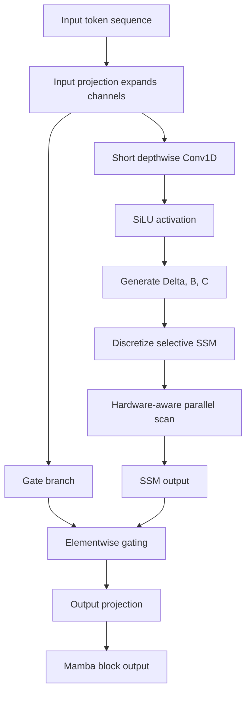

# Mamba (Gu and Dao, 2023)

Gu and Dao's "Mamba: Linear-Time Sequence Modeling with Selective State Spaces" introduces a selective state-space layer and a homogeneous language-model block that uses it instead of attention and even instead of a separate MLP block. The paper's core claim is that previous subquadratic sequence models failed on language partly because their dynamics were time-invariant: they could remember by position, but not choose what to remember based on token content.

Mamba is a turning point in this sequence. [Hyena](/cs/deep-learning/hyena) shows that attention-free long convolutions can be competitive, and [RWKV](/cs/deep-learning/rwkv) shows that scaled recurrent language models are viable. Mamba combines a recurrent state-space view, input-dependent selection, and a hardware-aware parallel scan to produce a linear-time model that competes strongly with Transformers at language-model scale.

## Definitions

**Problem and motivation.** A fixed convolution kernel or time-invariant recurrence treats the same relative position in the same way regardless of content. That is bad for tasks such as selective copying: the model must ignore many irrelevant tokens and preserve only tokens marked by content. Attention handles this by constructing pairwise data-dependent scores. Mamba seeks a fixed-size recurrent state that is still content-selective.

A continuous state-space model is

$$
\begin{aligned}
h'(t) &= Ah(t)+Bx(t),\\
y(t) &= Ch(t).
\end{aligned}
$$

After discretization, a sequence model can be written

$$
\begin{aligned}
h_t &= \overline{A}h_{t-1}+\overline{B}x_t,\\
y_t &= Ch_t.
\end{aligned}
$$

Traditional structured SSMs such as S4 keep $A$, $B$, $C$, and the step size $\Delta$ fixed across time, making the model linear time-invariant. That enables convolutional computation but limits content-dependent behavior.

Mamba's **selective SSM** makes some parameters functions of the input token:

$$
\Delta_t = \tau_\Delta(W_\Delta x_t),\qquad
B_t=W_Bx_t,\qquad
C_t=W_Cx_t.
$$

With a diagonal $A$, the discrete update becomes

$$
h_t=\overline{A}_t h_{t-1}+\overline{B}_t x_t,\qquad
y_t=C_t h_t,
$$

where $\overline{A}_t$ and $\overline{B}_t$ depend on $\Delta_t$, $A$, and $B_t$. The common zero-order-hold form is

$$
\overline{A}_t=\exp(\Delta_t A).
$$

The key point is not the exact discretization alone; it is that $\Delta_t$, $B_t$, and $C_t$ let each token decide how much state to reset, write, and read.

## Key results

**Method.** Mamba removes the time-invariance constraint but recovers efficient training through a hardware-aware scan. A recurrence of the form

$$
h_t=a_t\odot h_{t-1}+b_t
$$

can be parallelized using associative composition of affine maps:

$$
(a_2,b_2)\circ(a_1,b_1)=(a_2\odot a_1,\;a_2\odot b_1+b_2).
$$

This means the model can train over full sequences without processing every token strictly one after another in Python. The paper's implementation fuses discretization, scan, and output projection in GPU SRAM where possible, avoiding materializing the expanded state in high-bandwidth memory. It also uses recomputation in the backward pass to keep activation memory comparable to optimized attention implementations.

The Mamba block merges the SSM-style sequence mixer and a gated MLP-like structure. A simplified block expands the input, applies a short depthwise convolution and SiLU activation, runs the selective scan on the main branch, gates it with another branch, then projects back to the model dimension. The paper emphasizes a homogeneous stack of Mamba blocks rather than alternating attention, SSM, and MLP modules.

**Architecture details and hyperparameters.** The paper uses real-valued diagonal SSMs as the default, with state expansion inside the selective SSM. It uses SiLU/Swish activations, a short convolution before the SSM path, RMSNorm-like modern training choices in the improved recipe, and no separate attention or MLP blocks in the standard Mamba architecture. Scaling-law models mirror GPT-3 sizes: examples include about 125M, 350M, 760M, and 1.3B parameters, with depths and widths chosen similarly to Transformer baselines. The appendix reports Pile scaling-law training with GPT-2 tokenizer, AdamW, gradient clipping 1.0, weight decay 0.1, no dropout, linear warmup, and cosine decay.

**Benchmarks.** On synthetic selective copying, the paper reports that S6-style selectivity solves the task where nonselective S4 or gated-but-time-invariant variants struggle. On induction-head synthetic tests, Mamba trained at length 256 generalizes to much longer lengths, including million-token tests in the reported table.

For language modeling, the paper reports that Mamba is the first attention-free model in their study to match a strong modern Transformer++ recipe in scaling-law experiments, especially as context length grows. The zero-shot table reports Mamba best in its size class on the listed evaluations. For example, Mamba-2.8B reports average accuracy around $63.3$ across the paper's selected tasks, compared with Pythia-2.8B around $59.1$ and RWKV-3B around $59.6$ in the same table. The abstract also reports roughly 5 times generation throughput versus similar-size Transformers and that Mamba-3B matches Transformer baselines about twice its size. The paper further reports strong results in DNA and audio modeling, with performance improving on real data up to million-length sequences.

## Visual



| Model family | Dynamics | Training path | Inference memory | Content selection |
|---|---|---|---|---|
| S4-style SSM | Time-invariant | Convolution or recurrence | Fixed state | Limited |
| Hyena | Long convolution plus gates | FFT convolution | No KV cache | Data-controlled gates |
| RWKV | Decayed WKV recurrence | Parallelizable recurrence | Fixed state | Channelwise decay and receptance |
| Mamba | Input-dependent SSM | Fused selective scan | Fixed state | $\Delta_t$, $B_t$, $C_t$ from tokens |
| Transformer | Attention scores | Matrix attention | Growing KV cache | Pairwise token scores |

## Worked example 1: selective recurrence that chooses what to keep

Problem: use a scalar selective recurrence

$$
h_t=a_t h_{t-1}+b_t x_t,\qquad y_t=h_t,
$$

with $h_0=0$. Suppose three tokens have

$$
x=[10,99,20],
$$

and the model sets

$$
(a,b)_1=(0,1),\quad (a,b)_2=(1,0),\quad (a,b)_3=(0.5,1).
$$

Compute the state.

1. Token 1 is selected and resets the state:

$$
h_1=0\cdot 0+1\cdot 10=10.
$$

2. Token 2 is ignored:

$$
h_2=1\cdot 10+0\cdot 99=10.
$$

3. Token 3 is selected while keeping half of the old state:

$$
h_3=0.5\cdot 10+1\cdot 20=25.
$$

Check: a time-invariant recurrence would use the same $a$ and $b$ at all steps. Here the second token can be ignored because its parameters are input-dependent.

## Worked example 2: associative scan composition

Problem: compose three scalar affine updates

$$
h_t=a_t h_{t-1}+b_t
$$

with

$$
(a_1,b_1)=(0.5,2),\quad
(a_2,b_2)=(0.25,1),\quad
(a_3,b_3)=(2,-1).
$$

Find the combined map from $h_0$ to $h_3$.

1. Compose step 2 after step 1:

$$
\begin{aligned}
a_{21} &= a_2a_1=0.25\cdot 0.5=0.125,\\
b_{21} &= a_2b_1+b_2=0.25\cdot 2+1=1.5.
\end{aligned}
$$

So after two steps,

$$
h_2=0.125h_0+1.5.
$$

2. Compose step 3 after the two-step map:

$$
\begin{aligned}
a_{321} &= a_3a_{21}=2\cdot 0.125=0.25,\\
b_{321} &= a_3b_{21}+b_3=2\cdot 1.5-1=2.
\end{aligned}
$$

3. Therefore

$$
h_3=0.25h_0+2.
$$

Check by direct recurrence with $h_0=4$:

$$
h_1=0.5\cdot 4+2=4,\quad
h_2=0.25\cdot 4+1=2,\quad
h_3=2\cdot 2-1=3.
$$

The composed map gives

$$
0.25\cdot 4+2=3.
$$

## Code

```python
import torch
import torch.nn as nn
import torch.nn.functional as F

class TinySelectiveSSM(nn.Module):
    def __init__(self, dim, state_dim):
        super().__init__()
        self.a_log = nn.Parameter(-torch.arange(1, state_dim + 1).float())
        self.to_delta = nn.Linear(dim, dim)
        self.to_b = nn.Linear(dim, dim * state_dim)
        self.to_c = nn.Linear(dim, dim * state_dim)
        self.state_dim = state_dim

    def forward(self, x):
        # Pedagogical sequential scan. Real Mamba uses a fused parallel kernel.
        batch, length, dim = x.shape
        delta = F.softplus(self.to_delta(x))
        b = self.to_b(x).view(batch, length, dim, self.state_dim)
        c = self.to_c(x).view(batch, length, dim, self.state_dim)
        a = -torch.exp(self.a_log).view(1, 1, 1, self.state_dim)

        h = x.new_zeros(batch, dim, self.state_dim)
        ys = []
        for t in range(length):
            a_bar = torch.exp(delta[:, t].unsqueeze(-1) * a)
            h = a_bar * h + b[:, t] * x[:, t].unsqueeze(-1)
            ys.append((c[:, t] * h).sum(dim=-1))
        return torch.stack(ys, dim=1)

x = torch.randn(2, 16, 32)
layer = TinySelectiveSSM(dim=32, state_dim=8)
print(layer(x).shape)
```

## Common pitfalls

- Describing Mamba as merely "linear attention." It is a selective state-space model with input-dependent parameters and a scan implementation.
- Forgetting why ordinary SSMs were efficient. Time-invariance enabled convolution; Mamba gives that up and recovers efficiency through a fused scan.
- Treating selection as generic gating. In this paper, selection specifically controls propagation along the sequence dimension.
- Assuming fixed-state models can recall everything. Mamba is much stronger than earlier fixed-state models, but exact retrieval can still motivate hybrids such as [Griffin](/cs/deep-learning/griffin) and [Jamba](/cs/deep-learning/jamba).
- Copying the pedagogical scan code into production. The paper's speed depends on hardware-aware fused kernels, SRAM locality, and recomputation.
- Comparing benchmark numbers without token budget and recipe. The paper compares against strong Transformer++ recipes and same-dataset baselines where possible.

## Connections

- Generalizes the long-sequence concern in [Attention Is All You Need](/cs/deep-learning/attention-is-all-you-need) by eliminating the KV cache and quadratic attention matrix.
- Builds on [Hyena](/cs/deep-learning/hyena) and H3, but replaces implicit long convolution with selective state-space recurrence.
- Can be contrasted with [RWKV](/cs/deep-learning/rwkv), another recurrent language model whose WKV recurrence is less explicitly input-selective.
- Motivates the hybrid designs in [Griffin](/cs/deep-learning/griffin) and [Jamba](/cs/deep-learning/jamba).
- Related D2L pages: [Sequence Modeling and RNNs](/cs/deep-learning/sequence-modeling-rnns), [Gated RNNs and Sequence-to-Sequence](/cs/deep-learning/gated-rnns-seq2seq), and [Attention and Transformers](/cs/deep-learning/attention-transformers).
- Further reading: S4 and S5 for structured SSM background, H3 and RetNet for recurrent/linear-attention architectures, FlashAttention for hardware-aware attention, HyenaDNA for long genomic sequences, and MoE-Mamba for sparse expert variants.
