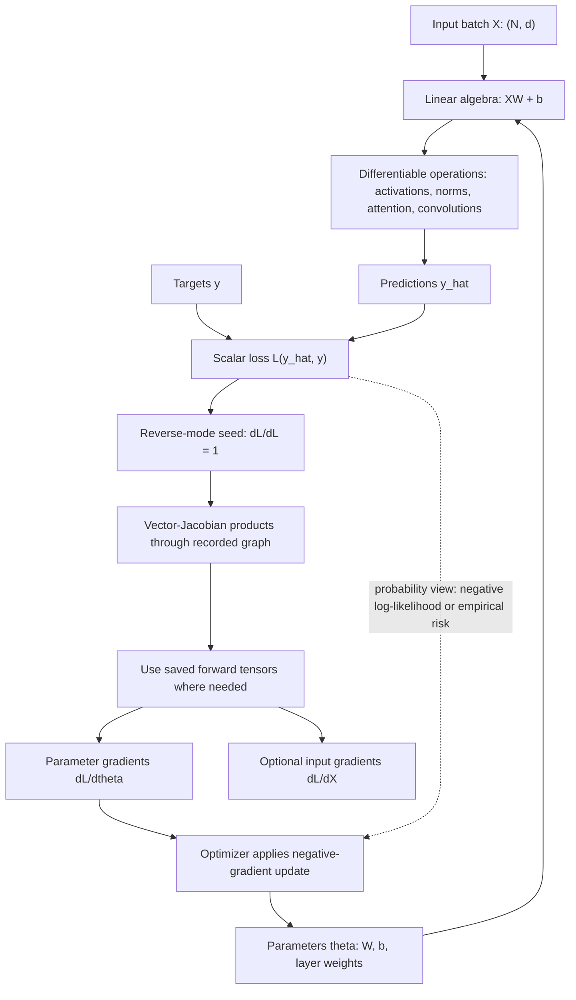

# Math for Deep Learning

The mathematical preliminaries in D2L are intentionally compact: enough linear algebra to express neural networks, enough calculus to understand gradient-based learning, enough automatic differentiation to implement training, and enough probability to reason about data, uncertainty, loss functions, and generalization. The point is not to turn every model into a theorem, but to make the symbols in later chapters operational.


*Figure: Layered neural networks make differentiable function approximation visible. Image: [Wikimedia Commons](https://commons.wikimedia.org/wiki/File:Artificial_neural_network.svg), Cburnett, CC BY-SA 3.0/GFDL.*

Deep learning repeatedly applies the same pattern. A model maps inputs to predictions through differentiable tensor operations. A loss function turns predictions into a scalar objective. Automatic differentiation computes gradients of that scalar with respect to model parameters. An optimizer uses those gradients to change the parameters. Linear algebra describes the computation; calculus supplies the local direction of improvement; probability explains why losses such as squared error and cross-entropy are natural.

## Definitions

A **scalar** is a single number, often written $x \in \mathbb{R}$. A **vector** is an ordered list $x \in \mathbb{R}^d$. A **matrix** is a rectangular array $X \in \mathbb{R}^{m \times n}$. A **tensor** is an array with any number of axes.

The **dot product** of two vectors $x,y \in \mathbb{R}^d$ is

$$
x^T y = \sum_{j=1}^d x_j y_j.
$$

The **matrix-vector product** $Xw$ combines each row $x_i$ of $X$ with $w$ by a dot product. The **matrix-matrix product** $AB$ composes linear transformations when their inner dimensions match.

A **norm** measures size. The common vector norms are

$$
\|x\|_1 = \sum_j |x_j|,
\qquad
\|x\|_2 = \sqrt{\sum_j x_j^2}.
$$

For a scalar-valued function $f(x)$, the **derivative** $f'(x)$ measures instantaneous rate of change. For $f: \mathbb{R}^d \to \mathbb{R}$, the **gradient** is

$$
\nabla_x f =
\left[
\frac{\partial f}{\partial x_1},
\ldots,
\frac{\partial f}{\partial x_d}
\right]^T.
$$

**Automatic differentiation** records a computation graph during the forward pass and applies the chain rule during the backward pass. PyTorch stores gradients in the `.grad` field of tensors with `requires_grad=True`.

A **random variable** assigns numeric values to uncertain outcomes. The expectation $\mathbb{E}[X]$ is a probability-weighted average. Conditional probability $P(A \mid B)$ measures the probability of $A$ after assuming $B$ occurred.

## Key results

Linear models use matrix multiplication to express many predictions at once:

$$
\hat{y} = Xw + b.
$$

This single equation covers an entire minibatch. It also reveals why matching dimensions matters: $X$ has shape $n \times d$, $w$ has shape $d$, and $\hat{y}$ has shape $n$.

The chain rule is the main calculus result behind backpropagation. If $z = g(x)$ and $y = f(z)$, then

$$
\frac{dy}{dx} = \frac{dy}{dz}\frac{dz}{dx}.
$$

For vector-valued intermediate quantities, the same idea applies through Jacobians, but deep learning frameworks avoid explicitly materializing most Jacobian matrices. They propagate vector-Jacobian products efficiently from the scalar loss back to parameters.

A local first-order approximation explains gradient descent:

$$
f(x + \Delta x) \approx f(x) + \nabla f(x)^T \Delta x.
$$

Choosing $\Delta x = -\eta \nabla f(x)$ gives

$$
f(x + \Delta x) \approx f(x) - \eta \|\nabla f(x)\|_2^2,
$$

so a sufficiently small positive learning rate $\eta$ should reduce the objective locally.

Probability connects losses to statistical assumptions. If targets follow

$$
y = x^T w + b + \epsilon,
\qquad
\epsilon \sim \mathcal{N}(0, \sigma^2),
$$

then maximizing Gaussian likelihood is equivalent to minimizing squared error. If class labels follow a categorical distribution predicted by softmax probabilities, maximizing likelihood is equivalent to minimizing cross-entropy.

Automatic differentiation should be understood as exact differentiation of the executed program, not symbolic algebra over the mathematical expression in a textbook. If Python control flow chooses one branch, autograd differentiates the operations that actually ran. This is powerful because models can include loops and conditionals, but it also means that converting tensors to Python numbers can break the graph.

Most deep learning objectives are scalar because reverse-mode automatic differentiation is efficient for many parameters and one output. The framework propagates gradients from the scalar loss backward through the graph. When the output is not scalar, PyTorch asks for the upstream gradient because it needs to know which vector-Jacobian product to compute.

Probability also explains why empirical averages appear everywhere. The true risk is an expectation over the data distribution, but the distribution is unknown. Training replaces it with a sample average over the dataset or minibatch. Generalization asks whether this finite-sample approximation led to parameters that work beyond the observed examples.

Notation consistency reduces cognitive load in deep learning. D2L usually reserves uppercase letters for matrices or tensors, lowercase bold-like symbols for vectors, and plain lowercase symbols for scalars. Code does not enforce this distinction, so the reader must keep track of whether a tensor represents one example, a minibatch, a parameter matrix, or a scalar loss. Many derivation mistakes are shape mistakes in disguise.

The link between likelihood and loss is a recurring modeling choice. Squared error corresponds to Gaussian noise with fixed variance. Cross-entropy corresponds to categorical likelihood. Other data assumptions lead to other losses, such as Poisson losses for counts or quantile losses for asymmetric prediction. D2L focuses on common losses, but the principle is broader: choose objectives that match the data-generating story and task metric.

## Visual



This computation graph connects the math objects to the training mechanics. The forward pass is a chain of tensor operations that ends in a scalar loss, and reverse-mode autodiff sends vector-Jacobian products backward through the exact recorded operations. The optimizer consumes `dL/dtheta`; input gradients are optional and only needed for analysis or methods such as adversarial examples.

| Mathematical tool | Deep learning role | Typical failure when misunderstood |
|---|---|---|
| Matrix multiplication | Batches, linear layers, attention scores | Inner dimensions do not match |
| Norms | Regularization, gradient clipping, distance | Penalizing the wrong parameter group |
| Gradients | Direction of steepest local increase | Updating in the wrong sign |
| Chain rule | Backpropagation through layers | Detaching tensors accidentally |
| Expectation | Risk, average loss, sampling | Confusing sample mean with exact expectation |
| Conditional probability | Supervised prediction and Bayes reasoning | Ignoring what is being conditioned on |

## Worked example 1: gradient of a quadratic loss

Problem: compute the gradient of

$$
f(w) = \frac{1}{2}\|Xw - y\|_2^2
$$

for

$$
X =
\begin{bmatrix}
1 & 2 \\
3 & 4
\end{bmatrix},
\quad
w =
\begin{bmatrix}
1 \\
-1
\end{bmatrix},
\quad
y =
\begin{bmatrix}
0 \\
1
\end{bmatrix}.
$$

Method:

1. Define the residual $r = Xw - y$.

$$
Xw =
\begin{bmatrix}
1(1)+2(-1) \\
3(1)+4(-1)
\end{bmatrix}
=
\begin{bmatrix}
-1 \\
-1
\end{bmatrix}.
$$

2. Subtract $y$:

$$
r =
\begin{bmatrix}
-1 \\
-1
\end{bmatrix}
-
\begin{bmatrix}
0 \\
1
\end{bmatrix}
=
\begin{bmatrix}
-1 \\
-2
\end{bmatrix}.
$$

3. Use the standard gradient result:

$$
\nabla_w f = X^T(Xw-y) = X^T r.
$$

4. Compute:

$$
X^T r =
\begin{bmatrix}
1 & 3 \\
2 & 4
\end{bmatrix}
\begin{bmatrix}
-1 \\
-2
\end{bmatrix}
=
\begin{bmatrix}
-1 - 6 \\
-2 - 8
\end{bmatrix}
=
\begin{bmatrix}
-7 \\
-10
\end{bmatrix}.
$$

Checked answer: $\nabla_w f = [-7, -10]^T$. A gradient-descent step subtracts this gradient, so it increases both components of $w$ for a small positive learning rate.

## Worked example 2: Bayes rule for a classifier signal

Problem: a detector flags an image as containing a rare class. The prior probability of the class is $P(C)=0.01$. The detector has true positive rate $P(F \mid C)=0.95$ and false positive rate $P(F \mid \neg C)=0.05$. Find $P(C \mid F)$.

Method:

1. Write Bayes rule:

$$
P(C \mid F) =
\frac{P(F \mid C)P(C)}{P(F)}.
$$

2. Expand the denominator by total probability:

$$
P(F) =
P(F \mid C)P(C) + P(F \mid \neg C)P(\neg C).
$$

3. Substitute values:

$$
P(F) = 0.95(0.01) + 0.05(0.99)
= 0.0095 + 0.0495
= 0.059.
$$

4. Compute the posterior:

$$
P(C \mid F) =
\frac{0.95(0.01)}{0.059}
= \frac{0.0095}{0.059}
\approx 0.161.
$$

Checked answer: even with a strong detector, a positive flag only gives about $16.1\%$ probability because the class is rare. This is the base-rate effect, and it is one reason accuracy alone can be misleading.

## Code

```python
import torch

X = torch.tensor([[1.0, 2.0], [3.0, 4.0]])
y = torch.tensor([[0.0], [1.0]])
w = torch.tensor([[1.0], [-1.0]], requires_grad=True)

loss = 0.5 * torch.sum((X @ w - y) ** 2)
loss.backward()

print("loss:", loss.item())
print("autograd gradient:", w.grad)

manual_grad = X.T @ (X @ w.detach() - y)
print("manual gradient:", manual_grad)
```

## Common pitfalls

- Confusing a row vector, column vector, and rank-1 tensor. PyTorch often accepts rank-1 tensors, but derivations require explicit orientation.
- Calling `backward()` repeatedly without clearing accumulated gradients. Optimizers usually need `zero_grad()` each iteration.
- Backpropagating through non-scalar outputs without supplying a gradient argument.
- Detaching a tensor or converting it to NumPy before all needed gradients have been computed.
- Treating probability estimates as calibrated merely because they came from a softmax.
- Forgetting that gradient descent moves opposite the gradient, while the gradient points toward steepest local increase.

## Connections

- [Linear algebra](/math/linear-algebra/)
- [Probability and random variables](/math/probability-and-random-variables/)
- [Classical machine learning](/cs/machine-learning/)
- [Optimization algorithms](/cs/deep-learning/optimization-algorithms)
- [Reinforcement learning and Bayesian tuning](/cs/deep-learning/reinforcement-learning-and-bayesian-tuning)
