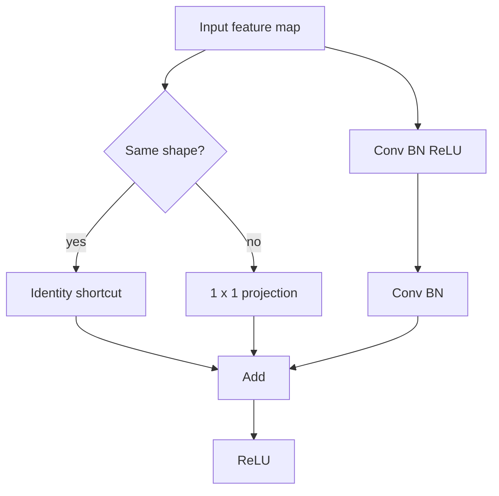

# Modern CNNs

D2L's modern CNN chapters show how image models evolved from LeNet into deeper, more modular architectures. AlexNet demonstrated that large CNNs trained on GPUs could dominate image recognition. VGG made depth systematic through repeated small convolutional blocks. NiN and GoogLeNet introduced channel mixing and multi-branch computation. Batch normalization stabilized deep training. ResNet changed the default architecture by making identity paths explicit, and DenseNet pushed feature reuse even further.

These models are more than a historical sequence. They introduce reusable design ideas: blocks, bottlenecks, normalization, residual connections, concatenation, global average pooling, and computational tradeoffs between width, depth, and resolution. Modern vision models still rely on these ideas even when attention or hybrid architectures are added.


*Figure: Convolutional neural network architecture. Image: [Wikimedia Commons](https://commons.wikimedia.org/wiki/File:Convolutional_Neural_Network.png), Irisbox, CC BY 4.0.*

## Definitions

An **architecture block** is a repeated module with a recognizable input-output pattern. VGG blocks repeat $3 \times 3$ convolutions and pooling. Inception blocks run several branches in parallel. Residual blocks add an input to a learned transformation.

**AlexNet** is a deep CNN that uses large early kernels, ReLU activations, dropout, and GPU training. It helped establish representation learning for large-scale image classification.

**VGG** uses stacks of small $3 \times 3$ convolutions. Repeating small kernels increases depth and receptive field while keeping the design regular.

**Network in Network** uses $1 \times 1$ convolutions to create per-pixel multilayer transformations over channels and replaces some fully connected classification structure with global average pooling.

**GoogLeNet** uses Inception blocks, where $1 \times 1$, $3 \times 3$, $5 \times 5$, and pooling branches are concatenated. $1 \times 1$ convolutions often reduce channel counts before expensive convolutions.

**Batch normalization** normalizes intermediate activations using minibatch statistics during training and running estimates during evaluation. It learns scale and shift parameters after normalization.

**ResNet** uses residual blocks:

$$
y = x + F(x).
$$

If shapes differ, a projection such as a $1 \times 1$ convolution can transform $x$ before addition.

**DenseNet** concatenates previous feature maps:

$$
x_l = H_l([x_0,x_1,\ldots,x_{l-1}]).
$$

## Key results

Depth increases representational power but makes optimization harder. Residual connections help because a block can learn a residual correction around the identity. If the best transformation is close to identity, it is easier to make $F(x)$ small than to force a plain stack of layers to learn an exact identity mapping.

Batch normalization for a scalar activation within a minibatch computes

$$
\hat{x} = \frac{x-\mu_B}{\sqrt{\sigma_B^2+\epsilon}},
\qquad
y = \gamma \hat{x} + \beta.
$$

The learned $\gamma$ and $\beta$ let the network recover useful scales and offsets. Batch norm can allow larger learning rates and reduce sensitivity to initialization, but it behaves differently for small batches and sequence models.

VGG's repeated $3 \times 3$ convolutions illustrate parameter tradeoffs. Two $3 \times 3$ convolutions have an effective $5 \times 5$ receptive field and add an extra nonlinearity. Three $3 \times 3$ convolutions have an effective $7 \times 7$ receptive field. This favors deeper stacks of small kernels over one large kernel in many settings.

Inception uses parallel branches because useful visual features appear at multiple scales. However, naive branches can be expensive. A $1 \times 1$ bottleneck reduces the number of channels before a $3 \times 3$ or $5 \times 5$ convolution, cutting computation.

DenseNet's concatenation preserves earlier features instead of repeatedly transforming them by addition. This encourages feature reuse but increases channel count, so transition layers reduce spatial size and compress channels.

Batch normalization placement is a design choice, but common modern blocks use convolution, normalization, and activation as a repeated pattern. Some residual variants place normalization and activation before the convolution, creating pre-activation blocks. The practical purpose is the same: keep intermediate signals in a trainable range and make very deep networks easier to optimize.

Architecture families also reflect hardware constraints. A network with fewer parameters is not always faster if it uses operations that are inefficient on the target device. Inception reduces arithmetic with bottlenecks, VGG is regular but heavy, and residual networks offer a strong balance of accuracy and trainability. D2L's architecture tour should therefore be read as a set of design tradeoffs rather than a leaderboard.

Modern CNN design often separates the stem, stages, and head. The stem quickly maps pixels to feature maps, stages reduce resolution while increasing channels, and the head pools and classifies. This pattern makes it easier to reason about where spatial detail is lost and where semantic abstraction grows.

Residual and dense connections can be read as information-routing mechanisms. A plain deep stack forces every layer to transform the representation before passing it onward. A residual block lets information bypass a transformation by addition. A dense block lets later layers see earlier features by concatenation. These paths improve gradient flow and feature reuse, which is why they became standard components in deep vision systems.

Architecture comparison should control for training recipe. AlexNet, VGG, GoogLeNet, ResNet, and DenseNet differ in structure, but reported performance also depends on data augmentation, optimizer, learning-rate schedule, initialization, batch size, and input resolution. D2L's concise implementations are educational baselines; production comparisons need matched compute and tuned recipes.

## Visual



| Family | Main design idea | Benefit | Cost or caution |
|---|---|---|---|
| AlexNet | Large CNN with ReLU and dropout | Scaled CNNs to ImageNet | Large early kernels are expensive |
| VGG | Repeated small conv blocks | Simple, regular, deep | Many parameters in classifier |
| NiN | $1 \times 1$ channel MLPs | Local channel mixing | Less spatial multi-scale structure |
| GoogLeNet | Inception branches | Multi-scale features | More complex block design |
| BatchNorm | Normalize activations | Stabilizes training | Batch-size dependence |
| ResNet | Residual addition | Very deep optimization | Shape alignment required |
| DenseNet | Feature concatenation | Strong feature reuse | Channel growth |

## Worked example 1: parameters saved by a bottleneck

Problem: compare the parameter count of a direct $5 \times 5$ convolution from $192$ input channels to $32$ output channels with a bottleneck design that first uses a $1 \times 1$ convolution from $192$ to $16$ channels, then a $5 \times 5$ convolution from $16$ to $32$ channels. Ignore biases.

Method:

1. Direct convolution parameters:

$$
32 \cdot 192 \cdot 5 \cdot 5
= 32 \cdot 192 \cdot 25.
$$

2. Compute:

$$
192 \cdot 25 = 4800,
\qquad
32 \cdot 4800 = 153600.
$$

3. Bottleneck $1 \times 1$ parameters:

$$
16 \cdot 192 \cdot 1 \cdot 1 = 3072.
$$

4. Bottleneck $5 \times 5$ parameters:

$$
32 \cdot 16 \cdot 5 \cdot 5
=32 \cdot 16 \cdot 25
=12800.
$$

5. Total bottleneck parameters:

$$
3072 + 12800 = 15872.
$$

6. Reduction factor:

$$
\frac{153600}{15872} \approx 9.68.
$$

Checked answer: the bottleneck design uses $15{,}872$ parameters instead of $153{,}600$, roughly a $9.7$ times reduction. This is why Inception-style blocks use $1 \times 1$ reductions before expensive kernels.

## Worked example 2: residual block shape matching

Problem: an input tensor has shape `(batch, 64, 56, 56)`. A residual branch uses a convolutional path that outputs `(batch, 128, 28, 28)`. Can the original input be added directly to the branch output? If not, specify a projection.

Method:

1. Addition requires identical shapes, or at least broadcast-compatible shapes. Residual feature maps are meant to align elementwise, so the channel and spatial dimensions should match exactly.
2. Compare channels: input has $64$ channels, branch has $128$ channels. They do not match.
3. Compare height and width: input has $56 \times 56$, branch has $28 \times 28$. They do not match.
4. Use a projection shortcut with output channels $128$ and stride $2$:

$$
\mathrm{shortcut}(x)=\mathrm{Conv}_{1 \times 1}(x;\ \text{out}=128,\ \text{stride}=2).
$$

5. The $1 \times 1$ projection changes channels from $64$ to $128$, and stride $2$ changes spatial size from $56 \times 56$ to $28 \times 28$.

Checked answer: direct addition is invalid. A $1 \times 1$ convolution with stride $2$ and $128$ output channels produces a shortcut tensor of shape `(batch, 128, 28, 28)`, which can be added to the residual branch.

## Code

```python
import torch
from torch import nn

class ResidualBlock(nn.Module):
    def __init__(self, in_channels, out_channels, stride=1):
        super().__init__()
        self.body = nn.Sequential(
            nn.Conv2d(in_channels, out_channels, kernel_size=3,
                      stride=stride, padding=1, bias=False),
            nn.BatchNorm2d(out_channels),
            nn.ReLU(),
            nn.Conv2d(out_channels, out_channels, kernel_size=3,
                      padding=1, bias=False),
            nn.BatchNorm2d(out_channels),
        )
        if in_channels != out_channels or stride != 1:
            self.shortcut = nn.Sequential(
                nn.Conv2d(in_channels, out_channels, kernel_size=1,
                          stride=stride, bias=False),
                nn.BatchNorm2d(out_channels),
            )
        else:
            self.shortcut = nn.Identity()
        self.activation = nn.ReLU()

    def forward(self, x):
        return self.activation(self.body(x) + self.shortcut(x))

block = ResidualBlock(64, 128, stride=2)
x = torch.randn(4, 64, 56, 56)
y = block(x)
print(y.shape)
```

## Common pitfalls

- Adding residual tensors with mismatched channel or spatial dimensions.
- Forgetting that batch normalization has different training and evaluation behavior.
- Comparing architectures by depth alone without considering width, resolution, and compute.
- Placing global average pooling too early and destroying useful spatial detail.
- Assuming $1 \times 1$ convolutions are trivial. They can dominate channel mixing and parameter counts.
- Treating named architectures as fixed recipes rather than reusable design patterns.

## Connections

- [Convolutional neural networks](/cs/deep-learning/convolutional-neural-networks)
- [Computer vision applications](/cs/deep-learning/computer-vision-applications)
- [Optimization algorithms](/cs/deep-learning/optimization-algorithms)
- [PyTorch builders guide](/cs/deep-learning/pytorch-builders-guide)
- [Machine learning](/cs/machine-learning/)
