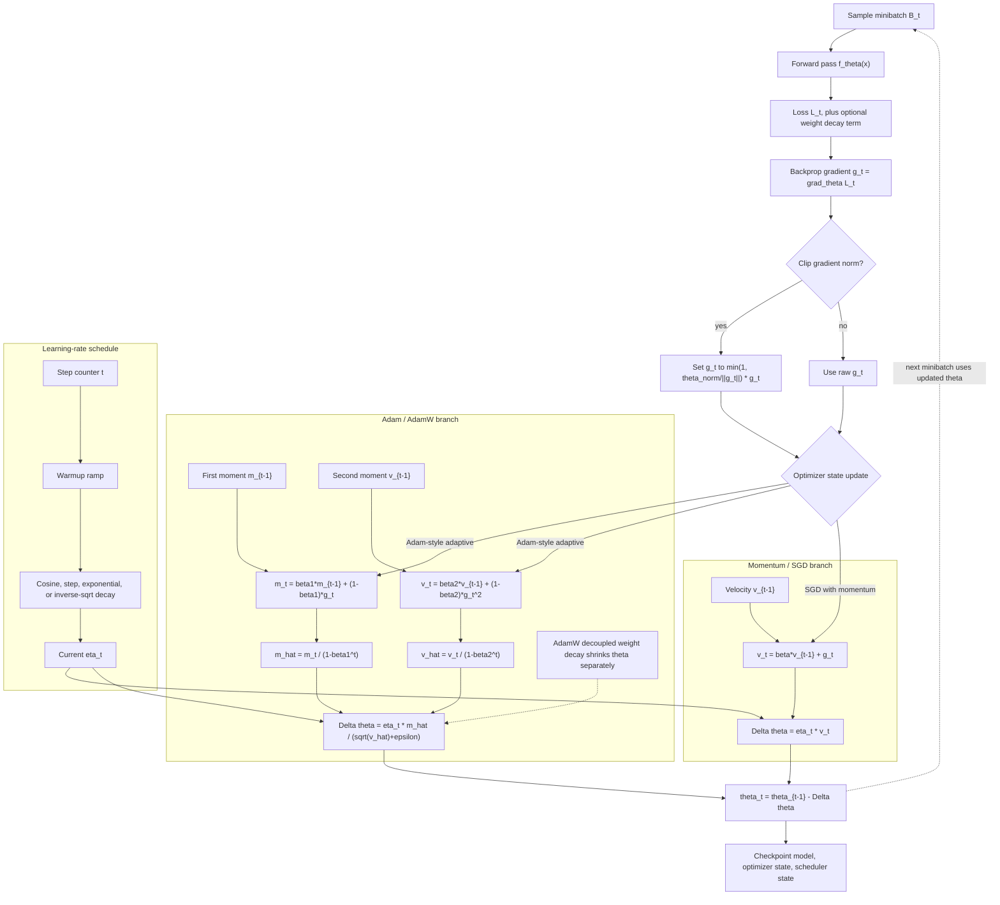

# Optimization Algorithms

Training a neural network is an optimization problem, but D2L is careful to separate optimization from generalization. Optimization asks how to reduce the training objective. Generalization asks whether the learned model works on new data. Deep learning needs both, and the optimizer often determines whether a reasonable architecture trains at all.

The D2L optimization chapters move from gradient descent and convexity to stochastic gradients, minibatches, momentum, adaptive learning rates, and schedules. These methods are not just implementation variants. Each one makes a different tradeoff among gradient noise, curvature, memory, compute, and hyperparameter sensitivity. Understanding the update equations makes debugging training curves much easier.

## Definitions

An **objective function** $f(\theta)$ maps parameters to a scalar value. In supervised learning, $f$ is usually empirical risk plus optional regularization.

**Gradient descent** updates parameters by

$$
\theta_t = \theta_{t-1} - \eta \nabla f(\theta_{t-1}),
$$

where $\eta$ is the learning rate.

**Stochastic gradient descent** replaces the full gradient with a gradient computed from one example or a minibatch:

$$
g_t = \frac{1}{|B_t|}\sum_{i \in B_t}\nabla_\theta \ell_i(\theta).
$$

**Momentum** keeps a velocity:

$$
v_t = \beta v_{t-1} + g_t,
\qquad
\theta_t = \theta_{t-1} - \eta v_t.
$$

**AdaGrad** accumulates squared gradients coordinatewise:

$$
s_t = s_{t-1} + g_t \odot g_t,
\qquad
\theta_t = \theta_{t-1} - \eta \frac{g_t}{\sqrt{s_t+\epsilon}}.
$$

**RMSProp** uses an exponential moving average of squared gradients:

$$
s_t = \gamma s_{t-1} + (1-\gamma)g_t \odot g_t.
$$

**Adam** combines momentum and RMSProp-style second moments, with bias correction.

A **learning-rate schedule** changes $\eta$ over time. Common schedules include step decay, exponential decay, cosine decay, warmup, and inverse square-root decay.

## Key results

For smooth objectives, a learning rate that is too large can diverge even when the gradient direction is correct. A learning rate that is too small may make training appear stuck. The useful range depends on curvature, batch size, normalization, initialization, and optimizer choice.

Convexity provides clean guarantees, but deep networks are nonconvex. D2L still studies convexity because it gives language for local minima, saddle points, curvature, and the difference between optimization difficulty and model expressiveness.

Minibatch size controls gradient noise and hardware efficiency. Larger batches produce less noisy gradient estimates and better matrix-kernel utilization, but they can require learning-rate adjustment and more memory. Very small batches are noisy and inefficient on parallel hardware.

Momentum damps oscillations in directions where gradients keep changing sign and accelerates progress in directions where gradients agree. It is especially useful in long, narrow valleys where plain gradient descent zigzags.

Adaptive methods rescale each coordinate by past gradient magnitude. This helps when features or parameters have different gradient scales. However, adaptive methods still need learning-rate tuning and may generalize differently from SGD with momentum in some vision settings.

Adam's common update is

$$
m_t = \beta_1m_{t-1} + (1-\beta_1)g_t,
$$

$$
v_t = \beta_2v_{t-1} + (1-\beta_2)g_t^2,
$$

$$
\hat{m}_t = \frac{m_t}{1-\beta_1^t},
\qquad
\hat{v}_t = \frac{v_t}{1-\beta_2^t},
$$

$$
\theta_t = \theta_{t-1} - \eta \frac{\hat{m}_t}{\sqrt{\hat{v}_t}+\epsilon}.
$$

Learning-rate schedules are often as important as the optimizer family. A high initial learning rate may make early progress fast but unstable. Warmup starts with a smaller rate and increases it over early steps, which is common for very deep networks and transformers. Decay then reduces update size so training can settle into a lower-loss region. A schedule changes the optimization trajectory even when every other hyperparameter is fixed.

Weight decay should be interpreted carefully with adaptive methods. Classical $L_2$ regularization adds $\lambda w$ to the gradient, after which an adaptive optimizer rescales it along with the loss gradient. Decoupled weight decay, used by optimizers such as AdamW, applies shrinkage separately from the adaptive gradient step. D2L's weight-decay treatment gives the mathematical penalty; modern optimizer APIs may expose both coupled and decoupled variants.

Stochastic gradients also act as noise. That noise can help escape sharp or poor regions, but too much noise prevents convergence. Batch size, data order, augmentation, dropout, and distributed training all affect the noise scale. This is why training recipes specify the optimizer, batch size, schedule, and regularization together rather than independently.

Training curves should be interpreted jointly. If training loss does not decrease, suspect optimization: learning rate, initialization, gradients, architecture, or data pipeline. If training loss decreases but validation loss worsens, suspect overfitting or distribution mismatch. If both losses are noisy, inspect batch size, label noise, and optimizer settings. Optimizers provide update rules, but diagnostics decide which rule or hyperparameter needs attention.

Gradient norms are a compact health signal. Norms near zero can indicate saturation, excessive regularization, or broken graph connections. Extremely large norms can indicate exploding gradients, too large a learning rate, or unstable recurrent dynamics. Clipping changes the update, so it should be used deliberately and monitored rather than added blindly to hide numerical problems.

The optimizer state should be treated as part of training. Resuming from a checkpoint with model weights but without momentum or Adam moments changes the next updates. For serious experiments, save model state, optimizer state, scheduler state, and epoch or step counters together.

## Visual



The optimizer diagram separates the raw gradient computation from optimizer state, learning-rate scheduling, and parameter updates. Momentum keeps a velocity state, while Adam keeps first and second moments and applies bias correction before the adaptive step. The schedule subgraph supplies `eta_t` to either branch, and the checkpoint node shows why optimizer and scheduler states are part of a reproducible training run.

| Optimizer | Extra state | Strength | Main tuning concern |
|---|---|---|---|
| Full GD | None | Exact training gradient | Expensive on large data |
| SGD | None | Cheap noisy updates | Learning-rate schedule |
| Minibatch SGD | None | Hardware efficient compromise | Batch size and learning rate |
| Momentum | Velocity | Faster in valleys | Momentum coefficient |
| AdaGrad | Sum of squared gradients | Rare feature adaptation | Learning rate can decay too much |
| RMSProp | Moving squared average | Nonstationary adaptation | Decay rate |
| Adam | First and second moments | Strong default optimizer | Weight decay and schedule |

## Worked example 1: gradient descent on a quadratic

Problem: minimize $f(x)=x^2$ starting from $x_0=3$ with learning rate $\eta=0.1$. Compute two gradient-descent steps.

Method:

1. Compute the derivative:

$$
f'(x)=2x.
$$

2. Step 1 gradient:

$$
g_0 = 2x_0 = 2(3)=6.
$$

3. Step 1 update:

$$
x_1 = x_0 - \eta g_0 = 3 - 0.1(6)=2.4.
$$

4. Step 2 gradient:

$$
g_1 = 2x_1 = 2(2.4)=4.8.
$$

5. Step 2 update:

$$
x_2 = 2.4 - 0.1(4.8)=1.92.
$$

6. Check objective decrease:

$$
f(3)=9,\quad f(2.4)=5.76,\quad f(1.92)=3.6864.
$$

Checked answer: after two steps, $x=1.92$ and the objective has decreased monotonically.

## Worked example 2: first Adam update in one dimension

Problem: compute the first Adam update for one parameter. Let $g_1=4$, $m_0=0$, $v_0=0$, $\beta_1=0.9$, $\beta_2=0.999$, $\eta=0.001$, and ignore $\epsilon$ for simplicity.

Method:

1. First moment:

$$
m_1 = 0.9(0) + 0.1(4)=0.4.
$$

2. Second moment:

$$
v_1 = 0.999(0) + 0.001(4^2)=0.016.
$$

3. Bias-correct first moment:

$$
\hat{m}_1 =
\frac{0.4}{1-0.9^1}
= \frac{0.4}{0.1}=4.
$$

4. Bias-correct second moment:

$$
\hat{v}_1 =
\frac{0.016}{1-0.999^1}
= \frac{0.016}{0.001}=16.
$$

5. Update amount:

$$
\eta \frac{\hat{m}_1}{\sqrt{\hat{v}_1}}
=0.001\frac{4}{4}
=0.001.
$$

Checked answer: the first Adam step subtracts approximately $0.001$ from the parameter. Bias correction makes the first step behave like a normalized gradient step rather than a tiny moment estimate.

## Code

```python
import torch
from torch import nn
from torch.utils.data import DataLoader, TensorDataset

torch.manual_seed(7)

n, d = 512, 5
X = torch.randn(n, d)
true_w = torch.arange(1.0, d + 1).reshape(d, 1)
y = X @ true_w + 0.1 * torch.randn(n, 1)
loader = DataLoader(TensorDataset(X, y), batch_size=32, shuffle=True)

def train(optimizer_name):
    model = nn.Linear(d, 1)
    loss_fn = nn.MSELoss()
    if optimizer_name == "sgd":
        optimizer = torch.optim.SGD(model.parameters(), lr=0.05, momentum=0.9)
    else:
        optimizer = torch.optim.Adam(model.parameters(), lr=0.05)

    for _ in range(20):
        for xb, yb in loader:
            loss = loss_fn(model(xb), yb)
            optimizer.zero_grad()
            loss.backward()
            optimizer.step()
    with torch.no_grad():
        return loss_fn(model(X), y).item()

print("SGD with momentum:", train("sgd"))
print("Adam:", train("adam"))
```

## Common pitfalls

- Treating the optimizer as a magic default instead of checking update scale and schedules.
- Comparing optimizers with different effective learning-rate tuning effort.
- Forgetting to exclude biases or normalization parameters from weight decay when the recipe calls for it.
- Increasing batch size without reconsidering learning rate, warmup, and memory limits.
- Ignoring gradient clipping in recurrent or very deep models with unstable gradients.
- Reading training loss alone; optimization success still needs validation checks for generalization.

## Connections

- [Linear regression and training loops](/cs/deep-learning/linear-regression-training)
- [Multilayer perceptrons and regularization](/cs/deep-learning/multilayer-perceptrons-regularization)
- [Computational performance](/cs/deep-learning/computational-performance)
- [Machine learning](/cs/machine-learning/)
- [Calculus](/math/calculus/)
