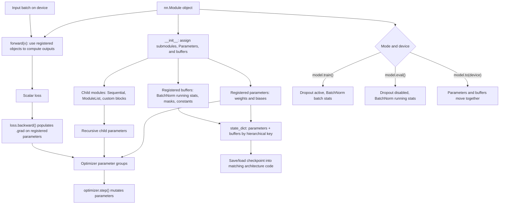

# PyTorch Builders Guide

D2L's builders' guide turns neural networks from formulas into maintainable software. Early examples can fit in a few lines, but real projects need named modules, reusable layers, controlled initialization, explicit parameter access, model serialization, and device management. PyTorch's `nn.Module` abstraction is the central tool for this.

The builder mindset is simple: the forward pass should describe computation, while the module object should own parameters and submodules. When parameters are registered correctly, PyTorch can move them to a GPU, save them in a `state_dict`, include them in an optimizer, and collect their gradients. Most painful PyTorch bugs come from breaking one of these registration or device assumptions.

## Definitions

An **`nn.Module`** is a Python object representing a differentiable component. It may contain parameters, buffers, and other modules. Calling a module invokes its `forward` method through PyTorch's wrapper logic.

A **parameter** is a tensor wrapped in `nn.Parameter`. Assigning it as an attribute of a module registers it automatically. Registered parameters appear in `model.parameters()` and receive gradients when used in differentiable computation.

A **buffer** is a persistent tensor that is not optimized, such as the running mean in batch normalization. Buffers are registered with `register_buffer`.

A **state dict** is an ordered mapping from parameter and buffer names to tensor values. It is the standard way to save and load model weights.

A **custom layer** is a module whose `forward` method implements a new operation. It may have no parameters, like a centering layer, or it may own trainable parameters, like a custom linear layer.

**Device management** controls where tensors live. A CPU tensor and CUDA tensor cannot participate in the same operation. A model and its input batch must be on the same device.

**Lazy initialization** delays parameter shape creation until the first input shape is observed. PyTorch provides lazy modules such as `nn.LazyLinear`, but explicit shapes are often easier for notes and small examples.

## Key results

Submodule assignment is recursive. If a module stores `self.net = nn.Sequential(...)`, then all parameters inside that sequential block are part of the parent module. If the same layers are stored only in an ordinary local list that is not an `nn.ModuleList`, PyTorch will not discover them.

Parameter sharing is possible by reusing the same module object in multiple places. If two paths call the same `nn.Linear` object, they share weights and accumulate gradients into the same parameter tensors. This is different from creating two separate linear layers with identical initial values.

Saving and loading should usually use `state_dict` rather than pickling the entire module object:

$$
\text{architecture code} + \text{state dict} \rightarrow \text{restored model}.
$$

This keeps model definitions readable and avoids coupling saved files to fragile Python object paths.

Initialization is part of the model specification. D2L shows built-in initialization and custom initialization because starting scales affect gradient flow. In PyTorch, initialization should be applied under `torch.no_grad()` or through functions in `torch.nn.init`, which already avoid tracking the operation.

Device transfer is not implicit for new tensors created inside `forward`. If a forward method creates a tensor with `torch.zeros(...)`, it should usually use `x.device` or `x.new_zeros(...)` so the tensor follows the input device.

Training and evaluation modes are part of the module interface. Calling `model.train()` does not train the model by itself; it tells modules such as dropout and batch normalization to use training behavior. Calling `model.eval()` does not disable gradients by itself; it changes module behavior. For evaluation, it is common to use both `model.eval()` and `torch.no_grad()`, because one controls layer semantics and the other controls gradient recording.

Custom layers should keep parameter creation in `__init__` and computation in `forward`. This makes the layer inspectable, serializable, and compatible with optimizers. If a parameter depends on an input shape that is unknown at construction time, a lazy layer or a carefully initialized first forward pass can be used, but the resulting parameters still need to be registered.

The state dictionary is also a debugging tool. Its keys reveal the module hierarchy, and its tensor shapes reveal whether the architecture matches a checkpoint. When loading fails, the missing and unexpected keys often point directly to renamed layers, changed output dimensions, or an accidentally unregistered submodule.

Small module tests are worthwhile. Before inserting a custom layer into a full model, pass a synthetic tensor through it, check the output shape, call a scalar loss, and verify that expected parameters receive gradients. This mirrors D2L's incremental construction style: build simple pieces, inspect them, then compose them. It is much faster to diagnose a shape bug in a custom block than inside a full training job.

Parameter management also affects reproducibility. Initialization should be explicit when results matter, random seeds should be set for controlled experiments, and saved checkpoints should include enough metadata to reconstruct the architecture and preprocessing. The model weights alone are rarely enough to reproduce a training run if data transforms or class mappings changed.

## Visual



The PyTorch builder diagram expands what `nn.Module` owns and how those objects participate in training. Parameters and child-module parameters flow into optimizer groups and receive gradients only if they are registered, while buffers travel through `state_dict` and device moves without being optimized. The mode branch separates `train()` and `eval()` behavior from gradient recording.

| PyTorch feature | Correct use | Common bug |
|---|---|---|
| `nn.Parameter` | Trainable tensor owned by a module | Plain tensor never reaches optimizer |
| `nn.ModuleList` | Dynamic list of child modules | Python list hides submodule parameters |
| `state_dict()` | Save weights and buffers | Saving whole object unnecessarily |
| `model.train()` | Enable training behavior | BatchNorm/dropout left in eval mode |
| `model.eval()` | Disable training-only behavior | Dropout active during validation |
| `.to(device)` | Move model or tensor | Model on GPU, batch still on CPU |

## Worked example 1: count parameters in an MLP

Problem: count the trainable parameters in an MLP with input dimension $10$, hidden dimension $8$, and output dimension $3$. The network is `Linear(10, 8)`, ReLU, then `Linear(8, 3)`.

Method:

1. A linear layer with input size $a$ and output size $b$ has a weight matrix of shape $(b,a)$ and a bias vector of shape $(b)$.
2. First layer:

$$
W_1 \in \mathbb{R}^{8 \times 10},
\qquad
b_1 \in \mathbb{R}^{8}.
$$

So it has

$$
8 \cdot 10 + 8 = 88
$$

parameters.

3. Second layer:

$$
W_2 \in \mathbb{R}^{3 \times 8},
\qquad
b_2 \in \mathbb{R}^{3}.
$$

So it has

$$
3 \cdot 8 + 3 = 27
$$

parameters.

4. ReLU has no trainable parameters.
5. Total:

$$
88 + 27 = 115.
$$

Checked answer: the model has $115$ trainable parameters. A PyTorch count using `sum(p.numel() for p in model.parameters())` should match.

## Worked example 2: tied parameter update

Problem: a scalar parameter $w$ is used twice in the computation

$$
y = wx + wx = 2wx.
$$

For $x=3$, target $t=10$, and squared loss

$$
\ell = \frac{1}{2}(y-t)^2,
$$

compute $\frac{\partial \ell}{\partial w}$ at $w=1$.

Method:

1. Compute prediction:

$$
y = 2(1)(3)=6.
$$

2. Compute residual:

$$
r = y-t = 6-10=-4.
$$

3. Differentiate loss with respect to prediction:

$$
\frac{\partial \ell}{\partial y}=r=-4.
$$

4. Differentiate prediction with respect to the shared parameter:

$$
\frac{\partial y}{\partial w}=2x=6.
$$

5. Apply the chain rule:

$$
\frac{\partial \ell}{\partial w}
= \frac{\partial \ell}{\partial y}\frac{\partial y}{\partial w}
= (-4)(6)
= -24.
$$

Checked answer: the gradient is $-24$. The parameter receives gradient contributions from both uses, which is exactly what should happen when a layer is intentionally shared.

## Code

```python
import os
import tempfile
import torch
from torch import nn

class CenteredLayer(nn.Module):
    def forward(self, x):
        return x - x.mean(dim=0, keepdim=True)

class SmallNet(nn.Module):
    def __init__(self, in_features, hidden, out_features):
        super().__init__()
        self.net = nn.Sequential(
            nn.Linear(in_features, hidden),
            nn.ReLU(),
            CenteredLayer(),
            nn.Linear(hidden, out_features),
        )

    def forward(self, x):
        return self.net(x)

device = torch.device("cuda" if torch.cuda.is_available() else "cpu")
model = SmallNet(10, 8, 3).to(device)

for module in model.modules():
    if isinstance(module, nn.Linear):
        nn.init.xavier_uniform_(module.weight)
        nn.init.zeros_(module.bias)

x = torch.randn(4, 10, device=device)
logits = model(x)
print("logit shape:", logits.shape)
print("parameter count:", sum(p.numel() for p in model.parameters()))

with tempfile.TemporaryDirectory() as tmpdir:
    path = os.path.join(tmpdir, "smallnet.pt")
    torch.save(model.state_dict(), path)
    restored = SmallNet(10, 8, 3).to(device)
    restored.load_state_dict(torch.load(path, map_location=device))
    restored.eval()
```

## Common pitfalls

- Defining layers inside `forward` when they should be persistent parameters. This recreates weights every call.
- Storing modules in a plain Python list instead of `nn.ModuleList` or `nn.Sequential`.
- Creating new tensors on CPU inside a GPU model's forward pass.
- Forgetting that `state_dict` restores values, not architecture. The class definition must match.
- Accidentally sharing a layer object when independent parameters were intended.
- Calling `model.eval()` for validation and forgetting to return to `model.train()` afterward.

## Connections

- [Multilayer perceptrons and regularization](/cs/deep-learning/multilayer-perceptrons-regularization)
- [Convolutional neural networks](/cs/deep-learning/convolutional-neural-networks)
- [Computational performance](/cs/deep-learning/computational-performance)
- [Machine learning](/cs/machine-learning/)
- [Linear algebra](/math/linear-algebra/)
