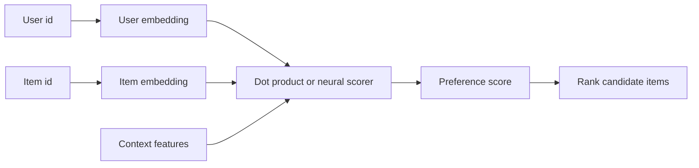

# Recommender Systems

D2L's recommender-system material introduces a major applied setting where deep learning meets sparse user-item interaction data. The goal is to predict what a user may like, click, buy, watch, or rate. Unlike standard supervised learning tables, recommender data is mostly missing, feedback can be explicit or implicit, and the absence of an interaction does not always mean negative preference.

The chapter surveys collaborative filtering, matrix factorization, autoencoders, factorization machines, neural collaborative filtering, and sequence-aware recommendation. These methods differ in architecture, but they share a central representation idea: learn user and item features from observed behavior, then score candidate items for each user.

## Definitions

Let $R \in \mathbb{R}^{m \times n}$ be a user-item matrix, where $R_{ui}$ is a rating or interaction for user $u$ and item $i$. Most entries are unobserved.

**Collaborative filtering** uses patterns across users and items to recommend. It does not require explicit item content, although hybrid systems can include content features.

**Explicit feedback** includes ratings or likes. **Implicit feedback** includes clicks, views, dwell time, purchases, and other behavioral signals.

**Matrix factorization** learns user vectors $p_u \in \mathbb{R}^k$ and item vectors $q_i \in \mathbb{R}^k$, then predicts

$$
\hat{r}_{ui} = p_u^T q_i + b_u + b_i + \mu,
$$

where $b_u$, $b_i$, and $\mu$ are optional user, item, and global biases.

An **autoencoder recommender** reconstructs a user's interaction vector from a compressed hidden representation.

A **factorization machine** models feature interactions using latent vectors:

$$
\hat{y}(x)=w_0+\sum_i w_ix_i+\sum_{i<j}\langle v_i,v_j\rangle x_ix_j.
$$

**Neural collaborative filtering** replaces or augments dot products with neural networks over user and item embeddings.

**Sequence-aware recommendation** models the order of interactions, predicting the next item from recent history.

## Key results

Matrix factorization is a low-rank model. If $P \in \mathbb{R}^{m \times k}$ stores user factors and $Q \in \mathbb{R}^{n \times k}$ stores item factors, then predicted ratings are approximately

$$
\hat{R}=PQ^T.
$$

Only observed entries should contribute to the explicit-feedback loss:

$$
\sum_{(u,i)\in \Omega}(R_{ui}-\hat{r}_{ui})^2
+ \lambda(\|p_u\|^2+\|q_i\|^2),
$$

where $\Omega$ is the set of observed interactions. Treating all missing entries as zeros can create a biased objective unless the task is intentionally implicit-feedback ranking.

Implicit feedback often requires negative sampling or confidence weighting. A user not clicking an item may mean dislike, lack of exposure, or simply no opportunity. This makes evaluation and data construction more subtle than ordinary classification.

Factorization machines are useful when interactions involve more than user and item ids. They can model pairwise interactions among user features, item features, context features, and device features without manually enumerating every cross feature.

Sequence-aware recommenders use RNNs, CNNs, attention, or transformers to capture changing intent. A user looking at several cameras may need different recommendations from the same user browsing books a week earlier.

Ranking metrics such as precision@k, recall@k, hit rate, and NDCG are often more relevant than rating RMSE because recommender systems usually present a short ranked list.

Data splitting is especially sensitive in recommendation. A random split over interactions can place a user's future behavior in the training set while evaluating on earlier behavior, which is unrealistic for next-item prediction. Time-based splits better match deployment when the system recommends future items from past interactions. User-level cold-start evaluation is different again: it tests behavior on users unseen during training.

Bias terms are not a minor detail. Some users rate generously, some items are broadly popular, and some datasets have a global rating level. User and item biases let the latent factors focus more on interaction-specific preference rather than explaining popularity or rating-scale habits. For implicit feedback, popularity bias can be even stronger because exposed items receive more interactions.

Neural recommenders increase flexibility, but they also increase the risk of learning exposure artifacts. If an item was never shown to a user, the missing interaction is ambiguous. Negative sampling should reflect the intended task: ranking among exposed items, ranking among all catalog items, or predicting the next item in a session. The evaluation candidate set must match that choice.

Recommendation objectives can be pointwise, pairwise, or listwise. A pointwise objective predicts a rating or click label for one user-item pair. A pairwise objective trains the model to rank an observed item above an unobserved or less preferred item. A listwise objective optimizes a whole ranked set more directly. Matrix factorization with squared error is pointwise, while many implicit-feedback recommenders use pairwise ranking losses.

Serving constraints are part of recommender design. Scoring every item for every user may be too expensive for a large catalog, so systems often use a two-stage design: candidate generation retrieves a smaller set, and a ranker scores those candidates more carefully. D2L's models describe scoring functions, but deployed recommenders also need retrieval, freshness, filtering, and feedback loops.

Because recommendations influence future interactions, evaluation is partly causal. Showing an item can create feedback that would not have existed otherwise, so offline logs are an incomplete view of user preference.

## Visual



| Method | Main representation | Strength | Caution |
|---|---|---|---|
| User-based CF | Similar users | Simple intuition | Sparse data problems |
| Item-based CF | Similar items | Stable item relations | Cold-start items |
| Matrix factorization | User/item latent factors | Scalable baseline | Dot product may be too simple |
| Autoencoder | Compressed interaction vector | Nonlinear reconstruction | Missing-data handling |
| Factorization machine | Feature interaction factors | Works with side features | Pairwise interaction design |
| Neural CF | Embeddings plus MLP | Flexible scoring | More data and tuning needed |
| Sequence-aware | Ordered history | Captures current intent | More complex evaluation |

## Worked example 1: matrix factorization prediction

Problem: a recommender uses user vector $p_u=[1,2]$, item vector $q_i=[3,1]$, user bias $b_u=0.2$, item bias $b_i=-0.1$, and global mean $\mu=3.5$. Predict the rating.

Method:

1. Compute dot product:

$$
p_u^Tq_i = 1(3)+2(1)=5.
$$

2. Add biases:

$$
\hat{r}_{ui}=5+0.2-0.1+3.5.
$$

3. Combine:

$$
5+0.2=5.2,
\qquad
5.2-0.1=5.1,
\qquad
5.1+3.5=8.6.
$$

4. If the rating scale is $1$ to $5$, the raw score may be clipped or interpreted as an unbounded preference score depending on the model.

Checked answer: the unbounded prediction is $8.6$. The value is high because the latent dot product is large; practical rating models may regularize, constrain, or transform outputs.

## Worked example 2: factorization-machine interaction

Problem: a factorization machine has active binary features $x_1=1$, $x_2=1$, $x_3=0$. The latent vectors are $v_1=[1,0]$, $v_2=[2,3]$, and $v_3=[4,1]`. Compute the pairwise interaction term.

Method:

1. The interaction term is

$$
\sum_{i<j}\langle v_i,v_j\rangle x_ix_j.
$$

2. Pair $(1,2)$ is active because $x_1x_2=1$:

$$
\langle v_1,v_2\rangle = 1(2)+0(3)=2.
$$

3. Pair $(1,3)$ has $x_1x_3=0$, so it contributes $0$.
4. Pair $(2,3)$ has $x_2x_3=0$, so it contributes $0$.
5. Total interaction:

$$
2 + 0 + 0 = 2.
$$

Checked answer: the pairwise interaction contribution is $2$. In sparse one-hot data, only interactions among active features matter.

## Code

```python
import torch
from torch import nn

torch.manual_seed(10)

users = torch.tensor([0, 0, 1, 1, 2, 2])
items = torch.tensor([0, 1, 1, 2, 0, 2])
ratings = torch.tensor([5.0, 4.0, 4.0, 1.0, 1.0, 5.0])

class MatrixFactorization(nn.Module):
    def __init__(self, num_users, num_items, factors):
        super().__init__()
        self.user = nn.Embedding(num_users, factors)
        self.item = nn.Embedding(num_items, factors)
        self.user_bias = nn.Embedding(num_users, 1)
        self.item_bias = nn.Embedding(num_items, 1)
        self.global_bias = nn.Parameter(torch.zeros(1))

    def forward(self, u, i):
        dot = (self.user(u) * self.item(i)).sum(dim=1)
        bias = self.user_bias(u).squeeze(1) + self.item_bias(i).squeeze(1)
        return dot + bias + self.global_bias

model = MatrixFactorization(num_users=3, num_items=3, factors=4)
optimizer = torch.optim.Adam(model.parameters(), lr=0.05, weight_decay=1e-4)
loss_fn = nn.MSELoss()

for _ in range(200):
    pred = model(users, items)
    loss = loss_fn(pred, ratings)
    optimizer.zero_grad()
    loss.backward()
    optimizer.step()

print("training RMSE:", torch.sqrt(loss_fn(model(users, items), ratings)).item())
print("score user 0 item 2:", model(torch.tensor([0]), torch.tensor([2])).item())
```

## Common pitfalls

- Treating every missing rating as a known negative rating.
- Evaluating only RMSE when the product needs top-k ranking quality.
- Splitting interactions randomly without respecting time, causing future behavior to leak into training.
- Ignoring cold-start users and items that have no interaction history.
- Training on implicit feedback without considering exposure bias.
- Overcomplicating the model before establishing matrix factorization and item-based baselines.

## Connections

- [Machine learning](/cs/machine-learning/)
- [NLP pretraining and applications](/cs/deep-learning/nlp-pretraining-and-applications)
- [Attention and transformers](/cs/deep-learning/attention-transformers)
- [Probability and random variables](/math/probability-and-random-variables/)
- [Linear algebra](/math/linear-algebra/)
