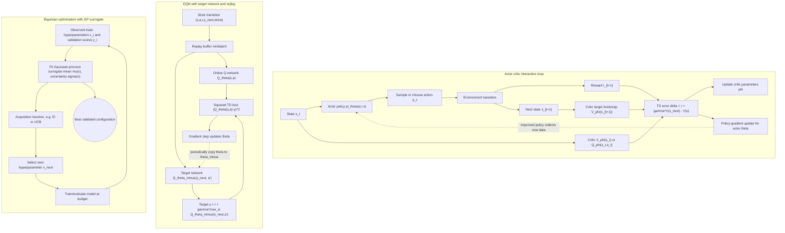

# Reinforcement Learning and Bayesian Tuning

D2L closes by touching topics that connect deep learning to decision making and automated model selection. Reinforcement learning studies agents that act in environments and learn from rewards. Gaussian processes provide a Bayesian way to model unknown functions. Hyperparameter optimization uses search algorithms, often including Bayesian optimization and multi-fidelity methods, to tune choices such as learning rate, model width, and regularization.


*Figure: Cart-pole is a standard control and reinforcement-learning benchmark. Image: [Wikimedia Commons](https://commons.wikimedia.org/wiki/File:Cartpole.gif), Condordellanebbia, CC BY-SA 4.0.*

These topics are broad enough for dedicated courses, so this page keeps the focus on D2L's role: introduce the objects and workflows that deep learning practitioners encounter. RL connects naturally to Sutton and Barto's framework of Markov decision processes. Gaussian processes connect probability, kernels, and uncertainty. Hyperparameter optimization connects experimental design to the reality that many deep learning outcomes depend on nontrained configuration choices.

## Definitions

A **Markov decision process** is a tuple $(\mathcal{S},\mathcal{A},P,R,\gamma)$ with states, actions, transition probabilities, rewards, and discount factor. The Markov property says the next-state distribution depends on the current state and action, not the full history.

A **policy** $\pi(a \mid s)$ specifies action probabilities. A **value function** estimates expected discounted return:

$$
V^\pi(s)=\mathbb{E}_\pi\left[\sum_{t=0}^{\infty}\gamma^t R_{t+1}\mid S_0=s\right].
$$

An **action-value function** is

$$
Q^\pi(s,a)=\mathbb{E}_\pi\left[\sum_{t=0}^{\infty}\gamma^t R_{t+1}\mid S_0=s,A_0=a\right].
$$

A **Gaussian process** is a distribution over functions. Any finite set of function values follows a multivariate Gaussian distribution. A GP is specified by a mean function and kernel:

$$
f(x) \sim \mathcal{GP}(m(x), k(x,x')).
$$

A common radial basis function kernel is

$$
k(x,x')=\sigma_f^2\exp\left(-\frac{\|x-x'\|^2}{2\ell^2}\right).
$$

**Hyperparameters** are configuration choices not directly learned by gradient descent, such as learning rate, dropout rate, batch size, depth, and weight decay.

**Bayesian optimization** fits a surrogate model to past trial results and uses an acquisition function to choose promising future trials. **Multi-fidelity optimization** allocates small budgets to many configurations and larger budgets to the most promising ones.

## Key results

The Bellman expectation equation for a fixed policy is

$$
V^\pi(s)=
\sum_a \pi(a\mid s)
\sum_{s'}P(s'\mid s,a)
\left[R(s,a,s')+\gamma V^\pi(s')\right].
$$

The optimal Bellman equation replaces policy averaging with maximization:

$$
V^*(s)=
\max_a
\sum_{s'}P(s'\mid s,a)
\left[R(s,a,s')+\gamma V^*(s')\right].
$$

Deep reinforcement learning uses neural networks to approximate policies, values, or models when state spaces are large. This creates the same optimization and generalization issues as supervised deep learning, plus exploration, delayed credit assignment, and off-policy distribution shift.

Gaussian process regression gives both a predictive mean and predictive uncertainty. For training inputs $X$, observations $y$, test inputs $X_*$, kernel matrix $K$, cross-kernel $K_*$, and noise variance $\sigma_n^2$, the posterior mean is

$$
\mu_* = K_*^T(K+\sigma_n^2I)^{-1}y.
$$

The uncertainty estimate makes GPs useful for Bayesian optimization, where the searcher must balance exploitation of known good regions with exploration of uncertain regions.

Successive halving is a multi-fidelity idea. Start many configurations with small budgets, rank them, keep a fraction, and allocate more budget to survivors. This is useful because early performance can often identify poor configurations before full training completes.

Exploration is the reason RL cannot simply choose the currently best-looking action forever. An action with uncertain value may need to be tried to discover whether it leads to better long-term reward. Deep RL algorithms add function approximation to this problem, so the agent's data distribution changes as the policy changes. This feedback loop is one reason RL training can be less stable than supervised learning.

Gaussian processes bring calibrated uncertainty into small-data function modeling. The kernel encodes smoothness assumptions: nearby hyperparameter settings are expected to have related objective values. If the kernel is poorly matched to the real response surface, Bayesian optimization can become overconfident or search inefficiently. The uncertainty estimate is useful, but it is still model-based.

Hyperparameter optimization should report the search space and budget, not only the winning configuration. A model found after hundreds of trials has used more validation information than a model found after five trials. Multi-fidelity methods reduce cost, but they introduce a bias toward configurations that perform well early. That bias is helpful when early learning curves are predictive and harmful when some models improve late.

Deep Q-learning and policy-gradient methods represent two common RL directions. Value-based methods learn action values and choose high-value actions, often with exploration added. Policy-gradient methods directly adjust policy parameters to increase expected return. Actor-critic methods combine both by learning a policy and a value estimate. D2L's brief RL chapter is an entry point; the dedicated reinforcement-learning section develops these ideas much further.

Bayesian optimization depends on an acquisition function, such as expected improvement or upper confidence bound. The acquisition function converts the surrogate's mean and uncertainty into a next trial. High predicted performance favors exploitation; high uncertainty favors exploration. This is the same exploration-exploitation theme seen in RL, but applied to choosing experiments rather than actions inside an environment.

## Visual


*Figure: Agent-environment feedback loop used as fallback visual context for DQN's value-learning setup. Image: [Wikimedia Commons](https://commons.wikimedia.org/wiki/File:Reinforcement_learning_diagram.svg), Megajuice, CC0.*



The actor-critic loop shows the policy, environment transition, critic bootstrap, and TD-error signal that updates both networks. The DQN subgraph makes the stabilizing machinery explicit: replay samples decorrelate data and the target network supplies a delayed Bellman target. The Bayesian-optimization subgraph mirrors the exploration-exploitation problem at the experiment level, using GP uncertainty and an acquisition function to choose the next trial.

| Topic | Core object | Deep learning connection | Main caution |
|---|---|---|---|
| RL | Policy and value functions | Neural approximators for decisions | Exploration and instability |
| MDP | Transition and reward model | Formal environment interface | Markov assumption may be approximate |
| Gaussian process | Kernel distribution over functions | Surrogate uncertainty model | Cubic scaling with data count |
| Bayesian optimization | Acquisition over hyperparameters | Efficient model selection | Surrogate can be misleading |
| Successive halving | Budgeted trial ranking | Saves training compute | Early results may mis-rank late bloomers |

## Worked example 1: Bellman value for one state

Problem: a state $s$ has two actions. Action $a_1$ gives immediate reward $1$ and transitions to terminal value $0$. Action $a_2$ gives immediate reward $0$ and transitions to a state with value $5$. Let $\gamma=0.9$. Find the optimal value $V^*(s)$.

Method:

1. Compute action value for $a_1$:

$$
Q(s,a_1)=1+\gamma(0)=1.
$$

2. Compute action value for $a_2$:

$$
Q(s,a_2)=0+\gamma(5)=0+4.5=4.5.
$$

3. Take the maximum:

$$
V^*(s)=\max(1,4.5)=4.5.
$$

4. The optimal action is $a_2$, even though its immediate reward is lower, because it leads to a much better future state.

Checked answer: $V^*(s)=4.5$, and the optimal action is $a_2$. This illustrates delayed reward, the core difficulty in RL.

## Worked example 2: one-step GP posterior mean

Problem: a zero-mean GP observes one noiseless training point: $x=0$, $y=2$. Use the RBF kernel with $\sigma_f^2=1$ and lengthscale $\ell=1$. Predict the posterior mean at $x_*=1$.

Method:

1. Compute training kernel:

$$
K = k(0,0)=\exp(0)=1.
$$

2. Compute cross-kernel:

$$
k(0,1)=
\exp\left(-\frac{(0-1)^2}{2}\right)
= \exp(-0.5)
\approx 0.607.
$$

3. With one noiseless point, the posterior mean is

$$
\mu_* = k(0,1)K^{-1}y.
$$

4. Substitute:

$$
\mu_* \approx 0.607(1^{-1})(2)=1.214.
$$

Checked answer: the posterior mean at $x_*=1$ is about $1.214$. It is pulled toward the observed value $2$, but the influence weakens with distance under the RBF kernel.

## Code

```python
import torch

def value_iteration(P, R, gamma=0.9, steps=20):
    # P[a, s, s_next], R[a, s, s_next]
    states = P.shape[1]
    V = torch.zeros(states)
    for _ in range(steps):
        q = (P * (R + gamma * V.reshape(1, 1, states))).sum(dim=2)
        V = q.max(dim=0).values
    return V

P = torch.tensor(
    [
        [[0.0, 1.0], [0.0, 1.0]],
        [[1.0, 0.0], [0.0, 1.0]],
    ]
)
R = torch.tensor(
    [
        [[0.0, 1.0], [0.0, 0.0]],
        [[0.5, 0.0], [0.0, 0.0]],
    ]
)
print("values:", value_iteration(P, R))

def rbf(x1, x2, lengthscale=1.0):
    sqdist = (x1[:, None] - x2[None, :]) ** 2
    return torch.exp(-0.5 * sqdist / lengthscale**2)

x_train = torch.tensor([0.0])
y_train = torch.tensor([2.0])
x_test = torch.tensor([1.0])
K = rbf(x_train, x_train) + 1e-6 * torch.eye(1)
K_s = rbf(x_train, x_test)
posterior_mean = K_s.T @ torch.linalg.solve(K, y_train)
print("GP posterior mean:", posterior_mean.item())
```

## Common pitfalls

- Treating RL as supervised learning on independent examples. Actions change future data collection.
- Optimizing immediate reward when the discounted return favors a delayed payoff.
- Ignoring exploration, which can prevent an agent from discovering better actions.
- Using a GP surrogate with too many observations without considering cubic kernel-matrix scaling.
- Trusting early-stopping or successive-halving rankings when learning curves cross late.
- Reporting one lucky hyperparameter run without accounting for search budget and validation reuse.

## Connections

- [Reinforcement learning](/cs/reinforcement-learning/)
- [Optimization algorithms](/cs/deep-learning/optimization-algorithms)
- [Probability and random variables](/math/probability-and-random-variables/)
- [Machine learning](/cs/machine-learning/)
- [NLP pretraining and applications](/cs/deep-learning/nlp-pretraining-and-applications)
