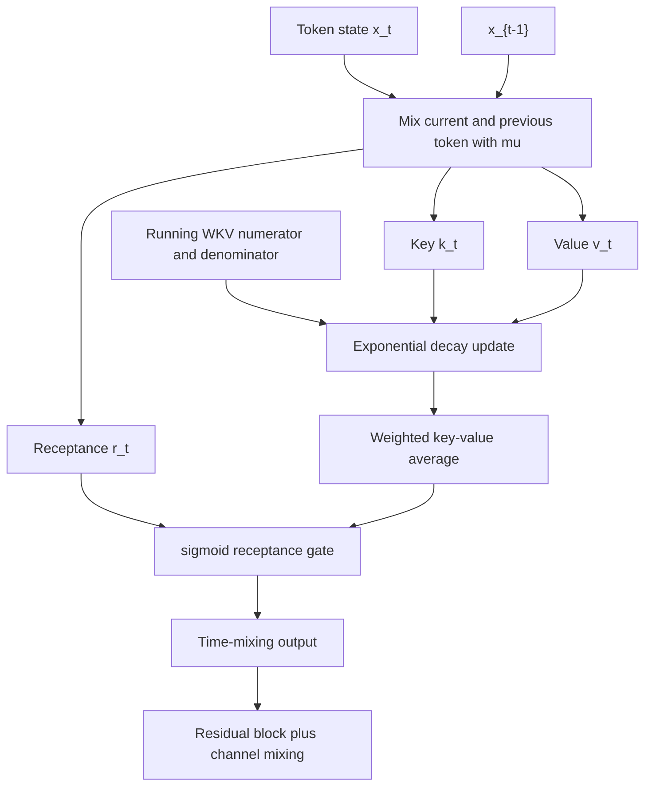

# RWKV (Peng et al., 2023)

Peng, Alcaide, Anthony, Albalak, Arcadinho, Biderman, Cao, Cheng, and many collaborators' "RWKV: Reinventing RNNs for the Transformer Era" proposes Receptance Weighted Key Value, a language-model architecture that trains with Transformer-like parallelism but runs autoregressive inference like an RNN. Its central design is a channelwise linear-attention recurrence with a small fixed state rather than a growing key-value cache.

RWKV follows [Hyena](/cs/deep-learning/hyena) in attacking the Transformer's long-sequence cost, but it chooses a recurrent formulation rather than FFT long convolution. It also anticipates [Mamba](/cs/deep-learning/mamba): both show that modern recurrent models can scale, but Mamba replaces RWKV's time-invariant WKV recurrence with selective state-space dynamics.

## Definitions

**Problem and motivation.** A decoder-only Transformer stores key and value vectors for every previous token during generation. That cache grows linearly with context length and is read repeatedly. Ordinary RNNs avoid the cache by keeping a fixed hidden state, but historically they were harder to train at scale and underperformed Transformers. RWKV tries to combine the two: parallelizable training over sequences, constant-state inference, and enough expressive capacity to behave competitively with Transformers.

RWKV stands for **Receptance Weighted Key Value**. The main time-mixing block produces vectors analogous to attention quantities:

$$
r_t = W_r(\mu_r\odot x_t + (1-\mu_r)\odot x_{t-1}),
$$

$$
k_t = W_k(\mu_k\odot x_t + (1-\mu_k)\odot x_{t-1}),
\qquad
v_t = W_v(\mu_v\odot x_t + (1-\mu_v)\odot x_{t-1}).
$$

The $\mu_*$ parameters implement token shift: each channel can interpolate between the current token and the previous token before projection.

The WKV operation is a per-channel exponentially decayed weighted average. A simplified single-channel form is

$$
\mathrm{WKV}_t
=
\frac{\sum_{i=1}^{t-1}\exp(k_i-(t-1-i)w)v_i+\exp(u+k_t)v_t}
{\sum_{i=1}^{t-1}\exp(k_i-(t-1-i)w)+\exp(u+k_t)}.
$$

Here $w$ is a learned nonnegative time-decay parameter and $u$ is a learned bonus for the current token. The output gate, called receptance, is usually

$$
o_t = W_o(\sigma(r_t)\odot \mathrm{WKV}_t).
$$

RWKV blocks also contain a **channel-mixing** subblock, analogous to the feed-forward or MLP part of a Transformer, but with token shift and gating.

## Key results

**Method.** RWKV replaces quadratic query-key attention with channelwise decayed accumulation. The WKV numerator and denominator can be updated recurrently, so inference only needs a fixed amount of state per layer and channel. During training, the same recurrence can be computed in a time-parallel mode using scan-like kernels and matrix multiplications. This is why the paper describes RWKV as having a Transformer form for training and an RNN form for inference.

The model is a stack of residual blocks. Each block has a time-mixing subblock and a channel-mixing subblock, with layer normalization and carefully designed initialization. The time-mixing recurrence contains exponential terms, so the paper uses numerically stable updates. Rather than store raw sums that can overflow, an implementation tracks scaled numerator, denominator, and a running maximum-like term.

**Architecture details and hyperparameters.** The paper scales models from 169M to 14B parameters, trained for one epoch on The Pile, about 330B tokens. The training context length is 1024 tokens for the main pretrained models. The paper uses Adam without weight decay, bfloat16 precision, dynamic batch sizes of 128 or 256 sequences, and an exponential learning-rate decay schedule. It reports a parameter formula of the form

$$
\#\mathrm{params}=2VD+13D^2L+D(11L+4),
$$

where $V$ is vocabulary size, $D$ is model dimension, and $L$ is the number of layers. It also emphasizes custom initialization: many weights are initialized near zero or identity-like behavior to stabilize deep recurrent training.

The recurrent state is small. The paper describes each layer's state as a handful of vectors of dimension $D$; in practical terms, this is independent of generated sequence length. That independence is the main contrast with a Transformer KV cache.

**Benchmarks.** RWKV reports pretrained checkpoints from 169M to 14B and compares with similarly sized Transformers such as Pythia, OPT, and BLOOM on a FLOP-matched basis. The paper reports competitive average zero-shot performance across tasks including ARC, BoolQ, COPA, HellaSwag, LAMBADA, OpenBookQA, PIQA, ReCoRD, SciQ, and WinoGrande. It also reports that RWKV follows a Transformer-like scaling-law relationship between compute and loss, with a strong log-log fit in their experiments.

For long context, the paper fine-tunes by progressively increasing context length from 1024 to 2048, 4096, and 8192 tokens and observes decreasing Pile test loss as context grows. On Long Range Arena, the paper reports RWKV as second only to S4 across five datasets, with stronger behavior on text and code-like tasks than on image/pathfinder tasks. The paper is careful about limitations: fixed-state recurrence can struggle with tasks requiring exact recall of many small details over long contexts.

## Visual



| Architecture | Training over tokens | Inference state | Long-context bottleneck | Main tradeoff |
|---|---|---|---|---|
| Transformer decoder | Parallel | KV cache grows with length | Attention over cache | Strong exact access, high memory |
| Basic RNN | Sequential unless scanned | Fixed hidden state | State compression | Efficient but historically weaker |
| RWKV | Parallelizable recurrence | Fixed WKV state | Compressed channel memory | Fast inference, harder exact recall |
| Mamba | Parallel selective scan | Fixed SSM state | Selective state compression | Stronger content-dependent recurrence |

## Worked example 1: one-channel WKV update

Problem: compute the simplified WKV value at $t=3$ for one channel. Let

$$
k_1=0,\quad k_2=\log 2,\quad k_3=0,
$$

$$
v_1=10,\quad v_2=20,\quad v_3=5,
$$

with decay $w=\log 2$ and current-token bonus $u=0$.

1. The past terms for $t=3$ use positions $1$ and $2$:

$$
\exp(k_i-(t-1-i)w).
$$

For $i=1$:

$$
\exp(0-(3-1-1)\log 2)=\exp(-\log 2)=0.5.
$$

For $i=2$:

$$
\exp(\log 2-(3-1-2)\log 2)=\exp(\log 2)=2.
$$

2. The current term is

$$
\exp(u+k_3)=\exp(0)=1.
$$

3. The numerator is

$$
0.5\cdot 10+2\cdot 20+1\cdot 5=5+40+5=50.
$$

4. The denominator is

$$
0.5+2+1=3.5.
$$

5. Therefore

$$
\mathrm{WKV}_3=50/3.5\approx 14.286.
$$

Check: the second token dominates because its key is high and it has not decayed; the first token still contributes but is halved by time decay.

## Worked example 2: fixed recurrent state versus KV cache

Problem: compare state growth for a 24-layer decoder with model dimension $D=2048$ and generated length $T=8192$. Use a simplified Transformer with one key and one value vector of dimension $D$ per token per layer, and a simplified RWKV state of $5D$ scalars per layer.

1. Transformer cache scalars:

$$
2\cdot L\cdot T\cdot D
=2\cdot 24\cdot 8192\cdot 2048.
$$

2. First compute $8192\cdot 2048=16{,}777{,}216$.

3. Then multiply by $48$:

$$
16{,}777{,}216\cdot 48=805{,}306{,}368.
$$

4. RWKV state scalars:

$$
5\cdot L\cdot D=5\cdot 24\cdot 2048=245{,}760.
$$

5. Ratio:

$$
\frac{805{,}306{,}368}{245{,}760}=3276.8.
$$

Check: this simplified calculation ignores heads, precision, and implementation details, but it captures the key asymptotic point: the Transformer cache grows with $T$, while RWKV's recurrent state does not.

## Code

```python
import torch

def rwkv_wkv_step(k, v, state, time_decay, time_first):
    """Numerically simple RWKV-style single step.

    k, v: [batch, channels]
    state stores numerator and denominator for the decayed past.
    """
    num, den = state
    current_weight = torch.exp(time_first + k)
    out = (num + current_weight * v) / (den + current_weight).clamp_min(1e-6)

    decay = torch.exp(-time_decay).clamp(max=1.0)
    next_num = decay * num + torch.exp(k) * v
    next_den = decay * den + torch.exp(k)
    return out, (next_num, next_den)

batch, channels = 2, 4
state = (torch.zeros(batch, channels), torch.zeros(batch, channels))
time_decay = torch.full((channels,), 0.7)
time_first = torch.zeros(channels)

for _ in range(3):
    k = torch.randn(batch, channels)
    v = torch.randn(batch, channels)
    y, state = rwkv_wkv_step(k, v, state, time_decay, time_first)
    print(y.shape)
```

## Common pitfalls

- Treating RWKV as a normal RNN. Its time-mixing recurrence is designed to be parallelizable for training and constant-state for inference.
- Ignoring numerical stability. The exponential WKV formula should be implemented with stable rescaling in real systems.
- Assuming fixed state means unlimited exact memory. A fixed state can carry useful summaries, but exact retrieval of many details can be harder than with full attention.
- Comparing RWKV with Transformers trained on different data or token budgets without caveats. The paper makes FLOP-matched comparisons, but external baselines still differ.
- Forgetting token shift. The $\mu_*$ interpolation between $x_t$ and $x_{t-1}$ is part of how RWKV injects local temporal information.
- Using Transformer-style prompts blindly. The paper reports sensitivity to ordering because an RNN-like model cannot revisit earlier instruction text with explicit attention.

## Connections

- Responds to the KV-cache and quadratic-attention costs introduced by [Attention Is All You Need](/cs/deep-learning/attention-is-all-you-need).
- Extends recurrent ideas from [Sequence Modeling and RNNs](/cs/deep-learning/sequence-modeling-rnns) with modern scaling, initialization, and parallel scan-style training.
- Differs from [Hyena](/cs/deep-learning/hyena), which uses implicit long convolutions rather than WKV recurrence.
- Sets up [Mamba](/cs/deep-learning/mamba), whose selective state-space recurrence can be seen as a stronger content-dependent recurrent token mixer.
- Related D2L pages: [Gated RNNs and Sequence-to-Sequence](/cs/deep-learning/gated-rnns-seq2seq), [Attention and Transformers](/cs/deep-learning/attention-transformers), and [Computational Performance](/cs/deep-learning/computational-performance).
- Further reading: Attention Free Transformer, linear attention, QRNN, S4, RetNet, Mamba, and the Pythia suite for controlled language-model scaling comparisons.
