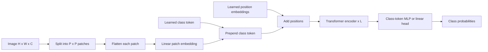

# Vision Transformer (Dosovitskiy et al., 2020)

Dosovitskiy, Beyer, Kolesnikov, Weissenborn, Zhai, Unterthiner, Dehghani, Minderer, Heigold, Gelly, Uszkoreit, and Houlsby's "An Image is Worth 16x16 Words: Transformers for Image Recognition at Scale" showed that an almost standard Transformer encoder can classify images when the image is represented as a sequence of patches. The central claim is not that patch attention is always better than convolution, but that large-scale pretraining can compensate for the Transformer's weaker built-in image priors.

This page is the first adaptation of [Attention Is All You Need](/cs/deep-learning/attention-is-all-you-need) in the paper sequence. It links the NLP Transformer to [Modern CNNs](/cs/deep-learning/modern-cnns), because ViT is best understood as a deliberate trade: reduce convolutional inductive bias, increase reliance on scale, and keep the same attention machinery.

## Definitions

**Problem and motivation.** Convolutional networks hard-code locality, weight sharing, and translation equivariance. Those biases make CNNs data-efficient on ImageNet-scale training, but they also make the architecture specialized. The ViT paper asks whether a generic Transformer can work for images if the input is converted into a token sequence and trained at sufficient scale.

Let an image have shape $H\times W\times C$, patch size $P\times P$, and $N=HW/P^2$ nonoverlapping patches. Each flattened patch has dimension $P^2C$. ViT maps each patch to a hidden vector with a learned linear projection:

$$
x_p \in \mathbb{R}^{N\times(P^2C)},\qquad
z_0=[x_{\mathrm{class}}; x_p^1E; x_p^2E;\ldots;x_p^NE]+E_{\mathrm{pos}}.
$$

Here $E\in \mathbb{R}^{(P^2C)\times D}$ is the patch embedding matrix, $D$ is the Transformer width, $x_{\mathrm{class}}$ is a learned classification token, and $E_{\mathrm{pos}}$ is a learned one-dimensional positional embedding.

The encoder is the standard pre-norm Transformer encoder:

$$
\begin{aligned}
z'_\ell &= \mathrm{MSA}(\mathrm{LN}(z_{\ell-1}))+z_{\ell-1},\\
z_\ell &= \mathrm{MLP}(\mathrm{LN}(z'_\ell))+z'_\ell.
\end{aligned}
$$

The MLP uses two linear layers with a GELU nonlinearity. The final class representation is the output state of the class token:

$$
y=\mathrm{LN}(z_L^0).
$$

ViT names models by size and patch size. For example, ViT-L/16 is the large configuration with $16\times 16$ patches. Smaller patches increase sequence length quadratically in $1/P$, so ViT-B/16 is much more expensive than ViT-B/32 at the same image resolution.

## Key results

**Method.** The paper intentionally makes few vision-specific changes. It splits the image into patches, embeds them with a linear layer, prepends a class token, adds learned positions, and feeds the result to a Transformer encoder. The only explicit two-dimensional structure appears in patch extraction and, during transfer to higher resolution, interpolation of the learned position embeddings on the patch grid.

That design choice explains both the weakness and the strength. On ImageNet alone, especially without strong regularization, large ViTs underperform comparable ResNets. They lack the locality and translation biases that help CNNs generalize from moderate data. But when pretrained on ImageNet-21k or JFT-300M, the scaling behavior changes. The paper reports that large ViT models transfer strongly to ImageNet, CIFAR, Oxford Pets, Oxford Flowers, and VTAB.

The paper also makes an important negative claim: complicated image-aware positional encodings were not the main ingredient in their setting. The authors compare one-dimensional learned positions, two-dimensional variants, relative positions, and no positions in ablations. No positional information is bad, but among reasonable positional schemes the differences are modest. That result is easy to misread. It does not mean two-dimensional structure is irrelevant for vision; it means that, after patchification at a relatively coarse grid such as $14\times 14$, the Transformer can learn useful spatial relations from data if the pretraining set is large enough.

Another methodological detail is the hybrid baseline. The paper also tests feeding a Transformer from CNN feature maps rather than raw image patches. Hybrids help at smaller scale because the CNN stem contributes useful inductive bias. As model and data scale increase, the pure ViT catches up or overtakes, supporting the paper's broader argument that the best architecture depends on the compute-data regime rather than on a single universal preference for convolution or attention.

**Architecture details and hyperparameters.** The model variants are based on BERT-style widths and depths. ViT-Base uses 12 layers, hidden size 768, MLP size 3072, and 12 heads. ViT-Large uses 24 layers, hidden size 1024, MLP size 4096, and 16 heads. ViT-Huge uses 32 layers, hidden size 1280, MLP size 5120, and 16 heads. Patch sizes include 32, 16, and 14 in the flagship ViT-H/14 model.

The paper pretrains on ImageNet-1k, ImageNet-21k, and JFT-300M. It uses Adam for pretraining with batch size 4096, weight decay around $0.1$, warmup, and learning-rate decay. Fine-tuning uses SGD with momentum, batch size 512, no weight decay, and often a higher image resolution than pretraining. When fine-tuning at a different resolution, the patch size remains fixed, so the sequence grows and the positional embedding is interpolated in two dimensions.

**Benchmarks.** The paper's abstract reports the best model reaching $88.55\%$ ImageNet top-1, $90.72\%$ ImageNet-ReaL, $94.55\%$ CIFAR-100, and $77.63\%$ on the VTAB suite of 19 tasks. The paper compares to strong ResNet-based Big Transfer and Noisy Student baselines, emphasizing that ViT's gains appear when pretraining data is large enough. Its own ablations show the opposite lesson as well: on smaller pretraining sets, CNNs are more data-efficient.

The conservative reading is that ViT did not prove "convolutions are obsolete." It proved that a simple patch-token Transformer scales surprisingly well, and that architectural priors and data scale can substitute for each other to some degree.

## Visual



| Model | Layers | Hidden size | MLP size | Heads | Typical notation |
|---|---:|---:|---:|---:|---|
| ViT-Base | 12 | 768 | 3072 | 12 | ViT-B/16 or ViT-B/32 |
| ViT-Large | 24 | 1024 | 4096 | 16 | ViT-L/16 or ViT-L/32 |
| ViT-Huge | 32 | 1280 | 5120 | 16 | ViT-H/14 |

## Worked example 1: patch count and input tensor shape

Problem: a $224\times 224$ RGB image is fed to ViT-B/16. Compute the number of patch tokens, the class-token sequence length, and the patch projection shape.

1. The patch size is $P=16$, so each side has

$$
224/16=14
$$

patches.

2. The number of image patches is

$$
N=14\cdot 14=196.
$$

3. Add one class token:

$$
N_{\mathrm{seq}}=196+1=197.
$$

4. Each RGB patch has flattened dimension

$$
P^2C=16^2\cdot 3=256\cdot 3=768.
$$

5. ViT-B has hidden width $D=768$, so the patch embedding matrix has shape

$$
768\times 768.
$$

Check: the model receives a tensor shaped like $(B,197,768)$ after prepending the class token and adding positional embeddings.

## Worked example 2: why higher fine-tuning resolution costs more

Problem: ViT-L/16 is pretrained at $224\times 224$ and fine-tuned at $384\times 384$. Compare the number of image tokens and the attention-score count per head.

1. At $224\times 224$:

$$
N_{224}=(224/16)^2=14^2=196.
$$

Including the class token gives $197$ sequence positions.

2. At $384\times 384$:

$$
N_{384}=(384/16)^2=24^2=576.
$$

Including the class token gives $577$ sequence positions.

3. Attention logits per head scale as $n^2$. The ratio is

$$
\frac{577^2}{197^2}
=
\frac{332{,}929}{38{,}809}
\approx 8.58.
$$

4. The image area ratio is

$$
\frac{384^2}{224^2}
=
\frac{147{,}456}{50{,}176}
\approx 2.94.
$$

Check: attention cost grows faster than image area because sequence length grows with area and attention scores grow with sequence length squared. Fine-tuning at higher resolution can help accuracy, but it is not a small cost change.

## Code

```python
import torch
import torch.nn as nn

class PatchEmbedding(nn.Module):
    def __init__(self, image_size=224, patch_size=16, channels=3, dim=768):
        super().__init__()
        assert image_size % patch_size == 0
        self.patch_size = patch_size
        self.num_patches = (image_size // patch_size) ** 2
        self.proj = nn.Conv2d(channels, dim, kernel_size=patch_size, stride=patch_size)
        self.cls = nn.Parameter(torch.zeros(1, 1, dim))
        self.pos = nn.Parameter(torch.zeros(1, self.num_patches + 1, dim))

    def forward(self, x):
        b = x.size(0)
        tokens = self.proj(x)              # [B, D, H/P, W/P]
        tokens = tokens.flatten(2).transpose(1, 2)
        cls = self.cls.expand(b, -1, -1)
        return torch.cat([cls, tokens], dim=1) + self.pos

x = torch.randn(2, 3, 224, 224)
embed = PatchEmbedding()
z = embed(x)
print(z.shape)  # [2, 197, 768]
```

## Common pitfalls

- Saying ViT ignores position. It uses learned positional embeddings; it just uses much less built-in two-dimensional structure than CNNs.
- Comparing ViT and CNNs only on ImageNet-1k from scratch. The paper's strongest conclusion depends on large-scale pretraining.
- Forgetting the class token. The classifier reads the class-token state in the main ViT design.
- Treating patch size as cosmetic. Halving patch size roughly quadruples sequence length and greatly increases attention work.
- Reusing pretrained positional embeddings at a new resolution without interpolation. The patch grid changes.
- Assuming the initial linear patch projection is a normal convolutional feature extractor. It is equivalent to a stride-$P$, kernel-$P$ convolution, but it has no deep local hierarchy before attention.

## Connections

- Reuses the encoder and attention formulas from [Attention Is All You Need](/cs/deep-learning/attention-is-all-you-need) and [Attention and Transformers](/cs/deep-learning/attention-transformers).
- Should be compared with [Modern CNNs](/cs/deep-learning/modern-cnns), especially for locality, equivariance, transfer, and data efficiency.
- The patch-token idea connects to later long-sequence cost concerns in [Hyena](/cs/deep-learning/hyena) and [Mamba](/cs/deep-learning/mamba), because high-resolution images produce long token sequences.
- For practical training loops and transfer learning mechanics, see [Computer Vision Applications](/cs/deep-learning/computer-vision-applications) and [PyTorch Builders Guide](/cs/deep-learning/pytorch-builders-guide).
- Further reading: BERT for the class-token and pretraining analogy, Big Transfer for supervised large-scale CNN transfer, DeiT for data-efficient ViT training, Swin Transformer for hierarchical local attention, and MAE for masked image modeling.
