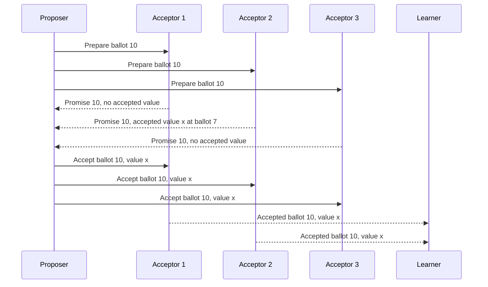

# Consensus: Paxos and Raft


*Figure: Classic Paxos message flow — prepare, promise, accept, accepted phases between proposers, acceptors, and learners. Image: [Wikimedia Commons](https://commons.wikimedia.org/wiki/File:Paxos.png), public domain.*

Consensus is the coordination problem behind replicated logs, leader election, configuration changes, metadata services, distributed locks, and transactional commit. A group of processes must choose one value even though messages can be delayed and some processes can fail. Lynch treats consensus as a formal agreement problem with impossibility results and reductions; Kleppmann connects it to total order broadcast and production data systems; van Steen and Tanenbaum present Paxos, fault tolerance, and reliable group communication as textbook mechanisms [1], [2], [3].


*Figure: Raft's three server states — follower, candidate, leader — and the transitions among them via election timeouts and majority-vote outcomes. From [Wikimedia Commons](https://commons.wikimedia.org/wiki/File:Raft.png), public domain.*

Paxos and Raft solve the same core problem under crash faults and partial synchrony, but they differ in presentation. Paxos is a compact family of protocols built around ballots, promises, and quorum intersection. Raft deliberately decomposes consensus into leader election, log replication, and safety rules. Both are best understood as ways to maintain a replicated log whose committed prefix is identical on a majority of nodes.

## Definitions

The **consensus problem** has three classic properties. **Agreement** says no two correct processes decide different values. **Validity** says a decided value must be one of the proposed values, or must satisfy an application-defined validity predicate. **Termination** says every correct process eventually decides. In asynchronous crash-prone systems, deterministic consensus cannot guarantee all three by FLP [4].

**Single-decree Paxos** decides one value. It has proposers, acceptors, and learners. A proposer chooses a unique ballot number and runs phase 1: prepare and promise. It then runs phase 2: accept request and accepted. Acceptors promise not to accept older ballots and report any previously accepted value. If the proposer sees a majority of promises, it must propose the highest-ballot value already accepted by that majority, or its own value if none exists [5], [6].

**Multi-Paxos** repeats Paxos for log slots. After a stable leader completes phase 1 for its ballot, it can usually skip repeated prepares and send phase-2 accept messages for new slots, reducing steady-state cost. The leader is an optimization, not a single point of safety.

**Raft** organizes replicated log consensus around terms and leaders [7]. A server is a follower, candidate, or leader. A candidate wins an election by receiving votes from a majority in a higher term. A leader appends entries to its log and replicates them with `AppendEntries` RPCs. Once an entry from the leader's current term is stored on a majority, it can be committed, and earlier entries become committed as part of the prefix.

**Viewstamped Replication** and **Zab** are closely related log-replication protocols. Viewstamped Replication uses views and primary changes; Zab, used by ZooKeeper, provides primary-order atomic broadcast with epoch-based leadership. These protocols differ in engineering details but share the quorum-and-view structure [8], [9].

**Byzantine consensus** tolerates arbitrary faults. PBFT uses a leader, three-phase communication, and $3f+1$ replicas to tolerate $f$ Byzantine replicas in a partially synchronous model [10]. HotStuff simplifies BFT leader changes with chained quorum certificates and is influential in modern blockchain-style BFT systems [11]. Byzantine protocols appear again in [Security and Byzantine Fault Tolerance](/cs/distributed-systems/security-and-byzantine-fault-tolerance).

**Reconfiguration** changes the membership of a consensus group. It is dangerous because two different configurations might form disjoint majorities. Raft's joint consensus and Paxos configuration entries solve this by making old and new configurations overlap during transition.

A **log entry** is the unit most applications actually care about. It usually contains a client command, a term or ballot, an index or slot, and sometimes configuration metadata. A **commit index** is the highest log position known to be durable enough to execute. An **applied index** is the highest committed position the state machine has actually applied. Keeping those separate avoids a subtle bug: replication can make an entry committed before a slow state machine has executed it. A **snapshot** compacts an old committed prefix so new or recovering replicas do not need to replay an unbounded log.

## Key results

The safety heart of Paxos is quorum intersection. Any two majorities of acceptors intersect in at least one acceptor. If a value might have been chosen by one majority, a later proposer that contacts another majority must hear from at least one acceptor in the first majority. The prepare/promise rule then forces the later proposer to preserve the already chosen value.

Paxos safety proof sketch: suppose value `v` is chosen in ballot `b`, meaning a majority accepted it. Consider a later ballot `b'`. A proposer for `b'` must gather promises from a majority, which intersects the majority that accepted `v`. At least one acceptor reports `v` or an even later accepted value. The proposer must choose the highest-ballot reported value. By induction over ballots, any later chosen value remains `v`. Termination needs additional timing and leadership assumptions.

Raft's safety is usually phrased through the log-matching property and leader completeness. If two logs contain an entry with the same index and term, then all preceding entries are identical. A candidate must have a log at least as up-to-date as the voter to receive the vote. Therefore, once an entry is committed in a term, future leaders must contain it. This is easier to teach than Paxos, which is one reason Raft became popular [7].

Consensus and total order broadcast are equivalent in a standard sense: consensus instances can choose successive log entries, while total order broadcast can decide a proposed value by broadcasting proposals and deciding the first delivered value. This equivalence connects Lynch's formal treatment to database replication and distributed commit [2].

The engineering result is that consensus is a replicated-log service, not a magic availability layer. A minority partition cannot safely accept writes. A majority partition can make progress if it elects or retains a leader. Slow disks, long pauses, and poor timeout settings can cause election storms even without permanent failures.

Another practical result is that client deduplication is part of the replicated-log contract. If a leader appends a command, commits it, and crashes before replying, the client may retry against a new leader. Without a client identifier and request sequence number, the command can execute twice. Consensus orders log entries; it does not automatically make commands idempotent. Production replicated state machines usually store the latest completed request per client inside the replicated state so retries return the original response.

## Visual



| Protocol | Fault model | Normal leader? | Main teaching abstraction | Typical use |
| --- | --- | --- | --- | --- |
| Single-decree Paxos | crash | no required stable leader | choose one value by ballots and quorums | one-shot decisions |
| Multi-Paxos | crash | yes, as optimization | replicated log slots | metadata stores |
| Raft | crash | yes | terms, elections, log replication | replicated services |
| Zab | crash | yes | primary-order atomic broadcast | ZooKeeper |
| PBFT | Byzantine | primary per view | pre-prepare, prepare, commit | permissioned BFT services |
| HotStuff | Byzantine | rotating leaders | chained quorum certificates | BFT replication and blockchains |

## Worked example 1: Single-decree Paxos with prior accepted value

Problem: Five acceptors `A1` to `A5` form a Paxos group. In ballot 3, `A2`, `A3`, and `A4` accepted value `red`, but the proposer crashed before learners heard a decision. Later a proposer starts ballot 8 and receives promises from `A1`, `A2`, and `A5`. What value may it propose?

Method:

1. A value is chosen when a majority accepts it. With five acceptors, a majority is:

$$
\lfloor 5/2 \rfloor + 1 = 3.
$$

2. Ballot 3 had acceptances from `A2`, `A3`, and `A4`, so `red` was already chosen, even if no client was notified.

3. The ballot 8 proposer contacts `A1`, `A2`, and `A5`, also a majority.

4. The two majorities intersect at `A2`:

$$
\{A2,A3,A4\} \cap \{A1,A2,A5\} = \{A2\}.
$$

5. `A2` reports accepted value `red` at ballot 3. If `A1` and `A5` report no accepted values, the highest accepted value in the promise set is still `red`.

6. Paxos requires the proposer to send accept requests for `red`, not a new value such as `blue`.

Checked answer: the ballot 8 proposer must propose `red`. This preserves safety even though the earlier proposer crashed before announcing success.

## Worked example 2: Raft leader election and committed entry

Problem: A Raft cluster has five servers. In term 4, leader `S1` replicated log entry `(index=10, term=4, command=set x=1)` to `S1`, `S2`, and `S3`, then crashed. `S4` and `S5` do not have entry 10. Can `S4` become leader in term 5?

Method:

1. Entry 10 is on a majority:

$$
\{S1,S2,S3\}
$$

has size 3 out of 5.

2. Because the entry is from the current leader's term and replicated on a majority, it is committed under Raft's commit rule.

3. A term 5 candidate needs votes from a majority, so it needs at least 3 votes.

4. Voters compare candidate logs. A candidate's log is at least as up-to-date if its last term is greater, or terms equal and last index is at least as large.

5. `S4` lacks entry 10 and has a less up-to-date log than `S2` and `S3`, assuming no later term entries exist.

6. `S2` and `S3` should deny `S4`'s vote. `S4` can get votes from itself and `S5` at most, which is 2.

Checked answer: `S4` cannot become leader in term 5 under the stated conditions. Raft's voting rule protects the committed entry by ensuring a future leader includes it.

## Code

```python
from dataclasses import dataclass

@dataclass(frozen=True)
class LogId:
    term: int
    index: int

def up_to_date(candidate: LogId, voter: LogId) -> bool:
    if candidate.term != voter.term:
        return candidate.term > voter.term
    return candidate.index >= voter.index

def can_win(candidate: str, candidate_log: LogId, voter_logs: dict[str, LogId]) -> bool:
    votes = 0
    for voter, log_id in voter_logs.items():
        if voter == candidate or up_to_date(candidate_log, log_id):
            votes += 1
    return votes >= len(voter_logs) // 2 + 1

logs = {
    "S1": LogId(4, 10),
    "S2": LogId(4, 10),
    "S3": LogId(4, 10),
    "S4": LogId(3, 9),
    "S5": LogId(3, 9),
}

for server in logs:
    print(server, "can win:", can_win(server, logs[server], logs))
```

## Common pitfalls

- Thinking Paxos acceptors "vote once." They can accept multiple ballots, subject to promises.
- Forgetting that a value may be chosen before any client learns it.
- Treating a leader as necessary for Paxos safety. Stable leadership is mainly a liveness and efficiency device.
- Tuning Raft election timeouts below normal tail latency, causing unnecessary elections.
- Allowing a candidate with a stale log to win because the vote freshness rule was skipped.
- Committing old-term Raft entries incorrectly without a current-term entry rule.
- Treating consensus as available in any partition. Only a majority side can safely make progress.
- Reconfiguring membership without overlapping majorities.
- Confusing consensus with two-phase commit. Consensus can survive coordinator failure with quorum replication; classic 2PC blocks.
- Ignoring disk persistence. Promises, votes, terms, and accepted values must survive crashes according to the protocol.
- Assuming Byzantine behavior is handled by Paxos or Raft. They tolerate crash faults, not equivocation.
- Using consensus for high-volume data paths when only metadata or ordering requires it.

## Connections

- [Foundations and System Models](/cs/distributed-systems/foundations-and-system-models)
- [Time, Clocks, and Event Ordering](/cs/distributed-systems/time-clocks-and-event-ordering)
- [Replication and Consistency](/cs/distributed-systems/replication-and-consistency)
- [Fault Tolerance and Failure Detection](/cs/distributed-systems/fault-tolerance-and-failure-detection)
- [Security and Byzantine Fault Tolerance](/cs/distributed-systems/security-and-byzantine-fault-tolerance)
- [Computer Networks](/cs/computer-networks/intro)
- [Operating Systems](/cs/operating-systems/intro)
- [Databases](/cs/databases/intro)
- [Cryptography](/cs/cryptography/intro)

## References

[1] M. Kleppmann, *Designing Data-Intensive Applications*. Sebastopol, CA: O'Reilly, 2017.  
[2] N. A. Lynch, *Distributed Algorithms*. San Francisco, CA: Morgan Kaufmann, 1996.  
[3] M. van Steen and A. S. Tanenbaum, *Distributed Systems*, 3rd ed., 2017.  
[4] M. J. Fischer, N. A. Lynch, and M. S. Paterson, "Impossibility of distributed consensus with one faulty process," *Journal of the ACM*, vol. 32, no. 2, pp. 374-382, 1985.  
[5] L. Lamport, "The part-time parliament," *ACM Transactions on Computer Systems*, vol. 16, no. 2, pp. 133-169, 1998.  
[6] L. Lamport, "Paxos made simple," *ACM SIGACT News*, vol. 32, no. 4, pp. 51-58, 2001.  
[7] D. Ongaro and J. Ousterhout, "In search of an understandable consensus algorithm," in *USENIX ATC*, 2014.  
[8] B. Liskov and J. Cowling, "Viewstamped replication revisited," MIT CSAIL, Tech. Rep., 2012.  
[9] F. P. Junqueira, B. C. Reed, and M. Serafini, "Zab: high-performance broadcast for primary-backup systems," in *DSN*, 2011.  
[10] M. Castro and B. Liskov, "Practical Byzantine fault tolerance," in *OSDI*, 1999.  
[11] M. Yin et al., "HotStuff: BFT consensus with linearity and responsiveness," in *PODC*, 2019.
