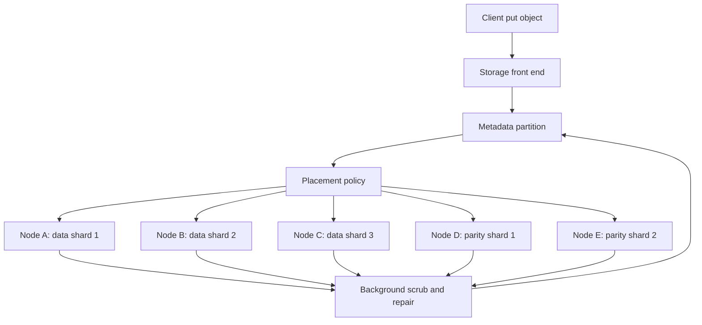

# Distributed Storage and CAP

Distributed storage systems turn disks, SSDs, memory, and networks into durable services: file systems, object stores, key-value stores, log stores, and analytical table formats. CAP is the famous warning label on this design space, but the actual engineering also includes storage engines, repair, erasure coding, placement, compaction, metadata, and query layout. Kleppmann supplies the data-system internals; van Steen and Tanenbaum supply distributed file, naming, replication, and fault-tolerance context; Lynch supplies the formal impossibility lens [1], [2], [3].

The main synthesis is that storage systems are distributed protocols with physical consequences. A quorum decision is also a disk write. A CAP trade-off becomes a user-visible error, stale read, or blocked request. A compaction strategy affects tail latency. A lakehouse table commit is a metadata consistency problem.

## Definitions

The **CAP theorem** states that when a network partition occurs, a replicated service cannot simultaneously guarantee linearizable consistency and availability for every request to a non-failing node [4]. In practical terms, a CP storage system may reject or block operations outside a majority; an AP storage system may accept operations on multiple sides and reconcile later.

**PACELC** extends the CAP intuition: if there is a partition, choose between availability and consistency; else, when the network is healthy, choose between latency and consistency [5]. This is useful because most design decisions occur outside partitions, where synchronous cross-region replication still adds latency.

A **distributed file system** exposes file-like storage across machines. GFS and HDFS use large blocks, append-oriented workloads, a master or namenode for metadata, and chunk/block servers for data [6], [7]. **Ceph** uses a distributed object store and a placement algorithm to reduce central metadata bottlenecks for many operations [8].

A **key-value store** stores values by key. Dynamo, Cassandra, and Riak style systems emphasize partitioning, replication, tunable consistency, hinted handoff, and anti-entropy [9], [10]. Many key-value stores use **LSM-trees**, where writes go to a memory table and log, flush into sorted string tables, and compact in the background [11].

An **object store** such as S3 presents buckets and objects rather than a POSIX filesystem. Object stores are usually optimized for durability, scale, and simple operations rather than low-latency overwrite semantics. They rely on replication or erasure coding, metadata partitioning, and background repair.

A **lakehouse table format** such as Apache Iceberg, Delta Lake, or Hudi layers table metadata, snapshots, schemas, partitions, and transaction-like commits over files in object storage. The data plane may be immutable Parquet files; the control plane is a metadata log or manifest protocol [12], [13], [14].

**Erasure coding** stores $k$ data fragments plus $m$ parity fragments so the object can be reconstructed from enough fragments, often using Reed-Solomon codes. It saves space compared with full replication but increases repair and read complexity.

A **placement policy** maps replicas or fragments to failure domains. A good policy avoids placing all copies in the same disk shelf, rack, availability zone, or maintenance group. A **scrubber** reads stored data in the background, verifies checksums, and repairs latent corruption before a second failure makes data unrecoverable. A **tombstone** marks a deletion in log-structured or eventually replicated storage so old replicas do not resurrect deleted data during repair. Tombstones must live long enough to reach lagging replicas, but too many tombstones hurt read and compaction performance.

A **metadata service** stores names, object locations, lease state, file chunk maps, table snapshots, or placement-group assignments. Metadata often has stronger consistency requirements than bulk data. For example, an object payload may be erasure-coded across many nodes, while the object name and version pointer must be updated atomically to avoid readers observing a half-written object. This split between control plane and data plane appears in GFS, HDFS, object stores, and lakehouse table formats.

## Key results

The first key result is the formal CAP conflict. Suppose a write succeeds on one side of a partition. A later read on the other side cannot know the write occurred. Returning the old value violates linearizability; waiting violates availability. This is not a product limitation, but a consequence of the model [4].

The second result is that PACELC captures normal-operation trade-offs. A database can choose CP under partition and still choose lower consistency for lower latency when healthy, or choose strong cross-region consistency and pay WAN latency. Systems should document both the partition behavior and the no-partition latency consistency trade-off.

The third result is that storage engine structure shapes distributed behavior. LSM-trees make writes sequential and fast, but compaction consumes I/O and can affect read amplification. B-trees support point updates and range scans with in-place page changes, but random writes and page splits are costly. Distributed storage design must combine partitioning and replication with local engine behavior.

The fourth result is that erasure coding trades storage overhead against recovery cost. Three-way replication stores $3S$ bytes for data size $S$ and can tolerate two replica losses if placed correctly. A $(k=6,m=3)$ erasure code stores $9/6=1.5S$ bytes and tolerates any three fragment losses, but reading degraded data or repairing a fragment may require contacting several nodes.

The fifth result is that analytical lakehouse systems move transactions into metadata. Data files are immutable; commit means publishing a new table snapshot or manifest pointer. Correctness depends on atomic metadata update, conflict detection, and readers choosing a consistent snapshot.

The sixth result is that deletion and overwrite semantics are harder than appends. Appending a new immutable object can be retried with a content hash or unique ID. Overwriting a name requires deciding which version is current, what readers in progress may see, and how old versions are garbage-collected. Deleting a replicated object requires preventing stale replicas from reintroducing it. Systems solve this with version IDs, generation numbers, tombstones, leases, or strongly consistent metadata transactions.

The seventh result is that "durability" has layers. A client acknowledgment might mean the data reached one kernel buffer, one local disk, a quorum of disks, multiple zones, or a remote region. Each layer has a different probability of loss and a different latency cost. Serious storage APIs document the acknowledgment point, and serious applications choose it based on RPO. For example, a telemetry pipeline may accept regional asynchronous replication, while a financial ledger may require quorum or synchronous multi-zone durability before success.

## Visual



| System family | Data unit | Metadata pattern | Consistency tendency | Typical workload |
| --- | --- | --- | --- | --- |
| GFS/HDFS | large blocks | master or namenode | strong metadata, pipeline writes | batch analytics |
| Dynamo/Cassandra | key-value rows | decentralized ring | tunable or eventual | high-write online services |
| Ceph | objects and blocks | placement groups and monitors | configurable | general distributed storage |
| S3-like object store | objects | partitioned object metadata | strong or eventual by operation and era | durable blobs |
| Iceberg/Delta/Hudi | immutable files plus manifests | snapshot metadata commits | snapshot isolation for tables | lakehouse analytics |

## Worked example 1: Apply CAP to a shopping-cart store

Problem: A shopping-cart service replicates cart `C` in regions East and West. A partition separates the regions. East receives `add item A`; West receives `add item B`. The product manager wants both regions to accept writes and every read to show the one true latest cart. Is that possible?

Method:

1. Accepting writes in both regions during the partition is an availability requirement.

2. "One true latest cart" implies a single linearizable value for the cart.

3. East cannot send `A` to West during the partition. West cannot send `B` to East.

4. If East reads after its local write, it sees at least `{A}`. If West reads after its local write, it sees at least `{B}`.

5. A single linearizable order could be `{A}` then `{A,B}` or `{B}` then `{A,B}`, but neither side can know the other write before communication resumes.

6. The system must choose: reject or block one side for CP behavior, or accept both and merge later for AP behavior.

Checked answer: the exact requirement is impossible under partition. A cart is often a good AP candidate if the merge operation is a set or multiset union with clear duplicate rules.

## Worked example 2: Compare replication and erasure-coding overhead

Problem: Store 600 TB of logical data. Compare three-way replication with Reed-Solomon style $(k=6,m=3)$ erasure coding. How much raw storage is required, ignoring metadata and reserve capacity?

Method:

1. Three-way replication stores three full copies:

$$
600 \text{ TB} \times 3 = 1800 \text{ TB}.
$$

2. A $(6,3)$ erasure code stores 6 data fragments and 3 parity fragments for each stripe, so overhead factor is:

$$
\frac{6+3}{6}=\frac{9}{6}=1.5.
$$

3. Raw storage for erasure coding:

$$
600 \text{ TB} \times 1.5 = 900 \text{ TB}.
$$

4. Raw storage saved:

$$
1800 - 900 = 900 \text{ TB}.
$$

5. Percentage reduction relative to replication:

$$
\frac{900}{1800}=0.5=50\%.
$$

Checked answer: three-way replication needs about 1800 TB; $(6,3)$ erasure coding needs about 900 TB. The savings are large, but repair reads and degraded reads become more expensive.

## Code

```python
def cap_decision(partitioned: bool, need_linearizable: bool, need_available: bool) -> str:
    if partitioned and need_linearizable and need_available:
        return "impossible: choose CP blocking/rejection or AP reconciliation"
    if partitioned and need_linearizable:
        return "CP: preserve linearizability by denying some requests"
    if partitioned and need_available:
        return "AP: answer locally and reconcile conflicts later"
    return "normal operation: evaluate PACELC latency/consistency trade-off"

def erasure_overhead(data_tb: float, k: int, m: int) -> float:
    return data_tb * (k + m) / k

print(cap_decision(True, True, True))
print("3x replication:", 600 * 3, "TB")
print("RS(6,3):", erasure_overhead(600, 6, 3), "TB")
```

## Common pitfalls

- Using CAP to avoid specifying the actual consistency model.
- Forgetting that CAP's availability is a formal property, not merely "high uptime."
- Ignoring PACELC and focusing only on rare partitions while normal latency dominates users' experience.
- Assuming object storage has filesystem rename or overwrite semantics.
- Treating LSM compaction as background work that cannot affect tail latency.
- Designing erasure coding without repair bandwidth and degraded-read planning.
- Placing replicas in the same rack, zone, or failure domain and overestimating durability.
- Assuming metadata is small enough to centralize forever.
- Letting lakehouse writers update manifests without atomic commit or conflict detection.
- Confusing backup, replication, snapshots, and versioning. They protect against different failures.
- Ignoring read amplification from tombstones, wide partitions, and too many sorted runs.
- Treating checksums as optional; storage corruption is a distributed-systems fault too.

## Connections

- [Replication and Consistency](/cs/distributed-systems/replication-and-consistency)
- [Partitioning and Sharding](/cs/distributed-systems/partitioning-and-sharding)
- [Fault Tolerance and Failure Detection](/cs/distributed-systems/fault-tolerance-and-failure-detection)
- [Transactions and Isolation Levels](/cs/distributed-systems/transactions-and-isolation-levels)
- [Security and Byzantine Fault Tolerance](/cs/distributed-systems/security-and-byzantine-fault-tolerance)
- [Computer Networks](/cs/computer-networks/intro)
- [Operating Systems](/cs/operating-systems/intro)
- [Databases](/cs/databases/intro)
- [Cryptography](/cs/cryptography/intro)

## References

[1] M. Kleppmann, *Designing Data-Intensive Applications*. Sebastopol, CA: O'Reilly, 2017.  
[2] N. A. Lynch, *Distributed Algorithms*. San Francisco, CA: Morgan Kaufmann, 1996.  
[3] M. van Steen and A. S. Tanenbaum, *Distributed Systems*, 3rd ed., 2017.  
[4] S. Gilbert and N. Lynch, "Brewer's conjecture and the feasibility of consistent, available, partition-tolerant web services," *SIGACT News*, vol. 33, no. 2, pp. 51-59, 2002.  
[5] D. J. Abadi, "Consistency tradeoffs in modern distributed database system design: CAP is only part of the story," *Computer*, vol. 45, no. 2, pp. 37-42, 2012.  
[6] S. Ghemawat, H. Gobioff, and S.-T. Leung, "The Google file system," in *SOSP*, 2003.  
[7] K. Shvachko et al., "The Hadoop distributed file system," in *MSST*, 2010.  
[8] S. A. Weil et al., "Ceph: a scalable, high-performance distributed file system," in *OSDI*, 2006.  
[9] G. DeCandia et al., "Dynamo: Amazon's highly available key-value store," in *SOSP*, 2007.  
[10] A. Lakshman and P. Malik, "Cassandra: a decentralized structured storage system," *ACM SIGOPS Operating Systems Review*, vol. 44, no. 2, pp. 35-40, 2010.  
[11] P. O'Neil et al., "The log-structured merge-tree," *Acta Informatica*, vol. 33, pp. 351-385, 1996.  
[12] R. S. Xin et al., "Lakehouse: a new generation of open platforms that unify data warehousing and advanced analytics," in *CIDR*, 2021.  
[13] Apache Software Foundation, "Apache Iceberg table format specification," project documentation.  
[14] M. Armbrust et al., "Delta Lake: high-performance ACID table storage over cloud object stores," *PVLDB*, vol. 13, no. 12, pp. 3411-3424, 2020.
