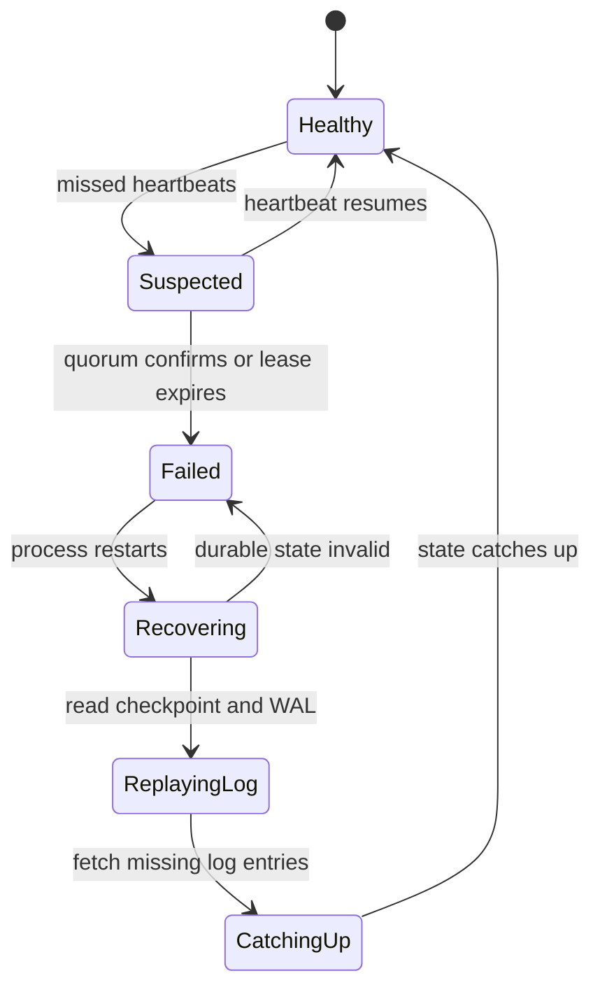

# Fault Tolerance and Failure Detection

Fault tolerance is the discipline of building systems that keep delivering acceptable service when parts misbehave. Distributed systems make this harder because the system may not know whether a component crashed, the network is slow, the disk is stuck, or a dependency is overloaded. Kleppmann frames this as reliability in the face of partial failure and operator reality; Lynch gives precise failure models and lower bounds; van Steen and Tanenbaum organize redundancy, process groups, failure detection, commit, and recovery [1], [2], [3].

This page connects failure detectors, recovery techniques, and state-machine replication. The key theme is that detection is not truth. A failure detector is a protocol component that converts missing evidence into suspicion. Fault-tolerant design must then decide how to act on suspicion without violating safety.

## Definitions

A **fault** is a defect or abnormal condition in a component. A **failure** is externally visible inability to provide the specified service. A disk fault may be masked by replication; an unmasked data loss is a failure. **Fault tolerance** is the ability to prevent faults from becoming service failures, usually through redundancy, isolation, detection, recovery, and repair.

**Failure detection** is the problem of suspecting failed processes. In a synchronous system, missed deadlines can prove failure relative to the timing model. In an asynchronous system, no timeout can distinguish a crashed process from a slow one. Chandra and Toueg formalized failure detectors by **completeness** and **accuracy** properties [4]. Completeness says failed processes are eventually suspected. Accuracy says correct processes are not suspected, either always or eventually.

A **perfect failure detector** has strong completeness and strong accuracy: every crashed process is eventually suspected and no correct process is ever suspected. An **eventually perfect failure detector** may make mistakes for a while but eventually stops suspecting correct processes. **Strong** and **weak** variants differ in whether all correct processes or at least one correct process must suspect failures.

A **heartbeat** detector expects periodic messages and suspects a peer after a timeout. A **phi-accrual failure detector** reports a suspicion level $\phi$ rather than a binary up/down result [5]. Roughly, $\phi$ increases as the current silence becomes less likely under observed inter-arrival times:

$$
\phi(t) = -\log_{10}(P(T > t)).
$$

Operators can choose thresholds based on the cost of false positives and false negatives.

**Crash recovery** assumes a process can restart after failure, typically preserving durable logs or snapshots. **Write-ahead logging** records intended changes on stable storage before exposing them as committed. **Checkpointing** saves a state image so recovery does not replay from the beginning. **Message logging** records nondeterministic inputs so a process can replay execution after restart.

**State-machine replication** runs deterministic replicas through the same ordered sequence of commands [6]. If all correct replicas start in the same state and apply the same commands in the same order, they produce the same outputs. Consensus or atomic broadcast supplies the order; deterministic execution supplies convergence.

**RTO**, or recovery time objective, is the target maximum time to restore service after an incident. **RPO**, or recovery point objective, is the target maximum amount of data loss measured in time or committed operations. RTO and RPO translate technical recovery mechanisms into business commitments.

Fault tolerance also depends on **fault containment**. A process crash is easier to mask than a bad deploy that corrupts every replica, a schema migration that deletes valid data, or a credential rotation that locks out all nodes. Redundancy helps only when replicas fail independently enough for the remaining replicas to preserve service. Engineers therefore separate failure domains by rack, zone, region, power source, software rollout wave, and administrative credential where the risk justifies the cost.

An **idempotent operation** can be retried without changing the result beyond the first successful execution. Idempotence is not the same as read-only behavior: `put(key, value)` can be idempotent, while `increment(counter)` is not unless guarded by a unique request identifier. Retry loops, leader failover, and message replay make idempotence a fault-tolerance primitive. When an operation cannot be naturally idempotent, systems often record a request ID in durable state and return the prior response on duplicate delivery.

## Key results

The first key result is that reliable failure detection is model-dependent. Perfect detection is impossible in a purely asynchronous system with crash failures because delay is unbounded. Eventually perfect detection can be implemented under partial synchrony: after the system stabilizes and timeout estimates become large enough, correct processes are no longer falsely suspected while failed processes remain silent [4].

The second result is that suspicion must be separated from authority. A node suspected by one peer should not automatically be deleted from membership if that action can break quorum intersection. Consensus systems usually require membership changes to go through the replicated log precisely because local failure detection can be wrong.

The third result is the state-machine replication theorem. If replicas are deterministic, begin in equivalent states, and execute the same sequence of commands, then their states remain equivalent after every command. Proof is by induction. The base case is the equal initial state. For the step, determinism means applying command $c_i$ to equal states produces equal next states and equal outputs. Therefore a replicated log plus deterministic application code gives fault masking for crash failures, assuming enough replicas and durable logs [6].

The fourth result is that recovery is a protocol, not just a backup file. Crash recovery must answer: which operations were committed, which were only tentative, which messages may be replayed, and which external side effects were already performed? Write-ahead logging solves the storage ordering piece. Idempotent operations, unique request IDs, and transactional outboxes solve many external-effect pieces.

The engineering trade-off is between fast detection and false suspicion. Short timeouts improve RTO for real crashes but can trigger failovers during pauses or congestion. Long timeouts reduce false positives but prolong outages. Phi-accrual detectors make this trade-off explicit by returning suspicion strength rather than a hard decision.

Checkpointing has a similar trade-off. Frequent checkpoints reduce replay time and improve RTO, but they consume I/O and can slow the foreground workload. Rare checkpoints reduce steady-state overhead but make recovery replay long logs, increasing downtime and sometimes lengthening the interval during which old bugs can be reintroduced by replay. Distributed checkpoints add another dimension: either coordinate a consistent cut, or combine local checkpoints with message logging so recovery can reconstruct a valid global execution.

Failure masking must also be paired with failure disclosure. A user-facing service might continue operating after losing one replica, but operators still need alerts, degraded-mode indicators, and repair automation. Silent redundancy exhaustion is dangerous: after one replica fails unnoticed, the next ordinary fault can become a data-loss event. Good fault-tolerant systems therefore expose both service-level health and redundancy-level health.

## Visual



| Technique | Masks which problem | Main cost | Common failure if misused |
| --- | --- | --- | --- |
| Heartbeats | crash suspicion | network traffic and timeout tuning | false failure during pauses |
| Phi-accrual detector | variable-latency suspicion | statistical calibration | treating $\phi$ as truth |
| Write-ahead log | crash during update | write amplification | acknowledging before durable record |
| Checkpointing | long replay time | checkpoint I/O and coordination | inconsistent global checkpoint |
| State-machine replication | replica crash | consensus latency and deterministic code | nondeterministic handlers diverge |
| Message logging | lost volatile execution | log volume | replaying external side effects twice |

## Worked example 1: Choose a phi-accrual threshold

Problem: A service receives heartbeats from a peer. Historical inter-arrival times are approximately exponential with mean $1$ second. No heartbeat has arrived for $5$ seconds. Estimate $\phi$ and decide whether thresholds `3` and `8` suspect the peer.

Method:

1. For an exponential distribution with mean $1$, the survival probability is:

$$
P(T>t)=e^{-t}.
$$

2. At $t=5$:

$$
P(T>5)=e^{-5}\approx 0.006737.
$$

3. Phi is:

$$
\phi(5)=-\log_{10}(0.006737).
$$

4. Compute:

$$
\log_{10}(0.006737)\approx -2.17,
$$

so:

$$
\phi(5)\approx 2.17.
$$

5. Compare thresholds. Threshold `3` requires $\phi \ge 3$, and threshold `8` requires $\phi \ge 8$.

Checked answer: with this simple distribution, $\phi \approx 2.17$, so neither threshold suspects yet. A system using threshold `3` would suspect after a silence where the tail probability drops below $10^{-3}$.

## Worked example 2: Determine RTO and RPO from backup policy

Problem: A metadata service checkpoints every 10 minutes, streams its WAL to another zone every 30 seconds, and takes 4 minutes to provision a replacement plus 3 minutes to replay logs after the latest checkpoint. What are the approximate RTO and RPO after losing the primary zone?

Method:

1. RPO measures possible data loss. If WAL is streamed every 30 seconds, the latest 30 seconds of acknowledged updates may be missing if acknowledgments did not wait for remote replication.

2. Therefore:

$$
RPO \approx 30 \text{ seconds}.
$$

3. RTO measures restoration time. Provisioning takes 4 minutes.

4. Replay after checkpoint takes 3 minutes.

5. Ignoring detection and DNS or routing changes, total restoration time is:

$$
RTO \approx 4 + 3 = 7 \text{ minutes}.
$$

6. If failure detection takes 2 additional minutes, operational RTO becomes about 9 minutes.

Checked answer: technical RPO is about 30 seconds and technical RTO is about 7 minutes, plus detection and traffic-shift time. If the service promises zero data loss, acknowledgments must wait for remote durable replication or consensus.

## Code

```python
import math
from collections import deque

class PhiAccrual:
    def __init__(self, window=100):
        self.intervals = deque(maxlen=window)
        self.last = None

    def heartbeat(self, now: float) -> None:
        if self.last is not None:
            self.intervals.append(now - self.last)
        self.last = now

    def phi(self, now: float) -> float:
        if self.last is None or not self.intervals:
            return 0.0
        elapsed = now - self.last
        mean = sum(self.intervals) / len(self.intervals)
        survival = math.exp(-elapsed / mean)
        return -math.log10(max(survival, 1e-12))

detector = PhiAccrual()
for t in [0, 1.0, 2.1, 3.0, 4.1, 5.0]:
    detector.heartbeat(t)

for now in [6.0, 8.0, 12.0]:
    score = detector.phi(now)
    print(now, round(score, 2), "suspect:", score >= 3.0)
```

## Common pitfalls

- Treating a missing heartbeat as proof of failure in an asynchronous or overloaded system.
- Making membership changes based on one node's suspicion rather than a replicated decision.
- Choosing aggressive timeouts without measuring tail latency, garbage collection pauses, and disk stalls.
- Forgetting to persist terms, votes, promises, and log records before acknowledging protocol steps.
- Replaying non-idempotent external side effects during recovery.
- Assuming backups imply a usable RTO. Restore time must be tested.
- Measuring RPO from backup frequency while ignoring asynchronous replication lag.
- Letting nondeterministic code run inside state-machine replication without logging the nondeterministic choices.
- Taking independent local checkpoints and assuming they form a consistent distributed checkpoint.
- Ignoring correlated failures such as rack power, region credentials, bad deploys, or operator mistakes.
- Building failover that works for crashes but not for slow or partitioned primaries.
- Treating Byzantine tolerance as a substitute for ordinary operational controls.

## Connections

- [Foundations and System Models](/cs/distributed-systems/foundations-and-system-models)
- [Consensus: Paxos and Raft](/cs/distributed-systems/consensus-paxos-and-raft)
- [Replication and Consistency](/cs/distributed-systems/replication-and-consistency)
- [Transactions and Isolation Levels](/cs/distributed-systems/transactions-and-isolation-levels)
- [Distributed Storage and CAP](/cs/distributed-systems/distributed-storage-and-cap)
- [Computer Networks](/cs/computer-networks/intro)
- [Operating Systems](/cs/operating-systems/intro)
- [Databases](/cs/databases/intro)
- [Cryptography](/cs/cryptography/intro)

## References

[1] M. Kleppmann, *Designing Data-Intensive Applications*. Sebastopol, CA: O'Reilly, 2017.  
[2] N. A. Lynch, *Distributed Algorithms*. San Francisco, CA: Morgan Kaufmann, 1996.  
[3] M. van Steen and A. S. Tanenbaum, *Distributed Systems*, 3rd ed., 2017.  
[4] T. D. Chandra and S. Toueg, "Unreliable failure detectors for reliable distributed systems," *Journal of the ACM*, vol. 43, no. 2, pp. 225-267, 1996.  
[5] N. Hayashibara, X. Defago, R. Yared, and T. Katayama, "The phi accrual failure detector," in *SRDS*, 2004.  
[6] F. B. Schneider, "Implementing fault-tolerant services using the state machine approach: a tutorial," *ACM Computing Surveys*, vol. 22, no. 4, pp. 299-319, 1990.  
[7] K. M. Chandy and L. Lamport, "Distributed snapshots: determining global states of distributed systems," *ACM Transactions on Computer Systems*, vol. 3, no. 1, pp. 63-75, 1985.
